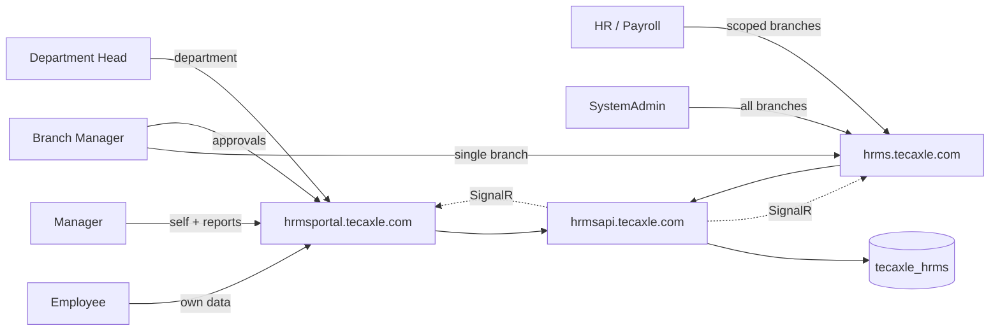
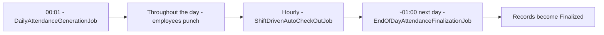
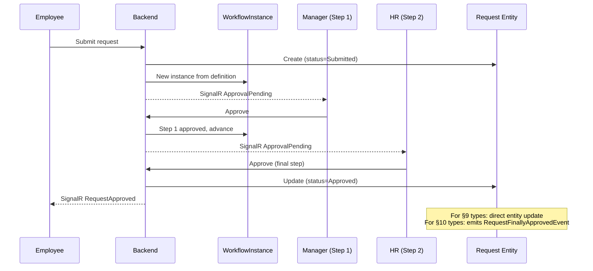
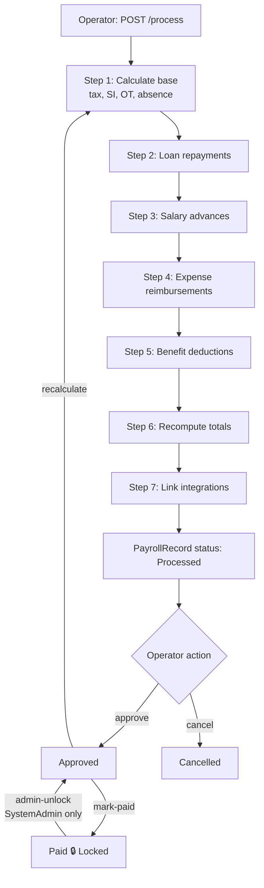
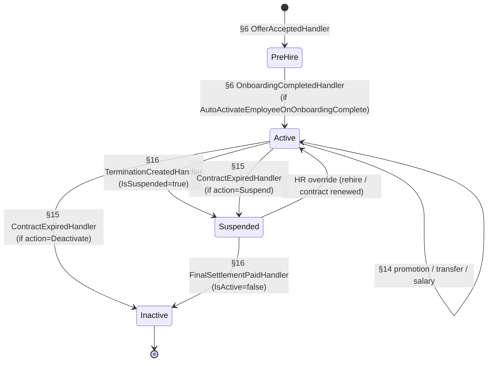

# TecAxle HRMS — End-to-End Business Flow

**Document type**: Operational reference. Self-contained. Read top to bottom for the full lifecycle, or jump to a numbered section for a specific flow.

**Audience**: HR, payroll, operations, IT administrators, and engineers. Mixed prose and code references. Every linked path resolves to a real file in this repository.

---

## Table of Contents

**Part 1 — Front Matter**
1. [Purpose & How to Read This Document](#1-purpose--how-to-read-this-document)
2. [System at a Glance](#2-system-at-a-glance)
3. [Persona & Branch-Scope Map](#3-persona--branch-scope-map)

**Part 2 — The Journey**

4. [Day Zero — Company Setup](#4-day-zero--company-setup)
5. [Recruitment Funnel](#5-recruitment-funnel)
6. [Hiring & Onboarding](#6-hiring--onboarding)
7. [Day-One UX](#7-day-one-ux)
8. [Daily Operations — Time, Shifts, Attendance](#8-daily-operations--time-shifts-attendance)
9. [Self-Service Workflow Requests](#9-self-service-workflow-requests)
10. [Executor-Driven Approval Requests](#10-executor-driven-approval-requests)
11. [Periodic Cycles — Monthly Accrual & Reminders](#11-periodic-cycles--monthly-accrual--reminders)
12. [Performance Cycle](#12-performance-cycle)
13. [Payroll Run](#13-payroll-run)
14. [Mid-Career Lifecycle Changes](#14-mid-career-lifecycle-changes)
15. [Contract Expiry](#15-contract-expiry)
16. [Offboarding](#16-offboarding)

**Part 3 — Cross-Cutting Concerns**

17. [Approval Workflow Engine in Depth](#17-approval-workflow-engine-in-depth)
18. [Authorization & Branch Scope](#18-authorization--branch-scope)
19. [Notifications](#19-notifications)
20. [Audit & Compliance](#20-audit--compliance)
21. [Reporting Surfaces](#21-reporting-surfaces)
22. [Configuration Inheritance](#22-configuration-inheritance)

**Part 4 — Reference**

23. [CompanySettings Configuration Catalogue](#23-companysettings-configuration-catalogue)
24. [Glossary & Index](#24-glossary--index)

---

# Part 1 — Front Matter

## 1. Purpose & How to Read This Document

TecAxle HRMS is a single-company human-resources and workforce-management platform. This document narrates the complete business lifecycle of the system — from the day a company is bootstrapped, through the day an employee is recruited, hired, works, gets paid, and eventually leaves. It is organized chronologically as an **employee journey** with cross-module integrations called out as the story progresses.

**How to read it**:

- Each section in Part 2 follows a fixed template:
  - **Trigger** — what kicks the flow off (a user action, a scheduled job, or a domain event).
  - **Actors** — who initiates, who approves, and who is affected.
  - **Sequence** — numbered steps, three to seven bullets.
  - **System effects** — entities created or updated, events raised, downstream handlers invoked.
  - **Configuration** — `CompanySettings` keys, policy entities, and feature toggles that change behavior.
  - **Failure modes** — what goes wrong and how the system reacts.
  - **Connects to** — pointers to upstream and downstream sections.
  - **Code paths** — clickable references to controllers, command handlers, services, and entities.
- Cross-cutting subjects (workflows, RBAC, notifications, audit, reporting, configuration inheritance) live in Part 3 because they apply to every flow.
- Part 4 is a flat reference for `CompanySettings` keys and a glossary.

Every code link uses the form `[label](path)` and points to a file relative to the repository root. There are no fabricated paths.

---

## 2. System at a Glance

**Architecture**:

- One Postgres 15+ database named `tecaxle_hrms`.
- One ASP.NET Core 9 backend at **`https://hrmsapi.tecaxle.com`**. Swagger at `/swagger`. SignalR hub at `/hubs/notifications`.
- Two Angular 20 frontends:
  - **Admin Portal** at **`https://hrms.tecaxle.com`** — used by HR, payroll operators, and SystemAdmins.
  - **Self-Service Portal** at **`https://hrmsportal.tecaxle.com`** — used by employees and managers.

All three are fronted by a shared Caddy reverse proxy on the production server (TLS via Let's Encrypt, `tls-alpn-01` challenge, automatic renewal). Local development uses ports `5099` (API), `4200` (admin), and `4201` (self-service); references in this document use the production hostnames.
- One EF Core `DbContext` ([TecAxleDbContext](src/Infrastructure/TimeAttendanceSystem.Infrastructure/Persistence/Common/TecAxleDbContext.cs)). No tenant resolution, no per-tenant databases — the v14 series collapsed the prior multi-tenant SaaS architecture into a single-company HRMS.
- Authentication is single-step email + password (no tenant selection). JWT carries `sub`, `email`, `roles`, `permissions`, `branch_scope`, and `preferred_language`.

**Architectural style**: Clean Architecture — Domain → Application → Infrastructure → API. CQRS via MediatR. Background jobs via Coravel. Validation via FluentValidation. Mapping via AutoMapper.

**Languages**: English and Arabic (RTL). All user-facing strings flow through `i18n.t('key')` on the frontend; entities with bilingual names carry `Name` (English) and `NameAr` (Arabic) columns.

**Glossary of recurring terms** (defined in detail in [§24](#24-glossary--index)):

| Term | One-line meaning |
|---|---|
| `CompanySettings` | Singleton row holding 100+ operational policies (lockout, accrual, approval, alert windows, lifecycle automation flags). Renamed from `TenantSettings` in v14.5. |
| `UserBranchScope` | Per-user list of branch IDs that limits which records the user can see. Empty list means SystemAdmin (sees everything). |
| `WorkflowDefinition` / `WorkflowInstance` | A reusable approval-process template and a live in-flight execution against it. |
| `PayrollRecord` lifecycle | `Draft → Processing → Processed → Approved → Paid (Locked) | Cancelled`. Paid records are immutable except via SystemAdmin admin-unlock. |
| `AttendanceRecord` vs. `AttendanceTransaction` | Record = the daily summary row (per employee per date). Transactions = the individual check-in/check-out punches that feed it. |
| Lifecycle handler | A MediatR domain-event handler in [Lifecycle/Handlers/](src/Application/TimeAttendanceSystem.Application/Lifecycle/Handlers/) that runs after a state-change event (e.g., offer accepted, resignation approved). |
| Approval executor | A class implementing `IApprovalExecutor` (see [IApprovalExecutor.cs](src/Application/TimeAttendanceSystem.Application/Features/ApprovalExecution/IApprovalExecutor.cs)) that materializes an approved request into entity state — for example, turning an approved Allowance Request into an `AllowanceAssignment`. |

---

## 3. Persona & Branch-Scope Map

The system has six effective personas. Every action in this document is performed by one or more of them.

| Persona | Portal | Default scope | Typical responsibilities |
|---|---|---|---|
| **Employee** | Self-Service (`hrmsportal.tecaxle.com`) | Self only | Submit vacation/excuse/remote-work/loan/letter/expense requests. View own attendance, payslips, balances, profile, training, certifications. |
| **Manager** (line / direct manager) | Self-Service (`hrmsportal.tecaxle.com`) | Self + direct reports | Review and approve their team's first-step requests. View team metrics. |
| **Department Head** | Self-Service (`hrmsportal.tecaxle.com`) | Self + entire department | Second-step approvals for department members. Department-wide visibility. |
| **Branch Manager** | Self-Service or Admin | Single branch | Branch-level approvals, branch reports, branch attendance. |
| **HR / Payroll Operator** | Admin (`hrms.tecaxle.com`) | Branches in `UserBranchScope` | Run recruitment, onboarding, payroll, performance cycles, offboarding. |
| **SystemAdmin** | Admin (`hrms.tecaxle.com`) | Everything | All HR powers plus: roles, permissions, workflow definitions, `CompanySettings`, payroll admin-unlock. |



**How branch scope is enforced**: At login, the `UserBranchScope` rows for the user are read and the branch IDs are placed in the JWT `branch_scope` claim. On the backend, every query handler inheriting [BaseHandler](src/Application/TimeAttendanceSystem.Application/Common/BaseHandler.cs) reads the current user's branch IDs via [ICurrentUser](src/Application/TimeAttendanceSystem.Application/Abstractions/ICurrentUser.cs) and filters its query at the EF level, e.g. `q.Where(e => allowedBranchIds.Contains(e.BranchId))`. SystemAdmin (`IsSystemAdmin == true` or empty `UserBranchScope`) bypasses the filter and sees all data. See [§18](#18-authorization--branch-scope) for the deeper detail.

---

# Part 2 — The Journey

## 4. Day Zero — Company Setup

The very first time the system is brought up, a SystemAdmin must populate the foundational reference data. After this is done, day-to-day operations can begin. Most of the seeding is automated on first run; the rest is configured through the admin portal.

**Trigger**: Backend started for the first time against an empty `tecaxle_hrms` database.

**Actors**: SystemAdmin (one of the two seeded users — `tecaxleadmin@system.local` or `systemadmin@system.local`).

**Sequence**:

1. EF Core applies the `Initial` migration, creating ~220 tables.
2. [SeedData.SeedAsync](src/Infrastructure/TimeAttendanceSystem.Infrastructure/Persistence/Common/SeedData.cs) runs once, seeding roles, permissions, the two SystemAdmin users (password `TempP@ssw0rd123!`), a default shift, a default remote-work policy, the default workflow definitions for each request type, vacation types, excuse policy, allowance types, and a Saudi-default End-of-Service (EOS) policy.
3. SystemAdmin logs in, is forced to change the password.
4. SystemAdmin uses the admin portal to create:
   - **Branches** (with optional GPS latitude/longitude/`GeofenceRadiusMeters` retained as branch metadata).
   - **Departments** (parent-child hierarchy, optional `ManagerEmployeeId`).
   - **Roles** and **role-permission** assignments.
   - **Users** linked to employees via `EmployeeUserLink`, with `UserBranchScope` rows.
   - **Public holidays** for the year.
   - **Shifts** and shift periods (regular / flexible / split / rotating / night) with grace periods, break configuration, and overtime rules.
   - **Salary structures**, **allowance types**, **leave accrual policies**, **excuse policy**, **remote-work policy**, **EOS policy tiers** if Saudi defaults need to be replaced.
   - **Workflow definitions** per request type (vacation, excuse, remote-work, allowance change, loan, expense claim, letter request, benefit enrollment, salary advance, attendance correction, fingerprint request, resignation).
5. SystemAdmin opens [`/settings/company-config`](time-attendance-frontend/src/app/pages/settings/company-configuration/) to tune [CompanySettings](src/Domain/TimeAttendanceSystem.Domain/Company/CompanySettings.cs) — see [§23](#23-companysettings-configuration-catalogue) for the full catalogue.

**System effects**: Database is fully populated for normal operation. Two SystemAdmin users active. Every subsequent feature now has a configuration backbone to read from.

**Configuration**: Every `CompanySettings` field has a sensible default; nothing is required to be changed before going live, but in practice operators tune `LoginLockoutPolicyJson`, alert-window CSVs, lifecycle-automation flags, and `WorkflowFallbackApproverRole` for their organization.

**Failure modes**:
- Migration fails — usually a connection string or Postgres permission issue. Fix `DefaultConnection` in [appsettings.json](src/Api/TimeAttendanceSystem.Api/appsettings.json) and restart.
- Seed fails — typically caused by the database not being empty (a rerun should be idempotent, but corrupted partial seeds may need a `DROP DATABASE` and recreate).
- SystemAdmin password not changed within the first session — `MustChangePassword=true` on the seeded user forces redirection to the change-password screen on every login until completed.

**Connects to**: Every other section. Branches drive [§18](#18-authorization--branch-scope). Workflow definitions drive [§9](#9-self-service-workflow-requests) and [§10](#10-executor-driven-approval-requests). Salary structures and EOS policy drive [§13](#13-payroll-run) and [§16](#16-offboarding). Shifts drive [§8](#8-daily-operations--time-shifts-attendance).

**Code paths**:
- [SeedData.cs](src/Infrastructure/TimeAttendanceSystem.Infrastructure/Persistence/Common/SeedData.cs) — first-run seed.
- [TecAxleDbContext.cs](src/Infrastructure/TimeAttendanceSystem.Infrastructure/Persistence/Common/TecAxleDbContext.cs) — all DbSets.
- [CompanyConfigurationController.cs](src/Api/TimeAttendanceSystem.Api/Controllers/CompanyConfigurationController.cs) — runtime settings UI.
- [CompanySettings.cs](src/Domain/TimeAttendanceSystem.Domain/Company/CompanySettings.cs) — settings entity.
- [BranchesController.cs](src/Api/TimeAttendanceSystem.Api/Controllers/BranchesController.cs), [DepartmentsController.cs](src/Api/TimeAttendanceSystem.Api/Controllers/DepartmentsController.cs), [RolesController.cs](src/Api/TimeAttendanceSystem.Api/Controllers/RolesController.cs), [UsersController.cs](src/Api/TimeAttendanceSystem.Api/Controllers/UsersController.cs).

---

## 5. Recruitment Funnel

Recruitment is the first place a future employee appears in the system. The funnel walks a candidate from a budgeted hiring need (Job Requisition) all the way to an accepted Offer Letter — at which point [§6](#6-hiring--onboarding) takes over.

**Trigger**: Department head or HR identifies a hiring need and submits a Job Requisition.

**Actors**:
- Hiring manager / department head — initiates and screens.
- HR recruiter — coordinates postings, candidates, interviews.
- Interviewers — conduct interviews and submit feedback.
- Approver(s) per `WorkflowDefinition` for offer approval.

**Sequence**:

1. **Job Requisition** ([JobRequisitionsController](src/Api/TimeAttendanceSystem.Api/Controllers/JobRequisitionsController.cs)) — hiring manager creates a requisition (job grade, target start date, headcount, budget). Goes through approval if configured.
2. **Job Posting** ([JobPostingsController](src/Api/TimeAttendanceSystem.Api/Controllers/JobPostingsController.cs)) — recruiter publishes one or more postings against the requisition.
3. **Candidate** ([CandidatesController](src/Api/TimeAttendanceSystem.Api/Controllers/CandidatesController.cs)) — candidate profiles created (manually or by application). Profile has resume, contact info, source.
4. **Job Application** ([JobApplicationsController](src/Api/TimeAttendanceSystem.Api/Controllers/JobApplicationsController.cs)) — links a candidate to a posting. Status moves through a pipeline: `Applied → Screened → Shortlisted → Interviewing → Offered → Hired | Rejected | Withdrawn`.
5. **Interview** ([InterviewSchedulesController](src/Api/TimeAttendanceSystem.Api/Controllers/InterviewSchedulesController.cs) for scheduling, [InterviewFeedbacksController](src/Api/TimeAttendanceSystem.Api/Controllers/InterviewFeedbacksController.cs) for feedback) — scheduled with one or more interviewers. Each submits an `InterviewFeedback`.
6. **Offer Letter** ([OfferLettersController](src/Api/TimeAttendanceSystem.Api/Controllers/OfferLettersController.cs)) — recruiter drafts the offer (compensation, start date, position). Goes through configured approval workflow. After approval, sent to candidate.
7. **Offer Accepted** — candidate accepts via portal link or HR records the acceptance. This raises an `OfferAcceptedEvent`.

**System effects**:
- Pipeline analytics rows accumulate at each stage transition for the recruitment dashboard.
- On offer acceptance, an `OfferAcceptedEvent` is published — picked up by [OfferAcceptedHandler](src/Application/TimeAttendanceSystem.Application/Lifecycle/Handlers/OfferAcceptedHandler.cs) (see [§6](#6-hiring--onboarding)).

**Configuration**:
- Workflow definitions for `JobRequisitionApproval` and `OfferApproval` (configured in `WorkflowDefinitions`).
- `CompanySettings.AutoCreateOnboardingOnOfferAcceptance` — controls whether offer acceptance immediately spawns an onboarding process.
- `CompanySettings.DefaultOnboardingTemplateId` — fallback when neither department- nor branch-level template is set.

**Failure modes**:
- Offer approval rejected — offer status moves to `Rejected`. Recruiter must amend or close.
- Candidate declines — application status moves to `OfferDeclined`. Pipeline analytics counts the loss.
- Workflow timeout (no approval action within `CompanySettings.WorkflowTimeoutDays`) — escalation per the workflow definition; eventually `FailedRouting` if escalation fails.

**Connects to**:
- **Upstream**: [§4](#4-day-zero--company-setup) supplies the workflow definitions and approver roles.
- **Downstream**: Acceptance starts [§6](#6-hiring--onboarding).

**Code paths**:
- [JobRequisitionsController.cs](src/Api/TimeAttendanceSystem.Api/Controllers/JobRequisitionsController.cs)
- [JobPostingsController.cs](src/Api/TimeAttendanceSystem.Api/Controllers/JobPostingsController.cs)
- [CandidatesController.cs](src/Api/TimeAttendanceSystem.Api/Controllers/CandidatesController.cs)
- [JobApplicationsController.cs](src/Api/TimeAttendanceSystem.Api/Controllers/JobApplicationsController.cs)
- [InterviewSchedulesController.cs](src/Api/TimeAttendanceSystem.Api/Controllers/InterviewSchedulesController.cs), [InterviewFeedbacksController.cs](src/Api/TimeAttendanceSystem.Api/Controllers/InterviewFeedbacksController.cs)
- [OfferLettersController.cs](src/Api/TimeAttendanceSystem.Api/Controllers/OfferLettersController.cs)
- Domain entities under [src/Domain/TimeAttendanceSystem.Domain/Recruitment/](src/Domain/TimeAttendanceSystem.Domain/Recruitment/).

---

## 6. Hiring & Onboarding

When an offer is accepted, the system materializes the candidate into a real `Employee` record (in pre-hire state) and starts an `OnboardingProcess`. Once all onboarding tasks are complete, the employee can be activated for daily operations.

**Trigger**: `OfferAcceptedEvent` raised at the end of [§5](#5-recruitment-funnel).

**Actors**:
- HR — provisions the employee record, contract, and user account.
- IT — completes IT-track onboarding tasks (laptop, accounts).
- Hiring manager — completes equipment, introductions, training tasks.
- New hire — attends orientation, completes documentation tasks.

**Sequence**:

1. [OfferAcceptedHandler](src/Application/TimeAttendanceSystem.Application/Lifecycle/Handlers/OfferAcceptedHandler.cs) runs (gated by `CompanySettings.AutoCreateOnboardingOnOfferAcceptance`):
   - Creates an `Employee` row with `IsPreHire=true`, `IsActive=false`.
   - Resolves an `OnboardingTemplate` via the priority chain `DefaultOnboardingTemplateId` → department's default → branch's default → any `IsDefault=true` template.
   - Creates an `OnboardingProcess` with `OnboardingTask` rows copied from the template, plus `OnboardingDocument` rows where the template requires uploads.
2. HR completes the employee's profile — bank details, dependents, education, work experience, addresses, emergency contacts, visa.
3. HR creates the `EmployeeContract` (contract type, start/end date, probation period defaulting to `CompanySettings.DefaultProbationDays`, salary structure assignment).
4. HR creates a `User` linked through `EmployeeUserLink`, assigns roles, and creates `UserBranchScope` rows. Initial password is generated and `MustChangePassword=true`.
5. Tasks across the seven onboarding categories (Documentation, IT, HR, Training, Equipment, Access, Introduction) are completed by their owners. The portal shows progress as a percentage.
6. When the last task is marked complete, the system raises `OnboardingCompletedEvent`.
7. [OnboardingCompletedHandler](src/Application/TimeAttendanceSystem.Application/Lifecycle/Handlers/OnboardingCompletedHandler.cs) runs:
   - Always stamps `Employee.OnboardingCompletedAt = utc-now`.
   - If `CompanySettings.AutoActivateEmployeeOnOnboardingComplete=true`, flips `IsPreHire=false` and `IsActive=true`. Otherwise the milestone is recorded but HR must activate manually.

**System effects**:
- New `Employee`, `OnboardingProcess`, `OnboardingTask[]`, `OnboardingDocument[]`, `EmployeeContract`, `User`, `UserRole[]`, `UserBranchScope[]`, `EmployeeUserLink`.
- A `LifecycleAutomationAudit` row for each lifecycle handler run (see [§20](#20-audit--compliance)).
- Default shift assignment may be created if a department- or branch-level default exists — see [§8](#8-daily-operations--time-shifts-attendance).

**Configuration**:
- `AutoCreateOnboardingOnOfferAcceptance` — if false, HR must create the onboarding process manually.
- `AutoActivateEmployeeOnOnboardingComplete` — opt-in. Default false (milestone-only).
- `DefaultOnboardingTemplateId` — fallback template.
- `DefaultProbationDays` — applied to `EmployeeContract` when the operator does not override.
- `LifecycleAutomationEnabled` — master kill-switch. When false, no lifecycle handler does anything (only audits).

**Failure modes**:
- Template resolution returns null (no defaults at any level) — handler logs and emits a notification to HR; no onboarding process created. HR must create one manually.
- Handler throws — the failure is caught by [ILifecycleEventPublisher](src/Application/TimeAttendanceSystem.Application/Abstractions/ILifecycleEventPublisher.cs) so the original command (offer acceptance) does not roll back. The failure is recorded in `LifecycleAutomationAudit`.

**Connects to**:
- **Upstream**: [§5](#5-recruitment-funnel) raises `OfferAcceptedEvent`.
- **Downstream**: [§7](#7-day-one-ux), [§8](#8-daily-operations--time-shifts-attendance).

**Code paths**:
- [OfferAcceptedHandler.cs](src/Application/TimeAttendanceSystem.Application/Lifecycle/Handlers/OfferAcceptedHandler.cs)
- [OnboardingCompletedHandler.cs](src/Application/TimeAttendanceSystem.Application/Lifecycle/Handlers/OnboardingCompletedHandler.cs)
- [LifecycleAutomationBase.cs](src/Application/TimeAttendanceSystem.Application/Lifecycle/Handlers/LifecycleAutomationBase.cs) — common base with audit + kill-switch logic.
- [OnboardingTemplatesController.cs](src/Api/TimeAttendanceSystem.Api/Controllers/OnboardingTemplatesController.cs), [OnboardingProcessesController.cs](src/Api/TimeAttendanceSystem.Api/Controllers/OnboardingProcessesController.cs).
- [EmployeesController.cs](src/Api/TimeAttendanceSystem.Api/Controllers/EmployeesController.cs), [EmployeeContractsController.cs](src/Api/TimeAttendanceSystem.Api/Controllers/EmployeeContractsController.cs).

---

## 7. Day-One UX

A newly active employee logs in for the first time.

**Trigger**: Employee navigates to the self-service portal (`https://hrmsportal.tecaxle.com`) and submits the login form.

**Actors**: Employee.

**Sequence**:

1. Browser POSTs to `/api/v1/auth/login` with `{ email, password }`.
2. [LoginCommandHandler.cs](src/Application/TimeAttendanceSystem.Application/Authorization/Commands/Login/LoginCommandHandler.cs) verifies the password (PBKDF2-SHA256, 10000 iterations), checks `User.IsActive`, runs lockout policy (`LoginLockoutPolicyJson`).
3. If `MustChangePassword=true`, the response indicates so and the portal forces a change-password screen.
4. JWT issued via [JwtTokenGenerator.cs](src/Infrastructure/TimeAttendanceSystem.Infrastructure/Security/JwtTokenGenerator.cs) carrying `sub`, `email`, `roles`, `permissions`, `branch_scope`, `preferred_language`. Refresh token issued as an HttpOnly cookie.
5. Employee lands on the dashboard. The system loads:
   - Today's attendance status (Present / Absent / On Leave / etc.).
   - Leave balance summary.
   - Pending requests they have submitted.
   - Announcements the company has published.
   - Personal alerts (visa expiring, document expiring, certification renewal due — driven by [§11](#11-periodic-cycles--monthly-accrual--reminders) jobs).

**System effects**:
- `LoginAttempt` row written.
- `Session` row created.
- SignalR connection established to `/hubs/notifications`.

**Configuration**:
- `LoginLockoutPolicyJson` — failed-attempt threshold and lockout durations.
- `PasswordMinLength` — for the change-password screen.

**Failure modes**:
- Wrong password — increments failed-attempt count; once threshold reached, account is locked per `LoginLockoutPolicyJson`.
- Account inactive (`User.IsActive=false`) — generic "invalid credentials" response; no enumeration.
- Two-factor enabled — login response indicates `requires2fa=true`; second step submits TOTP or backup code.

**Connects to**:
- **Upstream**: [§6](#6-hiring--onboarding) created the user.
- **Downstream**: every other employee-facing flow.

**Code paths**:
- [AuthController.cs](src/Api/TimeAttendanceSystem.Api/Controllers/AuthController.cs)
- [LoginCommandHandler.cs](src/Application/TimeAttendanceSystem.Application/Authorization/Commands/Login/LoginCommandHandler.cs)
- [JwtTokenGenerator.cs](src/Infrastructure/TimeAttendanceSystem.Infrastructure/Security/JwtTokenGenerator.cs)

---

## 8. Daily Operations — Time, Shifts, Attendance

This is the engine room of the HRMS. Every active employee, every business day, generates an attendance record. The pipeline is composed of three Coravel jobs and a real-time check-in surface.

**Trigger** (multiple):
- Scheduled: daily generation, hourly auto-checkout, end-of-day finalization.
- Real-time: employee checks in/out via biometric device or web punch.

**Actors**:
- Employee — punches in / out.
- Manager — reviews team attendance, approves corrections.
- HR — manages shifts, manual overrides, finalizations.

### 8.1 Shift assignment hierarchy

Each employee has an **effective shift** for any given date, resolved by priority:

1. **Employee-level** `ShiftAssignment` for the date — highest priority.
2. **Department-level** `ShiftAssignment` for the date.
3. **Branch-level** `ShiftAssignment` for the date.
4. **Default shift** seeded by [SeedData.cs](src/Infrastructure/TimeAttendanceSystem.Infrastructure/Persistence/Common/SeedData.cs).

Shift assignments support effective date ranges and an explicit `Priority` field for tie-breaking when multiple assignments overlap. Shift types include `Regular`, `Flexible`, `Split`, `Rotating`, and `Night`. Each shift carries grace periods, break configuration, and overtime rules.

### 8.2 Check-in surfaces

| Surface | How it works |
|---|---|
| Biometric fingerprint device | Hardware integration writes raw transactions; ingestion creates `AttendanceTransaction` rows. |
| Web punch | Employee clicks a Check-In/Check-Out button on the self-service portal. |
| Manual entry | HR enters a transaction on the admin portal — flagged as `IsManual=true`, audited. |

Each transaction is one of `CheckIn`, `CheckOut`, or `Break`.

### 8.3 The daily pipeline



| Job | Schedule | What it does |
|---|---|---|
| [DailyAttendanceGenerationJob](src/Infrastructure/TimeAttendanceSystem.Infrastructure/BackgroundJobs/DailyAttendanceGenerationJob.cs) | Daily, early morning | For each active employee, resolves the effective shift for the day and creates a `Pending` `AttendanceRecord` row. Skips weekends/holidays per shift configuration. |
| [ShiftDrivenAutoCheckOutJob](src/Infrastructure/TimeAttendanceSystem.Infrastructure/BackgroundJobs/ShiftDrivenAutoCheckOutJob.cs) | Hourly | For any open `CheckIn` past shift end + grace, emits an automatic `CheckOut` transaction. Uses branch-local time. The single source of truth for auto-checkout — no company-wide flag needed. |
| [EndOfDayAttendanceFinalizationJob](src/Infrastructure/TimeAttendanceSystem.Infrastructure/BackgroundJobs/EndOfDayAttendanceFinalizationJob.cs) | Daily, late night | For yesterday's records: pairs CheckIn/CheckOut transactions, computes regular hours, late minutes, early-leave minutes, and overtime per [OvertimeConfiguration](src/Domain/TimeAttendanceSystem.Domain/Settings/OvertimeConfiguration.cs). Flips `Pending → Absent` for no-shows. Integrates approved leave (vacation/excuse/comp-off) and public holidays. Marks the record `Finalized`. |

### 8.4 Manual correction (employee-initiated)

If the calculated record is wrong (forgot to check out, biometric down, working off-site), the employee submits an **Attendance Correction** request — a workflow request following [§9](#9-self-service-workflow-requests). On final approval, the underlying `AttendanceRecord` is updated and re-finalized.

Correction requests are bounded by `CompanySettings.AttendanceCorrectionMaxRetroactiveDays` (default 30 days) — older dates require HR override.

**System effects**: `AttendanceRecord` and `AttendanceTransaction` rows. Any change after finalization writes to `AuditLog`.

**Configuration**:
- `AttendanceCorrectionMaxRetroactiveDays` — how far back a correction can target.
- `MaxShiftGracePeriodMinutes` — upper bound on grace periods that can be configured per shift.
- `OvertimeConfiguration` per branch with regular + premium rates, daily/weekly/monthly thresholds.
- Branch-local timezone — used by `ShiftDrivenAutoCheckOutJob` for shift-end calculations.

**Failure modes**:
- Daily generation skipped (job didn't run) — surfaced by [OperationalFailureSurfacerJob](src/Infrastructure/TimeAttendanceSystem.Infrastructure/BackgroundJobs/OperationalFailureSurfacerJob.cs) and shown on the operations dashboard.
- Auto-checkout fires at the wrong time — usually a misconfigured branch timezone. Fix the branch and the next hourly run picks up correctly.
- End-of-day misses a record — the next end-of-day run finalizes any orphaned `Pending` records older than today.

**Connects to**:
- **Upstream**: [§4](#4-day-zero--company-setup) (shifts, holidays, OT config), [§6](#6-hiring--onboarding) (initial shift assignment).
- **Downstream**: [§9](#9-self-service-workflow-requests) (corrections, leave), [§13](#13-payroll-run) (regular hours, OT, absence days).

**Code paths**:
- [AttendanceController.cs](src/Api/TimeAttendanceSystem.Api/Controllers/AttendanceController.cs)
- [ShiftAssignmentsController.cs](src/Api/TimeAttendanceSystem.Api/Controllers/ShiftAssignmentsController.cs)
- [DailyAttendanceGenerationJob.cs](src/Infrastructure/TimeAttendanceSystem.Infrastructure/BackgroundJobs/DailyAttendanceGenerationJob.cs)
- [ShiftDrivenAutoCheckOutJob.cs](src/Infrastructure/TimeAttendanceSystem.Infrastructure/BackgroundJobs/ShiftDrivenAutoCheckOutJob.cs)
- [EndOfDayAttendanceFinalizationJob.cs](src/Infrastructure/TimeAttendanceSystem.Infrastructure/BackgroundJobs/EndOfDayAttendanceFinalizationJob.cs)
- [OvertimeConfiguration.cs](src/Domain/TimeAttendanceSystem.Domain/Settings/OvertimeConfiguration.cs)

---

## 9. Self-Service Workflow Requests

Five request types flow through the workflow engine and resolve as **direct status updates** on their request entity (no separate executor). On final approval, the workflow handler updates the request status, and where relevant, updates a related entity (leave balance, attendance record).

| Request type | What it represents | Entity updates on approval |
|---|---|---|
| **Vacation** (`EmployeeVacation`) | Time off (annual, sick, casual, etc.) | Status → Approved; `LeaveTransaction` written; balance updated; affected `AttendanceRecord`s flagged `OnLeave`. |
| **Excuse** (`EmployeeExcuse`) | Short-window absence (medical, personal, etc.) | Status → Approved; balance counter incremented; affected `AttendanceRecord` adjusted. |
| **Remote Work** (`RemoteWorkRequest`) | Work-from-home or hybrid days | Status → Approved; `AttendanceRecord` for the day(s) marked as remote; no leave deducted. |
| **Attendance Correction** (`AttendanceCorrectionRequest`) | Fix a wrong attendance row | `AttendanceRecord` recomputed and re-finalized. |
| **Fingerprint Request** (`FingerprintRequest`) | Enrollment / Update / Repair / Replacement of biometric data | Status moves through `Submitted → Assigned → Scheduled → Completed`. |

The shape of the flow is identical for all five.

**Trigger**: Employee submits a request via self-service.

**Actors**:
- **Initiator** — the employee.
- **Approvers** — chain depends on the workflow definition: typically Manager → Department Head → HR/Branch Manager.
- **Affected** — the employee themselves; for managerial visibility, also the team.

**Sequence** (generic, applies to all five):

1. Employee opens the relevant page (e.g. `https://hrmsportal.tecaxle.com/portal/vacation-requests/new`).
2. Frontend validates against company settings — for vacation, against `MaxVacationDaysPerRequest` and `MaxVacationFuturePlanningYears`.
3. POST to backend creates the request entity in `Submitted` state.
4. The system spawns a `WorkflowInstance` from the matching `WorkflowDefinition`. The definition is **snapshot-versioned** onto the instance so subsequent edits to the definition do not affect in-flight requests.
5. First step's approver(s) are resolved — by role, manager hierarchy, or direct user assignment, using the per-step `RoleAssignmentStrategy` (FirstMatch / RoundRobin / LeastPendingApprovals / FixedPriority).
6. SignalR notification fires (`RequestSubmitted` for the requester, `ApprovalPending` for approvers).
7. Approver acts: **Approve**, **Reject**, **Return for Correction**, or **Delegate**. Each writes a `WorkflowStepExecution` row.
8. On approve, the engine advances to the next step or, if final, marks the instance `Approved` and triggers final-approval logic in [ApproveStepCommandHandler.cs](src/Application/TimeAttendanceSystem.Application/Workflows/Commands/ApproveStep/ApproveStepCommandHandler.cs).
9. For these five request types, the handler updates the request entity status and any related entity (leave balance, attendance record). No separate executor runs.



**System effects**:
- `WorkflowInstance` and `WorkflowStepExecution` rows.
- Request entity status transitions.
- For vacation: `LeaveTransaction` row, balance updated; affected `AttendanceRecord`s flagged.
- For excuse: balance counter incremented.
- For remote work: affected `AttendanceRecord`s marked remote.
- For attendance correction: target `AttendanceRecord` recomputed and re-finalized.
- For fingerprint: assignment to a technician with scheduling.
- SignalR events at every transition: `RequestSubmitted`, `ApprovalPending`, `Approved`, `Rejected`, `Delegated`, `Escalated`, `ApprovalReminder`, `ReturnedForCorrection`.

**Configuration**:
- `WorkflowDefinition` per request type — defines steps, approver types, and the order.
- `WorkflowFallbackApproverRole` and `WorkflowFallbackApproverUserId` — used when role-based step routing finds no candidate.
- `MaxWorkflowDelegationDepth` (default 2) — caps delegation chains.
- `MaxWorkflowResubmissions` (default 3) — caps how many times a returned-for-correction request can be resubmitted.
- For vacation: `MaxVacationDaysPerRequest`, `MaxVacationFuturePlanningYears`, plus the `LeaveAccrualPolicy` and `VacationType` rules (carryover, expiry).
- For excuse: `EmployeeExcusePolicy` and `ExcuseBackwardWindowDays` / `ExcuseForwardWindowDays`.

**Failure modes**:
- **Insufficient leave balance** — request rejected at submission.
- **Approver chain has no candidate** — engine applies `WorkflowFallbackApproverRole`/`UserId`; if still none, instance moves to `FailedRouting` and HR is notified.
- **Workflow timeout** — escalation per step config (escalate to next role, or to fallback approver). The [WorkflowTimeoutProcessingJob](src/Infrastructure/TimeAttendanceSystem.Infrastructure/BackgroundJobs/WorkflowTimeoutProcessingJob.cs) drives this.
- **Cycle in delegation** — engine refuses to delegate if it would create a cycle. Falls back to escalation.
- **Frozen instance** — [FrozenWorkflowCleanupJob](src/Infrastructure/TimeAttendanceSystem.Infrastructure/BackgroundJobs/FrozenWorkflowCleanupJob.cs) detects instances stuck past their SLA.

**Connects to**:
- **Upstream**: [§4](#4-day-zero--company-setup) (workflow definitions, vacation/excuse policies).
- **Downstream**: [§8](#8-daily-operations--time-shifts-attendance) (leave/remote-work/correction effects), [§13](#13-payroll-run) (leave transactions become absence days; remote-work days do not deduct leave).
- **See also**: [§17](#17-approval-workflow-engine-in-depth) for the full workflow engine spec.

**Code paths**:
- [WorkflowsController.cs](src/Api/TimeAttendanceSystem.Api/Controllers/WorkflowsController.cs)
- [ApprovalsController.cs](src/Api/TimeAttendanceSystem.Api/Controllers/ApprovalsController.cs)
- [ApproveStepCommandHandler.cs](src/Application/TimeAttendanceSystem.Application/Workflows/Commands/ApproveStep/ApproveStepCommandHandler.cs)
- [EmployeeVacationsController.cs](src/Api/TimeAttendanceSystem.Api/Controllers/EmployeeVacationsController.cs), [EmployeeExcusesController.cs](src/Api/TimeAttendanceSystem.Api/Controllers/EmployeeExcusesController.cs), [RemoteWorkRequestsController.cs](src/Api/TimeAttendanceSystem.Api/Controllers/RemoteWorkRequestsController.cs)

---

## 10. Executor-Driven Approval Requests

Six request types use the same workflow flow as [§9](#9-self-service-workflow-requests), but on final approval they raise a `RequestFinallyApprovedEvent`. A handler dispatches this to an [ExecuteApprovalCommandHandler](src/Application/TimeAttendanceSystem.Application/Features/ApprovalExecution/Commands/ExecuteApprovalCommandHandler.cs) which routes to the right `IApprovalExecutor` implementation. The executor materializes the approval into entity state — typically creating or updating a record that the next payroll run consumes.

**Trigger**: `RequestFinallyApprovedEvent` raised after the last workflow step approves.

**Actors**: Same as [§9](#9-self-service-workflow-requests). The executor itself runs as a system actor.

**Sequence** (generic):

1. Final approval step is approved (see [§9](#9-self-service-workflow-requests) sequence).
2. `ApproveStepCommandHandler` raises `RequestFinallyApprovedEvent`.
3. `ExecuteApprovalCommandHandler` resolves the matching executor for the request type.
4. The executor runs in a try/catch — failures do not roll back the approval; they are surfaced as `OperationalFailureAlert` rows for the operations dashboard.
5. On success, the executor returns an `ExecutionResult` describing what was created/updated. The `WorkflowInstance` and request entity are stamped with execution metadata.

### 10.1 The six executors

| Executor | Triggered by | What it creates / updates |
|---|---|---|
| [AllowanceRequestExecutor](src/Application/TimeAttendanceSystem.Application/Features/ApprovalExecution/AllowanceRequestExecutor.cs) | `AllowanceRequest` (employee asks for a new allowance, e.g. transport, housing) | Creates or updates an `AllowanceAssignment` honoring effective dates, allowance type, and end date. Picked up by next payroll. |
| [LoanApplicationExecutor](src/Application/TimeAttendanceSystem.Application/Features/ApprovalExecution/LoanApplicationExecutor.cs) | `LoanApplication` (employee borrows from the company) | Generates the full `LoanRepayment` schedule (monthly installments with interest amortization). Each repayment is consumed by payroll on its due month. |
| [SalaryAdvanceExecutor](src/Application/TimeAttendanceSystem.Application/Features/ApprovalExecution/SalaryAdvanceExecutor.cs) | `SalaryAdvance` (employee requests advance pay) | Sets the deduction date range (defaults to the calendar month after approval if not specified). |
| [ExpenseClaimExecutor](src/Application/TimeAttendanceSystem.Application/Features/ApprovalExecution/ExpenseClaimExecutor.cs) | `ExpenseClaim` (employee submits expense receipts for reimbursement) | Creates an `ExpenseReimbursement` (payment method: payroll line or bank transfer). Payroll runs pick up the payroll-method reimbursements. |
| [LetterRequestExecutor](src/Application/TimeAttendanceSystem.Application/Features/ApprovalExecution/LetterRequestExecutor.cs) | `LetterRequest` (employee asks for an employment letter, salary letter, etc.) | Renders the `LetterTemplate` with the employee's data, uploads the resulting PDF to file storage, attaches it to the request. |
| [BenefitEnrollmentExecutor](src/Application/TimeAttendanceSystem.Application/Features/ApprovalExecution/BenefitEnrollmentExecutor.cs) | `BenefitEnrollment` (employee enrolls in a benefit plan: medical, life, etc.) | Activates the enrollment, sets `PayrollDeductionEnabled=true` if the plan has employee contribution. |

### 10.2 The interface

All executors implement `IApprovalExecutor` ([IApprovalExecutor.cs](src/Application/TimeAttendanceSystem.Application/Features/ApprovalExecution/IApprovalExecutor.cs)):

```csharp
public interface IApprovalExecutor
{
    string SupportedRequestType { get; }
    Task<ExecutionResult> ExecuteAsync(Guid requestId, CancellationToken ct);
}
```

`ExecutionResult` ([ExecutionResult.cs](src/Application/TimeAttendanceSystem.Application/Features/ApprovalExecution/ExecutionResult.cs)) carries success/failure, a message, and the IDs of any entities created or updated.

**System effects**:
- One or more entities created or updated, depending on executor.
- `OperationalFailureAlert` if the executor throws.
- Audit row in `LifecycleAutomationAudit` (executors share the audit trail).

**Configuration**:
- Same as [§9](#9-self-service-workflow-requests) for the workflow side.
- Per-request-type policies: `AllowancePolicy`, `LoanPolicy`, `ExpenseClaimPolicy`, `BenefitPlan`, `LetterTemplate`.

**Failure modes**:
- Executor throws — caught in the dispatcher, `OperationalFailureAlert` raised. The request stays in `Approved` state and HR is notified to investigate.
- No matching executor for request type — `OperationalFailureAlert` raised; this is a configuration bug.
- Concurrent executors processing the same request — guarded by `WorkflowInstance.LastProcessedAt` and an idempotency key.

**Connects to**:
- **Upstream**: [§9](#9-self-service-workflow-requests) handles the approval flow itself.
- **Downstream**: [§13](#13-payroll-run) — payroll integrates allowances, loans, advances, expenses, and benefit deductions in steps 2–5 of its pipeline.

**Code paths**:
- [ExecuteApprovalCommand.cs](src/Application/TimeAttendanceSystem.Application/Features/ApprovalExecution/Commands/ExecuteApprovalCommand.cs)
- [ExecuteApprovalCommandHandler.cs](src/Application/TimeAttendanceSystem.Application/Features/ApprovalExecution/Commands/ExecuteApprovalCommandHandler.cs)
- [IApprovalExecutor.cs](src/Application/TimeAttendanceSystem.Application/Features/ApprovalExecution/IApprovalExecutor.cs)
- [AllowanceRequestExecutor.cs](src/Application/TimeAttendanceSystem.Application/Features/ApprovalExecution/AllowanceRequestExecutor.cs)
- [LoanApplicationExecutor.cs](src/Application/TimeAttendanceSystem.Application/Features/ApprovalExecution/LoanApplicationExecutor.cs)
- [SalaryAdvanceExecutor.cs](src/Application/TimeAttendanceSystem.Application/Features/ApprovalExecution/SalaryAdvanceExecutor.cs)
- [ExpenseClaimExecutor.cs](src/Application/TimeAttendanceSystem.Application/Features/ApprovalExecution/ExpenseClaimExecutor.cs)
- [LetterRequestExecutor.cs](src/Application/TimeAttendanceSystem.Application/Features/ApprovalExecution/LetterRequestExecutor.cs)
- [BenefitEnrollmentExecutor.cs](src/Application/TimeAttendanceSystem.Application/Features/ApprovalExecution/BenefitEnrollmentExecutor.cs)

---

## 11. Periodic Cycles — Monthly Accrual & Reminders

Several flows happen on a calendar cadence rather than in response to user action.

### 11.1 Monthly leave accrual

**Trigger**: 1st of each month, scheduled.

**Sequence**:

1. [MonthlyLeaveAccrualJob](src/Infrastructure/TimeAttendanceSystem.Infrastructure/BackgroundJobs/MonthlyLeaveAccrualJob.cs) runs.
2. For each active employee with a `LeaveAccrualPolicy`, it adds the monthly accrual amount per `VacationType` to the running `LeaveBalance`.
3. Mid-year hires are prorated to the fraction of the month they were active.
4. Carryover and expiry are applied per the policy (e.g., "max 30 days carryover at year end, anything above expires").
5. A `LeaveTransaction` row of type `Accrual` is written for each balance change.

### 11.2 Carryover expiry

[LeaveCarryoverExpiryJob](src/Infrastructure/TimeAttendanceSystem.Infrastructure/BackgroundJobs/LeaveCarryoverExpiryJob.cs) runs daily and expires any carryover balance past its expiry date per `LeaveAccrualPolicy`.

### 11.3 Compensatory off expiry

[CompensatoryOffExpiryJob](src/Infrastructure/TimeAttendanceSystem.Infrastructure/BackgroundJobs/CompensatoryOffExpiryJob.cs) runs daily and burns any unused comp-off entitlement past its expiry window.

### 11.4 Expiry-alert family

A family of daily jobs walks the alert-window CSVs and emits in-app notifications and dashboard alerts:

| Job | Reads CSV | Drives |
|---|---|---|
| [ContractExpiryAlertJob](src/Infrastructure/TimeAttendanceSystem.Infrastructure/BackgroundJobs/ContractExpiryAlertJob.cs) | `ContractExpiryAlertDaysCsv` (e.g. "30,15,7") | HR alerts before contract end. Also publishes `ContractExpiredEvent` when end date hits — see [§15](#15-contract-expiry). |
| [VisaExpiryAlertJob](src/Infrastructure/TimeAttendanceSystem.Infrastructure/BackgroundJobs/VisaExpiryAlertJob.cs) | `VisaExpiryAlertDaysCsv` | Visa renewal alerts. |
| [DocumentExpiryAlertJob](src/Infrastructure/TimeAttendanceSystem.Infrastructure/BackgroundJobs/DocumentExpiryAlertJob.cs) | `DocumentExpiryAlertDaysCsv` | Employee document renewals. |
| [CertificationExpiryAlertJob](src/Infrastructure/TimeAttendanceSystem.Infrastructure/BackgroundJobs/CertificationExpiryAlertJob.cs) | (per certification) | Training/professional certifications. |
| [AssetWarrantyExpiryAlertJob](src/Infrastructure/TimeAttendanceSystem.Infrastructure/BackgroundJobs/AssetWarrantyExpiryAlertJob.cs) | `AssetWarrantyExpiryAlertDaysCsv` | Asset warranty renewals. |
| [OverdueAssetReturnAlertJob](src/Infrastructure/TimeAttendanceSystem.Infrastructure/BackgroundJobs/OverdueAssetReturnAlertJob.cs) | `AssetOverdueReturnAlertDaysCsv` | Unreturned company assets after exit. |
| [TrainingSessionReminderJob](src/Infrastructure/TimeAttendanceSystem.Infrastructure/BackgroundJobs/TrainingSessionReminderJob.cs) | `TrainingSessionReminderDaysCsv` | Upcoming training session reminders. |
| [SuccessionPlanReviewReminderJob](src/Infrastructure/TimeAttendanceSystem.Infrastructure/BackgroundJobs/SuccessionPlanReviewReminderJob.cs) | `SuccessionPlanReminderDaysCsv` | Succession plan periodic review. |
| [GrievanceSlaAlertJob](src/Infrastructure/TimeAttendanceSystem.Infrastructure/BackgroundJobs/GrievanceSlaAlertJob.cs) | `GrievanceSlaAlertDaysCsv` | Grievance breach of SLA. |
| [ReviewCycleReminderJob](src/Infrastructure/TimeAttendanceSystem.Infrastructure/BackgroundJobs/ReviewCycleReminderJob.cs) | `ReviewReminderDaysCsv` | Performance review reminders. |
| [TimesheetSubmissionReminderJob](src/Infrastructure/TimeAttendanceSystem.Infrastructure/BackgroundJobs/TimesheetSubmissionReminderJob.cs) | (per timesheet period) | Pending timesheet submissions. |
| [LoanRepaymentReminderJob](src/Infrastructure/TimeAttendanceSystem.Infrastructure/BackgroundJobs/LoanRepaymentReminderJob.cs) | (per repayment) | Upcoming loan repayments. |

### 11.5 Other periodic jobs

- [OnboardingTaskOverdueJob](src/Infrastructure/TimeAttendanceSystem.Infrastructure/BackgroundJobs/OnboardingTaskOverdueJob.cs) — flags overdue onboarding tasks.
- [BenefitEnrollmentExpiryJob](src/Infrastructure/TimeAttendanceSystem.Infrastructure/BackgroundJobs/BenefitEnrollmentExpiryJob.cs) — closes lapsed enrollments.
- [BenefitDeductionSyncJob](src/Infrastructure/TimeAttendanceSystem.Infrastructure/BackgroundJobs/BenefitDeductionSyncJob.cs) — syncs active enrollments into deductions for the next payroll.
- [ExpireTemporaryAllowancesJob](src/Infrastructure/TimeAttendanceSystem.Infrastructure/BackgroundJobs/ExpireTemporaryAllowancesJob.cs) — closes time-bound `AllowanceAssignment` rows.
- [PIPExpiryCheckJob](src/Infrastructure/TimeAttendanceSystem.Infrastructure/BackgroundJobs/PIPExpiryCheckJob.cs) and [PipFollowThroughJob](src/Infrastructure/TimeAttendanceSystem.Infrastructure/BackgroundJobs/PipFollowThroughJob.cs) — Performance Improvement Plan lifecycle.
- [TimesheetPeriodGenerationJob](src/Infrastructure/TimeAttendanceSystem.Infrastructure/BackgroundJobs/TimesheetPeriodGenerationJob.cs) and [TimesheetPeriodClosureJob](src/Infrastructure/TimeAttendanceSystem.Infrastructure/BackgroundJobs/TimesheetPeriodClosureJob.cs) — timesheet cadence.
- [AnnouncementSchedulerJob](src/Infrastructure/TimeAttendanceSystem.Infrastructure/BackgroundJobs/AnnouncementSchedulerJob.cs) and [AnnouncementExpiryJob](src/Infrastructure/TimeAttendanceSystem.Infrastructure/BackgroundJobs/AnnouncementExpiryJob.cs) — company announcement publishing.
- [AnalyticsSnapshotJob](src/Infrastructure/TimeAttendanceSystem.Infrastructure/BackgroundJobs/AnalyticsSnapshotJob.cs) and [MonthlyAnalyticsRollupJob](src/Infrastructure/TimeAttendanceSystem.Infrastructure/BackgroundJobs/MonthlyAnalyticsRollupJob.cs) — dashboard data.
- [OperationalFailureSurfacerJob](src/Infrastructure/TimeAttendanceSystem.Infrastructure/BackgroundJobs/OperationalFailureSurfacerJob.cs) — bubbles up silent failures from any job for HR/admin visibility.
- [ScheduledReportExecutionJob](src/Infrastructure/TimeAttendanceSystem.Infrastructure/BackgroundJobs/ScheduledReportExecutionJob.cs) — runs scheduled reports per their cron.

**Failure modes**:
- A job throws — Coravel logs the failure and retries on the next schedule. `OperationalFailureSurfacerJob` aggregates these for HR visibility.
- Misconfigured CSV (e.g. `"foo,bar"` instead of integer days) — the job logs and skips.
- Time-zone drift between the job's clock and the branch's local time — visible in `ShiftDrivenAutoCheckOutJob` more than alert jobs.

**Connects to**:
- **Upstream**: [§4](#4-day-zero--company-setup) for all CSV configuration.
- **Downstream**: [§13](#13-payroll-run) consumes accrual results for absence/leave math; [§15](#15-contract-expiry) is triggered by the contract alert job.

---

## 12. Performance Cycle

Performance management is a periodic cycle that runs in parallel with daily operations. The output (final ratings) feeds into pay decisions ([§14](#14-mid-career-lifecycle-changes)) and into PIP lifecycles for underperformers.

**Trigger**: HR creates a `PerformanceReviewCycle` for the period (annual, semi-annual, quarterly).

**Actors**:
- HR — creates cycles, defines competencies, manages PIPs.
- Manager — sets goals with their reports, conducts reviews.
- Employee — commits to goals, performs self-review, requests 360 feedback.
- 360 reviewers — peers, reports, cross-functional partners.

**Sequence**:

1. **Cycle creation** — HR creates `PerformanceReviewCycle` covering a date range. Selects the `CompetencyFramework` to use.
2. **Goal setting** — manager and employee jointly create `GoalDefinition` rows: SMART goals with weights and target dates. Captured at the start of the cycle.
3. **Mid-cycle check-ins** — managers update goal progress; employees log evidence and self-assessments.
4. **360 feedback** (optional) — manager creates `FeedbackRequest360` against the employee, lists reviewers, sends out forms. Reviewers submit `Feedback360Response` rows.
5. **Final review** — manager creates a `PerformanceReview` row at cycle end: scores against goals, scores against the competency framework (per-competency `CompetencyAssessment`), narrative comments, overall rating.
6. **Calibration** (optional) — HR runs calibration sessions across departments to normalize ratings.
7. **Acknowledgment** — employee acknowledges the review.
8. **Closeout** — HR closes the cycle. Final ratings are now reference data for pay decisions, promotion lists, and PIP triggers.

**System effects**:
- `PerformanceReviewCycle`, `GoalDefinition`, `PerformanceReview`, `CompetencyAssessment`, `FeedbackRequest360`, `Feedback360Response`.
- Reminders driven by [ReviewCycleReminderJob](src/Infrastructure/TimeAttendanceSystem.Infrastructure/BackgroundJobs/ReviewCycleReminderJob.cs).
- For underperformers: `PerformanceImprovementPlan` is created; [PIPExpiryCheckJob](src/Infrastructure/TimeAttendanceSystem.Infrastructure/BackgroundJobs/PIPExpiryCheckJob.cs) and [PipFollowThroughJob](src/Infrastructure/TimeAttendanceSystem.Infrastructure/BackgroundJobs/PipFollowThroughJob.cs) drive its lifecycle.

**Configuration**:
- `ReviewReminderDaysCsv` — when reminders fire.
- `CompetencyFramework` rows — define what is measured.
- Cycle parameters — review period, weights, rating scale.

**Failure modes**:
- Reviewer leaves the company mid-cycle — reviewer is reassigned by HR; system flags incomplete reviews.
- 360 reviewer non-response — escalation reminders fire; HR can manually close the request as "no response received".

**Connects to**:
- **Upstream**: [§4](#4-day-zero--company-setup) (competency frameworks).
- **Downstream**: [§14](#14-mid-career-lifecycle-changes) — promotions/salary adjustments commonly cite the latest review. PIP failure may end at termination ([§16](#16-offboarding)).

**Code paths**:
- [PerformanceReviewsController.cs](src/Api/TimeAttendanceSystem.Api/Controllers/PerformanceReviewsController.cs)
- [PerformanceImprovementPlansController.cs](src/Api/TimeAttendanceSystem.Api/Controllers/PerformanceImprovementPlansController.cs)
- Domain entities under [src/Domain/TimeAttendanceSystem.Domain/Performance/](src/Domain/TimeAttendanceSystem.Domain/Performance/).

---

## 13. Payroll Run

Payroll is the **integration crown** of the system. Every other module — attendance, leave, allowance approvals, loans, advances, expense claims, benefit enrollments, public holidays, contracts, salary adjustments, EOS — feeds this pipeline. The output is one `PayrollRecord` per employee per period, line-itemized for forensic transparency, locked when paid.

**Trigger**: A payroll operator creates a `PayrollPeriod` (in `Draft` state) and invokes "Process".

**Actors**:
- Payroll operator — creates periods, processes, recalculates.
- HR / Finance — reviews and approves processed records.
- SystemAdmin — only one who can run admin-unlock on a paid period (with a reason).
- Employee — eventually views the resulting payslip via self-service.

### 13.1 The 7-step pipeline

[ProcessPayrollPeriodCommandHandler.cs](src/Application/TimeAttendanceSystem.Application/PayrollPeriods/Commands/ProcessPayrollPeriod/ProcessPayrollPeriodCommandHandler.cs) orchestrates per employee, all wrapped in a single transaction that rolls back on any failure:

| # | Step | What it does |
|---|---|---|
| 1 | **Calculate base** | [IPayrollCalculationService](src/Application/TimeAttendanceSystem.Application/Payroll/Services/IPayrollCalculationService.cs) resolves all effective-dated inputs via [IPayrollInputResolver](src/Application/TimeAttendanceSystem.Application/Payroll/Services/IPayrollInputResolver.cs), then runs [ITaxCalculator](src/Application/TimeAttendanceSystem.Application/Payroll/Services/ITaxCalculator.cs), [ISocialInsuranceCalculator](src/Application/TimeAttendanceSystem.Application/Payroll/Services/ISocialInsuranceCalculator.cs), [IOvertimePayCalculator](src/Application/TimeAttendanceSystem.Application/Payroll/Services/IOvertimePayCalculator.cs), [IAbsenceDeductionCalculator](src/Application/TimeAttendanceSystem.Application/Payroll/Services/IAbsenceDeductionCalculator.cs). Two-pass allowance math: Fixed + `PercentageOfBasic` first, then OT, then `PercentageOfGross`. Day rate from [IPayrollCalendarResolver](src/Application/TimeAttendanceSystem.Application/Payroll/Services/IPayrollCalendarResolver.cs). |
| 2 | **Integrate loan repayments** | Match due `LoanRepayment`s for the period to deduction lines. |
| 3 | **Integrate salary advances** | Match approved `SalaryAdvance`s whose deduction date range overlaps the period. |
| 4 | **Integrate expense reimbursements** | Approved `ExpenseClaim`s with `ApprovedAt ≤ period end` become benefit lines (positive contribution). |
| 5 | **Integrate benefit deductions** | Active `BenefitEnrollment`s with `PayrollDeductionEnabled=true` add the employee premium as a deduction and an informational employer contribution line. |
| 6 | **Recompute totals** | Final gross, total deductions, net pay re-derived from the line items. |
| 7 | **Link integrations** | Mark each consumed `LoanRepayment` as Paid, each `SalaryAdvance` row as Deducted, each reimbursement and benefit deduction as linked to this `PayrollRecord.Id`. Loan outstanding balance updated. |

Each line item is written to `PayrollRecordDetail` with a `Notes` field describing what it is. Forensic snapshot stored on `PayrollRecord.CalculationBreakdownJson`.



### 13.2 The state machine

| State | What it means | Allowed transitions |
|---|---|---|
| **Draft** | Period created, not yet processed. | → Processing (via `/process`) |
| **Processing** | Pipeline running. | → Processed (success) or → Draft (failure rolled back) |
| **Processed** | Pipeline complete. Records visible to HR/Finance for review. | → Approved (`/approve`), → Draft (`/recalculate`), → Cancelled (`/cancel`) |
| **Approved** | Reviewed and approved. Ready to pay. | → Paid (`/mark-paid`), → Cancelled (`/cancel`) |
| **Paid** | Locked. `LockedAtUtc` is set. Employee can view payslip. | → Approved (only via SystemAdmin `/admin-unlock` with reason) |
| **Cancelled** | Period was cancelled before payment. | (terminal) |

Recalculation is **explicit** — never run `/process` twice. Use `/recalculate` to re-run the pipeline; this is allowed in `Processed` and `Approved` states (not `Paid`).

### 13.3 Audit trail

Every operation that mutates a `PayrollRecord` writes to:
- `PayrollRunAudit` — one row per operation (process / recalculate / approve / mark-paid / cancel / admin-unlock).
- `PayrollRunAuditItem` — child rows describing what changed.

Surface: `GET /api/v1/payroll-periods/{id}/run-audit`.

### 13.4 Side-effect reversal

When a payroll record is cancelled or admin-unlocked, the `PayrollSideEffectReverser` undoes the integrations from steps 2–5 (un-paid loan repayments, un-deducted advances, un-linked reimbursements/benefits) so the next run can re-pick them up.

**System effects**:
- One `PayrollRecord` per employee per period, with N `PayrollRecordDetail` rows.
- `PayrollRunAudit` + `PayrollRunAuditItem`.
- `LoanRepayment.Status`, `SalaryAdvance.DeductionStatus`, `ExpenseReimbursement.Status`, `BenefitEnrollment` deduction tracking — all updated.
- For non-employee-specific transactions (employer SI contribution), informational lines are written but do not affect net pay.

**Configuration**:
- `PayrollCalendarPolicy` — `BasisType` ∈ (`CalendarDays`, `WorkingDays`, `FixedBasis`). Eliminates the hardcoded 30-day month assumption.
- `TaxConfiguration` — progressive brackets, effective date.
- `SocialInsuranceConfiguration` — employee + employer rates, `MaxInsurableSalary` cap, `AppliesToNationalityCode` filter.
- `OvertimeConfiguration` per branch — used both for attendance OT calculation and for OT pay.
- `EmployeeInsurance` — additional insurance lines (life, medical) folded in.
- `AllowanceAssignment` rows — created by the AllowanceRequestExecutor (see [§10](#10-executor-driven-approval-requests)) or directly by HR.

**Failure modes**:
- A single employee's calculation throws — the per-employee transaction rolls back. Other employees continue. The failure is recorded as an `OperationalFailureAlert` and shown in the run audit.
- Operator runs `/process` on an already-processed period — rejected. Use `/recalculate`.
- Operator tries to mutate a `Paid` record — rejected. Requires SystemAdmin `/admin-unlock` with reason.
- Soft-deleted parent record — `PayrollSideEffectReverser.CascadeDeleteDetailsAsync` calls `IgnoreQueryFilters()` so cascade actually fires.

**Connects to**:
- **Upstream**: [§8](#8-daily-operations--time-shifts-attendance) (regular hours, OT, absence days), [§9](#9-self-service-workflow-requests) (leave transactions), [§10](#10-executor-driven-approval-requests) (allowances/loans/advances/expenses/benefits), [§4](#4-day-zero--company-setup) (tax, SI, calendar policy).
- **Downstream**: [§16](#16-offboarding) — final settlement is calculated as a payroll-style run plus EOS.

**Code paths**:
- [ProcessPayrollPeriodCommandHandler.cs](src/Application/TimeAttendanceSystem.Application/PayrollPeriods/Commands/ProcessPayrollPeriod/ProcessPayrollPeriodCommandHandler.cs) — the orchestrator.
- [IPayrollCalculationService.cs](src/Application/TimeAttendanceSystem.Application/Payroll/Services/IPayrollCalculationService.cs)
- [IPayrollInputResolver.cs](src/Application/TimeAttendanceSystem.Application/Payroll/Services/IPayrollInputResolver.cs)
- [ITaxCalculator.cs](src/Application/TimeAttendanceSystem.Application/Payroll/Services/ITaxCalculator.cs), [ISocialInsuranceCalculator.cs](src/Application/TimeAttendanceSystem.Application/Payroll/Services/ISocialInsuranceCalculator.cs), [IOvertimePayCalculator.cs](src/Application/TimeAttendanceSystem.Application/Payroll/Services/IOvertimePayCalculator.cs), [IAbsenceDeductionCalculator.cs](src/Application/TimeAttendanceSystem.Application/Payroll/Services/IAbsenceDeductionCalculator.cs)
- [IPayrollCalendarResolver.cs](src/Application/TimeAttendanceSystem.Application/Payroll/Services/IPayrollCalendarResolver.cs), [IProrationCalculator.cs](src/Application/TimeAttendanceSystem.Application/Payroll/Services/IProrationCalculator.cs)
- [PayrollPeriodsController.cs](src/Api/TimeAttendanceSystem.Api/Controllers/PayrollPeriodsController.cs)
- [PayrollSettingsController.cs](src/Api/TimeAttendanceSystem.Api/Controllers/PayrollSettingsController.cs)

---

## 14. Mid-Career Lifecycle Changes

Once an employee is active, four kinds of structural changes commonly happen during their tenure: promotion, transfer, salary adjustment, and contract amendment/renewal. Each is recorded as a first-class entity, effective-dated, and rippling into shifts, payroll, approvals, and branch scope automatically.

**Trigger**: HR creates the change record (typically as a follow-on from a performance cycle, restructuring, or a manager request).

**Actors**: HR, hiring manager, employee (acknowledgment), payroll operator (effective-date awareness for next run).

### 14.1 Promotion (`EmployeePromotion`)

- New `JobGrade`, new title, optional manager change.
- Optionally pairs with a `SalaryAdjustment` (next sub-section) and a new `ShiftAssignment` if the promotion changes work pattern.
- Effective date governs when payroll picks up the change.

### 14.2 Transfer (`EmployeeTransfer`)

- Employee moves between branches and/or departments.
- New `ManagerEmployeeId` is resolved.
- Approval workflow routing is automatically recalibrated — subsequent requests now route through the new branch's approvers.
- `UserBranchScope` for any reports may need adjustment.

### 14.3 Salary adjustment (`SalaryAdjustment`)

- Effective-dated new base salary.
- Picked up by [IPayrollInputResolver](src/Application/TimeAttendanceSystem.Application/Payroll/Services/IPayrollInputResolver.cs) on the next payroll run for any period whose start ≥ effective date.

### 14.4 Contract amendment / renewal

- New `EmployeeContract` row supersedes the prior one (effective-dated).
- Common reasons: extending end date, switching from probationary to permanent, change in benefits.
- See [§15](#15-contract-expiry) for what happens if a contract expires without renewal.

**System effects** (applies to all four):
- New row in the relevant entity, audited via [AuditLog](src/Domain/TimeAttendanceSystem.Domain/Common/AuditLog.cs).
- SignalR notification to the employee.
- Where relevant: revised `ShiftAssignment`, revised `EmployeeUserLink` department/branch, revised `UserBranchScope` for the affected user.

**Configuration**:
- Effective dating: every change has a `StartDate`. Payroll uses [IPayrollInputResolver](src/Application/TimeAttendanceSystem.Application/Payroll/Services/IPayrollInputResolver.cs) which honors effective dates.
- `DefaultProbationDays` — used for new contract probationary periods if not overridden.

**Failure modes**:
- Effective date in the past after a payroll period was already paid — the change does not retroactively rewrite paid payroll. Operator must decide whether to issue a back-pay adjustment (a separate `SalaryAdjustment` for the differential).
- Transfer breaks an in-flight workflow approval — the workflow snapshot-version pinned at submission time keeps the original routing valid; subsequent requests pick up the new routing.

**Connects to**:
- **Upstream**: [§12](#12-performance-cycle) commonly drives promotions; HR-initiated for transfers.
- **Downstream**: [§13](#13-payroll-run) picks up changes on next process; [§8](#8-daily-operations--time-shifts-attendance) honors new shift; [§9](#9-self-service-workflow-requests) routes via new manager/branch.

**Code paths**:
- [EmployeePromotionsController.cs](src/Api/TimeAttendanceSystem.Api/Controllers/EmployeePromotionsController.cs)
- [EmployeeTransfersController.cs](src/Api/TimeAttendanceSystem.Api/Controllers/EmployeeTransfersController.cs)
- [SalaryAdjustmentsController.cs](src/Api/TimeAttendanceSystem.Api/Controllers/SalaryAdjustmentsController.cs)
- [EmployeeContractsController.cs](src/Api/TimeAttendanceSystem.Api/Controllers/EmployeeContractsController.cs)

---

## 15. Contract Expiry

Contracts have a defined end date. Without action, an expired-but-still-active contract becomes a compliance risk. The system pre-warns operators and applies a configurable action on the day it expires.

**Trigger**: [ContractExpiryAlertJob](src/Infrastructure/TimeAttendanceSystem.Infrastructure/BackgroundJobs/ContractExpiryAlertJob.cs) runs daily.

**Actors**: HR (reads alerts and decides on action), system (auto-applies on expiry day).

**Sequence**:

1. Daily, the job walks `EmployeeContract` rows.
2. For each active contract whose `EndDate - today` matches a value in `CompanySettings.ContractExpiryAlertDaysCsv` (e.g. "30,15,7"), the job emits an in-app notification to HR (recipients resolved by `INotificationRecipientResolver` against `NotificationRecipientRolesCsv`).
3. On the day `EndDate ≤ today` AND `Status=Active`, the job publishes `ContractExpiredEvent`.
4. [ContractExpiredHandler](src/Application/TimeAttendanceSystem.Application/Lifecycle/Handlers/ContractExpiredHandler.cs) applies `CompanySettings.ContractExpiredAction`:
   - **NotifyOnly** — emit alert, take no entity action.
   - **AutoMarkExpired** — flip `Contract.Status=Expired`, leave employee active.
   - **Suspend** — flip contract to `Expired`, set `Employee.IsSuspended=true`, `User.IsActive=false`.
   - **Deactivate** — flip contract to `Expired`, set `Employee.IsActive=false`.

The default in v13.5+ is **AutoMarkExpired**, which fixes the prior silent "Active past end date" bug while still requiring HR to make the offboarding decision.

**System effects**: Contract status updated, optional employee state change. Notification to HR. `LifecycleAutomationAudit` row.

**Configuration**:
- `ContractExpiryAlertDaysCsv` — alert windows.
- `ContractExpiredAction` — what happens at expiry.
- `LifecycleAutomationEnabled` — master kill-switch.

**Failure modes**:
- Handler throws — caught by [ILifecycleEventPublisher](src/Application/TimeAttendanceSystem.Application/Abstractions/ILifecycleEventPublisher.cs); the alert job continues for other contracts.
- Renewal happens after the action — HR amends the contract to extend `EndDate` and reactivates the employee per [§14](#14-mid-career-lifecycle-changes).

**Connects to**:
- **Upstream**: [§6](#6-hiring--onboarding) created the contract; [§14](#14-mid-career-lifecycle-changes) may have amended it.
- **Downstream**: For Suspend / Deactivate, the employee enters the offboarding state space — see [§16](#16-offboarding).

**Code paths**:
- [ContractExpiryAlertJob.cs](src/Infrastructure/TimeAttendanceSystem.Infrastructure/BackgroundJobs/ContractExpiryAlertJob.cs)
- [ContractExpiredHandler.cs](src/Application/TimeAttendanceSystem.Application/Lifecycle/Handlers/ContractExpiredHandler.cs)

---

## 16. Offboarding

Offboarding is the longest lifecycle chain in the system. Six handlers work together to turn a resignation request into a fully off-boarded employee with a paid final settlement and a deactivated account.



### 16.1 Resignation submission

**Trigger**: Employee submits a resignation request via self-service.

**Sequence**:

1. Employee opens `https://hrmsportal.tecaxle.com/portal/my-resignation/new`, enters `LastWorkingDay`, optional reason.
2. Frontend validates against the configured notice period.
3. POST creates `ResignationRequest` in `Submitted`.
4. Goes through the configured workflow (typically Manager → HR → SystemAdmin). See [§9](#9-self-service-workflow-requests) for the workflow shape.
5. On final approval, [ApproveStepCommandHandler](src/Application/TimeAttendanceSystem.Application/Workflows/Commands/ApproveStep/ApproveStepCommandHandler.cs) marks the request `Approved` and raises `ResignationApprovedEvent`.

### 16.2 Resignation approved → termination created

[ResignationApprovedHandler](src/Application/TimeAttendanceSystem.Application/Lifecycle/Handlers/ResignationApprovedHandler.cs):

- If `CompanySettings.AutoCreateTerminationOnResignationApproved=true`, creates a `TerminationRecord` with reason `Resignation`, last working day = the approved date.
- Otherwise: HR must create the termination manually.
- Either way, raises `TerminationCreatedEvent`.

### 16.3 Termination → clearance + suspend

[TerminationCreatedHandler](src/Application/TimeAttendanceSystem.Application/Lifecycle/Handlers/TerminationCreatedHandler.cs) does two independent things:

1. **Create clearance** — if `AutoCreateClearanceOnTermination=true`:
   - Resolves a `ClearanceTemplate` from `DefaultClearanceTemplateId`.
   - If null, creates a `ClearanceChecklist` with 8 hardcoded default items: laptop return, ID badge, building access, email lockdown, file handover, project handover, pending expenses, final timesheet.
   - Otherwise, copies items from the template.
2. **Suspend the employee** — if `AutoSuspendEmployeeOnTerminationCreated=true`:
   - `Employee.IsSuspended=true`
   - `User.IsActive=false`
   - The employee can no longer log in, but their record remains for clearance and settlement processing.

### 16.4 Clearance completion

Department, IT, Finance, and other clearance owners (per item) tick off their items. Each completion writes to `ClearanceItem.CompletedAt`.

When the last item is complete:
- `ClearanceCompletedEvent` is raised.
- [ClearanceCompletedHandler](src/Application/TimeAttendanceSystem.Application/Lifecycle/Handlers/ClearanceCompletedHandler.cs) runs:
   - If `AutoEnableFinalSettlementCalcOnClearanceComplete=true`, marks the termination ready for settlement.
   - In all cases, sends an in-app notification to HR via `INotificationRecipientResolver` so they can proceed.
   - If `RequireClearanceCompleteBeforeFinalSettlement=true`, this is the gate that unlocks the settlement step.

### 16.5 End-of-Service (EOS) calculation

EOS is the lump-sum benefit owed to the employee on exit, sized by tenure and termination reason. The Saudi default seeded by [SeedData.cs](src/Infrastructure/TimeAttendanceSystem.Infrastructure/Persistence/Common/SeedData.cs) reflects KSA labor law; other jurisdictions can be configured via `EndOfServicePolicy` + `EndOfServicePolicyTier` (effective-dated, optional `CountryCode`).

[EndOfServiceCalculator.cs](src/Application/TimeAttendanceSystem.Application/EndOfService/Services/EndOfServiceCalculator.cs):

1. Resolves the effective `EndOfServicePolicy` for the employee on the termination date.
2. Reads the matching `EndOfServicePolicyTier` for the employee's tenure (e.g., 0–5 years one rate, 5+ years another).
3. For resignation, applies `EndOfServiceResignationDeductionTier` (some jurisdictions reduce EOS for voluntary resignation under 5 years).
4. Computes the gross EOS amount.
5. Persists the result on `EndOfServiceBenefit` along with `AppliedPolicySnapshotJson` — a frozen snapshot of the policy used, for audit defense.

### 16.6 Final settlement

The final settlement is a single-employee payroll-style run that pays:
- Last partial month's salary.
- Accrued unused leave encashment.
- Outstanding allowances.
- Outstanding expense reimbursements.
- The EOS amount from §16.5.
- Minus outstanding loan balance, advance balance, and any final deductions.

Operator processes the settlement, reviews, marks `Paid`. This raises `FinalSettlementPaidEvent`.

### 16.7 Final settlement paid → deactivate

[FinalSettlementPaidHandler](src/Application/TimeAttendanceSystem.Application/Lifecycle/Handlers/FinalSettlementPaidHandler.cs):

- If `AutoDeactivateEmployeeOnFinalSettlementPaid=true`:
  - `Employee.IsActive=false`
  - `Employee.IsSuspended=false` (cleaned up; the suspension state was just a transient holding pattern)
  - The employee is now fully off-boarded.

### 16.8 Exit interview

Exit interview is a separate flow, captured in `ExitInterview`. It is decoupled from the lifecycle chain — HR can collect it any time after termination, and it does not gate any other step.

**System effects** (across the whole chain):
- `ResignationRequest`, `TerminationRecord`, `ClearanceChecklist`, `ClearanceItem[]`, `EndOfServiceBenefit`, `FinalSettlement`, `PayrollRecord` for the settlement, `ExitInterview` (optional).
- `Employee.IsSuspended` toggled, then `Employee.IsActive=false` at the end.
- `User.IsActive=false` at suspension time.
- Six `LifecycleAutomationAudit` rows (one per handler run).
- SignalR notifications to the employee (resignation acknowledged, termination scheduled, settlement paid) and to HR/owners (clearance items pending, settlement ready).

**Configuration**:
- `AutoCreateTerminationOnResignationApproved` (opt-in, default false).
- `AutoCreateClearanceOnTermination` (opt-in).
- `AutoSuspendEmployeeOnTerminationCreated` (opt-in).
- `AutoEnableFinalSettlementCalcOnClearanceComplete` (opt-in).
- `RequireClearanceCompleteBeforeFinalSettlement` (opt-in gate).
- `AutoDeactivateEmployeeOnFinalSettlementPaid` (opt-in).
- `DefaultClearanceTemplateId` (fallback to 8 hardcoded items if null).
- `EndOfServicePolicy` + tiers (with optional `CountryCode`).
- `LifecycleAutomationEnabled` master kill-switch.

**Failure modes**:
- Any lifecycle handler throws — caught by [ILifecycleEventPublisher](src/Application/TimeAttendanceSystem.Application/Abstractions/ILifecycleEventPublisher.cs); the original command (resignation approval, termination creation, etc.) is not rolled back. HR is alerted.
- Clearance item disputed (e.g., asset not returned) — owner does not tick the item; HR escalates per the [OverdueAssetReturnAlertJob](src/Infrastructure/TimeAttendanceSystem.Infrastructure/BackgroundJobs/OverdueAssetReturnAlertJob.cs).
- Settlement calculation reveals negative net (the employee owes the company more than they are due) — operator must escalate; system flags but does not auto-create a debt record.
- Employee tries to log in after suspension — login refused (`User.IsActive=false`).

**Connects to**:
- **Upstream**: [§9](#9-self-service-workflow-requests) (resignation request flow), [§13](#13-payroll-run) (settlement is payroll-style), [§15](#15-contract-expiry) (alternate entry into Suspended/Inactive).
- **Downstream**: [§21](#21-reporting-surfaces) (turnover analytics), [§20](#20-audit--compliance) (exit audit trail).

**Code paths**:
- [ResignationRequestsController.cs](src/Api/TimeAttendanceSystem.Api/Controllers/ResignationRequestsController.cs)
- [TerminationsController.cs](src/Api/TimeAttendanceSystem.Api/Controllers/TerminationsController.cs)
- [ResignationApprovedHandler.cs](src/Application/TimeAttendanceSystem.Application/Lifecycle/Handlers/ResignationApprovedHandler.cs)
- [TerminationCreatedHandler.cs](src/Application/TimeAttendanceSystem.Application/Lifecycle/Handlers/TerminationCreatedHandler.cs)
- [ClearanceCompletedHandler.cs](src/Application/TimeAttendanceSystem.Application/Lifecycle/Handlers/ClearanceCompletedHandler.cs)
- [FinalSettlementPaidHandler.cs](src/Application/TimeAttendanceSystem.Application/Lifecycle/Handlers/FinalSettlementPaidHandler.cs)
- [EndOfServiceCalculator.cs](src/Application/TimeAttendanceSystem.Application/EndOfService/Services/EndOfServiceCalculator.cs)
- [LifecycleAutomationBase.cs](src/Application/TimeAttendanceSystem.Application/Lifecycle/Handlers/LifecycleAutomationBase.cs) — common audit + kill-switch.

---

# Part 3 — Cross-Cutting Concerns

## 17. Approval Workflow Engine in Depth

The workflow engine is the spine of every multi-step approval. It is reused by request types from [§9](#9-self-service-workflow-requests), [§10](#10-executor-driven-approval-requests), and [§16](#16-offboarding). This section is the deep-dive that those sections refer to.

**Core entities** ([src/Domain/TimeAttendanceSystem.Domain/Workflows/](src/Domain/TimeAttendanceSystem.Domain/Workflows/)):
- `WorkflowDefinition` — reusable template: ordered steps, approver type per step, escalation/timeout rules.
- `WorkflowStep` — a step of the definition. Approver type ∈ (`Role`, `User`, `Manager`, `DirectManager`, `DepartmentHead`, `BranchManager`).
- `WorkflowInstance` — a live execution. Snapshots the definition at submit time so subsequent edits to the definition do not break in-flight approvals.
- `WorkflowStepExecution` — one row per approver action (approve/reject/return-for-correction/delegate).
- `ApprovalDelegation` — A delegates to B for a date range. Bounded by `MaxWorkflowDelegationDepth` and cycle-detected.
- `WorkflowSystemActionAudit` — append-only audit of system-actor actions (escalations, fallback routing).
- `WorkflowRoleAssignmentCursor` — round-robin cursor for `RoleAssignmentStrategy.RoundRobin`.

**Per-step role assignment strategies**:
- **FirstMatch** — pick the first user with the role.
- **RoundRobin** — rotate across qualifying users (cursor stored in `WorkflowRoleAssignmentCursor`).
- **LeastPendingApprovals** — pick the user with the smallest pending queue (load balancing).
- **FixedPriority** — pick the highest-priority qualifying user, fall back to next.

**Non-terminal actions**:
- **Return for Correction** — `POST /api/v1/approvals/{id}/return-for-correction` with comments. Returns the request to the submitter, does not advance the step counter.
- **Resubmit** — submitter modifies and resubmits. Counted against `MaxWorkflowResubmissions` (default 3).

**Terminal statuses**:
- `Approved`, `Rejected`, `Cancelled`, `FailedRouting`.

**Validation**: Per-request-type rules can plug into [IWorkflowValidationRule](src/Application/TimeAttendanceSystem.Application/Workflows/Validation/IWorkflowValidationRule.cs) — e.g. "vacation request cannot exceed available balance", "expense claim must have at least one receipt attached". Inspect installed rules at `GET /api/v1/workflows/validation-rules`.

**Operational endpoints**:
- `GET /api/v1/workflows/system-actions` — recent system-actor actions.
- `GET /api/v1/workflows/role-assignment-stats` — per-strategy distribution stats.
- `GET /api/v1/approvals/pending` — current user's queue.
- `POST /api/v1/approvals/{id}/approve | /reject | /delegate | /return-for-correction | /resubmit | /cancel`.

**Configuration**:
- `WorkflowFallbackApproverRole` and `WorkflowFallbackApproverUserId`.
- `MaxWorkflowDelegationDepth` (default 2).
- `MaxWorkflowResubmissions` (default 3).
- Per-step `TimeoutHours`, `EscalationStrategy`.

**Code paths**:
- [WorkflowsController.cs](src/Api/TimeAttendanceSystem.Api/Controllers/WorkflowsController.cs)
- [ApprovalsController.cs](src/Api/TimeAttendanceSystem.Api/Controllers/ApprovalsController.cs)
- [ApproveStepCommandHandler.cs](src/Application/TimeAttendanceSystem.Application/Workflows/Commands/ApproveStep/ApproveStepCommandHandler.cs)
- [WorkflowTimeoutProcessingJob.cs](src/Infrastructure/TimeAttendanceSystem.Infrastructure/BackgroundJobs/WorkflowTimeoutProcessingJob.cs)
- [FrozenWorkflowCleanupJob.cs](src/Infrastructure/TimeAttendanceSystem.Infrastructure/BackgroundJobs/FrozenWorkflowCleanupJob.cs)

---

## 18. Authorization & Branch Scope

**JWT claims** (issued by [JwtTokenGenerator.cs](src/Infrastructure/TimeAttendanceSystem.Infrastructure/Security/JwtTokenGenerator.cs)):
- `sub` — user ID.
- `email`.
- `roles` — list of role names.
- `permissions` — list of `resource.action` keys (e.g. `vacation.read`, `payroll.process`).
- `branch_scope` — list of allowed branch IDs (empty for SystemAdmin).
- `preferred_language` — `en` or `ar`.

**RBAC matrix**: 70+ resources × 26 actions = 223+ authorization policies. Examples: `employee.read`, `employee.update`, `payroll.approve`, `workflow.define`. Defined as `[Authorize(Policy = "...")]` on controller actions.

**Branch scoping**: Enforced at the **query handler level**, not via middleware or global query filters. Pattern:

```csharp
public class GetEmployeesQueryHandler : BaseHandler<GetEmployeesQuery, ...>
{
    public override async Task<...> Handle(...)
    {
        var q = Context.Employees.AsQueryable();
        if (!CurrentUser.IsSystemAdmin && CurrentUser.BranchIds.Any())
        {
            q = q.Where(e => CurrentUser.BranchIds.Contains(e.BranchId));
        }
        // ... rest of query
    }
}
```

This pattern is repeated across every query handler that returns scope-bound data.

**Two-factor authentication**: TOTP-based, with backup codes. Enabled per user. Login response indicates `requires2fa=true` after password verification; the second step submits the code.

**Session management**:
- `Session` rows track active logins.
- `BlacklistedToken` rows track revoked JWTs (e.g. logout, password change).
- Refresh tokens via HttpOnly cookie, rotated on each refresh.

**Code paths**:
- [JwtTokenGenerator.cs](src/Infrastructure/TimeAttendanceSystem.Infrastructure/Security/JwtTokenGenerator.cs)
- [BaseHandler.cs](src/Application/TimeAttendanceSystem.Application/Common/BaseHandler.cs)
- [ICurrentUser.cs](src/Application/TimeAttendanceSystem.Application/Abstractions/ICurrentUser.cs)
- [LoginCommandHandler.cs](src/Application/TimeAttendanceSystem.Application/Authorization/Commands/Login/LoginCommandHandler.cs)

---

## 19. Notifications

Two notification surfaces:

1. **In-app database notifications** — rows in the `Notifications` table, read by the client. Used for persistent records (request approved, EOS calculated, document expiring).
2. **SignalR real-time push** — over `/hubs/notifications`. Used for live UX (approval popup arrived, status changed, broadcast).

Both are bilingual — `Title` / `TitleAr`, `Body` / `BodyAr`.

**Event sources** (notification types):
- `RequestSubmitted`, `RequestApproved`, `RequestRejected`, `RequestReturnedForCorrection`.
- `ApprovalPending` — for the approver.
- `ApprovalDelegated`, `ApprovalEscalated`, `ApprovalReminder`.
- `DelegationReceived` — for the delegate.
- `OnboardingTaskAssigned`, `OnboardingTaskOverdue`.
- `ContractExpiring`, `VisaExpiring`, `DocumentExpiring`, `CertificationExpiring`, `AssetWarrantyExpiring`.
- `ClearanceItemAssigned`, `ClearanceCompleted`.
- `PayrollProcessed`, `PayslipAvailable`.
- `TimesheetSubmissionDue`.
- `OperationalFailureAlert` — for HR/SystemAdmin when a job or executor fails.
- `Announcement` — company-wide broadcasts.

**Recipient resolution**: [INotificationRecipientResolver](src/Application/TimeAttendanceSystem.Application/Abstractions/INotificationRecipientResolver.cs) reads `CompanySettings.NotificationRecipientRolesCsv` (default `"HRManager,SystemAdmin"`) and resolves user IDs by role. Single source of truth — never hardcode role-name comparisons in queries.

**Code paths**:
- [NotificationsController.cs](src/Api/TimeAttendanceSystem.Api/Controllers/NotificationsController.cs)
- [NotificationHub.cs](src/Api/TimeAttendanceSystem.Api/Hubs/NotificationHub.cs), [NotificationHubContext.cs](src/Api/TimeAttendanceSystem.Api/Hubs/NotificationHubContext.cs).
- [INotificationRecipientResolver.cs](src/Application/TimeAttendanceSystem.Application/Abstractions/INotificationRecipientResolver.cs).

---

## 20. Audit & Compliance

Three layered audit systems:

**1. Generic field-level audit** — every entity mutation writes one `AuditLog` row plus N `AuditChange` rows (one per changed field), captured by an EF interceptor. Surfaces who changed what, when, from what value, to what value. Browsed via `/reports/audit-logs`.

**2. Lifecycle automation audit** — every lifecycle handler writes a `LifecycleAutomationAudit` row capturing: which event, which handler, which target entity, what action taken, success/failure. Browsed via:
- `GET /api/v1/lifecycle-automation/audit`
- `GET /api/v1/lifecycle-automation/audit/{id}`
- `GET /api/v1/lifecycle-automation/audit/by-entity?entityType=Employee&entityId=...`

**3. Payroll run audit** — `PayrollRunAudit` + `PayrollRunAuditItem` capture every operation on a payroll period (process, recalculate, approve, mark-paid, cancel, admin-unlock) with the operator, timestamp, and per-record changes. Surfaced via `/api/v1/payroll-periods/{id}/run-audit`.

**Login & session audit**:
- `LoginAttempt` — every login attempt with IP, success/failure, lockout state.
- `Session` — active sessions.
- Reports: `/reports/sessions`, `/reports/login-history`.

**Workflow audit**:
- `WorkflowStepExecution` — every approver action.
- `WorkflowSystemActionAudit` — system-actor actions (escalation, fallback routing).

**Code paths**:
- [AuditLog.cs](src/Domain/TimeAttendanceSystem.Domain/Common/AuditLog.cs)
- [AuditActionFilter.cs](src/Api/TimeAttendanceSystem.Api/Filters/AuditActionFilter.cs)
- [LifecycleAutomationController.cs](src/Api/TimeAttendanceSystem.Api/Controllers/LifecycleAutomationController.cs)

---

## 21. Reporting Surfaces

Reports come in three flavors:

| Flavor | What it is | How it runs |
|---|---|---|
| **Live reports** | Rendered on demand from the admin portal. | Frontend calls a report endpoint with filters; backend streams CSV or returns paginated JSON. |
| **Scheduled reports** | Cron-based recurring runs. | [ScheduledReportExecutionJob](src/Infrastructure/TimeAttendanceSystem.Infrastructure/BackgroundJobs/ScheduledReportExecutionJob.cs) executes per its cron, emails or stores the output. |
| **Dashboards** | Always-on widgets showing KPIs. | Per-persona: Admin, HR, Manager, Employee. Refreshed via API + SignalR for real-time bits. |

**Catalog** (selected):
- Attendance — daily, monthly, by employee, by branch, late/early summaries, OT summaries.
- Leave — usage by type, balance ledger, accrual history.
- Payroll — period summary, gross-to-net, allowances, deductions, EOS report.
- Recruitment — funnel conversion, time-to-hire, source-of-hire.
- Performance — rating distribution, calibration variance, PIP outcomes.
- Audit — login history, sessions, generic audit log, lifecycle audit, payroll audit.
- Custom reports — operator-defined SQL or query-builder reports.

**Global search**: A unified omnibox in the admin topbar (`Ctrl/⌘+K` or magnifier icon) submits to `/global-search?q=...` — searches across employees, branches, departments, requests, and documents using portable case-insensitive `Contains` (no Postgres-specific `ILike`).

**Code paths**:
- [ReportsController.cs](src/Api/TimeAttendanceSystem.Api/Controllers/ReportsController.cs)
- [ScheduledReportExecutionJob.cs](src/Infrastructure/TimeAttendanceSystem.Infrastructure/BackgroundJobs/ScheduledReportExecutionJob.cs)
- [GlobalSearchController.cs](src/Api/TimeAttendanceSystem.Api/Controllers/GlobalSearchController.cs)

---

## 22. Configuration Inheritance

Settings cascade in a strict priority chain:

```
DepartmentSettingsOverride (most specific)
        ↓ falls back to
BranchSettingsOverride
        ↓ falls back to
CompanySettings (default)
```

[ICompanySettingsResolver.GetSettingsAsync(branchId?, deptId?)](src/Application/TimeAttendanceSystem.Application/Abstractions/ICompanySettingsResolver.cs) resolves a `ResolvedSettingsDto` by walking this chain. Each level of override carries only the fields that level overrides — null fields fall through to the next level.

**What can be overridden**:
- `BranchSettingsOverride` — attendance-related fields (grace periods, OT thresholds, public-holiday subset for the branch, branch-local timezone).
- `DepartmentSettingsOverride` — default shift, approval comment requirement.
- `CompanySettings` — everything else (auth, lifecycle, notification, validation, alert windows, etc.).

**Caching**: Resolved settings cached for 5 minutes per `(branchId, deptId)` pair. Invalidated on any mutation via `InvalidateCache()`.

**FluentValidation integration**: [IValidationSettingsProvider](src/Application/TimeAttendanceSystem.Application/Validation/IValidationSettingsProvider.cs) provides a scoped synchronous read of validation thresholds (`MaxVacationDaysPerRequest`, etc.) inside FluentValidation rules. `WarmAsync()` hydrates at request start; `Current` is read synchronously by the rules.

**Code paths**:
- [ICompanySettingsResolver.cs](src/Application/TimeAttendanceSystem.Application/Abstractions/ICompanySettingsResolver.cs)
- [CompanySettingsResolver.cs](src/Infrastructure/TimeAttendanceSystem.Infrastructure/Services/CompanySettingsResolver.cs)
- [CompanySettings.cs](src/Domain/TimeAttendanceSystem.Domain/Company/CompanySettings.cs)
- [CompanyConfigurationController.cs](src/Api/TimeAttendanceSystem.Api/Controllers/CompanyConfigurationController.cs)

---

# Part 4 — Reference

## 23. CompanySettings Configuration Catalogue

Operators tune behavior through this single settings entity. Fields are grouped by category. Defaults are designed to preserve safe, conservative behavior; tightening or loosening is opt-in.

### 23.1 Security & authentication

| Key | Default | Effect |
|---|---|---|
| `PasswordMinLength` | 12 | Minimum length for new passwords. |
| `LoginLockoutPolicyJson` | `{...}` | Failed-attempt threshold(s), lockout duration(s). Progressive (e.g. 3 attempts → 5 min, 5 → 30 min, 8 → 24 h). |

### 23.2 Attendance & shifts

| Key | Default | Effect |
|---|---|---|
| `MaxShiftGracePeriodMinutes` | 60 | Upper bound on grace periods configurable per shift. |
| `AttendanceCorrectionMaxRetroactiveDays` | 30 | How far back attendance corrections can target. |
| `OvertimeConfigMaxFutureDays` | 365 | OT config future-date limit. |

### 23.3 Leave & excuse

| Key | Default | Effect |
|---|---|---|
| `MaxVacationDaysPerRequest` | 30 | Max consecutive vacation days a single request can ask for. |
| `MaxVacationFuturePlanningYears` | 1 | How far in the future a vacation can be planned. |
| `ExcuseBackwardWindowDays` | 7 | How many days back an excuse can target. |
| `ExcuseForwardWindowDays` | 7 | How many days forward an excuse can target. |

### 23.4 Approval & workflow

| Key | Default | Effect |
|---|---|---|
| `WorkflowFallbackApproverRole` | (unset) | Used when role-based step routing finds no candidate. |
| `WorkflowFallbackApproverUserId` | (unset) | Specific user fallback. |
| `MaxWorkflowDelegationDepth` | 2 | Caps delegation chain depth. |
| `MaxWorkflowResubmissions` | 3 | Caps how many times a returned-for-correction request can be resubmitted. |

### 23.5 Notification

| Key | Default | Effect |
|---|---|---|
| `NotificationRecipientRolesCsv` | `"HRManager,SystemAdmin"` | Roles to notify for system-level alerts. |

### 23.6 Lifecycle automation (16 fields)

All default to false except where noted. Master kill-switch: `LifecycleAutomationEnabled`.

| Key | Default | Effect |
|---|---|---|
| `LifecycleAutomationEnabled` | true | Master kill-switch. When false, no lifecycle handler runs. |
| `AutoCreateOnboardingOnOfferAcceptance` | true | Offer accepted → onboarding process spawned. |
| `AutoActivateEmployeeOnOnboardingComplete` | false | Onboarding complete → flip employee active. Default false (milestone-only). |
| `AutoCreateTerminationOnResignationApproved` | false | Resignation approved → termination created. |
| `AutoCreateClearanceOnTermination` | true | Termination created → clearance checklist created. |
| `AutoSuspendEmployeeOnTerminationCreated` | true | Termination created → employee suspended. |
| `AutoEnableFinalSettlementCalcOnClearanceComplete` | true | Clearance complete → final settlement enabled. |
| `RequireClearanceCompleteBeforeFinalSettlement` | true | Settlement gate. |
| `AutoDeactivateEmployeeOnFinalSettlementPaid` | true | Settlement paid → employee fully off-boarded. |
| `ContractExpiredAction` | `AutoMarkExpired` | NotifyOnly / AutoMarkExpired / Suspend / Deactivate. |
| `DefaultOnboardingTemplateId` | (unset) | Fallback template. |
| `DefaultClearanceTemplateId` | (unset) | Fallback to 8 hardcoded items if null. |

### 23.7 Alert windows (CSVs)

All values are CSV strings of integer "days before" thresholds.

| Key | Default | Drives |
|---|---|---|
| `ContractExpiryAlertDaysCsv` | `"30,15,7"` | Contract expiry alerts. |
| `VisaExpiryAlertDaysCsv` | `"90,60,30,15,7"` | Visa renewal alerts. |
| `DocumentExpiryAlertDaysCsv` | `"30,15,7"` | Document renewal alerts. |
| `AssetWarrantyExpiryAlertDaysCsv` | `"30,15"` | Asset warranty renewals. |
| `AssetOverdueReturnAlertDaysCsv` | `"7,14,30"` | Unreturned company assets. |
| `TrainingSessionReminderDaysCsv` | `"7,1"` | Upcoming training reminders. |
| `SuccessionPlanReminderDaysCsv` | `"30"` | Periodic succession plan review. |
| `GrievanceSlaAlertDaysCsv` | `"3"` | Grievance SLA breach. |
| `ReviewReminderDaysCsv` | `"7,3,1"` | Performance review reminders. |

### 23.8 Validation thresholds

| Key | Default | Effect |
|---|---|---|
| `MaxUploadSizeMb` | 10 | Per-file upload limit. |
| `DefaultProbationDays` | 90 | Default probation length on new contracts. |

### 23.9 General

| Key | Default | Effect |
|---|---|---|
| `DefaultLanguage` | `"en"` | Default UI language for new users. |
| `CompanyTimezone` | (set per branch) | Branch-local timezones drive shift-end calculations. |

---

## 24. Glossary & Index

**AttendanceRecord** — daily summary row per employee per date. Contains computed regular hours, OT hours, late minutes, status (Present/Absent/OnLeave/Holiday/Weekend/Remote/etc.).

**AttendanceTransaction** — individual punch (CheckIn / CheckOut / Break) that feeds an `AttendanceRecord`.

**Approval Executor** — class implementing `IApprovalExecutor` that materializes an approved request into entity state. Six exist: AllowanceRequest, LoanApplication, SalaryAdvance, ExpenseClaim, LetterRequest, BenefitEnrollment. See [§10](#10-executor-driven-approval-requests).

**Branch Scope** — the set of branch IDs a user is allowed to see. Stored in `UserBranchScope`. Empty = SystemAdmin (sees all). Enforced at query-handler level.

**CompanySettings** — singleton row holding 100+ operational policies. Singular, never per-tenant. Renamed from `TenantSettings` in v14.5. See [§23](#23-companysettings-configuration-catalogue).

**Coravel** — the in-process background job scheduler used by the backend for all cron-style work.

**Effective dating** — most input entities (`SalaryAdjustment`, `AllowanceAssignment`, `EmployeeContract`, `EndOfServicePolicy`, `TaxConfiguration`, `SocialInsuranceConfiguration`) carry `StartDate`/`EndDate`. The payroll input resolver picks the row whose date range covers the period being processed.

**EmployeeUserLink** — the bridge between the `Employee` business entity and the `User` login account. Single linkage.

**EOS** — End-of-Service. The lump-sum benefit owed to an employee on exit, sized by tenure and termination reason. Configured per `EndOfServicePolicy` + `EndOfServicePolicyTier`. Saudi default seeded.

**Lifecycle Handler** — MediatR domain-event handler that runs after a state-change event. Seven exist: OfferAccepted, OnboardingCompleted, ResignationApproved, TerminationCreated, ClearanceCompleted, FinalSettlementPaid, ContractExpired. All inherit from [LifecycleAutomationBase.cs](src/Application/TimeAttendanceSystem.Application/Lifecycle/Handlers/LifecycleAutomationBase.cs) for shared audit + kill-switch behavior.

**MediatR** — the in-process command/query/event bus used by the Application layer.

**Operational Failure Alert** — a notification surfaced when a job or executor fails silently. Driven by [OperationalFailureSurfacerJob](src/Infrastructure/TimeAttendanceSystem.Infrastructure/BackgroundJobs/OperationalFailureSurfacerJob.cs) and shown to HR/SystemAdmin on the operations dashboard.

**PayrollRecord lifecycle** — `Draft → Processing → Processed → Approved → Paid (Locked) | Cancelled`. Paid records are immutable except via SystemAdmin admin-unlock with a reason.

**Pre-Hire** — employee state where `IsPreHire=true` and `IsActive=false`. Created at offer acceptance, before onboarding completes. Cannot log in.

**RBAC** — Role-Based Access Control. Permissions are `resource.action` keys assigned to roles; users have roles. 70+ resources × 26 actions = 223+ policies.

**Suspended** — employee state where `IsSuspended=true` and `User.IsActive=false`. Used during termination/clearance and can be triggered by contract expiry. Reversible (unlike `IsActive=false`).

**SystemAdmin** — the privileged role with empty `UserBranchScope` (sees everything) and exclusive access to admin-unlock, role/permission editing, and `CompanySettings`.

**Two-Factor Authentication** — TOTP-based, with backup codes. Enabled per user.

**WorkflowDefinition / WorkflowInstance** — reusable approval template and a live execution. The instance snapshot-versions the definition at submit time so subsequent edits do not affect in-flight work.

---

### Index of cross-references

| Topic | Sections |
|---|---|
| Lifecycle handlers | [§6](#6-hiring--onboarding), [§15](#15-contract-expiry), [§16](#16-offboarding), [§24](#24-glossary--index) |
| Approval executors | [§10](#10-executor-driven-approval-requests), [§13](#13-payroll-run), [§24](#24-glossary--index) |
| Workflow engine | [§9](#9-self-service-workflow-requests), [§10](#10-executor-driven-approval-requests), [§16](#16-offboarding), [§17](#17-approval-workflow-engine-in-depth) |
| Branch scope | [§3](#3-persona--branch-scope-map), [§7](#7-day-one-ux), [§14](#14-mid-career-lifecycle-changes), [§18](#18-authorization--branch-scope) |
| Payroll | [§10](#10-executor-driven-approval-requests), [§13](#13-payroll-run), [§14](#14-mid-career-lifecycle-changes), [§16](#16-offboarding) |
| Notifications | [§9](#9-self-service-workflow-requests), [§19](#19-notifications) |
| Audit | [§13](#13-payroll-run), [§16](#16-offboarding), [§17](#17-approval-workflow-engine-in-depth), [§20](#20-audit--compliance) |
| CompanySettings | [§4](#4-day-zero--company-setup), [§22](#22-configuration-inheritance), [§23](#23-companysettings-configuration-catalogue) |

---

**End of document.**
