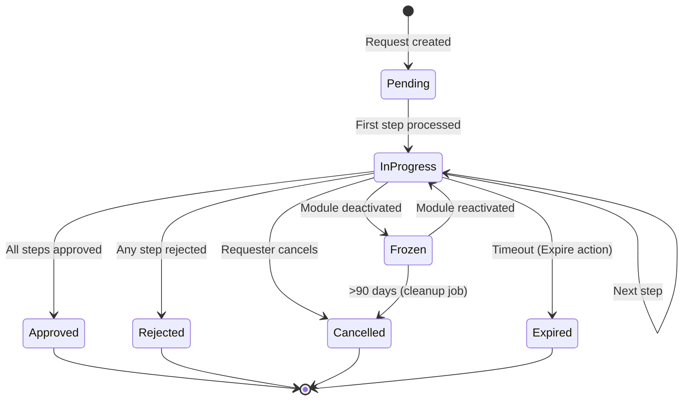
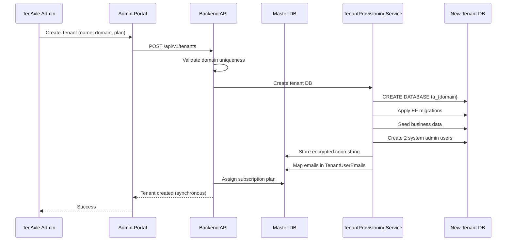
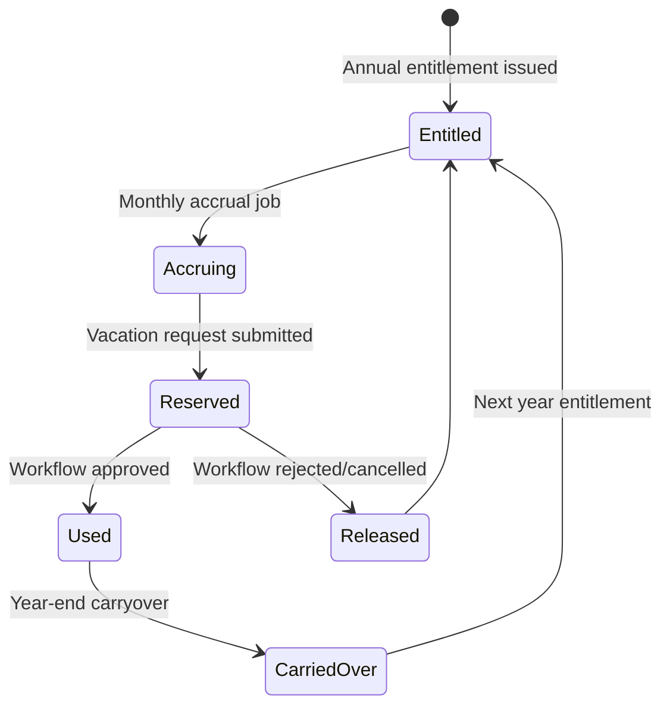
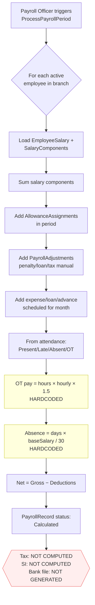

# HRMS Business Flow Review

**System:** TecAxle HRMS (multi-tenant SaaS workforce management platform)
**Review Date:** 2026-04-14
**Scope:** Backend (.NET 8 Clean Architecture), Admin Angular frontend, Employee self-service Angular frontend, Flutter mobile app, PostgreSQL master DB + per-tenant DBs
**Audience:** Product leaders, HR stakeholders, solution architects, QA, and senior management
**Purpose:** Provide a top-down view of what the system actually does vs. what it claims, highlight gaps and risks, and recommend prioritized enhancements.

> **How to read this document**
> Every significant finding is flagged with one of the following tags:
> - **[Implemented]** — code path verified, works end-to-end
> - **[Partial]** — core exists but stubbed, hardcoded, or missing edge cases
> - **[Missing]** — feature described or implied but no production implementation found
> - **[Inferred]** — behavior deduced from code patterns; warrants stakeholder confirmation
>
> File paths are given without line numbers (which drift with edits) for long-term traceability.

---

## 1. Executive Summary

TecAxle HRMS is a comprehensive enterprise HR/workforce platform that combines **Time & Attendance**, **Leave/Excuse/Remote-Work**, **Recruitment → Onboarding → Performance → Offboarding lifecycle**, **Payroll & Compensation**, and **Subscription-based module entitlements** into a single tenant-isolated SaaS. Each tenant gets its own dedicated PostgreSQL database (`ta_{domain}`); a master database (`tecaxle_master`) holds only platform entities (tenants, subscription plans, platform users).

### Maturity at a glance

| Domain | Verdict | Headline |
|---|---|---|
| Authentication, multi-tenancy, per-tenant DB provisioning | **Mature** | Email → tenant resolution → DB connection; AES-256 encrypted conn strings |
| Subscription / entitlements / MediatR enforcement | **Mature for 173 decorated handlers**; gap elsewhere | Enforcement is selective — lifecycle controllers bypass it entirely |
| Approval workflow engine | **Mature engine, fragile edges** | Solid state machine; approver resolution heuristics are brittle |
| Time & Attendance (incl. mobile GPS+NFC) | **Mostly mature** | Core hours, premium OT, early-start tracking all stubbed with `// TODO` |
| Leave Management | **Operational** | No expiry, no blackout, cancel-after-approved leaves attendance inconsistent |
| Shift Management | **Operational** | Priority-based resolution works; no conflict detection |
| Payroll & Compensation | **Materially incomplete** | Tax and social-insurance **never computed**; entities exist but unused |
| End-of-Service | **Implemented (Saudi)** | Resignation tier deductions in code |
| Recruitment / Performance / Onboarding / Offboarding | **Domains complete, plumbing weak** | Controllers bypass MediatR; no module gating; no auto-transitions between stages |
| Notifications | **Mostly mature** | SignalR live, FCM push delivery is TODO |
| File management | **Basic** | Local disk only; no PDF generation for offers/contracts/payslips |

### Top 5 headline observations

1. **Payroll does not compute tax or social insurance.** `TaxConfiguration` and `SocialInsuranceConfig` entities exist; handler never reads them. Fields on `PayrollRecord` remain zero. This is the single largest revenue/compliance risk.
2. **Lifecycle controllers (Recruitment, Onboarding, Performance, Offboarding, Contracts) bypass MediatR** and use `IApplicationDbContext` directly. This skips `[RequiresModule]` entitlement enforcement — a tenant without the Recruitment module can still hit recruitment endpoints.
3. **Hardcoded "business constants" in critical calculations:** overtime multiplier `1.5×`, 30-day month for absence deduction, `AssignedByUserId = 1` in auto-shift assignment, OT caps `2h` pre / `4h` post, 15-min OT threshold. None are sourced from configuration.
4. **Approval-kickoff logic is duplicated across 4+ request handlers** (Vacation, Excuse, Remote-Work, Attendance Correction) with copy-pasted delegation and auto-approve branches — a bug in one handler will not be fixed in the others.
5. **No auto-transitions between major lifecycle events.** Offer-Accepted does not create an Onboarding process; Resignation-Approved does not create a Termination record; Termination does not generate a Final Settlement. Every cross-stage step is a manual HR action.

### Scope snapshot

- **26 system modules**, 130+ API controllers, 269 `[RequiresModule]`-decorated commands/queries (non-Core modules)
- **12 background jobs** (attendance generation, leave accrual, workflow timeout, contract/visa/PIP/review reminders, frozen-workflow cleanup, profile-change apply, onboarding-overdue, expense-allowance expiry)
- **7-state workflow machine** (Pending, InProgress, Approved, Rejected, Cancelled, Expired, Frozen)
- **8 seeded policy templates** (Saudi Standard, UAE Standard, 6 industry templates)
- **3 frontends + mobile:** Admin (Angular 20 @ 4200), Self-service (Angular 20 @ 4201), Flutter mobile (iOS/Android)

---

## 2. System Scope and Functional Map

### 2.1 Module catalog

The system defines 26 modules in `SystemModule` enum. Below is a functional grouping with primary roles and dependencies.

| # | Module | Purpose | Primary Roles | Upstream Dependencies | Downstream Consumers |
|---|---|---|---|---|---|
| 1 | Core / Auth / RBAC | Login, 2FA, JWT, roles, permissions, branch-scope | All users | — | Every module |
| 2 | Tenants (Platform) | Tenant CRUD, DB provisioning, status | TecAxle Admin | — | All tenant-scoped data |
| 3 | Subscription Plans | Plans, entitlements, feature flags, limits | TecAxle Admin | — | Entitlement enforcement pipeline |
| 4 | Tenant Subscriptions | Assign/change/cancel plan per tenant | TecAxle Admin, Tenant SysAdmin | Subscription Plans, Tenants | Entitlement service, UI gating |
| 5 | Tenant Configuration | TenantSettings, Branch/Dept overrides, setup steps | Tenant SysAdmin, HR Admin | Tenants | Every business module that reads settings |
| 6 | Organization (Branches/Departments/Employees) | Hierarchy + master data | HR Admin, Manager | Tenant Config | Shifts, Attendance, Payroll, Leave, Workflows |
| 7 | Shift Management | Shifts, periods, off-days, assignments | HR Admin, Manager | Organization | Attendance Calculation |
| 8 | Time & Attendance | Transactions, daily records, calculations | Employee, Manager, HR | Shifts, Public Holidays, Remote-Work, Leave, Excuse | Payroll, Reports |
| 9 | Mobile Attendance | GPS+NFC verified check-in/out | Employee | Branches (geofence), NFC Tags | Time & Attendance |
| 10 | Public Holidays | Branch-specific + recurring | HR Admin | Organization | Attendance, Payroll |
| 11 | Overtime Configuration | Per-branch OT rules & rates | HR Admin | Organization | Attendance, Payroll |
| 12 | Leave Management | Vacation types, balances, accrual, requests | Employee, Manager, HR | Organization, Workflow | Attendance, Payroll |
| 13 | Excuse Management | Excuse policies + requests | Employee, Manager | Organization, Workflow | Attendance |
| 14 | Remote-Work Management | Policies + requests | Employee, Manager | Organization, Workflow | Attendance |
| 15 | Fingerprint Requests | Biometric enrollment/repair | Employee, Technician | Organization | — |
| 16 | NFC Tag Management | Tag provisioning, HMAC signing | HR Admin / Tech | Organization | Mobile Attendance |
| 17 | Approval Workflows | Unified engine across all request types | All approver-type users | Organization | All request modules, Notifications |
| 18 | Notifications | In-app (SignalR), push (FCM TODO), broadcasts | All | Workflow, background jobs | UI, mobile |
| 19 | Recruitment | Requisitions, postings, candidates, applications, interviews, offers | HR, Manager | Organization | Onboarding (manual link) |
| 20 | Onboarding | Templates, processes, tasks, documents | HR, Employee, Buddy | Recruitment (manual) | Employee creation |
| 21 | Performance | Cycles, reviews, goals, competencies, PIPs, 360° | HR, Manager, Employee | Organization | Promotions, Salary Adjustments |
| 22 | Employee Lifecycle | Contracts, promotions, transfers, profile changes, visas | HR | Organization | Payroll, Offboarding |
| 23 | Salary Adjustments | Increments, promotions, corrections | HR, Manager | Workflow | Payroll |
| 24 | Payroll & Compensation | Salary structures, periods, records, allowances | Payroll Officer, HR | Attendance, Leave, Salary, Allowances | Bank transfer (missing), EOS |
| 25 | Offboarding | Resignation, termination, exit interview, clearance, settlement | HR, Employee, Manager | Workflow, Contracts, Payroll | — |
| 26 | Reporting & Audit | Dashboards, attendance/leave reports, audit logs, sessions | HR, Platform Admin | All modules | — |

### 2.2 Module interaction map

```
Tenants ── Subscription Plans ── Entitlement Service ── [Every module via MediatR pipeline]
                                            │
                                            └── Module Deactivation ── Workflow Freezing

Organization ── Shifts ──┐
                         │
Public Holidays ─────────┤
                         ├──► Attendance Calculation ──► Payroll Processing ──► (missing) Bank File
Leave / Excuse / Remote ─┤                                        │
                         │                                        └──► EOS on termination
Mobile GPS+NFC ──────────┘

Workflows ◄── (Vacation, Excuse, Remote, Correction, Fingerprint, Allowance, Salary Adj, Resignation)
                                    │
                                    └──► Notifications (SignalR + in-app), Audit

Recruitment ──(manual)──► Onboarding ──(manual)──► Employee Creation ──► Contracts ──► Payroll
                                                                                   │
                                                          Resignation ──► Termination ──► Clearance ──► Final Settlement
```

---

## 3. Roles and Actors

### 3.1 Platform-level actors (master DB)

| Role | Table | Primary Responsibilities | Key Modules | Notes |
|---|---|---|---|---|
| **TecAxle Admin** | `PlatformUsers` with `PlatformRole = TecAxleAdmin` | Provision new tenants, assign subscription plans, cancel/suspend tenants, manage plan catalog, monitor platform health | Tenants, Subscription Plans, Entitlement admin | Single unified portal; does **not** see tenant-only menu items (enforced in `sidenav.component.ts`) |
| **TecAxle Support** | `PlatformUsers` with `PlatformRole = TecAxleSupport` | Read-only / support access to tenants | Tenants (view), Policy Templates | Role enum exists; distinct permissions not explored in this pass |

### 3.2 Tenant-level actors (per-tenant DB)

| Role | Source | Primary Responsibilities | Module Access | Approvals Performed |
|---|---|---|---|---|
| **Tenant System Admin** | Seeded (`tecaxleadmin@{domain}`, `systemadmin@{domain}`, `IsSystemUser=true`) | Full tenant admin; protected from edit/delete | All enabled modules | Any role-based approval if assigned |
| **HR Administrator** | User with HR role | Manage employees, contracts, payroll setup, policies | Organization, Leave, Payroll, Lifecycle, Recruitment | Depends on workflow config |
| **HR Operations** | User with HR role (subset perms) | Day-to-day HR tasks (request processing, document management) | Portal, Leave, Excuse, Remote | Often mid-step approvers |
| **Department Head** | Inferred from employee structure (first employee with no manager in same dept) | Approve team requests, review performance | Portal, Approvals | DepartmentHead approver-type |
| **Direct Manager** | `Employee.ManagerEmployeeId` | Approve direct reports' requests | Portal, Approvals, Team | DirectManager approver-type |
| **Employee** | Any non-managerial user | Self-service: attendance, requests, profile | Self-service portal, Mobile app | — |
| **Technician (Fingerprint)** | Inferred (no dedicated role) | Assigned to fingerprint requests | Fingerprint Requests | — |
| **Payroll Officer** | **[Inferred]** — not a formally named role | Process payroll periods, generate records | Payroll | — |
| **Approver (Role-based)** | Any user assigned to a role that a workflow step targets | Approve via workflow | Workflow assignments | Step-specific |

**Observation:** There is **no explicit Payroll Officer or Finance role in the permission model**. Payroll endpoints are presumably gated by permissions but the role concept is soft.

### 3.3 Dual system users per tenant

Per tenant the provisioning service creates **two** system admins:
- `tecaxleadmin@{domain}` (TecAxle-side master operator)
- `systemadmin@{domain}` (tenant-side system operator)

Both are flagged `IsSystemUser = true` and are protected from edit/delete via `UpdateUserCommandHandler` / `DeleteUserCommandHandler`. The frontend `user-table.component.ts` hides edit/delete buttons for these users.

---

## 4. End-to-End Business Flows

This section walks through the 14 most significant flows. Each flow follows: **Trigger → Preconditions → Steps → Status transitions → Notifications → Exceptions → Outcome → Entities → APIs**.

### 4.1 Tenant provisioning & onboarding

- **Trigger:** TecAxle Admin submits Create-Tenant form (admin portal)
- **Preconditions:** Unique email domain (enforced via `TenantUserEmails` uniqueness); valid subscription plan selected
- **Steps:**
  1. `CreateTenantCommand` runs with FluentValidation
  2. `TenantProvisioningService` derives DB name `ta_{email_domain}` (collision fallback: append suffix `_2`, `_3`, …)
  3. PostgreSQL database created; EF Core migrations applied; business-data seed (roles, permissions, shifts, workflows, vacation types) runs
  4. Local `Tenant` row created in tenant DB (for FK on TenantSettings/SetupSteps)
  5. `TenantSettings` defaults + 9 `SetupStep` rows seeded
  6. Two system admin users created: `tecaxleadmin@{domain}` + `systemadmin@{domain}`; both mapped in master `TenantUserEmails`
  7. Encrypted connection string (AES-256) stored in master `Tenants.EncryptedConnectionString`
  8. Selected subscription plan assigned via `TenantSubscription` record in master DB
- **Notifications:** None for the tenant itself; platform admin sees success/fail in UI
- **Outcome:** Tenant active; can log in via `tecaxleadmin@{domain}` / seeded password
- **Entities (master):** `Tenants`, `TenantUserEmails`, `TenantSubscriptions`, `PlatformUsers`
- **Entities (tenant DB):** `Tenants` (single row), `TenantSettings`, `SetupSteps`, `Users`, `Roles`, `Shifts`, `WorkflowDefinitions`, `VacationTypes`
- **APIs:** `POST /api/v1/tenants`, `POST /api/v1/tenants/{id}/provision-database`

**⚠️ Weaknesses**
- **Synchronous provisioning.** DB creation + migration + seeding happens in-request; tenants with large seed sets wait at the UI. No progress indicator in UI; no background job option.
- **Partial-failure cleanup is opportunistic.** If step 6 fails after step 3, the empty tenant DB remains.
- **Subscription assignment is non-fatal** (by design). Tenant is created Active even if plan assignment fails, leaving a tenant with no plan.

### 4.2 Employee onboarding (Recruitment → Offer → Onboarding)

- **Trigger:** HR creates Job Requisition
- **Happy path:**
  1. Requisition: `Draft → PendingApproval → Approved → Open` (state machine in `RequisitionStatus`)
  2. HR creates Job Posting (internal / external)
  3. Candidate applies → `JobApplication` created with `ApplicationStatus = New`
  4. Application advances: `New → Screening → ShortListed → InterviewScheduled → Interviewing → OfferPending → OfferExtended → OfferAccepted → Hired`
  5. Interview(s) scheduled; feedback collected per interviewer
  6. Offer Letter: `Draft → PendingApproval → Approved → Sent → Accepted`
  7. **MANUAL** HR creates Onboarding Process from template, linking `OfferLetterId`
  8. Onboarding tasks expanded from template; due dates set
  9. Employee record created (manually); `OnboardingProcess` links to `EmployeeId`
  10. Tasks worked through; `OnboardingTaskOverdueJob` flags overdue items
- **Notifications:** Task overdue → assigned employee + HR (dual notification)
- **Outcome:** New active Employee with completed onboarding
- **Entities:** `JobRequisition`, `JobPosting`, `Candidate`, `JobApplication`, `InterviewSchedule`, `InterviewFeedback`, `OfferLetter`, `OnboardingTemplate`, `OnboardingProcess`, `OnboardingTask`, `OnboardingDocument`, `Employee`
- **APIs:** `/api/v1/job-requisitions`, `/api/v1/job-postings`, `/api/v1/candidates`, `/api/v1/job-applications`, `/api/v1/interview-schedules`, `/api/v1/offer-letters`, `/api/v1/onboarding-templates`, `/api/v1/onboarding-processes`

**⚠️ Weaknesses**
- **No auto-transition: Offer-Accepted → Onboarding Process creation.** HR must click "create onboarding" manually after the offer is accepted. Risk of forgotten onboarding.
- **No auto-transition: Onboarding complete → Employee activation.** `Employee.IsActive` is not driven by onboarding completion.
- **Interview feedback aggregation not implemented.** Individual feedback stored; no rolled-up decision score or dashboard.
- **Offer letter PDF generation not found.** `DocumentUrl` field exists on `OfferLetter` but PDF builder is absent — HR presumably uploads externally.
- **Recruitment controllers bypass MediatR and [RequiresModule].** A tenant whose plan excludes Recruitment can still use these endpoints.

### 4.3 Daily attendance generation & finalization

- **Trigger:** `DailyAttendanceGenerationJob` at 02:00 tenant-local daily (Coravel); also on-demand via admin action
- **Preconditions:** Active employees, active shift assignments (or default-shift fallback)
- **Steps (per employee):**
  1. `DailyAttendanceGeneratorService.GenerateAttendanceRecordForEmployeeAsync`
  2. Resolve effective shift assignment (priority: Employee > Department > Branch; tie-break by Priority DESC, type DESC)
  3. If none found, auto-assign the shift marked `IsDefault=true` as a temporary assignment (hardcoded `AssignedByUserId = 1`)
  4. Build `AttendanceRecord` with scheduled times from shift periods
  5. `AttendanceCalculationService.CalculateAttendanceAsync` determines status:
     - Priority: **Holiday → approved Leave → approved Remote Work → full-day Excuse → no shift (DayOff) → no working day → no check-in (Absent) → no check-out (Incomplete) → Late / EarlyLeave (if thresholds) → Present**
  6. Working hours, break hours, late minutes, early-leave minutes calculated from transactions
  7. Overtime calculated (holiday = all hours; normal day = pre-shift + post-shift beyond grace)
- **End-of-day job:** `EndOfDayAttendanceFinalizationJob` at 23:59 marks eligible records finalized
- **Notifications:** None automatically (no "your attendance was finalized" notice)
- **Outcome:** One `AttendanceRecord` per employee per day with status, working hours, overtime
- **Entities:** `AttendanceRecord`, `AttendanceTransaction`, `WorkingDay`, `Shift`, `ShiftPeriod`, `ShiftAssignment`, `OvertimeConfiguration`

**⚠️ Weaknesses**
- **Grace-period behavior is counter-intuitive.** If an employee exceeds the grace period (e.g., grace=15 min, arrival=20 min late), the **full** 20 minutes is reported as late — not 5 minutes. Documented as "tolerance" but implemented as "all-or-nothing".
- **Flexible hours use `FlexMinutesAfter` only.** `FlexMinutesBefore` is a field on the shift but never read. Early arrivals within the flex window are not differentiated.
- **CoreHoursWorked / CoreHoursCompliant / PremiumOvertimeHours / EarlyStartHours / LateEndHours / TrackingGaps are all stubbed with `// TODO`.** These appear on `WorkingDay` but always return 0 or `true`.
- **Default-shift auto-assignment hardcodes `AssignedByUserId = 1`.** Breaks audit trail and will fail if User ID 1 doesn't exist.

### 4.4 Mobile GPS+NFC check-in

- **Trigger:** Employee taps "Check In" in Flutter mobile app
- **Preconditions:** Tenant has `mobileEnabled = true`; branch has `Latitude`, `Longitude`, `GeofenceRadiusMeters`; NFC tag registered and Active for branch (if NFC required)
- **Steps:**
  1. Mobile calls `POST /api/v1/mobile/attendance/transaction` with GPS + NFC payload
  2. `ProcessMobileTransactionCommandHandler` reads tenant settings to determine `requireGps`, `requireNfc`
  3. GPS check: Haversine distance vs branch coords; fail → log `GpsOutsideGeofence`
  4. NFC check: tag exists / active / registered to branch; if HMAC required, verify HMAC-SHA256 signature of `{tagId}|{branchId}|{tagUid}|{timestamp}|{signature}`
  5. On success: create `AttendanceTransaction` (UTC + branch-local time, device ID, GPS coords, verification method)
  6. Every attempt (success and failure) logged to `AttendanceVerificationLog`
- **Notifications:** None
- **Outcome:** `AttendanceTransaction` → consumed by nightly attendance generation
- **Entities:** `AttendanceTransaction`, `AttendanceVerificationLog`, `NfcTag`, `Branch`

**⚠️ Weaknesses**
- **Failure-reason misclassification.** When NFC is required but missing, the handler logs `GpsUnavailable` instead of a specific "NFC required but not provided" reason.
- **No offline queue / retry on the client.** A single network failure blocks the transaction.
- **Minimal fraud-detection.** Only Device ID is captured; no device model / OS fingerprint / jailbreak check.
- **No user-facing feedback on geofence boundary.** The mobile UX does not show "you are 25m outside the allowed area".

### 4.5 Vacation / Leave request

- **Trigger:** Employee submits vacation via self-service portal or mobile app
- **Preconditions:** Valid vacation type; sufficient leave balance (including pending reservations)
- **Steps:**
  1. `CreateEmployeeVacationCommand` validates date overlap and balance
  2. `EmployeeVacation` created with `IsApproved = false`
  3. Leave balance **reserved** immediately (moved to `PendingDays`), even before approval
  4. `WorkflowEngine.StartWorkflowAsync` kicks off a Vacation workflow (branch-scoped or org-default)
  5. First step assigned to resolved approver (DirectManager by default); approver receives `ApprovalPending` notification
  6. Approver approves/rejects; subsequent steps process until workflow terminal state
  7. On final **Approve**: `EmployeeVacation.IsApproved = true`; reserved days converted to **Used**; attendance records for the vacation period set to `OnLeave`
  8. On **Reject**: reservation released; requester notified
- **Notifications:** RequestSubmitted, ApprovalPending (each step), RequestApproved/Rejected
- **Status:** `WorkflowInstance.Status`: Pending → InProgress → Approved / Rejected / Cancelled / Expired / Frozen
- **Outcome:** Leave recorded; attendance status updated for period
- **Entities:** `EmployeeVacation`, `LeaveBalance`, `LeaveTransaction`, `WorkflowInstance`, `WorkflowStepExecution`, `AttendanceRecord`
- **APIs:** `POST /api/v1/employee-vacations`, `GET /api/v1/employee-vacations/my-requests`, approval via `POST /api/v1/workflows/{instanceId}/approve`

**⚠️ Weaknesses**
- **Cancel-after-approved does not revert attendance.** If a user cancels an approved vacation, `EmployeeVacation` status changes but `AttendanceRecord.Status = OnLeave` is not recalculated back to Present/whatever would have been.
- **Orphaned workflow instance on cancel.** `WorkflowInstanceId` on vacation is not cleared; re-requesting can create a duplicate workflow.
- **Bulk vacation creation** UI exists but there is no bulk-approval path for managers (must approve each vacation individually).
- **No blackout period support.** Cannot prevent vacations during company-defined blackout windows.

### 4.6 Excuse request

- **Trigger:** Employee submits excuse (sick, personal, medical, etc.) via self-service
- **Steps:** Same pattern as Vacation — `CreateEmployeeExcuseCommand` → workflow → on approval update `EmployeeExcuse.ApprovalStatus = Approved`
- **Attendance integration:** Full-day excuses (≥8 hours) override status to `Excused` or `OnDuty` (per excuse type); partial excuses (<8 hours) **only adjust late/early-leave minutes** but do **not** change status.
- **⚠️ Gap:** Partial excuse users remain flagged as Late/EarlyLeave in reports even though the excuse was approved — confusing for employees.

### 4.7 Remote-work request

- **Trigger:** Employee requests remote work
- **Steps:** Same workflow pattern; on approval sets `AttendanceRecord.Status = RemoteWork` for the period
- **Policy checks:** Max days per week/month, notice period, blackout periods, department eligibility (policy config exists)
- **⚠️ Weakness:** The `RemoteWorkPolicy` exists with notice period / max days fields, but whether these are enforced pre-workflow vs only visible in UI requires confirmation.

### 4.8 Attendance correction

- **Trigger:** Employee notices a wrong clock-in/out → submits correction
- **Steps:** `CreateAttendanceCorrectionRequestCommand` → workflow → on approval, original transaction adjusted or new transaction created; attendance recalculated
- **⚠️ Weakness:** TODO noted in code for file-upload support; correction requests cannot attach supporting evidence (photo of device malfunction, etc.) in the current implementation.

### 4.9 Shift assignment & change

- **Trigger:** HR/Manager assigns new shift or changes shift for specific dates
- **Resolution:** Shift selection at attendance-generation time uses:
  ```
  WHERE Status = Active
    AND EffectiveFromDate <= date
    AND (EffectiveToDate IS NULL OR EffectiveToDate >= date)
  ORDER BY Priority DESC, AssignmentType DESC
  ```
  — Employee (3) > Department (2) > Branch (1)
- **Change shift for a specific attendance record:** Referenced in CLAUDE.md, but **handler/API not located** in this pass. Marked **[Inferred - needs verification]**.

**⚠️ Weaknesses**
- **No conflict detection.** Two Employee-level active assignments for the same date range both pass validation; resolution picks the higher Priority, silently ignoring the other.
- **No bulk import.** Assignments are one-by-one unless done via policy template application.

### 4.10 Overtime "approval"

- **Design intent:** `OvertimeConfiguration.RequireApproval` exists as a flag
- **Implementation state: [Missing]** — the flag is stored but **never read** by `AttendanceCalculationService`. Overtime is computed and credited without any approval step. The documented "Approval Requirements: Optional approval workflow for overtime" is aspirational.

### 4.11 Payroll processing

- **Trigger:** Payroll Officer triggers `ProcessPayrollPeriodCommand` for a period
- **Status transitions:** `Draft → Processing → Processed` (no `Finalized` state in code)
- **Steps (per employee):**
  1. Get current `EmployeeSalary` + `SalaryComponents`
  2. Sum components by type (allowance vs deduction)
  3. Add active `AllowanceAssignments` within period
  4. Add `PayrollAdjustments` (penalties, loans, tax adjustments — manually entered)
  5. Add expense reimbursements / loan installments / salary advances scheduled for the month
  6. From attendance: count Present+Late working days, Absent days, sum overtime hours
  7. Compute `overtimePay = overtimeHours × hourlySalary × 1.5` **(hardcoded 1.5×)**
  8. `absenceDeduction = absenceDays × (baseSalary / 30)` **(hardcoded 30-day month)**
  9. Sum all details; `Net = Gross − Deductions`
  10. Status → `Calculated`
- **Notifications:** None noted
- **Entities:** `PayrollPeriod`, `PayrollRecord`, `PayrollRecordDetail`, `EmployeeSalary`, `SalaryComponent`, `AllowanceAssignment`, `PayrollAdjustment`
- **APIs:** `POST /api/v1/payroll-periods/{id}/process`, `GET /api/v1/payroll-periods/{id}/records`

**⚠️ Critical gaps**
- **Tax is never computed.** `TaxConfiguration` / `TaxBracket` entities exist; handler never queries them. `PayrollRecord.TaxAmount` remains zero.
- **Social insurance is never computed.** `SocialInsuranceConfig` + `EmployeeSocialInsuranceEmployee/Employer` fields exist; never populated.
- **Overtime multiplier is hardcoded 1.5×.** Ignores `OvertimeConfiguration` rates (Normal 1.5 / Holiday 2.0 / OffDay 2.5 are defined but unused for payroll).
- **30-day month for absence deduction.** Doesn't adjust for 28/29/30/31-day months or partial periods.
- **No "Finalized" status / lock.** Records can presumably be re-processed; nothing prevents overwriting after issuance.
- **No bank-transfer file generation.** `BankTransferFile` entity exists but no handler emits it.
- **No payslip PDF.** `PaySlipGeneratedAt` field exists; generator not found.

### 4.12 Salary adjustment

- **Trigger:** HR or Manager requests salary adjustment (annual increment, promotion, correction, market adjustment)
- **Steps:** `SalaryAdjustment` created → workflow for approval → on approval, new effective salary applied to `EmployeeSalary`
- **Integration with payroll:** The next payroll period should pick up the new salary. Whether the adjustment also generates retro-active catch-up in the payroll month is **[unclear — needs confirmation]**.

### 4.13 Contract lifecycle

- **Steps:**
  1. HR creates `EmployeeContract` → `Active`
  2. `ContractExpiryAlertJob` runs daily; sends HR notifications at **30 / 15 / 7 days** before expiry
  3. HR renews (creates new contract, old becomes `Renewed`) or terminates
  4. Status: `Active → RenewalPending → Renewed / Terminated / Expired`
- **Visa lifecycle:** Parallel — `EmployeeVisa` + `VisaExpiryAlertJob` at **90 / 60 / 30 / 15 / 7 days**
- **Profile change requests:** `ApplyScheduledProfileChangesJob` applies pending changes on EffectiveDate via reflection-based field updates (DepartmentId, ManagerEmployeeId, JobTitle, JobGrade, EmploymentStatus, WorkLocationType, CostCenter, IsActive)

**⚠️ Weakness:** Contract expiry sends notifications but **does not auto-deactivate** the employee. If HR misses the alert, the expired employee remains active.

### 4.14 Offboarding

- **Steps (intended):**
  1. Employee submits `ResignationRequest`
  2. Workflow routes to manager → HR
  3. On approval: HR creates `TerminationRecord`, `ClearanceChecklist`, `ExitInterview`, `FinalSettlement`
  4. EOS benefit calculated via `CalculateEndOfServiceCommand`:
     - Saudi law: first 5 years × 0.5 month; after 5 years × 1 month
     - Resignation deductions: <2yrs = 0% entitled, 2–5yrs = 33%, 5–10yrs = 67%, ≥10yrs = 100%
  5. Final settlement paid; employee deactivated
- **Implementation state: [Partial]**
  - Resignation request creation + workflow: **[Implemented]**
  - EOS calculation: **[Implemented]**
  - Clearance checklist / final settlement handlers: **[Missing / partial]** — domain exists, workflow/handlers not discovered
  - **No auto-transition: Resignation Approved → Termination Record.** HR must do it manually.
  - **No auto-transition: Termination → Employee Deactivation.** `Employee.IsActive` is not toggled by this flow.
  - **No clearance-checklist enforcement.** Settlement could theoretically be issued without clearance.

---

## 5. Module-by-Module Detailed Analysis

### 5.1 Authentication & Multi-Tenancy

| Aspect | Status | Notes |
|---|---|---|
| Email-based login resolves tenant from master DB | **[Implemented]** | `TenantUserEmails` → tenant DB → authenticate |
| Platform admin fallback | **[Implemented]** | After no tenant match, checks `PlatformUsers` |
| JWT with tenant_id / is_platform_user / platform_role claims | **[Implemented]** | Flow correct |
| 2FA + backup codes | **[Implemented]** | Present in entity model |
| Password history + lockout | **[Implemented]** | `PasswordHistory`, `LoginAttempt` |
| Branch-scoped data access | **[Implemented]** | `UserBranchScope` |
| Session management + blacklist | **[Implemented]** | `BlacklistedToken` |

**UX concerns:** First-login password-change is forced (`MustChangePassword = true` for seeded users) — good. But no self-serve tenant discovery ("forgot my subdomain") is visible to employees.

### 5.2 Tenant & Subscription

| Aspect | Status | Notes |
|---|---|---|
| Tenant CRUD + provisioning | **[Implemented]** | Synchronous; see §4.1 |
| Plan catalog (Starter/Professional/Enterprise) | **[Implemented]** | 3 defaults seeded |
| Plan assignment / change / cancel | **[Implemented]** | With entitlement change log |
| `ModuleEntitlementBehavior` MediatR pipeline | **[Partial]** | 173 handlers decorated; lifecycle controllers **bypass** |
| Frontend module-aware nav & guards | **[Implemented]** | `EntitlementService`, `moduleGuard` |
| Tenant settings + branch/dept overrides | **[Implemented]** | 5-min cached resolver |
| Policy templates (Saudi/UAE + 6 industry) | **[Implemented]** | 8 seeded templates |

### 5.3 Time & Attendance

| Aspect | Status | Notes |
|---|---|---|
| Daily attendance generation | **[Implemented]** | Nightly job |
| Status priority chain | **[Implemented]** | Holiday → Leave → Remote → Excuse → DayOff → Late → Present |
| Grace period | **[Partial — misleading]** | Full late time counted if grace exceeded |
| Flexible hours | **[Partial]** | Only `FlexMinutesAfter` used |
| Overtime (regular) | **[Partial]** | Per-shift caps 2h/4h; payroll ignores configured rates |
| Overtime (premium tiers) | **[Missing]** | Only single rate per day type |
| Core hours compliance | **[Missing]** | Stubbed TODO |
| Manual override | **[Implemented]** | Edit-attendance page exists |
| Mobile GPS+NFC | **[Implemented]** | See §4.4; HMAC verification functional |
| Device integration (biometric) | **[Inferred — unverified]** | No ingest endpoint discovered in this pass |

### 5.4 Leave Management

| Aspect | Status | Notes |
|---|---|---|
| Vacation types + policies | **[Implemented]** | Full CRUD |
| Balance reservation on request | **[Implemented]** | Reserves pre-approval |
| Monthly accrual | **[Implemented]** | `MonthlyLeaveAccrualJob` with pro-ration |
| Carryover | **[Partial]** | Calculated but not capped by policy; no expiry logic |
| Entitlements year-over-year | **[Implemented]** | Next-year entitlement created |
| Bulk vacation creation | **[Implemented]** | Modal in admin |
| Cancel-after-approved reverts attendance | **[Missing]** | Known gap |
| Blackout periods | **[Missing]** | Not modeled |
| Sick-leave limit enforcement | **[Missing]** | No cap per policy |

### 5.5 Excuse, Remote-Work, Fingerprint, Attendance-Correction

All follow the same workflow-kickoff pattern. Each:
- Has its own create command with validation
- Starts a workflow for approval
- On approval mutates related attendance state

**Primary weak point across all four:** duplicated kickoff code (delegation check, auto-approve branch, attendance update hook). Extract to a shared `IRequestWorkflowStarter` service.

### 5.6 Shift Management

| Aspect | Status | Notes |
|---|---|---|
| Shift types, periods, core hours, grace | **[Implemented]** | Entity-level |
| Overlap detection across shift periods | **[Implemented]** | Validation on period creation |
| Shift assignment priority | **[Implemented]** | See §4.9 |
| Assignment conflict detection | **[Missing]** | Multiple same-level active assignments allowed |
| Bulk assignment | **[Missing]** | Single-assignment UI only |
| Change shift for specific attendance record | **[Inferred — not located]** | Mentioned in CLAUDE.md |

### 5.7 Payroll & Compensation

| Aspect | Status | Notes |
|---|---|---|
| Salary structures + components | **[Implemented]** | CRUD |
| Payroll period processing | **[Partial]** | See §4.11 critical gaps |
| Tax calculation | **[Missing]** | Config entities unused |
| Social insurance | **[Missing]** | Config entities unused |
| Allowance types/policies/assignments/requests | **[Implemented]** | Request workflow works |
| End-of-service benefits (Saudi) | **[Implemented]** | Tiered deductions |
| Bank transfer file | **[Missing]** | Entity exists, generator absent |
| Payslip PDF | **[Missing]** | Field exists, generator absent |
| Payroll "Finalized" / lock status | **[Missing]** | Only "Processed" |
| Retro / catch-up calculations | **[Inferred — unclear]** | Salary adjustment integration unverified |

### 5.8 Recruitment, Onboarding, Performance, Offboarding

All four share the same **implementation concern: controllers bypass MediatR and have no `[RequiresModule]` attributes.** Domain models are complete and fairly sophisticated; what's missing is:
- Pipeline CQRS enforcement
- Module gating
- Cross-module auto-transitions

| Module | Domain | Controllers | Jobs | Gaps |
|---|---|---|---|---|
| Recruitment | **[Implemented]** | **[Implemented, bypasses MediatR]** | — | Offer PDF, module gating, feedback aggregation |
| Onboarding | **[Implemented]** | **[Implemented, bypasses MediatR]** | OnboardingTaskOverdueJob | Auto-create from Offer, completion → activation |
| Performance | **[Implemented]** | **[Implemented, bypasses MediatR]** | ReviewCycleReminderJob, PIPExpiryCheckJob | 360 aggregation, goal progress, workflow approvals |
| Offboarding | **[Implemented (domain)]** | **[Partial]** | — | Clearance, settlement handlers, auto-transitions |

### 5.9 Employee Lifecycle

| Aspect | Status | Notes |
|---|---|---|
| Contract lifecycle | **[Implemented]** | Alerts + manual renew/terminate |
| Contract expiry alerts | **[Implemented]** | 30/15/7 days |
| Promotion workflow | **[Implemented]** | Via workflow engine |
| Transfer (inter-branch/dept) | **[Implemented]** | History tracking |
| Profile change scheduling | **[Implemented]** | Reflection-based applier |
| Visa tracking + alerts | **[Implemented]** | 90/60/30/15/7 days |
| Auto-deactivate on contract expiry | **[Missing]** | Alerts only |

### 5.10 Notifications

| Aspect | Status | Notes |
|---|---|---|
| In-app notifications CRUD | **[Implemented]** | `NotificationsController` |
| SignalR NotificationHub | **[Implemented]** | `/hubs/notifications` |
| Per-user group targeting | **[Implemented]** | `user_{userId}` groups |
| Bilingual titles/messages | **[Implemented]** | EN+AR |
| Push token registration | **[Implemented]** | FCM tokens stored |
| FCM push send | **[Missing]** | TODO in `CreateBroadcastCommandHandler` |
| Email channel | **[Missing]** | No SMTP integration found |
| SMS channel | **[Missing]** | Not found |

### 5.11 File Management

| Aspect | Status | Notes |
|---|---|---|
| Upload / download / delete | **[Implemented]** | Local disk |
| Entity linking (`FileAttachment`) | **[Implemented]** | EntityType + EntityId |
| Cloud storage | **[Missing]** | Local only |
| Type/size enforcement | **[Partial]** | 10MB max, type whitelist in code; no virus scan |
| PDF generation (offer, contract, payslip) | **[Missing]** | URL fields present, generators absent |

### 5.12 Reporting & Audit

| Aspect | Status | Notes |
|---|---|---|
| Attendance reports (summary/detail) | **[Implemented]** | With CSV export |
| Leave reports | **[Implemented]** | By type |
| Module-gated reports | **[Implemented]** | `ReportsController` checks entitlement per endpoint |
| Audit log (before/after) | **[Implemented]** | `AuditLog`, `AuditChange` |
| Session reports | **[Implemented]** | Active sessions, login history |
| Export formats beyond CSV | **[Missing]** | No Excel/PDF export |
| Scheduled report email delivery | **[Missing]** | TODO noted |

---

## 6. Approval Workflows and Decision Logic

### 6.1 Engine architecture

A single `WorkflowEngine` service governs all approval requests. It operates over three tables:
- `WorkflowDefinition` — template (steps, approvers, timeouts)
- `WorkflowInstance` — a live request
- `WorkflowStepExecution` — per-step state (assigned, approved, delegated, timed-out)
- `ApprovalDelegation` — time-bound out-of-office redirects

### 6.2 State machine

```
         ┌─────────────┐
   ──▶   │  Pending    │
         └──────┬──────┘
                │ first step processed
         ┌──────▼──────┐
         │ InProgress  │◀───────┐
         └──┬──┬──┬──┬─┘        │
            │  │  │  │          │ Module reactivate
 Approve all │  │  │  │ Freeze  │
            │  │  │  │          │
            ▼  ▼  ▼  ▼          │
     Approved Rejected Expired Frozen ──────┘
     Cancelled           (90-day cleanup → Cancelled)
```

### 6.3 Approver resolution (from `DetermineApproverAsync`)

| ApproverType | Resolution | Risk |
|---|---|---|
| **SpecificUser** | Use `ApproverUserId` | — |
| **DirectManager** | `EmployeeUserLink` → `Employee.Manager` → manager's user | Fails if employee has no manager |
| **DepartmentHead** | First employee in same dept with `ManagerEmployeeId = null` | **Fragile heuristic.** Many orgs have explicit head-role assignments |
| **Role** | `UserRoles.FirstOrDefaultAsync` for active user with role | **No rotation / load-balancing.** Always same user |
| **System** | Returns 0 (no human approver) | — |

### 6.4 Rejection, cancel, delegation, timeout

- **Reject** at any step → workflow terminal `Rejected`; requester notified; no "return to requester for edit" flow
- **Cancel** (by requester before terminal) → `Cancelled`; reservations (balance, etc.) released
- **Delegation** → original execution remains in `Delegated` state (orphaned); new execution assigned to delegate
- **Timeout** actions: `Expire`, `AutoApprove`, `AutoReject`, `Escalate`
- **Escalation** passes `triggeringUserId = 0` creating an execution with `CreatedBy = "0"` — audit smell

### 6.5 Weaknesses

| # | Issue | Severity | Impact |
|---|---|---|---|
| W1 | Role-based first-user bottleneck | High | Single user gets all role-based approvals |
| W2 | Department-head heuristic | High | Wrong in ~any org with explicit head designations |
| W3 | Orphaned Delegated executions | Medium | Audit confusion |
| W4 | `PerformValidationAsync` returns `true` unconditionally | Medium | No real validation on Validation-type steps |
| W5 | Condition evaluator catches all exceptions, defaults false | Medium | Silent failures |
| W6 | Escalation with `triggeringUserId = 0` | Medium | Audit trail gap |
| W7 | Debug `Console.WriteLine` in approval handler | Low | Log noise |
| W8 | Duplicated kickoff logic across 4+ request handlers | Medium | Bug divergence risk |
| W9 | No step-level "return for changes" | Medium | UX — reject is binary |
| W10 | Workflow definition not version-pinned on instance | Low | Mid-flight definition edits can break instances |

---

## 7. Configuration and Policy Logic

### 7.1 Inheritance chain

```
Platform Defaults (code constants)
        ▼
Tenant Settings (TenantSettings row)
        ▼
Branch Overrides (BranchSettingsOverride, nullable fields = inherit)
        ▼
Department Overrides (DepartmentSettingsOverride, narrow scope)
```

Resolved via `ITenantSettingsResolver` with per-field source tracking (`tenant` / `branch` / `department`) and 5-minute caching.

### 7.2 What is configurable today

- Attendance thresholds, shift grace, core hours
- Leave types, policies, accrual rates
- Overtime rates (defined but not used by payroll!)
- Approval workflow definitions (per branch / org)
- Mobile verification requirements (GPS/NFC)
- NFC encryption `RequirePayload` toggle
- Subscription-driven module enablement + feature flags + limits

### 7.3 What is hardcoded but should be configurable

| Hardcoded value | Location | Risk |
|---|---|---|
| Overtime multiplier `1.5×` in payroll | `ProcessPayrollPeriodCommandHandler` | Wrong pay in every period |
| `30-day month` for absence deduction | same handler | Over/under-deducts by up to 3% |
| `AssignedByUserId = 1` in auto-shift | `DailyAttendanceGeneratorService` | Breaks if user ID 1 absent |
| `OT caps 2h pre / 4h post` | overtime calc | May not match tenant policy |
| `15-min OT minimum threshold` | overtime calc | Doesn't come from `OvertimeConfiguration` |
| `90-day frozen-workflow cleanup` | `FrozenWorkflowCleanupJob` | Should be policy |
| `Contract expiry thresholds 30/15/7` | `ContractExpiryAlertJob` | Should be policy |
| `Visa expiry thresholds 90/60/30/15/7` | `VisaExpiryAlertJob` | Should be policy |
| `Review reminder windows 7/3/1` | `ReviewCycleReminderJob` | Should be policy |
| `Resignation-vs-termination EOS tiers` | EOS handler | Saudi-specific; multi-country needs config |

### 7.4 Policy templates

The 8 seeded templates (Saudi Standard, UAE Standard, 6 Saudi industry) apply TenantSettings + VacationTypes + ExcusePolicy + Shift + OffDay + OvertimeConfiguration in a single click. Custom tenant templates are supported. **Good design; underused in the current UX** — no "onboarding wizard" walks tenants through template selection.

---

## 8. Integrations and External Dependencies

| Integration | Purpose | Triggers | Data Exchanged | Failure Mode | Business Risk |
|---|---|---|---|---|---|
| **PostgreSQL (master)** | Platform data | Startup + every login | Tenant lookup, plan data | DB down → no logins | Platform outage |
| **PostgreSQL (per-tenant)** | Business data | Every tenant request | All business entities | Connection lost → request fails | Per-tenant outage |
| **Firebase Cloud Messaging** | Push notifications to mobile | Broadcast, workflow events | Device tokens, payload | **[Missing]** — not yet delivering | Mobile users miss notifications |
| **SignalR Hub** | Real-time in-app notifications | Workflow events | Notification JSON | Hub down → in-app lag (poll fallback?) | Degraded UX |
| **SMTP / Email** | Transactional email | **[Missing]** | — | — | No password-reset email, no alerts |
| **SMS** | OTP / urgent alerts | **[Missing]** | — | — | No OTP channel |
| **NFC hardware** | Tag scan at branch | Mobile check-in | Tag UID + encrypted payload | Tag damaged/misread | Attendance blocked |
| **GPS / device geolocation** | Geofence verification | Mobile check-in | Lat/long | Permission denied / offline | Attendance blocked |
| **Biometric devices** | Fingerprint ingest | **[Inferred — unverified]** | Fingerprint scans | — | Unknown |
| **Local file storage** | Upload/download | File API | Binary files | Disk full | Upload failures |

**⚠️ Risk hotspots**
- **No email = no password reset, no OOO delegation reminders, no report delivery.** Major gap for production use.
- **FCM incomplete = mobile employees rely on in-app-only notifications.** They must open the app to see anything.
- **Biometric device integration is claimed but not visible** in the reviewed code paths. Needs stakeholder confirmation.

---

## 9. Automation, Background Jobs, and Scheduled Processes

All jobs run via **Coravel**. The new pattern is `TenantIteratingJob` — the job iterates all active tenants from the master DB, connects to each tenant DB, and runs the per-tenant logic sequentially.

| Job | Schedule | Purpose | Tenant-iterating? | Retry | Notes |
|---|---|---|---|---|---|
| `DailyAttendanceGenerationJob` | Daily 02:00 | Create attendance records | Yes | No explicit retry | Failure for one tenant does not halt others |
| `EndOfDayAttendanceFinalizationJob` | Daily 23:59 | Lock finalized records | Yes | No retry | — |
| `MonthlyLeaveAccrualJob` | Monthly 1st 01:00 UTC | Accrue leave balances | Yes | No retry | Idempotent via last-accrual-date check |
| `WorkflowTimeoutProcessingJob` | Hourly | Process overdue workflow steps | Yes | No retry | See §6.4 |
| `ContractExpiryAlertJob` | Daily | Alert 30/15/7 days | Yes | No retry | Notifications only |
| `VisaExpiryAlertJob` | Daily | Alert 90/60/30/15/7 days | Yes | No retry | Notifications only |
| `ApplyScheduledProfileChangesJob` | Daily | Apply staged profile edits | Yes | No retry | Reflection-based |
| `ExpireTemporaryAllowancesJob` | Daily | Expire timed allowances | Yes | No retry | — |
| `OnboardingTaskOverdueJob` | Daily 05:00 | Mark tasks overdue | Yes | No retry | Dual notification (assignee + HR) |
| `ReviewCycleReminderJob` | Daily 07:00 | Review deadline reminders | Yes | No retry | 7/3/1 days pre-deadline |
| `PIPExpiryCheckJob` | Daily 06:00 | Alert on expired PIPs | Yes | No retry | Does **not** auto-close |
| `FrozenWorkflowCleanupJob` | Daily 03:00 | Cancel >90-day-frozen workflows | Yes | No retry | — |

**⚠️ Cross-cutting weaknesses**
- **No retry** on any job. If one tenant fails transiently, its data is wrong until tomorrow.
- **No dead-letter visibility.** Failures are logged but there is no admin UI showing "which tenant's accrual failed last night".
- **No idempotency guarantees beyond last-run dates.** Some jobs re-run safely (accrual checks last-accrual-date); others may double-process if the job is retriggered manually.
- **No per-tenant enable/disable.** All active tenants run every job every day; can't pause accrual for a single tenant under review.

---

## 10. Business Rules Inventory

### 10.1 Attendance rules
- Status priority: Holiday → approved Leave → approved RemoteWork → full-day Excuse → DayOff (no shift or non-working) → Absent (no check-in) → Incomplete (no check-out) → Late / EarlyLeave → Present
- Grace period: if exceeded, **full** late time counted
- Flexible hours: `FlexMinutesAfter` delays the "late starts" point; `FlexMinutesBefore` unused
- Working hours = Σ (check-in → check-out) − break periods
- Overtime: Holiday = all working hours; Normal = pre-shift + post-shift beyond 15-min threshold
- OT caps: 2h pre-shift, 4h post-shift (hardcoded)
- `RequireApproval` for OT: **stored, not enforced**

### 10.2 Leave rules
- Balance reserved on request submission (PendingDays)
- Balance confirmed (UsedDays) on workflow approval
- Half-day leaves deduct 0.5
- Monthly accrual pro-rated to hire date
- Carryover calculated, **not capped** by policy
- Carryover **never expires**
- Saudi EOS: <5yrs = 0.5 mo/yr; ≥5yrs = 1 mo/yr
- Saudi EOS resignation deductions: <2yrs 0%, 2-5yrs 33%, 5-10yrs 67%, ≥10yrs 100%

### 10.3 Payroll rules (hardcoded — should be configurable)
- Overtime pay = hours × hourly × **1.5**
- Absence deduction = absences × (base salary / **30**)
- Hourly salary = base / (30 × working hours per day) (implicit)
- Tax = **0** (not computed)
- Social insurance = **0** (not computed)

### 10.4 Approval rules
- Direct workflow-step ownership checked first
- Delegations matched by `DelegateUserId` + date range + entity type
- Approver rejection → terminal workflow state
- Timeouts per step in hours; action per step

### 10.5 Eligibility / access rules
- Employees see only their own data (portal)
- Managers see only direct + indirect reports
- Branch-scope restricts cross-branch access
- SystemAdmin bypasses entitlement checks
- SystemUser flag protects user from edit/delete

### 10.6 Date / temporal rules
- `EffectiveFromDate` ≤ `EffectiveToDate` on all dated entities
- `EffectiveFromDate` not more than 5 years in the past (shift assignment)
- Contracts alert at 30/15/7 days pre-expiry
- Visas alert at 90/60/30/15/7 days pre-expiry
- Workflows frozen >90 days auto-cancelled

### 10.7 Security rules
- Passwords hashed; password history enforced
- JWT with per-tenant claim
- AES-256 encrypted tenant connection strings in master
- HMAC-SHA256 signed NFC payloads (when `RequirePayload = true`)
- 2FA + backup codes for sensitive accounts

---

## 11. User Experience Review

### 11.1 Employee (self-service portal + mobile)

**Strengths**
- Modern form design adopted across 26 forms (label-above-input, full-border, focus ring)
- Bilingual EN/AR with RTL support end-to-end
- Grouped sidebar in admin (12 logical sections) aids discoverability
- Real-time notifications via SignalR + bell component

**Friction points**
- **Mobile check-in offers no geofence guidance.** "You are 48m outside allowed area" would drastically reduce support calls.
- **No offline queue** on mobile — a transient network blip = a failed check-in.
- **Pending leave balance is confusing.** Users see "current balance" but not always a clear breakdown of reserved vs accrued vs used.
- **Partial excuses don't change status.** Employee submits excuse for 2 hours, approval is granted, but the day still shows "Late" in the portal.
- **Cancel-after-approved vacation** succeeds in the portal but attendance records retain `OnLeave` — reports are wrong for that period.
- **No empty-state coaching** after first login for a brand-new tenant — user sees a blank dashboard with no next step.

### 11.2 Manager

**Friction points**
- **No batch approve.** For a team with 10 pending requests, manager clicks 10 times.
- **No SLA coloring** on pending-approvals list — everything looks equally urgent.
- **No delegation reminder** when delegation expires — approvals pile up silently.
- **Team members list lacks sorting by pending-request count**, making it hard to see who needs attention.
- **Fragile department-head resolution** means requests may route to unexpected users and confuse the approver.

### 11.3 HR Administrator

**Friction points**
- **Policy-template selection is buried.** A new tenant should see a first-run wizard; today it's under Settings.
- **Plan features vs. feature-flags vs. policy settings** are split across multiple UIs — unclear which to edit when.
- **Payroll "Processed" vs "Finalized"** is ambiguous in the UI because the backend has no "Finalized" state.
- **Offer-to-onboarding transition is manual** — HR must remember to spin up onboarding after each accepted offer.
- **Resignation-to-termination transition is manual** — same risk.

### 11.4 Platform Admin (TecAxle Admin)

**Friction points**
- **Synchronous tenant provisioning** blocks the UI for the full DB-create + migration + seed time.
- **Plan-change doesn't preview** which tenants/users/modules will be affected.
- **Cross-tenant audit view is absent** — no single "what's happening across all my tenants" dashboard.

### 11.5 Common issues

- **Error messages are often technical** (ValidationException chains) rather than business-friendly.
- **No in-app help / tooltips** explaining concepts like "grace period" or "pending balance".
- **Lack of skeleton loaders** in some admin tables during pagination — flicker feels jarring.

---

## 12. Weaknesses, Gaps, and Risks

### 12.1 Business-logic gaps
- Tax calculation (payroll)
- Social insurance calculation (payroll)
- Bank-transfer file generation
- Payslip PDF generation
- Offer-letter / contract PDF generation
- Cross-module auto-transitions (Offer→Onboarding, Resignation→Termination, Onboarding→Activation, Contract-Expired→Deactivation)
- Overtime approval enforcement (flag unused)
- Blackout periods for leave
- Vacation expiry / carryover caps
- Goal progress calculation
- 360° feedback aggregation
- Competency scoring

### 12.2 Technical-to-business mismatches
- `CoreHoursWorked`, `PremiumOvertimeHours`, `EarlyStartHours`, `LateEndHours`, `TrackingGaps` stubbed — reports built on these fields mislead
- `RequireApproval` for overtime exists but not enforced — policy theater
- `OvertimeConfiguration` rates defined but payroll ignores them — accounting discrepancy
- Lifecycle controllers bypass `[RequiresModule]` — paid-module enforcement is an illusion there

### 12.3 Missing validations
- No conflict detection for overlapping shift assignments
- No carryover cap enforcement
- No clearance completion before final settlement
- No duplicate-prevention on delegated-to-delegated chains (multi-level delegation)
- Payroll: no re-process guard; can recalc after "Processed"

### 12.4 Missing exception handling
- Background jobs have no retry / dead-letter
- Condition-evaluator silently returns `false` on any exception
- Notification sends fire-and-forget — silent delivery failures

### 12.5 Incomplete flows
- Offboarding clearance + settlement handlers
- Firebase push delivery
- Email / SMS channels
- Biometric device server ingest (if real)
- "Change shift for specific attendance record" (mentioned but not located)

### 12.6 Poor configurability
- See §7.3 (hardcoded constants list)
- No per-tenant tax/SI rules
- No per-country labor-law engine (only Saudi EOS is hardcoded)
- No per-country rounding / currency precision rules

### 12.7 Data consistency risks
- Cancel-after-approved vacation leaves attendance as `OnLeave`
- `WorkflowInstanceId` remains on cancelled request entities
- Delegated executions orphaned on final approval
- Profile change job uses reflection with no schema-validation safety net

### 12.8 Permission / security risks
- Lifecycle controllers skip module entitlement — paying tenants may be unable to restrict features their plan should hide
- No rate-limit / throttling on mobile attendance endpoints (DoS potential)
- `AssignedByUserId = 1` hardcode breaks audit integrity
- Workflow definition not versioned — mid-flight edits could alter in-progress outcomes

### 12.9 Reporting / audit gaps
- No single cross-tenant audit trail for platform admins
- No export beyond CSV
- Entitlement change log exists but no UI to view it
- No "who cancelled this vacation and why"-style narrative log

---

## 13. Recommendations and Enhancement Opportunities

Prioritized into **Critical / High / Medium / Low**, each with Problem → Impact → Suggested fix → Affected module → Business value.

### 13.1 Critical

| # | Problem | Impact | Suggested Fix | Module | Value |
|---|---|---|---|---|---|
| C1 | Payroll does not compute tax or social insurance | Non-compliant payroll; manual Excel overrides likely in production | Implement `TaxCalculationService` reading `TaxConfiguration.TaxBrackets` with progressive brackets; implement `SocialInsuranceService` reading `SocialInsuranceConfig`; populate `PayrollRecord.TaxAmount` and `SocialInsuranceEmployee/Employer`; add UI for tax config | Payroll | Legal/compliance; customer trust |
| C2 | Lifecycle controllers bypass MediatR and `[RequiresModule]` | Paid-module gating is unenforceable; CQRS is violated | Refactor Recruitment, Onboarding, Performance, Offboarding, Contracts controllers to use Commands/Queries; add `[RequiresModule]` per handler | Recruitment, Onboarding, Performance, Offboarding, Contracts | Revenue protection |
| C3 | Hardcoded payroll/attendance constants | Wrong pay in every period; not SaaS-safe | Move OT multiplier, 30-day month, OT caps, thresholds to `OvertimeConfiguration` and tenant settings; remove `AssignedByUserId = 1` hardcode | Payroll, Attendance | Accuracy & configurability |
| C4 | No cross-stage auto-transitions | Missed onboarding, forgotten terminations, customer embarrassment | Domain events: `OfferAccepted → CreateOnboardingProcess`; `ResignationApproved → CreateTerminationRecord`; `OnboardingCompleted → ActivateEmployee`; `ContractExpired → DeactivateEmployee` | Recruitment→Onboarding, Offboarding | Process integrity |
| C5 | FCM push not delivered | Mobile employees silently miss notifications | Implement Firebase Admin SDK send in `CreateBroadcastCommandHandler` + workflow event emitters | Notifications, Mobile | Engagement, adoption |

### 13.2 High

| # | Problem | Impact | Suggested Fix | Module | Value |
|---|---|---|---|---|---|
| H1 | Bank-transfer file not generated | Finance team exports payroll manually | Implement generator producing bank-standard file (ISO20022 / per-bank format); schedule in period finalization | Payroll | Ops efficiency |
| H2 | Role-based approver picks first user | Bottleneck on one person | Add round-robin or random-pick across active role holders; persist assignment strategy on workflow step | Workflows | Fairness, throughput |
| H3 | Cancel-after-approved vacation doesn't revert attendance | Reports wrong | On vacation cancel when already approved, re-run attendance calc for affected dates | Leave, Attendance | Reporting accuracy |
| H4 | No payroll "Finalized" lock | Records can be overwritten post-issuance | Add `Finalized` status; block re-process once Finalized | Payroll | Data integrity |
| H5 | Duplicated approval-kickoff code across request handlers | Bug divergence risk | Extract to `IRequestWorkflowStarter.StartAsync<TEntity>()` | Workflows | Maintainability |
| H6 | Premium OT tiers not implemented | Weekend/holiday work under-paid | Use `OvertimeConfiguration.PublicHolidayRate / OffDayRate`; differentiate in payroll | Attendance, Payroll | Compliance |
| H7 | Email channel missing | No password reset, no out-of-office notifications | Integrate SMTP (e.g., SendGrid/SES); wire to notification service | Notifications | Core feature |
| H8 | Synchronous tenant provisioning | UI hangs for platform admin | Make provisioning a background job with status polling | Tenants | UX |

### 13.3 Medium

| # | Problem | Impact | Suggested Fix | Module | Value |
|---|---|---|---|---|---|
| M1 | Department-head heuristic is fragile | Wrong routing | Add explicit `DepartmentHeadUserId` on `Department`; fall back to heuristic | Workflows, Org | Accuracy |
| M2 | No batch approve in manager UI | Tedious for managers with many requests | Add multi-select + bulk approve/reject on pending approvals list | Self-service | UX |
| M3 | No SLA coloring on approvals list | Missed SLAs | Color rows by time-since-submission vs step timeout | Self-service | UX |
| M4 | No offer-letter / contract / payslip PDF | Manual document creation | Add PDF generator (e.g., QuestPDF); template system | Recruitment, Contracts, Payroll | Automation |
| M5 | Carryover never caps or expires | Growing leave liability on books | Enforce policy cap; add expiry date on entitlement; expire job | Leave | Finance |
| M6 | Mobile offers no geofence guidance | Failed check-ins | Show distance from branch and direction hint | Mobile | UX |
| M7 | Partial excuse keeps "Late" status | Confusing for employees | When excuse covers the lateness minutes, switch to `Excused (partial)` | Attendance | Clarity |
| M8 | Background jobs have no retry | Transient failures permanently wrong | Wrap per-tenant execution in retry-with-backoff; persist failures table | Jobs | Reliability |
| M9 | Blackout periods for leave missing | Operational conflict during releases | Add `BlackoutPeriod` entity with branch/department scope | Leave | Ops control |
| M10 | No cross-tenant audit view | Platform admins fly blind | Add `/platform/audit` with filters | Platform | Visibility |

### 13.4 Low

| # | Problem | Impact | Fix |
|---|---|---|---|
| L1 | `Console.WriteLine` in workflow handler | Log noise | Replace with structured logging |
| L2 | 360° feedback aggregation not implemented | Review quality | Build aggregation on submit |
| L3 | Goal progress not calculated | Reviews less useful | Weighted average of milestone completion |
| L4 | Excel / PDF report export missing | Power users use CSV | Add EPPlus/QuestPDF exports |
| L5 | No in-app tooltips on HR concepts | Support calls | Add tooltip library + glossary |
| L6 | `PerformValidationAsync` stub always `true` | Validation-step noop | Implement condition-driven validators |
| L7 | Workflow definition not version-pinned on instance | Mid-flight changes can corrupt | Store `DefinitionVersion` on instance |
| L8 | Entitlement change log not viewable in UI | Audit blind-spot | Add log viewer for platform admins |

### 13.5 Suggested 90-day roadmap

| Sprint | Focus | Deliverables |
|---|---|---|
| **Sprint 1 (weeks 1–2)** | Compliance unblock | C1 tax service MVP (flat bracket), C1 SI MVP, C3 OT multiplier from config |
| **Sprint 2 (weeks 3–4)** | Entitlement integrity | C2 refactor Recruitment controller to MediatR + [RequiresModule]; H5 extract workflow starter service |
| **Sprint 3 (weeks 5–6)** | Lifecycle automation | C4 auto-transitions: Offer→Onboarding, Resignation→Termination; H4 Payroll Finalized state |
| **Sprint 4 (weeks 7–8)** | Notifications | C5 FCM send; H7 SMTP integration |
| **Sprint 5 (weeks 9–10)** | Financial output | H1 bank-transfer file; M4 payslip PDF |
| **Sprint 6 (weeks 11–12)** | UX polish & audit | M2 batch approve, M3 SLA coloring, M10 cross-tenant audit |

---

## 14. Open Questions / Unclear Areas

These items require stakeholder confirmation before acting on assumptions:

1. **Biometric/fingerprint device server-side ingest** — CLAUDE.md mentions "Device Integration: Support for biometric fingerprint devices," but no ingestion endpoint was located. Is there an external service feeding `AttendanceTransaction` from devices? Or is `FingerprintRequest` module only about requesting enrollment?
2. **Payslip PDF generation** — the `PaySlipGeneratedAt` field is persisted; is the generator in a separate utility or genuinely missing?
3. **TaxConfiguration / SocialInsuranceConfig** — intended for a future release, or should they already be live? If live, what country's rules drive them (Saudi VAT rate? Income tax? Saudi GOSI?)?
4. **Multi-level delegation** — if A delegates to B and B delegates (while A's delegation is active), is the intended behavior "B's delegate sees the request" or "blocked"? Current code is ambiguous.
5. **Expired workflow state in UI** — is there a visible "your request expired, please resubmit" flow, or does the requester receive no signal?
6. **"Change shift for specific attendance record"** — CLAUDE.md lists this feature; a direct handler/API was not found. Is it implemented elsewhere (inline edit via `UpdateAttendanceRecord`?) or pending?
7. **Payroll retroactive adjustments** — when a `SalaryAdjustment` is approved mid-period, does the payroll cycle catch up retroactively or only from the next period?
8. **OT approval** — `RequireApproval` is a flag but nothing enforces it; is this intentional (flag-only for reporting) or unfinished?
9. **Biometric / hardware-side time sync** — daylight-saving behavior for mobile transactions was not fully explored.
10. **Mobile tenant discovery** — public endpoint `GET /api/v1/tenants/discover` exists; what data is returned and how is tenant enumeration prevented?

---

## 15. Appendix

### 15.1 Key API endpoints (condensed)

**Platform (master-DB data, TecAxle Admin only)**
- `POST /api/v1/tenants` — create tenant (auto-provisions DB)
- `POST /api/v1/tenants/{id}/provision-database`
- `POST /api/v1/tenants/{id}/suspend|activate`
- `GET  /api/v1/tenants/discover` — public tenant discovery for mobile
- `/api/v1/subscription-plans` — CRUD
- `/api/v1/tenants/{tenantId}/subscription` — assign / change / cancel
- `/api/v1/policy-templates` — CRUD + apply

**Tenant admin**
- `/api/v1/tenant-configuration` — settings + overrides
- `/api/v1/branches`, `/api/v1/departments`, `/api/v1/employees`, `/api/v1/users`, `/api/v1/roles`, `/api/v1/permissions`
- `/api/v1/shifts`, `/api/v1/shift-assignments`, `/api/v1/public-holidays`, `/api/v1/overtime-configurations`
- `/api/v1/vacation-types`, `/api/v1/excuse-policies`, `/api/v1/remote-work-policies`, `/api/v1/workflows`
- `/api/v1/attendance-records`, `/api/v1/employee-vacations`, `/api/v1/employee-excuses`, `/api/v1/remote-work-requests`
- `/api/v1/payroll-periods`, `/api/v1/salary-structures`, `/api/v1/allowance-*`
- `/api/v1/job-requisitions`, `/api/v1/job-postings`, `/api/v1/candidates`, `/api/v1/job-applications`, `/api/v1/offer-letters`
- `/api/v1/onboarding-templates`, `/api/v1/onboarding-processes`
- `/api/v1/review-cycles`, `/api/v1/performance-reviews`, `/api/v1/goals`, `/api/v1/pips`

**Self-service / portal**
- `GET /api/v1/portal/employee-dashboard`, `/manager-dashboard`, `/team-members`, `/pending-approvals`
- `GET /api/v1/portal/my-attendance`, `/my-profile`, `/my-vacations`, `/approval-vacation/{id}`
- `/api/v1/notifications`, `/api/v1/notifications/mark-all-read`

**Mobile**
- `POST /api/v1/mobile/attendance/transaction`
- `POST /api/v1/mobile/attendance/check-location`
- `POST /api/v1/push-tokens/register`

**SignalR**
- `/hubs/notifications` (authenticated; per-user group `user_{userId}`)

### 15.2 Key services / classes

- `WorkflowEngine` — unified approval engine
- `AttendanceCalculationService` — status + hours + OT
- `DailyAttendanceGeneratorService` — nightly record generation
- `MobileAttendanceController` — GPS+NFC verification
- `EntitlementService` — module/feature/limit checks (5-min cache)
- `ModuleDeactivationService` — freeze/unfreeze workflows
- `TenantProvisioningService` — DB creation + seeding
- `TenantConnectionResolver` — per-request DB routing
- `ConnectionStringEncryption` — AES-256 for tenant conn strings
- `LeaveAccrualService` — monthly accrual + carryover
- `ProcessPayrollPeriodCommandHandler` — payroll runner
- `CalculateEndOfServiceCommandHandler` — Saudi EOS
- `NotificationHub` (SignalR) + `IInAppNotificationService`
- `ModuleEntitlementBehavior`, `UsageLimitBehavior` — MediatR pipeline

### 15.3 Key entities

**Master DB:** `Tenant`, `PlatformUser`, `TenantUserEmail`, `SubscriptionPlan`, `PlanModuleEntitlement`, `PlanFeatureFlag`, `PlanLimit`, `TenantSubscription`, `TenantModuleAddOn`, `TenantFeatureOverride`, `EntitlementChangeLog`, `PolicyTemplate`, `PolicyTemplateItem`

**Tenant DB:** `User`, `Role`, `Permission`, `Employee`, `Branch`, `Department`, `Shift`, `ShiftAssignment`, `AttendanceRecord`, `AttendanceTransaction`, `AttendanceVerificationLog`, `VacationType`, `EmployeeVacation`, `LeaveBalance`, `LeaveTransaction`, `LeaveEntitlement`, `LeaveAccrualPolicy`, `ExcusePolicy`, `EmployeeExcuse`, `RemoteWorkPolicy`, `RemoteWorkRequest`, `OvertimeConfiguration`, `PublicHoliday`, `NfcTag`, `WorkflowDefinition`, `WorkflowInstance`, `WorkflowStep`, `WorkflowStepExecution`, `ApprovalDelegation`, `Notification`, `TenantSettings`, `BranchSettingsOverride`, `DepartmentSettingsOverride`, `SetupStep`, `JobRequisition`, `JobPosting`, `Candidate`, `JobApplication`, `InterviewSchedule`, `InterviewFeedback`, `OfferLetter`, `OnboardingTemplate`, `OnboardingProcess`, `OnboardingTask`, `OnboardingDocument`, `PerformanceReviewCycle`, `PerformanceReview`, `GoalDefinition`, `CompetencyAssessment`, `FeedbackRequest360`, `PerformanceImprovementPlan`, `EmployeeContract`, `EmployeePromotion`, `EmployeeTransfer`, `SalaryAdjustment`, `EmployeeVisa`, `EmployeeProfileChange`, `JobGrade`, `SalaryStructure`, `SalaryComponent`, `EmployeeSalary`, `PayrollPeriod`, `PayrollRecord`, `PayrollRecordDetail`, `PayrollAdjustment`, `AllowanceType`, `AllowancePolicy`, `AllowanceAssignment`, `AllowanceRequest`, `TaxConfiguration`, `SocialInsuranceConfig`, `BankTransferFile`, `ResignationRequest`, `TerminationRecord`, `ExitInterview`, `ClearanceChecklist`, `ClearanceItem`, `EndOfServiceBenefit`, `FinalSettlement`, `FileAttachment`, `AuditLog`, `AuditChange`, `FingerprintRequest`

### 15.4 Key UI pages (admin portal)

Under `time-attendance-frontend/src/app/pages/`:
`auth/`, `dashboard/`, `tenants/` (list/create/edit/view), `subscription-plans/`, `branches/` (with map), `departments/`, `employees/`, `users/`, `roles/`, `shifts/`, `attendance/` (daily, monthly, edit, change-shift), `employee-vacations/` (incl. bulk), `employee-excuses/`, `remote-work/`, `approvals/`, `settings/` (tenant-config, vacation-types, excuse-policies, overtime, leave-balances, remote-work-policy, public-holidays, workflows), `reports/` (audit, sessions)

### 15.5 Key configuration files

- `src/Api/TecAxle.Hrms.Api/appsettings.json`
  - `ConnectionStrings:MasterDatabase` — master DB
  - `ConnectionStrings:PostgreSqlConnection` — tenant DB template
  - `MultiTenancy:Mode` — `PerTenantDatabase`
  - `MultiTenancy:EncryptionKey` — AES-256 key
  - `NfcEncryption:SecretKey` + `RequirePayload`
  - `Jwt:*` — JWT settings
- `CLAUDE.md` — architectural reference

### 15.6 Diagrams

#### Workflow state machine



#### Tenant provisioning sequence



#### Leave balance lifecycle



#### Payroll processing flow



---

**End of Review**

*This document is a snapshot as of 2026-04-14. Given the rapid pace of development (12 days since v12.0 release, v12.1 already shipped grouped sidebar), some findings may be outdated within weeks. Prioritize verifying the Critical items against the current codebase before allocating remediation budget.*
