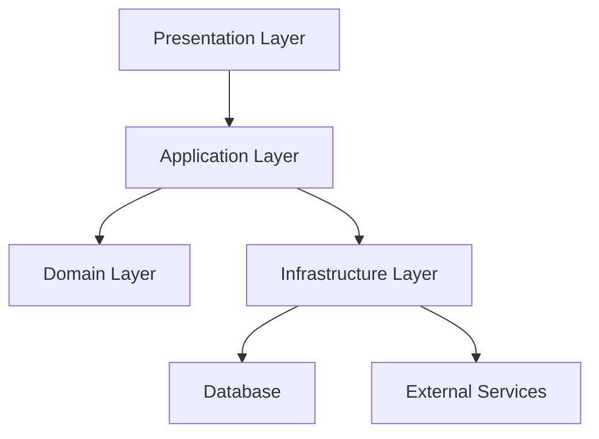
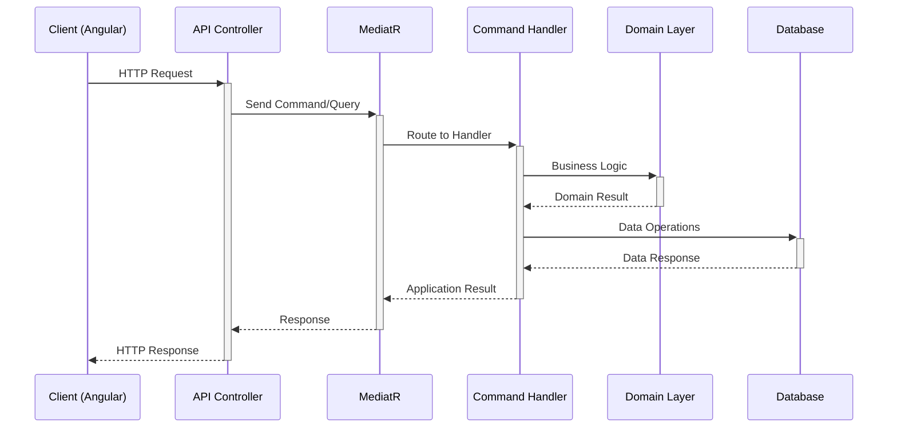
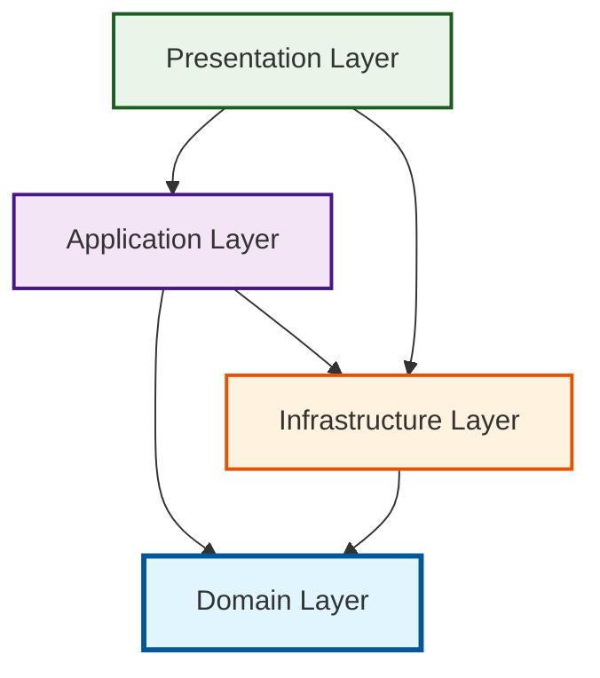
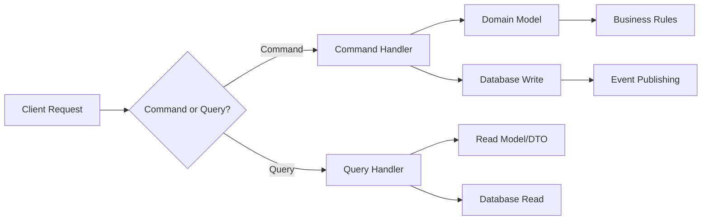

# Time Attendance System - Project Architecture & Implementation Guide

*A comprehensive enterprise-grade time attendance management system built with .NET 9 and Angular 18*

---

## Table of Contents

### Core Architecture
1. [Executive Overview](#executive-overview)
2. [Technology Stack & Justification](#technology-stack--justification)
3. [System Architecture Overview](#system-architecture-overview)
4. [Architectural Decision Records](#architectural-decision-records)

### Backend Architecture
5. [Clean Architecture Implementation](#clean-architecture-implementation)
6. [Domain-Driven Design Patterns](#domain-driven-design-patterns)
7. [CQRS with MediatR](#cqrs-with-mediatr)
8. [Data Architecture & Patterns](#data-architecture--patterns)
9. [Background Processing](#background-processing)
10. [API Design & Patterns](#api-design--patterns)

### Frontend Architecture
11. [Angular 18 Modern Architecture](#angular-18-modern-architecture)
12. [Component Architecture Patterns](#component-architecture-patterns)
13. [State Management Strategy](#state-management-strategy)
14. [Routing & Navigation](#routing--navigation)
15. [HTTP & API Integration](#http--api-integration)

### Shared Systems
16. [Comprehensive Component Library](#comprehensive-component-library)
17. [Design System & Styling Architecture](#design-system--styling-architecture)
18. [Security Architecture Deep Dive](#security-architecture-deep-dive)
19. [Configuration Management](#configuration-management)

### Development & Deployment
20. [Module Implementation Blueprint](#module-implementation-blueprint)
21. [Development Workflow & Standards](#development-workflow--standards)
22. [Performance Optimization](#performance-optimization)
23. [Monitoring & Observability](#monitoring--observability)
24. [Deployment Architecture](#deployment-architecture)

---

## Executive Overview

### System Vision
The Time Attendance System is an enterprise-grade workforce management solution designed to handle complex organizational structures with multi-tenant architecture, comprehensive attendance tracking, and sophisticated business rule processing.

### Key Business Capabilities
- **Multi-Tenant Operations**: Branch-based data isolation supporting organizational hierarchies
- **Comprehensive Attendance Management**: Clock in/out, shift assignments, overtime calculations
- **Advanced Workforce Analytics**: Reporting, compliance tracking, and performance metrics
- **Flexible Scheduling**: Shift management with complex business rules and exceptions
- **Employee Self-Service**: Mobile-friendly portal for attendance and leave management
- **Administrative Control**: Role-based access with granular permission management

### Strategic Architecture Principles

#### 1. **Enterprise-Ready Foundation**


#### 2. **Scalability & Performance**
- **Async-First Design**: All operations use async/await patterns
- **Command Query Responsibility Segregation (CQRS)**: Optimized read/write operations
- **Background Processing**: Coravel-based job scheduling for heavy operations
- **Efficient Data Access**: Entity Framework Core with optimized queries

#### 3. **Security & Compliance**
- **Defense in Depth**: Multiple security layers from frontend to database
- **Audit Trail**: Comprehensive logging for compliance and forensics
- **Data Protection**: GDPR-compliant soft deletes and data retention
- **Multi-Factor Authentication**: Enhanced security for sensitive operations

#### 4. **Developer Experience**
- **Clean Code Architecture**: Testable, maintainable, and extensible
- **Rich Type Safety**: TypeScript frontend, strongly-typed C# backend
- **Consistent Patterns**: Standardized approaches across all modules
- **Comprehensive Documentation**: Inline documentation and architectural guides

### System Boundaries & Context
```
┌─────────────────────────────────────────────────────────────┐
│                  Time Attendance System                     │
├─────────────────────────────────────────────────────────────┤
│  Core Domains:                                             │
│  • Employee Management     • Attendance Tracking           │
│  • Shift Management       • Leave Management               │
│  • Branch Operations      • User Administration            │
│                                                            │
│  External Integrations:                                    │
│  • Email Services         • SMS Notifications             │
│  • File Storage          • Analytics Platforms            │
│  • Payroll Systems       • HR Information Systems         │
└────────────────────────────────────────────────────────────┘
```

---

## Technology Stack & Justification

### Backend Technology Stack (.NET 9)

| Component | Technology | Version | Justification |
|-----------|------------|---------|---------------|
| **Runtime** | .NET 9 | 9.0 | Latest LTS with performance improvements, native AOT support |
| **Web Framework** | ASP.NET Core | 9.0 | High-performance, cross-platform, built-in DI container |
| **Architecture** | Clean Architecture | - | Separation of concerns, testability, maintainability |
| **ORM** | Entity Framework Core | 9.0 | Code-first, LINQ support, excellent performance |
| **CQRS** | MediatR | 12.x | Command/Query separation, clean request handling |
| **Validation** | FluentValidation | 11.x | Rich validation rules, separation from domain logic |
| **Background Jobs** | Coravel | 5.x | Simple scheduling, .NET native, no external dependencies |
| **Authentication** | JWT Bearer | - | Stateless, scalable, industry standard |
| **API Documentation** | Swagger/OpenAPI | 3.0 | Auto-generated docs, testing interface |
| **Database** | SQL Server | 2022 | Enterprise features, excellent tooling, Azure integration |
| **Caching** | Memory Cache | - | Built-in, fast access for frequently used data |
| **Logging** | Serilog | 3.x | Structured logging, multiple sinks, excellent filtering |

### Frontend Technology Stack (Angular 18)

| Component | Technology | Version | Justification |
|-----------|------------|---------|---------------|
| **Framework** | Angular | 18.x | Mature ecosystem, TypeScript, enterprise-ready |
| **Architecture** | Standalone Components | - | Modern Angular, reduced bundle size, simpler setup |
| **State Management** | Angular Signals | - | Reactive state, fine-grained updates, better performance |
| **Styling Framework** | Bootstrap | 5.3 | Mature, responsive, extensive component library |
| **CSS Architecture** | Custom Design System | - | Consistent theming, maintainable styles |
| **HTTP Client** | Angular HttpClient | - | Built-in interceptors, observables, error handling |
| **Routing** | Angular Router | - | Guards, lazy loading, excellent navigation features |
| **Forms** | Reactive Forms | - | Type-safe, powerful validation, reactive updates |
| **Build Tool** | Angular CLI + Vite | - | Fast builds, hot reload, excellent dev experience |
| **Testing** | Jasmine + Karma | - | Angular standard, comprehensive testing utilities |
| **Internationalization** | Custom i18n Service | - | Lightweight, flexible, real-time language switching |

### Development & Operations Stack

| Purpose | Technology | Justification |
|---------|------------|---------------|
| **Version Control** | Git | Industry standard, excellent branching model |
| **Database Migration** | EF Core Migrations | Code-first, version controlled schema changes |
| **Containerization** | Docker | Consistent environments, easy deployment |
| **CI/CD** | GitHub Actions | Integrated with repository, powerful workflow engine |
| **Monitoring** | Application Insights | Real-time monitoring, excellent Azure integration |
| **Error Tracking** | Serilog + Seq | Structured logging, powerful search capabilities |

### Architectural Decision Records (ADRs)

#### ADR-001: Clean Architecture Implementation
**Decision**: Implement Clean Architecture with Domain-Driven Design
**Status**: Accepted
**Context**: Need maintainable, testable architecture for enterprise application
**Consequences**:
- ✅ Clear separation of concerns
- ✅ Highly testable
- ✅ Technology-agnostic business logic
- ❌ Additional complexity for simple operations

#### ADR-002: CQRS with MediatR
**Decision**: Use CQRS pattern with MediatR for request handling
**Status**: Accepted
**Context**: Need to separate read and write operations for performance and clarity
**Consequences**:
- ✅ Optimized read/write operations
- ✅ Clear request/response contracts
- ✅ Excellent for testing
- ❌ More files and complexity

#### ADR-003: Angular Signals for State Management
**Decision**: Use Angular Signals instead of NgRx for state management
**Status**: Accepted
**Context**: Need reactive state management without additional complexity
**Consequences**:
- ✅ Built into Angular, no external dependencies
- ✅ Fine-grained reactivity
- ✅ Better performance
- ❌ Limited devtools compared to NgRx

#### ADR-004: JWT Authentication Strategy
**Decision**: Use JWT tokens with refresh token rotation
**Status**: Accepted
**Context**: Need stateless, scalable authentication
**Consequences**:
- ✅ Stateless, scalable
- ✅ Cross-platform compatibility
- ✅ Built-in expiration
- ❌ Token size considerations
- ❌ Logout complexity (token blacklisting)

#### ADR-005: Multi-Tenant Architecture
**Decision**: Implement branch-based multi-tenancy at application level
**Status**: Accepted
**Context**: Need to support multiple organizations with data isolation
**Consequences**:
- ✅ Data isolation
- ✅ Flexible permissions
- ✅ Single codebase maintenance
- ❌ Complex query patterns
- ❌ Potential security risks if not implemented correctly

---

## System Architecture Overview

### High-Level Architecture

```
┌─────────────────────────────────────────────────────────────┐
│                        Web Browser                              │
│  ┌─────────────────────────────────────────────────────────┐   │
│  │              Angular 18 SPA                           │   │
│  │  • Standalone Components  • Angular Signals          │   │
│  │  • Reactive Forms         • Custom Design System     │   │
│  │  • Route Guards          • HTTP Interceptors         │   │
│  └─────────────────────────────────────────────────────────┘   │
└─────────────────────────┬───────────────────────────────────────┘
                          │ HTTPS/REST API
                          ▼
┌─────────────────────────────────────────────────────────────┐
│                    ASP.NET Core API                            │
│  ┌─────────────────────────────────────────────────────────┐   │
│  │                Presentation Layer                      │   │
│  │  • Controllers        • Filters                        │   │
│  │  • Middleware         • Authentication                 │   │
│  └─────────────────────────────────────────────────────────┘   │
│  ┌─────────────────────────────────────────────────────────┐   │
│  │               Application Layer                        │   │
│  │  • CQRS Commands/Queries  • MediatR Pipeline          │   │
│  │  • Validation Rules       • Business Logic            │   │
│  └─────────────────────────────────────────────────────────┘   │
│  ┌─────────────────────────────────────────────────────────┐   │
│  │                 Domain Layer                           │   │
│  │  • Entities           • Value Objects                  │   │
│  │  • Business Rules     • Domain Events                 │   │
│  └─────────────────────────────────────────────────────────┘   │
│  ┌─────────────────────────────────────────────────────────┐   │
│  │              Infrastructure Layer                      │   │
│  │  • Entity Framework   • Background Jobs               │   │
│  │  • External Services  • Email/SMS                     │   │
│  └─────────────────────────────────────────────────────────┘   │
└─────────────────────────┬───────────────────────────────────────┘
                          │
                          ▼
┌─────────────────────────────────────────────────────────────┐
│                     SQL Server                                │
│  • Multi-tenant Data  • Audit Logs  • Performance Indexes    │
└─────────────────────────────────────────────────────────────┘
```

### Request Flow Architecture



### Data Flow & State Management

```
┌── Frontend State Flow ──────────────────────────────────────┐
│                                                          │
│  Component ↔ Signal ↔ Service ↔ HTTP ↔ API          │
│     ↕️            ↕️         ↕️        ↕️       ↕️           │
│  Template    Reactive   Cache    Error   Controller     │
│              State              Handler                   │
└──────────────────────────────────────────────────────────┘

┌── Backend Data Flow ────────────────────────────────────────┐
│                                                          │
│ Controller → Command → Handler → Domain → Repository    │
│     ↕️          ↕️        ↕️       ↕️         ↕️           │
│   DTO       Validation  Business Entity   Database      │
│                         Logic                            │
└──────────────────────────────────────────────────────────┘
```

---

## Clean Architecture Implementation

### Layer Responsibilities & Structure

```
src/
├── Api/                              # 🌐 Presentation Layer
│   └── TimeAttendanceSystem.Api/     # ASP.NET Core Web API
│       ├── Controllers/              # HTTP endpoints & request handling
│       ├── Filters/                  # Cross-cutting concerns (logging, validation)
│       ├── Middleware/               # Request pipeline components
│       ├── Configuration/            # Startup configuration classes
│       └── Program.cs               # Application entry point
│
├── Application/                      # 🏗️ Application Layer (Orchestration)
│   └── TimeAttendanceSystem.Application/
│       ├── [Feature]/               # Feature-based organization
│       │   ├── Commands/            # Write operations (CQRS)
│       │   │   ├── Create[Entity]/
│       │   │   ├── Update[Entity]/
│       │   │   └── Delete[Entity]/
│       │   ├── Queries/             # Read operations (CQRS)
│       │   │   ├── Get[Entity]/
│       │   │   └── List[Entities]/
│       │   └── DTOs/                # Data Transfer Objects
│       ├── Abstractions/            # Interface definitions
│       ├── Common/                  # Shared application logic
│       │   ├── Result.cs            # Result pattern implementation
│       │   ├── PagedResult.cs       # Pagination wrapper
│       │   └── BaseHandler.cs       # Common handler functionality
│       └── Extensions/              # Application service extensions
│
├── Domain/                          # 🎯 Domain Layer (Business Logic)
│   └── TimeAttendanceSystem.Domain/
│       ├── [Aggregate]/             # Domain aggregates
│       │   ├── [Entity].cs          # Rich domain entities
│       │   ├── [ValueObject].cs     # Immutable value objects
│       │   └── [DomainEvent].cs     # Domain events
│       ├── Common/                  # Shared domain concepts
│       │   ├── BaseEntity.cs        # Base entity with audit fields
│       │   ├── ValueObject.cs       # Value object base class
│       │   └── DomainEvent.cs       # Domain event base class
│       └── Enums/                   # Domain enumerations
│
├── Infrastructure/                  # ⚙️ Infrastructure Layer (External Concerns)
│   └── TimeAttendanceSystem.Infrastructure/
│       ├── Persistence/             # Data access implementation
│       │   ├── Configurations/      # EF Core entity configurations
│       │   ├── Migrations/          # Database schema migrations
│       │   ├── TimeAttendanceDbContext.cs
│       │   └── SeedData.cs         # Initial data seeding
│       ├── Services/               # External service implementations
│       │   ├── EmailService.cs     # Email sending implementation
│       │   ├── TwoFactorService.cs # 2FA implementation
│       │   └── DeviceService.cs    # Device detection
│       └── BackgroundJobs/         # Scheduled task implementations
│
└── Shared/                          # 🔧 Shared Kernel
    └── TimeAttendanceSystem.Shared/
        ├── Constants/              # System-wide constants
        ├── Localization/           # Multi-language resources
        └── Extensions/             # Extension methods
```

### Dependency Flow & Rules



**Clean Architecture Rules**:
1. **Domain Layer** has no dependencies - pure business logic
2. **Application Layer** depends only on Domain
3. **Infrastructure Layer** implements interfaces from Application/Domain
4. **Presentation Layer** coordinates between Application and Infrastructure
5. **Dependencies point inward** - outer layers depend on inner layers

### Real Implementation Examples

#### Domain Entity Example
```csharp
// Domain/TimeAttendanceSystem.Domain/Employees/Employee.cs
public class Employee : BaseEntity
{
    public long BranchId { get; set; }
    public string EmployeeNumber { get; set; } = string.Empty;
    public string FirstName { get; set; } = string.Empty;
    public string LastName { get; set; } = string.Empty;
    public string? FirstNameAr { get; set; }
    public string? LastNameAr { get; set; }
    public DateTime HireDate { get; set; }
    public EmploymentStatus EmploymentStatus { get; set; }
    public string JobTitle { get; set; } = string.Empty;

    // Navigation Properties
    public Branch Branch { get; set; } = null!;
    public Department? Department { get; set; }
    public Employee? Manager { get; set; }
    public ICollection<Employee> DirectReports { get; set; } = new List<Employee>();

    // Business Logic
    public string FullName => $"{FirstName} {LastName}";
    public bool IsActive => EmploymentStatus == EmploymentStatus.Active;

    // Domain Methods
    public Result AssignToDepartment(Department department)
    {
        if (department.BranchId != BranchId)
            return Result.Failure("Employee and department must belong to the same branch");

        DepartmentId = department.Id;
        return Result.Success();
    }
}
```

#### Application Command Example
```csharp
// Application/Employees/Commands/CreateEmployee/CreateEmployeeCommand.cs
public record CreateEmployeeCommand(
    long BranchId,
    string EmployeeNumber,
    string FirstName,
    string LastName,
    string? FirstNameAr,
    string? LastNameAr,
    DateTime HireDate,
    EmploymentStatus EmploymentStatus,
    string JobTitle,
    long? DepartmentId
) : IRequest<Result<long>>;

// Application/Employees/Commands/CreateEmployee/CreateEmployeeCommandHandler.cs
public class CreateEmployeeCommandHandler : IRequestHandler<CreateEmployeeCommand, Result<long>>
{
    private readonly TimeAttendanceDbContext _context;

    public CreateEmployeeCommandHandler(TimeAttendanceDbContext context)
    {
        _context = context;
    }

    public async Task<Result<long>> Handle(CreateEmployeeCommand request, CancellationToken cancellationToken)
    {
        // Business Rule Validation
        var existingEmployee = await _context.Employees
            .FirstOrDefaultAsync(e => e.EmployeeNumber == request.EmployeeNumber &&
                                    e.BranchId == request.BranchId,
                                cancellationToken);

        if (existingEmployee != null)
            return Result.Failure<long>("Employee number already exists in this branch");

        // Create Domain Entity
        var employee = new Employee
        {
            BranchId = request.BranchId,
            EmployeeNumber = request.EmployeeNumber,
            FirstName = request.FirstName,
            LastName = request.LastName,
            FirstNameAr = request.FirstNameAr,
            LastNameAr = request.LastNameAr,
            HireDate = request.HireDate,
            EmploymentStatus = request.EmploymentStatus,
            JobTitle = request.JobTitle,
            DepartmentId = request.DepartmentId
        };

        _context.Employees.Add(employee);
        await _context.SaveChangesAsync(cancellationToken);

        return Result.Success(employee.Id);
    }
}
```

#### API Controller Example
```csharp
// Api/Controllers/EmployeesController.cs
[ApiController]
[Route("api/employees")]
[Authorize]
public class EmployeesController : BaseController
{
    public EmployeesController(IMediator mediator) : base(mediator) { }

    [HttpPost]
    [HasPermission(PermissionResources.Employee, PermissionActions.Create)]
    public async Task<ActionResult<long>> CreateEmployee(CreateEmployeeCommand command)
    {
        var result = await Mediator.Send(command);

        if (result.IsFailure)
            return BadRequest(result.Error);

        return CreatedAtAction(nameof(GetEmployee), new { id = result.Value }, result.Value);
    }

    [HttpGet("{id}")]
    [HasPermission(PermissionResources.Employee, PermissionActions.Read)]
    public async Task<ActionResult<EmployeeDto>> GetEmployee(long id)
    {
        var result = await Mediator.Send(new GetEmployeeByIdQuery(id));

        if (result.IsFailure)
            return NotFound(result.Error);

        return Ok(result.Value);
    }
}
```

---

## Domain-Driven Design Patterns

### Domain Model Architecture

```mermaid
classDiagram
    class BaseEntity {
        +long Id
        +DateTime CreatedAtUtc
        +string CreatedBy
        +DateTime? ModifiedAtUtc
        +string? ModifiedBy
        +bool IsDeleted
        +byte[] RowVersion
    }

    class Employee {
        +string EmployeeNumber
        +string FirstName
        +string LastName
        +DateTime HireDate
        +EmploymentStatus Status
        +string FullName
        +bool IsActive
        +AssignToDepartment(Department)
        +CalculateOvertime(WorkingHours)
    }

    class Branch {
        +string Name
        +string Code
        +TimeZone TimeZone
        +List~Employee~ Employees
        +AddEmployee(Employee)
        +GetActiveEmployees()
    }

    class Department {
        +string Name
        +long BranchId
        +long? ParentDepartmentId
        +List~Employee~ Employees
        +Department? Parent
        +List~Department~ SubDepartments
    }

    BaseEntity <|-- Employee
    BaseEntity <|-- Branch
    BaseEntity <|-- Department
    Branch ||--o{ Employee
    Department ||--o{ Employee
    Department ||--o{ Department : parent-child
```

### Core Domain Patterns

#### 1. **Base Entity Pattern**
All domain entities inherit from `BaseEntity` providing:
- **Unique Identity**: Long integer primary keys
- **Audit Trail**: Creation and modification tracking
- **Soft Delete**: Logical deletion with `IsDeleted` flag
- **Concurrency Control**: Row versioning for optimistic locking

```csharp
public abstract class BaseEntity
{
    public long Id { get; set; }
    public DateTime CreatedAtUtc { get; set; }
    public string CreatedBy { get; set; } = string.Empty;
    public DateTime? ModifiedAtUtc { get; set; }
    public string? ModifiedBy { get; set; }
    public bool IsDeleted { get; set; }
    [Timestamp]
    public byte[] RowVersion { get; set; } = Array.Empty<byte>();
}
```

#### 2. **Value Objects Pattern**
Immutable objects representing concepts without identity:

```csharp
public class EmployeeNumber : ValueObject
{
    public string Value { get; }

    private EmployeeNumber(string value)
    {
        Value = value;
    }

    public static Result<EmployeeNumber> Create(string value)
    {
        if (string.IsNullOrWhiteSpace(value))
            return Result.Failure<EmployeeNumber>("Employee number cannot be empty");

        if (value.Length > 20)
            return Result.Failure<EmployeeNumber>("Employee number cannot exceed 20 characters");

        return Result.Success(new EmployeeNumber(value.ToUpperInvariant()));
    }

    protected override IEnumerable<object> GetAtomicValues()
    {
        yield return Value;
    }
}
```

#### 3. **Aggregate Root Pattern**
Domain aggregates with consistency boundaries:

```csharp
public class Employee : BaseEntity, IAggregateRoot
{
    private readonly List<AttendanceRecord> _attendanceRecords = new();

    public IReadOnlyCollection<AttendanceRecord> AttendanceRecords => _attendanceRecords;

    public Result ClockIn(DateTime clockInTime, string location)
    {
        var todayRecord = _attendanceRecords
            .FirstOrDefault(r => r.Date.Date == clockInTime.Date);

        if (todayRecord?.ClockInTime != null)
            return Result.Failure("Employee has already clocked in today");

        if (todayRecord == null)
        {
            todayRecord = new AttendanceRecord(Id, clockInTime.Date);
            _attendanceRecords.Add(todayRecord);
        }

        todayRecord.SetClockIn(clockInTime, location);

        // Domain Event
        AddDomainEvent(new EmployeeClockedInEvent(Id, clockInTime, location));

        return Result.Success();
    }
}
```

#### 4. **Domain Events Pattern**
Decoupled communication between aggregates:

```csharp
public class EmployeeClockedInEvent : DomainEvent
{
    public long EmployeeId { get; }
    public DateTime ClockInTime { get; }
    public string Location { get; }

    public EmployeeClockedInEvent(long employeeId, DateTime clockInTime, string location)
    {
        EmployeeId = employeeId;
        ClockInTime = clockInTime;
        Location = location;
    }
}

// Event Handler
public class EmployeeClockedInEventHandler : INotificationHandler<EmployeeClockedInEvent>
{
    private readonly INotificationService _notificationService;

    public async Task Handle(EmployeeClockedInEvent notification, CancellationToken cancellationToken)
    {
        // Send notification to manager
        // Update real-time dashboard
        // Log attendance for compliance
    }
}
```

### Domain Services

For business logic that doesn't naturally belong to any entity:

```csharp
public class OvertimeCalculationService : IDomainService
{
    public OvertimeCalculationResult CalculateOvertime(
        Employee employee,
        AttendanceRecord attendanceRecord,
        OvertimeConfiguration configuration)
    {
        var regularHours = configuration.RegularHoursPerDay;
        var workedHours = attendanceRecord.TotalWorkedHours;

        if (workedHours <= regularHours)
            return new OvertimeCalculationResult(TimeSpan.Zero, 0);

        var overtimeHours = workedHours - regularHours;
        var overtimeMinutes = (decimal)overtimeHours.TotalMinutes;

        return new OvertimeCalculationResult(overtimeHours, overtimeMinutes);
    }
}
```

### Repository Pattern Implementation

Abstract data access behind interfaces:

```csharp
public interface IEmployeeRepository
{
    Task<Employee?> GetByIdAsync(long id);
    Task<Employee?> GetByEmployeeNumberAsync(string employeeNumber, long branchId);
    Task<PagedResult<Employee>> GetPagedAsync(EmployeesFilter filter);
    Task<List<Employee>> GetByDepartmentAsync(long departmentId);
    void Add(Employee employee);
    void Update(Employee employee);
    void Delete(Employee employee);
}

// Infrastructure Implementation
public class EmployeeRepository : IEmployeeRepository
{
    private readonly TimeAttendanceDbContext _context;

    public EmployeeRepository(TimeAttendanceDbContext context)
    {
        _context = context;
    }

    public async Task<Employee?> GetByIdAsync(long id)
    {
        return await _context.Employees
            .Include(e => e.Branch)
            .Include(e => e.Department)
            .Include(e => e.Manager)
            .FirstOrDefaultAsync(e => e.Id == id && !e.IsDeleted);
    }

    public async Task<PagedResult<Employee>> GetPagedAsync(EmployeesFilter filter)
    {
        var query = _context.Employees
            .Where(e => !e.IsDeleted)
            .AsQueryable();

        // Apply filters
        if (filter.BranchId.HasValue)
            query = query.Where(e => e.BranchId == filter.BranchId);

        if (!string.IsNullOrEmpty(filter.SearchTerm))
        {
            var searchTerm = filter.SearchTerm.ToLower();
            query = query.Where(e =>
                e.FirstName.ToLower().Contains(searchTerm) ||
                e.LastName.ToLower().Contains(searchTerm) ||
                e.EmployeeNumber.ToLower().Contains(searchTerm));
        }

        var totalCount = await query.CountAsync();

        var employees = await query
            .OrderBy(e => e.FirstName)
            .Skip((filter.PageNumber - 1) * filter.PageSize)
            .Take(filter.PageSize)
            .Include(e => e.Branch)
            .Include(e => e.Department)
            .ToListAsync();

        return new PagedResult<Employee>(employees, totalCount, filter.PageNumber, filter.PageSize);
    }
}
```

---

## CQRS with MediatR

### Command Query Responsibility Segregation

The system implements CQRS pattern to separate read and write operations, providing:
- **Optimized Read Models**: Tailored DTOs for different views
- **Write Model Integrity**: Rich domain objects with business rules
- **Scalability**: Independent scaling of read/write operations
- **Clarity**: Clear separation between commands and queries



### Command Pattern Implementation

#### Commands Structure
```
Application/
├── [Feature]/
│   ├── Commands/
│   │   ├── Create[Entity]/
│   │   │   ├── Create[Entity]Command.cs      # Command definition
│   │   │   ├── Create[Entity]CommandHandler.cs # Business logic
│   │   │   ├── Create[Entity]CommandValidator.cs # Validation rules
│   │   │   └── Create[Entity]Response.cs     # Response model (if needed)
│   │   ├── Update[Entity]/
│   │   └── Delete[Entity]/
```

#### Real Command Example
```csharp
// Command Definition
public record CreateEmployeeCommand(
    long BranchId,
    string EmployeeNumber,
    string FirstName,
    string LastName,
    string? FirstNameAr,
    string? LastNameAr,
    DateTime HireDate,
    EmploymentStatus EmploymentStatus,
    string JobTitle,
    string? JobTitleAr,
    long? DepartmentId,
    long? ManagerEmployeeId,
    WorkLocationType WorkLocationType
) : IRequest<Result<long>>;

// Command Validator
public class CreateEmployeeCommandValidator : AbstractValidator<CreateEmployeeCommand>
{
    public CreateEmployeeCommandValidator()
    {
        RuleFor(x => x.BranchId)
            .NotEmpty()
            .WithMessage("Branch ID is required");

        RuleFor(x => x.EmployeeNumber)
            .NotEmpty()
            .MaximumLength(20)
            .WithMessage("Employee number is required and must not exceed 20 characters");

        RuleFor(x => x.FirstName)
            .NotEmpty()
            .MaximumLength(50)
            .WithMessage("First name is required and must not exceed 50 characters");

        RuleFor(x => x.LastName)
            .NotEmpty()
            .MaximumLength(50)
            .WithMessage("Last name is required and must not exceed 50 characters");

        RuleFor(x => x.HireDate)
            .NotEmpty()
            .LessThanOrEqualTo(DateTime.Today.AddDays(30))
            .WithMessage("Hire date cannot be more than 30 days in the future");

        RuleFor(x => x.JobTitle)
            .NotEmpty()
            .MaximumLength(100)
            .WithMessage("Job title is required and must not exceed 100 characters");
    }
}

// Command Handler
public class CreateEmployeeCommandHandler : IRequestHandler<CreateEmployeeCommand, Result<long>>
{
    private readonly TimeAttendanceDbContext _context;
    private readonly IValidator<CreateEmployeeCommand> _validator;
    private readonly ILogger<CreateEmployeeCommandHandler> _logger;

    public CreateEmployeeCommandHandler(
        TimeAttendanceDbContext context,
        IValidator<CreateEmployeeCommand> validator,
        ILogger<CreateEmployeeCommandHandler> logger)
    {
        _context = context;
        _validator = validator;
        _logger = logger;
    }

    public async Task<Result<long>> Handle(CreateEmployeeCommand request, CancellationToken cancellationToken)
    {
        try
        {
            // Validation
            var validationResult = await _validator.ValidateAsync(request, cancellationToken);
            if (!validationResult.IsValid)
            {
                var errors = string.Join(", ", validationResult.Errors.Select(e => e.ErrorMessage));
                return Result.Failure<long>(errors);
            }

            // Business Rule: Unique employee number per branch
            var existingEmployee = await _context.Employees
                .FirstOrDefaultAsync(e => e.EmployeeNumber == request.EmployeeNumber &&
                                        e.BranchId == request.BranchId &&
                                        !e.IsDeleted,
                                    cancellationToken);

            if (existingEmployee != null)
                return Result.Failure<long>("Employee number already exists in this branch");

            // Business Rule: Department must belong to same branch
            if (request.DepartmentId.HasValue)
            {
                var department = await _context.Departments
                    .FirstOrDefaultAsync(d => d.Id == request.DepartmentId &&
                                            !d.IsDeleted,
                                        cancellationToken);

                if (department == null)
                    return Result.Failure<long>("Department not found");

                if (department.BranchId != request.BranchId)
                    return Result.Failure<long>("Department must belong to the same branch as the employee");
            }

            // Business Rule: Manager must exist and belong to same branch
            if (request.ManagerEmployeeId.HasValue)
            {
                var manager = await _context.Employees
                    .FirstOrDefaultAsync(e => e.Id == request.ManagerEmployeeId &&
                                            e.BranchId == request.BranchId &&
                                            !e.IsDeleted,
                                        cancellationToken);

                if (manager == null)
                    return Result.Failure<long>("Manager not found or does not belong to the same branch");
            }

            // Create Entity
            var employee = new Employee
            {
                BranchId = request.BranchId,
                EmployeeNumber = request.EmployeeNumber,
                FirstName = request.FirstName,
                LastName = request.LastName,
                FirstNameAr = request.FirstNameAr,
                LastNameAr = request.LastNameAr,
                HireDate = request.HireDate,
                EmploymentStatus = request.EmploymentStatus,
                JobTitle = request.JobTitle,
                JobTitleAr = request.JobTitleAr,
                DepartmentId = request.DepartmentId,
                ManagerEmployeeId = request.ManagerEmployeeId,
                WorkLocationType = request.WorkLocationType
            };

            _context.Employees.Add(employee);
            await _context.SaveChangesAsync(cancellationToken);

            _logger.LogInformation("Employee created successfully with ID: {EmployeeId}", employee.Id);

            return Result.Success(employee.Id);
        }
        catch (Exception ex)
        {
            _logger.LogError(ex, "Error creating employee");
            return Result.Failure<long>("An error occurred while creating the employee");
        }
    }
}
```

### Query Pattern Implementation

#### Queries Structure
```
Application/
├── [Feature]/
│   ├── Queries/
│   │   ├── Get[Entity]/
│   │   │   ├── Get[Entity]Query.cs           # Query definition
│   │   │   ├── Get[Entity]QueryHandler.cs    # Query logic
│   │   │   └── [Entity]Dto.cs               # Response DTO
│   │   ├── List[Entities]/
│   │   │   ├── Get[Entities]Query.cs
│   │   │   ├── Get[Entities]QueryHandler.cs
│   │   │   ├── [Entity]Dto.cs
│   │   │   └── [Entities]Filter.cs          # Filter model
```

#### Real Query Example
```csharp
// Query Definition
public record GetEmployeesQuery(
    int PageNumber = 1,
    int PageSize = 10,
    EmployeesFilter? Filter = null
) : IRequest<Result<PagedResult<EmployeeDto>>>;

// Filter Model
public class EmployeesFilter
{
    public long? BranchId { get; set; }
    public long? DepartmentId { get; set; }
    public string? SearchTerm { get; set; }
    public EmploymentStatus? EmploymentStatus { get; set; }
    public DateTime? HiredAfter { get; set; }
    public DateTime? HiredBefore { get; set; }
    public bool IncludeInactive { get; set; } = false;
}

// DTO Definition
public class EmployeeDto
{
    public long Id { get; set; }
    public long BranchId { get; set; }
    public string BranchName { get; set; } = string.Empty;
    public string EmployeeNumber { get; set; } = string.Empty;
    public string FirstName { get; set; } = string.Empty;
    public string LastName { get; set; } = string.Empty;
    public string FullName { get; set; } = string.Empty;
    public string? FirstNameAr { get; set; }
    public string? LastNameAr { get; set; }
    public string? FullNameAr { get; set; }
    public string? Email { get; set; }
    public string? Phone { get; set; }
    public DateTime HireDate { get; set; }
    public EmploymentStatus EmploymentStatus { get; set; }
    public string JobTitle { get; set; } = string.Empty;
    public string? JobTitleAr { get; set; }
    public long? DepartmentId { get; set; }
    public string? DepartmentName { get; set; }
    public long? ManagerEmployeeId { get; set; }
    public string? ManagerName { get; set; }
    public WorkLocationType WorkLocationType { get; set; }
    public DateTime CreatedAtUtc { get; set; }
    public bool IsActive => EmploymentStatus == EmploymentStatus.Active;
}

// Query Handler
public class GetEmployeesQueryHandler : IRequestHandler<GetEmployeesQuery, Result<PagedResult<EmployeeDto>>>
{
    private readonly TimeAttendanceDbContext _context;
    private readonly ILogger<GetEmployeesQueryHandler> _logger;

    public GetEmployeesQueryHandler(
        TimeAttendanceDbContext context,
        ILogger<GetEmployeesQueryHandler> logger)
    {
        _context = context;
        _logger = logger;
    }

    public async Task<Result<PagedResult<EmployeeDto>>> Handle(
        GetEmployeesQuery request,
        CancellationToken cancellationToken)
    {
        try
        {
            var query = _context.Employees
                .Where(e => !e.IsDeleted)
                .AsQueryable();

            // Apply filters
            if (request.Filter != null)
            {
                if (request.Filter.BranchId.HasValue)
                    query = query.Where(e => e.BranchId == request.Filter.BranchId);

                if (request.Filter.DepartmentId.HasValue)
                    query = query.Where(e => e.DepartmentId == request.Filter.DepartmentId);

                if (!string.IsNullOrEmpty(request.Filter.SearchTerm))
                {
                    var searchTerm = request.Filter.SearchTerm.ToLower();
                    query = query.Where(e =>
                        e.FirstName.ToLower().Contains(searchTerm) ||
                        e.LastName.ToLower().Contains(searchTerm) ||
                        e.EmployeeNumber.ToLower().Contains(searchTerm) ||
                        (e.Email != null && e.Email.ToLower().Contains(searchTerm)));
                }

                if (request.Filter.EmploymentStatus.HasValue)
                    query = query.Where(e => e.EmploymentStatus == request.Filter.EmploymentStatus);

                if (request.Filter.HiredAfter.HasValue)
                    query = query.Where(e => e.HireDate >= request.Filter.HiredAfter);

                if (request.Filter.HiredBefore.HasValue)
                    query = query.Where(e => e.HireDate <= request.Filter.HiredBefore);

                if (!request.Filter.IncludeInactive)
                    query = query.Where(e => e.EmploymentStatus == EmploymentStatus.Active);
            }

            // Get total count for pagination
            var totalCount = await query.CountAsync(cancellationToken);

            // Apply pagination and get data
            var employees = await query
                .OrderBy(e => e.FirstName)
                .ThenBy(e => e.LastName)
                .Skip((request.PageNumber - 1) * request.PageSize)
                .Take(request.PageSize)
                .Select(e => new EmployeeDto
                {
                    Id = e.Id,
                    BranchId = e.BranchId,
                    BranchName = e.Branch.Name,
                    EmployeeNumber = e.EmployeeNumber,
                    FirstName = e.FirstName,
                    LastName = e.LastName,
                    FullName = e.FullName,
                    FirstNameAr = e.FirstNameAr,
                    LastNameAr = e.LastNameAr,
                    FullNameAr = e.FullNameAr,
                    Email = e.Email,
                    Phone = e.Phone,
                    HireDate = e.HireDate,
                    EmploymentStatus = e.EmploymentStatus,
                    JobTitle = e.JobTitle,
                    JobTitleAr = e.JobTitleAr,
                    DepartmentId = e.DepartmentId,
                    DepartmentName = e.Department != null ? e.Department.Name : null,
                    ManagerEmployeeId = e.ManagerEmployeeId,
                    ManagerName = e.Manager != null ? e.Manager.FullName : null,
                    WorkLocationType = e.WorkLocationType,
                    CreatedAtUtc = e.CreatedAtUtc
                })
                .ToListAsync(cancellationToken);

            var result = new PagedResult<EmployeeDto>(
                employees,
                totalCount,
                request.PageNumber,
                request.PageSize);

            return Result.Success(result);
        }
        catch (Exception ex)
        {
            _logger.LogError(ex, "Error retrieving employees");
            return Result.Failure<PagedResult<EmployeeDto>>("An error occurred while retrieving employees");
        }
    }
}
```

### MediatR Pipeline Behaviors

Cross-cutting concerns implemented as pipeline behaviors:

```csharp
// Validation Behavior
public class ValidationBehavior<TRequest, TResponse> : IPipelineBehavior<TRequest, TResponse>
    where TRequest : IRequest<TResponse>
{
    private readonly IEnumerable<IValidator<TRequest>> _validators;

    public ValidationBehavior(IEnumerable<IValidator<TRequest>> validators)
    {
        _validators = validators;
    }

    public async Task<TResponse> Handle(TRequest request, RequestHandlerDelegate<TResponse> next, CancellationToken cancellationToken)
    {
        if (_validators.Any())
        {
            var context = new ValidationContext<TRequest>(request);
            var validationResults = await Task.WhenAll(_validators.Select(v => v.ValidateAsync(context, cancellationToken)));
            var failures = validationResults.SelectMany(r => r.Errors).Where(f => f != null).ToList();

            if (failures.Count != 0)
            {
                throw new ValidationException(failures);
            }
        }

        return await next();
    }
}

// Logging Behavior
public class LoggingBehavior<TRequest, TResponse> : IPipelineBehavior<TRequest, TResponse>
    where TRequest : IRequest<TResponse>
{
    private readonly ILogger<LoggingBehavior<TRequest, TResponse>> _logger;

    public LoggingBehavior(ILogger<LoggingBehavior<TRequest, TResponse>> logger)
    {
        _logger = logger;
    }

    public async Task<TResponse> Handle(TRequest request, RequestHandlerDelegate<TResponse> next, CancellationToken cancellationToken)
    {
        var requestName = typeof(TRequest).Name;
        var stopwatch = Stopwatch.StartNew();

        _logger.LogInformation("Handling {RequestName}", requestName);

        try
        {
            var response = await next();

            stopwatch.Stop();
            _logger.LogInformation("Handled {RequestName} in {ElapsedMilliseconds}ms",
                requestName, stopwatch.ElapsedMilliseconds);

            return response;
        }
        catch (Exception ex)
        {
            stopwatch.Stop();
            _logger.LogError(ex, "Error handling {RequestName} after {ElapsedMilliseconds}ms",
                requestName, stopwatch.ElapsedMilliseconds);
            throw;
        }
    }
}

// Performance Behavior
public class PerformanceBehavior<TRequest, TResponse> : IPipelineBehavior<TRequest, TResponse>
    where TRequest : IRequest<TResponse>
{
    private readonly ILogger<PerformanceBehavior<TRequest, TResponse>> _logger;
    private const int SlowRequestThresholdMs = 5000;

    public async Task<TResponse> Handle(TRequest request, RequestHandlerDelegate<TResponse> next, CancellationToken cancellationToken)
    {
        var stopwatch = Stopwatch.StartNew();
        var response = await next();
        stopwatch.Stop();

        if (stopwatch.ElapsedMilliseconds > SlowRequestThresholdMs)
        {
            var requestName = typeof(TRequest).Name;
            _logger.LogWarning("Slow request detected: {RequestName} took {ElapsedMilliseconds}ms",
                requestName, stopwatch.ElapsedMilliseconds);
        }

        return response;
    }
}
```

### MediatR Configuration
```csharp
// Program.cs
services.AddMediatR(cfg =>
{
    cfg.RegisterServicesFromAssembly(typeof(CreateEmployeeCommand).Assembly);
    cfg.AddBehavior(typeof(IPipelineBehavior<,>), typeof(LoggingBehavior<,>));
    cfg.AddBehavior(typeof(IPipelineBehavior<,>), typeof(ValidationBehavior<,>));
    cfg.AddBehavior(typeof(IPipelineBehavior<,>), typeof(PerformanceBehavior<,>));
});
```

---

## Data Architecture & Patterns

### Database Schema Design

The system uses Entity Framework Core with a code-first approach, implementing sophisticated patterns for enterprise data management.

#### Entity Framework Configuration Pattern

Each entity has a dedicated configuration class:

```csharp
// Infrastructure/Persistence/Configurations/EmployeeConfiguration.cs
public class EmployeeConfiguration : IEntityTypeConfiguration<Employee>
{
    public void Configure(EntityTypeBuilder<Employee> builder)
    {
        // Table Configuration
        builder.ToTable("Employees");

        // Primary Key
        builder.HasKey(e => e.Id);
        builder.Property(e => e.Id)
            .ValueGeneratedOnAdd();

        // Indexes for Performance
        builder.HasIndex(e => new { e.BranchId, e.EmployeeNumber })
            .IsUnique()
            .HasDatabaseName("IX_Employees_BranchId_EmployeeNumber");

        builder.HasIndex(e => e.BranchId)
            .HasDatabaseName("IX_Employees_BranchId");

        builder.HasIndex(e => e.DepartmentId)
            .HasDatabaseName("IX_Employees_DepartmentId");

        builder.HasIndex(e => e.EmploymentStatus)
            .HasDatabaseName("IX_Employees_EmploymentStatus");

        // Required Properties
        builder.Property(e => e.BranchId)
            .IsRequired();

        builder.Property(e => e.EmployeeNumber)
            .IsRequired()
            .HasMaxLength(20);

        builder.Property(e => e.FirstName)
            .IsRequired()
            .HasMaxLength(50);

        builder.Property(e => e.LastName)
            .IsRequired()
            .HasMaxLength(50);

        // Optional Properties
        builder.Property(e => e.FirstNameAr)
            .HasMaxLength(50);

        builder.Property(e => e.LastNameAr)
            .HasMaxLength(50);

        builder.Property(e => e.NationalId)
            .HasMaxLength(20);

        builder.Property(e => e.Email)
            .HasMaxLength(255);

        builder.Property(e => e.Phone)
            .HasMaxLength(20);

        builder.Property(e => e.JobTitle)
            .IsRequired()
            .HasMaxLength(100);

        builder.Property(e => e.JobTitleAr)
            .HasMaxLength(100);

        builder.Property(e => e.PhotoUrl)
            .HasMaxLength(500);

        // Enum Configurations
        builder.Property(e => e.Gender)
            .HasConversion<string>()
            .HasMaxLength(10);

        builder.Property(e => e.EmploymentStatus)
            .HasConversion<string>()
            .HasMaxLength(20);

        builder.Property(e => e.WorkLocationType)
            .HasConversion<string>()
            .HasMaxLength(20);

        // Relationships
        builder.HasOne(e => e.Branch)
            .WithMany(b => b.Employees)
            .HasForeignKey(e => e.BranchId)
            .OnDelete(DeleteBehavior.Restrict)
            .HasConstraintName("FK_Employees_Branch");

        builder.HasOne(e => e.Department)
            .WithMany(d => d.Employees)
            .HasForeignKey(e => e.DepartmentId)
            .OnDelete(DeleteBehavior.SetNull)
            .HasConstraintName("FK_Employees_Department");

        builder.HasOne(e => e.Manager)
            .WithMany(m => m.DirectReports)
            .HasForeignKey(e => e.ManagerEmployeeId)
            .OnDelete(DeleteBehavior.SetNull)
            .HasConstraintName("FK_Employees_Manager");

        builder.HasOne(e => e.EmployeeUserLink)
            .WithOne(l => l.Employee)
            .HasForeignKey<EmployeeUserLink>(l => l.EmployeeId)
            .OnDelete(DeleteBehavior.Cascade);

        // Computed Properties
        builder.Ignore(e => e.FullName);
        builder.Ignore(e => e.FullNameAr);

        // Audit Configuration (inherited from BaseEntity)
        builder.Property(e => e.CreatedAtUtc)
            .IsRequired()
            .HasDefaultValueSql("GETUTCDATE()");

        builder.Property(e => e.CreatedBy)
            .IsRequired()
            .HasMaxLength(255);

        builder.Property(e => e.ModifiedAtUtc);

        builder.Property(e => e.ModifiedBy)
            .HasMaxLength(255);

        builder.Property(e => e.IsDeleted)
            .IsRequired()
            .HasDefaultValue(false);

        builder.Property(e => e.RowVersion)
            .IsRequired()
            .IsRowVersion()
            .HasColumnName("RowVersion");

        // Query Filters (Global Filters)
        builder.HasQueryFilter(e => !e.IsDeleted);
    }
}
```

### Database Context Implementation

```csharp
public class TimeAttendanceDbContext : DbContext
{
    private readonly IHttpContextAccessor? _httpContextAccessor;

    public TimeAttendanceDbContext(
        DbContextOptions<TimeAttendanceDbContext> options,
        IHttpContextAccessor? httpContextAccessor = null)
        : base(options)
    {
        _httpContextAccessor = httpContextAccessor;
    }

    // DbSets
    public DbSet<Branch> Branches => Set<Branch>();
    public DbSet<Department> Departments => Set<Department>();
    public DbSet<Employee> Employees => Set<Employee>();
    public DbSet<User> Users => Set<User>();
    public DbSet<Role> Roles => Set<Role>();
    public DbSet<Permission> Permissions => Set<Permission>();
    public DbSet<Shift> Shifts => Set<Shift>();
    public DbSet<AttendanceRecord> AttendanceRecords => Set<AttendanceRecord>();
    public DbSet<AuditLog> AuditLogs => Set<AuditLog>();
    // ... other DbSets

    protected override void OnModelCreating(ModelBuilder modelBuilder)
    {
        base.OnModelCreating(modelBuilder);

        // Apply all configurations
        modelBuilder.ApplyConfigurationsFromAssembly(typeof(TimeAttendanceDbContext).Assembly);

        // Seed initial data
        SeedInitialData(modelBuilder);

        // Configure multi-tenancy (if needed)
        ConfigureMultiTenancy(modelBuilder);
    }

    public override async Task<int> SaveChangesAsync(CancellationToken cancellationToken = default)
    {
        // Audit trail implementation
        AddAuditInformation();

        // Handle domain events
        await DispatchDomainEventsAsync();

        return await base.SaveChangesAsync(cancellationToken);
    }

    private void AddAuditInformation()
    {
        var currentUser = GetCurrentUser();
        var utcNow = DateTime.UtcNow;

        foreach (var entry in ChangeTracker.Entries<BaseEntity>())
        {
            switch (entry.State)
            {
                case EntityState.Added:
                    entry.Entity.CreatedAtUtc = utcNow;
                    entry.Entity.CreatedBy = currentUser;
                    break;

                case EntityState.Modified:
                    entry.Entity.ModifiedAtUtc = utcNow;
                    entry.Entity.ModifiedBy = currentUser;
                    // Prevent modification of creation audit fields
                    entry.Property(x => x.CreatedAtUtc).IsModified = false;
                    entry.Property(x => x.CreatedBy).IsModified = false;
                    break;
            }
        }
    }

    private string GetCurrentUser()
    {
        return _httpContextAccessor?.HttpContext?.User?.Identity?.Name ?? "System";
    }

    private async Task DispatchDomainEventsAsync()
    {
        var domainEntities = ChangeTracker
            .Entries<BaseEntity>()
            .Where(x => x.Entity.DomainEvents != null && x.Entity.DomainEvents.Any());

        var domainEvents = domainEntities
            .SelectMany(x => x.Entity.DomainEvents!)
            .ToList();

        domainEntities.ToList()
            .ForEach(entity => entity.Entity.ClearDomainEvents());

        foreach (var domainEvent in domainEvents)
        {
            // Publish domain event via MediatR
            // await _mediator.Publish(domainEvent);
        }
    }

    private void SeedInitialData(ModelBuilder modelBuilder)
    {
        // Seed Permissions
        var permissions = PermissionBuilder.GetAllPermissions().ToList();
        modelBuilder.Entity<Permission>().HasData(permissions);

        // Seed System Admin Role
        modelBuilder.Entity<Role>().HasData(new Role
        {
            Id = 1,
            Name = "System Administrator",
            Description = "Full system access",
            CreatedAtUtc = DateTime.UtcNow,
            CreatedBy = "System"
        });

        // Seed Role Permissions for System Admin
        var rolePermissions = permissions.Select((permission, index) => new RolePermission
        {
            Id = index + 1,
            RoleId = 1,
            PermissionId = permission.Id,
            CreatedAtUtc = DateTime.UtcNow,
            CreatedBy = "System"
        }).ToArray();

        modelBuilder.Entity<RolePermission>().HasData(rolePermissions);
    }
}
```

### Migration Strategy

#### Migration Naming Convention
```
YYYYMMDD_HHMM_DescriptiveName.cs

Examples:
- 20241201_1430_InitialCreate.cs
- 20241202_0900_AddEmployeeAuditFields.cs
- 20241203_1500_CreateAttendanceTable.cs
```

#### Migration Best Practices

```csharp
// Example Migration
public partial class AddEmployeeAttendanceTracking : Migration
{
    protected override void Up(MigrationBuilder migrationBuilder)
    {
        // Create AttendanceRecords table
        migrationBuilder.CreateTable(
            name: "AttendanceRecords",
            columns: table => new
            {
                Id = table.Column<long>(type: "bigint", nullable: false)
                    .Annotation("SqlServer:Identity", "1, 1"),
                EmployeeId = table.Column<long>(type: "bigint", nullable: false),
                Date = table.Column<DateTime>(type: "date", nullable: false),
                ClockInTime = table.Column<DateTime>(type: "datetime2", nullable: true),
                ClockOutTime = table.Column<DateTime>(type: "datetime2", nullable: true),
                TotalWorkedMinutes = table.Column<int>(type: "int", nullable: true),
                OvertimeMinutes = table.Column<int>(type: "int", nullable: false, defaultValue: 0),
                Status = table.Column<string>(type: "nvarchar(20)", maxLength: 20, nullable: false),
                Notes = table.Column<string>(type: "nvarchar(500)", maxLength: 500, nullable: true),
                // Audit Fields
                CreatedAtUtc = table.Column<DateTime>(type: "datetime2", nullable: false, defaultValueSql: "GETUTCDATE()"),
                CreatedBy = table.Column<string>(type: "nvarchar(255)", maxLength: 255, nullable: false),
                ModifiedAtUtc = table.Column<DateTime>(type: "datetime2", nullable: true),
                ModifiedBy = table.Column<string>(type: "nvarchar(255)", maxLength: 255, nullable: true),
                IsDeleted = table.Column<bool>(type: "bit", nullable: false, defaultValue: false),
                RowVersion = table.Column<byte[]>(type: "rowversion", rowVersion: true, nullable: false)
            },
            constraints: table =>
            {
                table.PrimaryKey("PK_AttendanceRecords", x => x.Id);
                table.ForeignKey(
                    name: "FK_AttendanceRecords_Employee",
                    column: x => x.EmployeeId,
                    principalTable: "Employees",
                    principalColumn: "Id",
                    onDelete: ReferentialAction.Restrict);
            });

        // Create indexes
        migrationBuilder.CreateIndex(
            name: "IX_AttendanceRecords_EmployeeId_Date",
            table: "AttendanceRecords",
            columns: new[] { "EmployeeId", "Date" },
            unique: true,
            filter: "IsDeleted = 0");

        migrationBuilder.CreateIndex(
            name: "IX_AttendanceRecords_Date",
            table: "AttendanceRecords",
            column: "Date");

        migrationBuilder.CreateIndex(
            name: "IX_AttendanceRecords_Status",
            table: "AttendanceRecords",
            column: "Status");
    }

    protected override void Down(MigrationBuilder migrationBuilder)
    {
        migrationBuilder.DropTable(name: "AttendanceRecords");
    }
}
```

### Data Seeding Strategy

```csharp
public static class SeedData
{
    public static async Task SeedAsync(TimeAttendanceDbContext context, IServiceProvider services)
    {
        // Seed in dependency order
        await SeedPermissions(context);
        await SeedRoles(context);
        await SeedRolePermissions(context);
        await SeedSystemUser(context, services);
        await SeedBranches(context);
        await SeedDepartments(context);
        await SeedEmployees(context);

        await context.SaveChangesAsync();
    }

    private static async Task SeedPermissions(TimeAttendanceDbContext context)
    {
        if (!await context.Permissions.AnyAsync())
        {
            var permissions = PermissionBuilder.GetAllPermissions();
            context.Permissions.AddRange(permissions);
        }
    }

    private static async Task SeedBranches(TimeAttendanceDbContext context)
    {
        if (!await context.Branches.AnyAsync())
        {
            var branches = new[]
            {
                new Branch
                {
                    Id = 1,
                    Name = "Main Office",
                    NameAr = "المكتب الرئيسي",
                    Code = "MAIN",
                    Address = "123 Business District",
                    City = "Dubai",
                    Country = "UAE",
                    TimeZone = "Asia/Dubai",
                    IsActive = true,
                    CreatedAtUtc = DateTime.UtcNow,
                    CreatedBy = "System"
                },
                new Branch
                {
                    Id = 2,
                    Name = "Branch Office",
                    NameAr = "مكتب الفرع",
                    Code = "BRANCH",
                    Address = "456 Commercial Street",
                    City = "Abu Dhabi",
                    Country = "UAE",
                    TimeZone = "Asia/Dubai",
                    IsActive = true,
                    CreatedAtUtc = DateTime.UtcNow,
                    CreatedBy = "System"
                }
            };

            context.Branches.AddRange(branches);
        }
    }

    private static async Task SeedEmployees(TimeAttendanceDbContext context)
    {
        if (!await context.Employees.AnyAsync())
        {
            var employees = new[]
            {
                new Employee
                {
                    Id = 1,
                    BranchId = 1,
                    EmployeeNumber = "EMP001",
                    FirstName = "Ahmed",
                    LastName = "Mohammed",
                    FirstNameAr = "أحمد",
                    LastNameAr = "محمد",
                    Email = "ahmed.mohammed@company.com",
                    Phone = "+971501234567",
                    HireDate = DateTime.Today.AddYears(-2),
                    EmploymentStatus = EmploymentStatus.Active,
                    JobTitle = "Software Engineer",
                    JobTitleAr = "مهندس برمجيات",
                    WorkLocationType = WorkLocationType.Office,
                    CreatedAtUtc = DateTime.UtcNow,
                    CreatedBy = "System"
                },
                new Employee
                {
                    Id = 2,
                    BranchId = 1,
                    EmployeeNumber = "EMP002",
                    FirstName = "Sarah",
                    LastName = "Ali",
                    FirstNameAr = "سارة",
                    LastNameAr = "علي",
                    Email = "sarah.ali@company.com",
                    Phone = "+971509876543",
                    HireDate = DateTime.Today.AddYears(-1),
                    EmploymentStatus = EmploymentStatus.Active,
                    JobTitle = "HR Manager",
                    JobTitleAr = "مدير الموارد البشرية",
                    WorkLocationType = WorkLocationType.Hybrid,
                    ManagerEmployeeId = 1,
                    CreatedAtUtc = DateTime.UtcNow,
                    CreatedBy = "System"
                }
            };

            context.Employees.AddRange(employees);
        }
    }
}
```

### Query Optimization Patterns

#### Efficient Query Patterns
```csharp
public class EmployeeRepository : IEmployeeRepository
{
    private readonly TimeAttendanceDbContext _context;

    public async Task<PagedResult<EmployeeDto>> GetEmployeesWithPaginationAsync(
        EmployeesFilter filter,
        int pageNumber,
        int pageSize)
    {
        // Use projection to select only needed fields
        var baseQuery = _context.Employees
            .AsNoTracking() // Read-only queries
            .Where(e => !e.IsDeleted);

        // Apply filters efficiently
        if (filter.BranchId.HasValue)
            baseQuery = baseQuery.Where(e => e.BranchId == filter.BranchId);

        if (!string.IsNullOrEmpty(filter.SearchTerm))
        {
            var searchTerm = filter.SearchTerm.ToLower();
            baseQuery = baseQuery.Where(e =>
                EF.Functions.Like(e.FirstName.ToLower(), $"%{searchTerm}%") ||
                EF.Functions.Like(e.LastName.ToLower(), $"%{searchTerm}%") ||
                EF.Functions.Like(e.EmployeeNumber.ToLower(), $"%{searchTerm}%"));
        }

        // Count total records (before pagination)
        var totalCount = await baseQuery.CountAsync();

        // Apply pagination and projection
        var employees = await baseQuery
            .OrderBy(e => e.FirstName)
            .ThenBy(e => e.LastName)
            .Skip((pageNumber - 1) * pageSize)
            .Take(pageSize)
            .Select(e => new EmployeeDto // Project to DTO
            {
                Id = e.Id,
                BranchId = e.BranchId,
                BranchName = e.Branch.Name,
                EmployeeNumber = e.EmployeeNumber,
                FirstName = e.FirstName,
                LastName = e.LastName,
                FullName = e.FirstName + " " + e.LastName,
                Email = e.Email,
                JobTitle = e.JobTitle,
                DepartmentName = e.Department != null ? e.Department.Name : null,
                ManagerName = e.Manager != null ? e.Manager.FirstName + " " + e.Manager.LastName : null,
                EmploymentStatus = e.EmploymentStatus,
                HireDate = e.HireDate
            })
            .ToListAsync();

        return new PagedResult<EmployeeDto>(employees, totalCount, pageNumber, pageSize);
    }

    // Bulk operations for performance
    public async Task<Result> BulkUpdateEmployeeStatusAsync(List<long> employeeIds, EmploymentStatus status)
    {
        var affectedRows = await _context.Employees
            .Where(e => employeeIds.Contains(e.Id))
            .ExecuteUpdateAsync(setters => setters
                .SetProperty(e => e.EmploymentStatus, status)
                .SetProperty(e => e.ModifiedAtUtc, DateTime.UtcNow)
                .SetProperty(e => e.ModifiedBy, "BulkUpdate"));

        return affectedRows > 0
            ? Result.Success()
            : Result.Failure("No employees were updated");
    }
}
```

### Performance Monitoring

```csharp
// Query performance interceptor
public class QueryPerformanceInterceptor : DbCommandInterceptor
{
    private readonly ILogger<QueryPerformanceInterceptor> _logger;
    private const int SlowQueryThresholdMs = 1000;

    public QueryPerformanceInterceptor(ILogger<QueryPerformanceInterceptor> logger)
    {
        _logger = logger;
    }

    public override ValueTask<DbDataReader> ReaderExecutedAsync(
        DbCommand command,
        CommandExecutedEventData eventData,
        DbDataReader result,
        CancellationToken cancellationToken = default)
    {
        if (eventData.Duration.TotalMilliseconds > SlowQueryThresholdMs)
        {
            _logger.LogWarning(
                "Slow query detected: {CommandText} took {Duration}ms",
                command.CommandText,
                eventData.Duration.TotalMilliseconds);
        }

        return base.ReaderExecutedAsync(command, eventData, result, cancellationToken);
    }
}

// Register interceptor
services.AddDbContext<TimeAttendanceDbContext>(options =>
{
    options.UseSqlServer(connectionString)
        .AddInterceptors(serviceProvider.GetRequiredService<QueryPerformanceInterceptor>());
});
```

---

## Background Processing

The system uses **Coravel** for background job processing, providing scheduled tasks for attendance calculations, report generation, and system maintenance.

### Coravel Configuration

```csharp
// Program.cs - Coravel Setup
var builder = WebApplication.CreateBuilder(args);

// Add Coravel services
builder.Services.AddScheduler();
builder.Services.AddQueue();

// Register background services
builder.Services.AddScoped<DailyAttendanceGenerationJob>();
builder.Services.AddScoped<WeeklyReportJob>();
builder.Services.AddScoped<MonthlyCalculationJob>();
builder.Services.AddScoped<SystemMaintenanceJob>();

var app = builder.Build();

// Configure scheduled jobs
app.Services.UseScheduler(scheduler =>
{
    // Daily attendance calculation at 11:30 PM
    scheduler
        .Schedule<DailyAttendanceGenerationJob>()
        .DailyAt(23, 30)
        .PreventOverlapping(nameof(DailyAttendanceGenerationJob));

    // Weekly reports on Sunday at 11:45 PM
    scheduler
        .Schedule<WeeklyReportJob>()
        .Weekly()
        .Sunday()
        .At(23, 45)
        .PreventOverlapping(nameof(WeeklyReportJob));

    // Monthly calculations on 1st day at 1:00 AM
    scheduler
        .Schedule<MonthlyCalculationJob>()
        .Monthly()
        .At(1, 0)
        .PreventOverlapping(nameof(MonthlyCalculationJob));

    // System maintenance daily at 2:00 AM
    scheduler
        .Schedule<SystemMaintenanceJob>()
        .DailyAt(2, 0)
        .PreventOverlapping(nameof(SystemMaintenanceJob));

    // Auto checkout for employees at 10:00 PM
    scheduler
        .Schedule(() => app.Services.GetRequiredService<IServiceScopeFactory>()
            .CreateScope().ServiceProvider
            .GetRequiredService<AutoCheckoutService>()
            .ProcessAutoCheckoutAsync())
        .DailyAt(22, 0)
        .PreventOverlapping("AutoCheckout");
});
```

### Background Job Implementation

#### Daily Attendance Generation Job
```csharp
public class DailyAttendanceGenerationJob : IInvocable
{
    private readonly IServiceScopeFactory _serviceScopeFactory;
    private readonly ILogger<DailyAttendanceGenerationJob> _logger;

    public DailyAttendanceGenerationJob(
        IServiceScopeFactory serviceScopeFactory,
        ILogger<DailyAttendanceGenerationJob> logger)
    {
        _serviceScopeFactory = serviceScopeFactory;
        _logger = logger;
    }

    public async Task Invoke()
    {
        using var scope = _serviceScopeFactory.CreateScope();
        var context = scope.ServiceProvider.GetRequiredService<TimeAttendanceDbContext>();
        var overtimeService = scope.ServiceProvider.GetRequiredService<IOvertimeCalculationService>();
        var notificationService = scope.ServiceProvider.GetRequiredService<INotificationService>();

        try
        {
            _logger.LogInformation("Starting daily attendance generation job");

            var yesterday = DateTime.Today.AddDays(-1);
            var processedCount = 0;
            var errorCount = 0;

            // Get all active employees with attendance transactions from yesterday
            var employeesWithTransactions = await context.AttendanceTransactions
                .Where(t => t.TransactionTime.Date == yesterday && !t.IsDeleted)
                .Include(t => t.Employee)
                .ThenInclude(e => e.Branch)
                .GroupBy(t => t.EmployeeId)
                .Select(g => new
                {
                    EmployeeId = g.Key,
                    Employee = g.First().Employee,
                    Transactions = g.OrderBy(t => t.TransactionTime).ToList()
                })
                .ToListAsync();

            foreach (var employeeData in employeesWithTransactions)
            {
                try
                {
                    await ProcessEmployeeAttendance(
                        context,
                        overtimeService,
                        employeeData.Employee,
                        employeeData.Transactions,
                        yesterday);

                    processedCount++;
                }
                catch (Exception ex)
                {
                    _logger.LogError(ex, "Error processing attendance for employee {EmployeeId}",
                        employeeData.EmployeeId);
                    errorCount++;
                }
            }

            // Handle employees with no transactions (absences)
            await ProcessAbsences(context, yesterday);

            await context.SaveChangesAsync();

            _logger.LogInformation(
                "Daily attendance generation completed. Processed: {ProcessedCount}, Errors: {ErrorCount}",
                processedCount, errorCount);

            // Send summary notification to administrators
            await notificationService.SendDailyProcessingSummaryAsync(
                processedCount, errorCount, yesterday);
        }
        catch (Exception ex)
        {
            _logger.LogError(ex, "Fatal error in daily attendance generation job");

            // Send error notification to system administrators
            await notificationService.SendJobErrorNotificationAsync(
                "Daily Attendance Generation", ex.Message);

            throw;
        }
    }

    private async Task ProcessEmployeeAttendance(
        TimeAttendanceDbContext context,
        IOvertimeCalculationService overtimeService,
        Employee employee,
        List<AttendanceTransaction> transactions,
        DateTime date)
    {
        // Check if attendance record already exists
        var existingRecord = await context.AttendanceRecords
            .FirstOrDefaultAsync(r => r.EmployeeId == employee.Id && r.Date.Date == date);

        if (existingRecord != null)
        {
            _logger.LogWarning("Attendance record already exists for employee {EmployeeId} on {Date}",
                employee.Id, date);
            return;
        }

        // Determine clock in/out times
        var clockInTransaction = transactions
            .Where(t => t.TransactionType == TransactionType.ClockIn)
            .OrderBy(t => t.TransactionTime)
            .FirstOrDefault();

        var clockOutTransaction = transactions
            .Where(t => t.TransactionType == TransactionType.ClockOut)
            .OrderByDescending(t => t.TransactionTime)
            .FirstOrDefault();

        // Get employee's shift for the date
        var shift = await GetEmployeeShiftForDate(context, employee.Id, date);

        // Calculate worked time and overtime
        var workedMinutes = 0;
        var overtimeMinutes = 0;
        var status = AttendanceStatus.Absent;

        if (clockInTransaction != null)
        {
            status = AttendanceStatus.Present;

            if (clockOutTransaction != null)
            {
                var workedTime = clockOutTransaction.TransactionTime - clockInTransaction.TransactionTime;
                workedMinutes = (int)workedTime.TotalMinutes;

                // Calculate overtime
                if (shift != null)
                {
                    var overtimeResult = await overtimeService.CalculateOvertimeAsync(
                        employee.Id, date, clockInTransaction.TransactionTime,
                        clockOutTransaction.TransactionTime, shift);

                    overtimeMinutes = (int)overtimeResult.OvertimeMinutes;
                }

                status = AttendanceStatus.Complete;
            }
            else
            {
                status = AttendanceStatus.IncompleteCheckout;
            }
        }

        // Create attendance record
        var attendanceRecord = new AttendanceRecord
        {
            EmployeeId = employee.Id,
            Date = date,
            ClockInTime = clockInTransaction?.TransactionTime,
            ClockOutTime = clockOutTransaction?.TransactionTime,
            TotalWorkedMinutes = workedMinutes,
            OvertimeMinutes = overtimeMinutes,
            Status = status,
            ShiftId = shift?.Id,
            CreatedBy = "System"
        };

        // Check for tardiness
        if (shift != null && clockInTransaction != null)
        {
            var expectedClockIn = date.Date.Add(shift.StartTime);
            var actualClockIn = clockInTransaction.TransactionTime;

            if (actualClockIn > expectedClockIn.AddMinutes(shift.GracePeriodMinutes ?? 0))
            {
                attendanceRecord.IsLate = true;
                attendanceRecord.LateMinutes = (int)(actualClockIn - expectedClockIn).TotalMinutes;
            }
        }

        // Check for early departure
        if (shift != null && clockOutTransaction != null)
        {
            var expectedClockOut = date.Date.Add(shift.EndTime);
            var actualClockOut = clockOutTransaction.TransactionTime;

            if (actualClockOut < expectedClockOut.AddMinutes(-(shift.GracePeriodMinutes ?? 0)))
            {
                attendanceRecord.IsEarlyDeparture = true;
                attendanceRecord.EarlyDepartureMinutes = (int)(expectedClockOut - actualClockOut).TotalMinutes;
            }
        }

        context.AttendanceRecords.Add(attendanceRecord);

        _logger.LogDebug(
            "Created attendance record for employee {EmployeeId}: Status={Status}, Worked={WorkedMinutes}, Overtime={OvertimeMinutes}",
            employee.Id, status, workedMinutes, overtimeMinutes);
    }

    private async Task<Shift?> GetEmployeeShiftForDate(
        TimeAttendanceDbContext context,
        long employeeId,
        DateTime date)
    {
        return await context.ShiftAssignments
            .Where(sa => sa.EmployeeId == employeeId &&
                        sa.StartDate <= date &&
                        (sa.EndDate == null || sa.EndDate >= date) &&
                        !sa.IsDeleted)
            .Include(sa => sa.Shift)
            .Select(sa => sa.Shift)
            .FirstOrDefaultAsync();
    }

    private async Task ProcessAbsences(TimeAttendanceDbContext context, DateTime date)
    {
        // Find employees who should have worked but have no transactions
        var employeesWithoutTransactions = await context.Employees
            .Where(e => e.EmploymentStatus == EmploymentStatus.Active && !e.IsDeleted)
            .Where(e => !context.AttendanceTransactions.Any(t =>
                t.EmployeeId == e.Id &&
                t.TransactionTime.Date == date &&
                !t.IsDeleted))
            .Where(e => !context.AttendanceRecords.Any(r =>
                r.EmployeeId == e.Id &&
                r.Date.Date == date))
            .ToListAsync();

        foreach (var employee in employeesWithoutTransactions)
        {
            // Check if employee was scheduled to work
            var hasShiftAssignment = await context.ShiftAssignments
                .AnyAsync(sa => sa.EmployeeId == employee.Id &&
                              sa.StartDate <= date &&
                              (sa.EndDate == null || sa.EndDate >= date) &&
                              !sa.IsDeleted);

            if (hasShiftAssignment)
            {
                // Check for approved leave
                var hasApprovedLeave = await context.LeaveRequests
                    .AnyAsync(lr => lr.EmployeeId == employee.Id &&
                                  lr.StartDate <= date &&
                                  lr.EndDate >= date &&
                                  lr.Status == LeaveStatus.Approved &&
                                  !lr.IsDeleted);

                if (!hasApprovedLeave)
                {
                    // Create absence record
                    var attendanceRecord = new AttendanceRecord
                    {
                        EmployeeId = employee.Id,
                        Date = date,
                        Status = AttendanceStatus.Absent,
                        TotalWorkedMinutes = 0,
                        OvertimeMinutes = 0,
                        Notes = "Auto-generated absence record",
                        CreatedBy = "System"
                    };

                    context.AttendanceRecords.Add(attendanceRecord);
                }
            }
        }
    }
}
```

#### Auto Checkout Service
```csharp
public class AutoCheckoutService
{
    private readonly TimeAttendanceDbContext _context;
    private readonly ILogger<AutoCheckoutService> _logger;

    public AutoCheckoutService(
        TimeAttendanceDbContext context,
        ILogger<AutoCheckoutService> logger)
    {
        _context = context;
        _logger = logger;
    }

    public async Task ProcessAutoCheckoutAsync()
    {
        try
        {
            _logger.LogInformation("Starting auto checkout process");

            var today = DateTime.Today;
            var autoCheckoutCount = 0;

            // Find employees who clocked in but didn't clock out
            var incompleteAttendances = await _context.AttendanceTransactions
                .Where(t => t.TransactionTime.Date == today &&
                          t.TransactionType == TransactionType.ClockIn &&
                          !t.IsDeleted)
                .Where(t => !_context.AttendanceTransactions.Any(cout =>
                    cout.EmployeeId == t.EmployeeId &&
                    cout.TransactionTime.Date == today &&
                    cout.TransactionType == TransactionType.ClockOut &&
                    cout.TransactionTime > t.TransactionTime &&
                    !cout.IsDeleted))
                .Include(t => t.Employee)
                .ToListAsync();

            foreach (var clockInTransaction in incompleteAttendances)
            {
                // Get employee's shift to determine expected end time
                var shift = await GetEmployeeShiftForDate(clockInTransaction.EmployeeId, today);

                if (shift != null)
                {
                    var expectedEndTime = today.Add(shift.EndTime);
                    var autoCheckoutTime = DateTime.Now;

                    // Only auto checkout if current time is past shift end time + grace period
                    var graceMinutes = shift.GracePeriodMinutes ?? 15;
                    if (autoCheckoutTime > expectedEndTime.AddMinutes(graceMinutes))
                    {
                        // Create auto checkout transaction
                        var autoCheckoutTransaction = new AttendanceTransaction
                        {
                            EmployeeId = clockInTransaction.EmployeeId,
                            TransactionTime = expectedEndTime, // Use shift end time, not current time
                            TransactionType = TransactionType.ClockOut,
                            Source = TransactionSource.AutoCheckout,
                            DeviceInfo = "System Auto Checkout",
                            Notes = $"Auto checkout at shift end time. Actual processing time: {autoCheckoutTime:HH:mm}",
                            CreatedBy = "System"
                        };

                        _context.AttendanceTransactions.Add(autoCheckoutTransaction);
                        autoCheckoutCount++;

                        _logger.LogInformation(
                            "Auto checkout created for employee {EmployeeId} at {CheckoutTime}",
                            clockInTransaction.EmployeeId, expectedEndTime);
                    }
                }
            }

            if (autoCheckoutCount > 0)
            {
                await _context.SaveChangesAsync();
                _logger.LogInformation("Auto checkout process completed. {Count} employees processed",
                    autoCheckoutCount);
            }
            else
            {
                _logger.LogInformation("Auto checkout process completed. No employees required auto checkout");
            }
        }
        catch (Exception ex)
        {
            _logger.LogError(ex, "Error in auto checkout process");
            throw;
        }
    }

    private async Task<Shift?> GetEmployeeShiftForDate(long employeeId, DateTime date)
    {
        return await _context.ShiftAssignments
            .Where(sa => sa.EmployeeId == employeeId &&
                        sa.StartDate <= date &&
                        (sa.EndDate == null || sa.EndDate >= date) &&
                        !sa.IsDeleted)
            .Include(sa => sa.Shift)
            .Select(sa => sa.Shift)
            .FirstOrDefaultAsync();
    }
}
```

#### Weekly Report Job
```csharp
public class WeeklyReportJob : IInvocable
{
    private readonly IServiceScopeFactory _serviceScopeFactory;
    private readonly ILogger<WeeklyReportJob> _logger;

    public WeeklyReportJob(
        IServiceScopeFactory serviceScopeFactory,
        ILogger<WeeklyReportJob> logger)
    {
        _serviceScopeFactory = serviceScopeFactory;
        _logger = logger;
    }

    public async Task Invoke()
    {
        using var scope = _serviceScopeFactory.CreateScope();
        var context = scope.ServiceProvider.GetRequiredService<TimeAttendanceDbContext>();
        var reportService = scope.ServiceProvider.GetRequiredService<IReportService>();
        var emailService = scope.ServiceProvider.GetRequiredService<IEmailService>();

        try
        {
            _logger.LogInformation("Starting weekly report generation");

            var endDate = DateTime.Today.AddDays(-1); // Yesterday
            var startDate = endDate.AddDays(-6); // Week ago

            // Get all branches
            var branches = await context.Branches
                .Where(b => b.IsActive && !b.IsDeleted)
                .ToListAsync();

            foreach (var branch in branches)
            {
                await GenerateBranchWeeklyReport(
                    context, reportService, emailService,
                    branch, startDate, endDate);
            }

            _logger.LogInformation("Weekly report generation completed");
        }
        catch (Exception ex)
        {
            _logger.LogError(ex, "Error in weekly report generation");
            throw;
        }
    }

    private async Task GenerateBranchWeeklyReport(
        TimeAttendanceDbContext context,
        IReportService reportService,
        IEmailService emailService,
        Branch branch,
        DateTime startDate,
        DateTime endDate)
    {
        try
        {
            // Generate report data
            var reportData = await reportService.GenerateWeeklyAttendanceSummaryAsync(
                branch.Id, startDate, endDate);

            // Get branch managers/administrators to send report to
            var recipients = await context.Users
                .Where(u => u.UserBranchScopes.Any(ubs => ubs.BranchId == branch.Id) &&
                          u.UserRoles.Any(ur => ur.Role.Name.Contains("Admin") || ur.Role.Name.Contains("Manager")) &&
                          !string.IsNullOrEmpty(u.Email) &&
                          u.IsActive && !u.IsDeleted)
                .Select(u => new { u.Email, u.FirstName, u.LastName })
                .ToListAsync();

            if (recipients.Any())
            {
                // Send email with report
                await emailService.SendWeeklyReportAsync(
                    recipients.Select(r => r.Email).ToList(),
                    branch.Name,
                    startDate,
                    endDate,
                    reportData);

                _logger.LogInformation(
                    "Weekly report sent for branch {BranchName} to {RecipientCount} recipients",
                    branch.Name, recipients.Count);
            }
            else
            {
                _logger.LogWarning("No recipients found for weekly report for branch {BranchName}",
                    branch.Name);
            }
        }
        catch (Exception ex)
        {
            _logger.LogError(ex, "Error generating weekly report for branch {BranchId}", branch.Id);
        }
    }
}
```

### Job Configuration Settings

```json
// appsettings.json
{
  "AttendanceScheduling": {
    "EnableDailyCalculation": true,
    "DailyCalculationHour": 23,
    "DailyCalculationMinute": 30,
    "EnableWeeklyCalculation": true,
    "WeeklyCalculationDay": 0,  // Sunday
    "WeeklyCalculationHour": 23,
    "WeeklyCalculationMinute": 45,
    "EnableMonthlyCalculation": true,
    "MonthlyCalculationDay": 1,  // First day of month
    "MonthlyCalculationHour": 1,
    "MonthlyCalculationMinute": 0,
    "EnableAutoCheckout": true,
    "AutoCheckoutHour": 22,
    "AutoCheckoutMinute": 0,
    "MaxRetryAttempts": 3,
    "RetryDelayMinutes": 5
  }
}
```

### Queue Processing for Immediate Tasks

```csharp
// Queue service for immediate background tasks
public class AttendanceQueueService
{
    private readonly IQueue _queue;

    public AttendanceQueueService(IQueue queue)
    {
        _queue = queue;
    }

    public void QueueAttendanceProcessing(long employeeId, DateTime date)
    {
        _queue.QueueInvocable<ProcessSingleAttendanceJob>(new
        {
            EmployeeId = employeeId,
            Date = date
        });
    }

    public void QueueOvertimeRecalculation(long employeeId, DateTime startDate, DateTime endDate)
    {
        _queue.QueueInvocable<RecalculateOvertimeJob>(new
        {
            EmployeeId = employeeId,
            StartDate = startDate,
            EndDate = endDate
        });
    }

    public void QueueReportGeneration(ReportType reportType, long branchId, DateTime startDate, DateTime endDate)
    {
        _queue.QueueInvocable<GenerateReportJob>(new
        {
            ReportType = reportType,
            BranchId = branchId,
            StartDate = startDate,
            EndDate = endDate
        });
    }
}

// Usage in controllers
[HttpPost("recalculate-overtime")]
public async Task<ActionResult> RecalculateOvertime(RecalculateOvertimeCommand command)
{
    var result = await Mediator.Send(command);

    if (result.IsSuccess)
    {
        // Queue background recalculation
        _attendanceQueueService.QueueOvertimeRecalculation(
            command.EmployeeId,
            command.StartDate,
            command.EndDate);
    }

    return Ok(result);
}
```

### Error Handling and Monitoring

```csharp
public class JobErrorHandler
{
    private readonly ILogger<JobErrorHandler> _logger;
    private readonly IEmailService _emailService;

    public JobErrorHandler(ILogger<JobErrorHandler> logger, IEmailService emailService)
    {
        _logger = logger;
        _emailService = emailService;
    }

    public async Task HandleJobErrorAsync(string jobName, Exception exception, object? jobParameters = null)
    {
        var errorId = Guid.NewGuid();

        _logger.LogError(exception,
            "Job {JobName} failed with ID {ErrorId}. Parameters: {@JobParameters}",
            jobName, errorId, jobParameters);

        // Send notification to system administrators
        var adminEmails = await GetSystemAdministratorEmailsAsync();

        if (adminEmails.Any())
        {
            await _emailService.SendJobErrorNotificationAsync(
                adminEmails,
                jobName,
                exception.Message,
                errorId.ToString());
        }

        // Log to monitoring system (Application Insights, etc.)
        // ... monitoring integration
    }
}
```

---

## API Design & Patterns

### RESTful API Design Principles

The system follows RESTful design principles with consistent patterns across all endpoints.

#### API Base Structure
```
/api/v1/
├── auth/              # Authentication endpoints
├── users/             # User management
├── employees/         # Employee operations
├── branches/          # Branch management
├── departments/       # Department operations
├── roles/             # Role and permission management
├── shifts/            # Shift management
├── attendance/        # Attendance tracking
├── reports/           # Report generation
└── settings/          # System configuration
```

#### HTTP Status Code Standards
```csharp
// Success Responses
200 OK          - Successful GET, PUT, PATCH
201 Created     - Successful POST (resource created)
204 No Content  - Successful DELETE

// Client Error Responses
400 Bad Request      - Validation failures, malformed requests
401 Unauthorized     - Authentication required
403 Forbidden        - Insufficient permissions
404 Not Found        - Resource not found
409 Conflict         - Business rule violations, duplicate resources
422 Unprocessable    - Semantic validation failures

// Server Error Responses
500 Internal Error   - Unexpected server errors
503 Service Unavailable - Temporary service issues
```

#### Base Controller Implementation
```csharp
[ApiController]
[Authorize]
[Route("api/v1/[controller]")]
public abstract class BaseController : ControllerBase
{
    protected readonly IMediator Mediator;
    private readonly ILogger<BaseController> _logger;

    protected BaseController(IMediator mediator, ILogger<BaseController> logger)
    {
        Mediator = mediator;
        _logger = logger;
    }

    /// <summary>
    /// Handles Result<T> responses with proper HTTP status codes
    /// </summary>
    protected ActionResult<T> HandleResult<T>(Result<T> result)
    {
        if (result.IsSuccess)
            return Ok(result.Value);

        return result.Error switch
        {
            "Not found" => NotFound(CreateErrorResponse(result.Error)),
            var error when error.Contains("validation") => BadRequest(CreateErrorResponse(error)),
            var error when error.Contains("permission") => Forbid(),
            var error when error.Contains("duplicate") => Conflict(CreateErrorResponse(error)),
            _ => BadRequest(CreateErrorResponse(result.Error))
        };
    }

    /// <summary>
    /// Handles Result responses (non-generic)
    /// </summary>
    protected ActionResult HandleResult(Result result)
    {
        if (result.IsSuccess)
            return Ok();

        return BadRequest(CreateErrorResponse(result.Error));
    }

    /// <summary>
    /// Handles PagedResult<T> responses
    /// </summary>
    protected ActionResult<PagedResult<T>> HandlePagedResult<T>(Result<PagedResult<T>> result)
    {
        if (result.IsFailure)
            return BadRequest(CreateErrorResponse(result.Error));

        var pagedResult = result.Value;
        Response.Headers.Add("X-Total-Count", pagedResult.TotalCount.ToString());
        Response.Headers.Add("X-Page-Number", pagedResult.PageNumber.ToString());
        Response.Headers.Add("X-Page-Size", pagedResult.PageSize.ToString());
        Response.Headers.Add("X-Total-Pages", pagedResult.TotalPages.ToString());

        return Ok(pagedResult);
    }

    private object CreateErrorResponse(string error)
    {
        return new
        {
            error = error,
            timestamp = DateTime.UtcNow,
            path = Request.Path.Value,
            method = Request.Method
        };
    }

    /// <summary>
    /// Gets current user ID from JWT claims
    /// </summary>
    protected long GetCurrentUserId()
    {
        var userIdClaim = User.FindFirst(ClaimTypes.NameIdentifier)?.Value;
        return long.TryParse(userIdClaim, out var userId) ? userId : 0;
    }

    /// <summary>
    /// Gets current user branch IDs from JWT claims
    /// </summary>
    protected List<long> GetCurrentUserBranchIds()
    {
        var branchClaims = User.FindAll("BranchId").Select(c => c.Value);
        return branchClaims
            .Where(b => long.TryParse(b, out _))
            .Select(long.Parse)
            .ToList();
    }
}
```

#### Real API Controller Example
```csharp
[ApiController]
[Route("api/v1/employees")]
[Authorize]
public class EmployeesController : BaseController
{
    public EmployeesController(IMediator mediator, ILogger<EmployeesController> logger)
        : base(mediator, logger) { }

    /// <summary>
    /// Get paginated list of employees with filtering
    /// </summary>
    [HttpGet]
    [HasPermission(PermissionResources.Employee, PermissionActions.Read)]
    [ProducesResponseType(typeof(PagedResult<EmployeeDto>), 200)]
    [ProducesResponseType(400)]
    [ProducesResponseType(401)]
    [ProducesResponseType(403)]
    public async Task<ActionResult<PagedResult<EmployeeDto>>> GetEmployees(
        [FromQuery] int pageNumber = 1,
        [FromQuery] int pageSize = 10,
        [FromQuery] long? branchId = null,
        [FromQuery] long? departmentId = null,
        [FromQuery] string? searchTerm = null,
        [FromQuery] EmploymentStatus? employmentStatus = null,
        [FromQuery] bool includeInactive = false)
    {
        var filter = new EmployeesFilter
        {
            BranchId = branchId,
            DepartmentId = departmentId,
            SearchTerm = searchTerm,
            EmploymentStatus = employmentStatus,
            IncludeInactive = includeInactive
        };

        var query = new GetEmployeesQuery(pageNumber, pageSize, filter);
        var result = await Mediator.Send(query);

        return HandlePagedResult(result);
    }

    /// <summary>
    /// Get employee by ID
    /// </summary>
    [HttpGet("{id:long}")]
    [HasPermission(PermissionResources.Employee, PermissionActions.Read)]
    [ProducesResponseType(typeof(EmployeeDto), 200)]
    [ProducesResponseType(404)]
    [ProducesResponseType(401)]
    [ProducesResponseType(403)]
    public async Task<ActionResult<EmployeeDto>> GetEmployee(long id)
    {
        var query = new GetEmployeeByIdQuery(id);
        var result = await Mediator.Send(query);

        return HandleResult(result);
    }

    /// <summary>
    /// Create new employee
    /// </summary>
    [HttpPost]
    [HasPermission(PermissionResources.Employee, PermissionActions.Create)]
    [ProducesResponseType(typeof(long), 201)]
    [ProducesResponseType(400)]
    [ProducesResponseType(401)]
    [ProducesResponseType(403)]
    [ProducesResponseType(409)]
    public async Task<ActionResult<long>> CreateEmployee([FromBody] CreateEmployeeCommand command)
    {
        var result = await Mediator.Send(command);

        if (result.IsFailure)
            return HandleResult(result);

        return CreatedAtAction(
            nameof(GetEmployee),
            new { id = result.Value },
            result.Value);
    }

    /// <summary>
    /// Update existing employee
    /// </summary>
    [HttpPut("{id:long}")]
    [HasPermission(PermissionResources.Employee, PermissionActions.Update)]
    [ProducesResponseType(200)]
    [ProducesResponseType(400)]
    [ProducesResponseType(404)]
    [ProducesResponseType(401)]
    [ProducesResponseType(403)]
    [ProducesResponseType(409)]
    public async Task<ActionResult> UpdateEmployee(long id, [FromBody] UpdateEmployeeCommand command)
    {
        if (id != command.Id)
            return BadRequest("ID mismatch between route and body");

        var result = await Mediator.Send(command);
        return HandleResult(result);
    }

    /// <summary>
    /// Delete employee (soft delete)
    /// </summary>
    [HttpDelete("{id:long}")]
    [HasPermission(PermissionResources.Employee, PermissionActions.Delete)]
    [ProducesResponseType(204)]
    [ProducesResponseType(404)]
    [ProducesResponseType(401)]
    [ProducesResponseType(403)]
    [ProducesResponseType(409)]
    public async Task<ActionResult> DeleteEmployee(long id)
    {
        var command = new DeleteEmployeeCommand(id);
        var result = await Mediator.Send(command);

        if (result.IsFailure)
            return HandleResult(result);

        return NoContent();
    }

    /// <summary>
    /// Bulk operations for employees
    /// </summary>
    [HttpPost("bulk-update-status")]
    [HasPermission(PermissionResources.Employee, PermissionActions.Update)]
    [ProducesResponseType(200)]
    [ProducesResponseType(400)]
    [ProducesResponseType(401)]
    [ProducesResponseType(403)]
    public async Task<ActionResult> BulkUpdateStatus([FromBody] BulkUpdateEmployeeStatusCommand command)
    {
        var result = await Mediator.Send(command);
        return HandleResult(result);
    }

    /// <summary>
    /// Export employees to Excel
    /// </summary>
    [HttpGet("export")]
    [HasPermission(PermissionResources.Employee, PermissionActions.Read)]
    [ProducesResponseType(typeof(FileResult), 200)]
    [ProducesResponseType(400)]
    [ProducesResponseType(401)]
    [ProducesResponseType(403)]
    public async Task<ActionResult> ExportEmployees(
        [FromQuery] long? branchId = null,
        [FromQuery] long? departmentId = null,
        [FromQuery] string? searchTerm = null,
        [FromQuery] EmploymentStatus? employmentStatus = null)
    {
        var filter = new EmployeesFilter
        {
            BranchId = branchId,
            DepartmentId = departmentId,
            SearchTerm = searchTerm,
            EmploymentStatus = employmentStatus
        };

        var command = new ExportEmployeesCommand(filter);
        var result = await Mediator.Send(command);

        if (result.IsFailure)
            return HandleResult(result);

        var fileContent = result.Value;
        return File(
            fileContent.Data,
            "application/vnd.openxmlformats-officedocument.spreadsheetml.sheet",
            fileContent.FileName);
    }
}
```

### API Middleware Pipeline

#### Request Processing Pipeline
```csharp
// Program.cs - Middleware configuration
var app = builder.Build();

// Security Headers
app.UseSecurityHeaders();

// CORS
app.UseCors("AllowSpecificOrigins");

// HTTPS Redirection
app.UseHttpsRedirection();

// Authentication & Authorization
app.UseAuthentication();
app.UseAuthorization();

// Custom Middleware
app.UseMiddleware<RequestLoggingMiddleware>();
app.UseMiddleware<ErrorHandlingMiddleware>();
app.UseMiddleware<PerformanceMiddleware>();
app.UseMiddleware<TenantMiddleware>();

// API Documentation
if (app.Environment.IsDevelopment())
{
    app.UseSwagger();
    app.UseSwaggerUI(c =>
    {
        c.SwaggerEndpoint("/swagger/v1/swagger.json", "Time Attendance API v1");
        c.RoutePrefix = "api-docs";
        c.DisplayRequestDuration();
        c.EnableDeepLinking();
        c.EnableFilter();
        c.ShowExtensions();
    });
}

app.MapControllers();
```

#### Error Handling Middleware
```csharp
public class ErrorHandlingMiddleware
{
    private readonly RequestDelegate _next;
    private readonly ILogger<ErrorHandlingMiddleware> _logger;

    public ErrorHandlingMiddleware(RequestDelegate next, ILogger<ErrorHandlingMiddleware> logger)
    {
        _next = next;
        _logger = logger;
    }

    public async Task InvokeAsync(HttpContext context)
    {
        try
        {
            await _next(context);
        }
        catch (Exception ex)
        {
            _logger.LogError(ex, "An unhandled exception occurred");
            await HandleExceptionAsync(context, ex);
        }
    }

    private static async Task HandleExceptionAsync(HttpContext context, Exception exception)
    {
        var response = context.Response;
        response.ContentType = "application/json";

        var result = exception switch
        {
            ValidationException validationEx => new
            {
                error = "Validation failed",
                details = validationEx.Errors.Select(e => new
                {
                    property = e.PropertyName,
                    message = e.ErrorMessage
                }),
                timestamp = DateTime.UtcNow,
                path = context.Request.Path.Value
            },
            UnauthorizedAccessException => new
            {
                error = "Unauthorized access",
                timestamp = DateTime.UtcNow,
                path = context.Request.Path.Value
            },
            NotFoundException => new
            {
                error = "Resource not found",
                timestamp = DateTime.UtcNow,
                path = context.Request.Path.Value
            },
            BusinessRuleException businessEx => new
            {
                error = businessEx.Message,
                timestamp = DateTime.UtcNow,
                path = context.Request.Path.Value
            },
            _ => new
            {
                error = "An internal server error occurred",
                timestamp = DateTime.UtcNow,
                path = context.Request.Path.Value
            }
        };

        response.StatusCode = exception switch
        {
            ValidationException => 400,
            UnauthorizedAccessException => 401,
            NotFoundException => 404,
            BusinessRuleException => 409,
            _ => 500
        };

        await response.WriteAsync(JsonSerializer.Serialize(result));
    }
}
```

#### Performance Monitoring Middleware
```csharp
public class PerformanceMiddleware
{
    private readonly RequestDelegate _next;
    private readonly ILogger<PerformanceMiddleware> _logger;
    private const int SlowRequestThresholdMs = 5000;

    public PerformanceMiddleware(RequestDelegate next, ILogger<PerformanceMiddleware> logger)
    {
        _next = next;
        _logger = logger;
    }

    public async Task InvokeAsync(HttpContext context)
    {
        var stopwatch = System.Diagnostics.Stopwatch.StartNew();
        var requestId = Guid.NewGuid().ToString();

        // Add request ID to response headers
        context.Response.OnStarting(() =>
        {
            context.Response.Headers.Add("X-Request-ID", requestId);
            return Task.CompletedTask;
        });

        await _next(context);

        stopwatch.Stop();

        // Log slow requests
        if (stopwatch.ElapsedMilliseconds > SlowRequestThresholdMs)
        {
            _logger.LogWarning(
                "Slow request detected: {Method} {Path} took {ElapsedMilliseconds}ms (Request ID: {RequestId})",
                context.Request.Method,
                context.Request.Path.Value,
                stopwatch.ElapsedMilliseconds,
                requestId);
        }
        else
        {
            _logger.LogInformation(
                "Request completed: {Method} {Path} in {ElapsedMilliseconds}ms (Request ID: {RequestId})",
                context.Request.Method,
                context.Request.Path.Value,
                stopwatch.ElapsedMilliseconds,
                requestId);
        }
    }
}
```

### API Versioning Strategy

```csharp
// API Versioning configuration
services.AddApiVersioning(opt =>
{
    opt.DefaultApiVersion = new ApiVersion(1, 0);
    opt.AssumeDefaultVersionWhenUnspecified = true;
    opt.ApiVersionReader = ApiVersionReader.Combine(
        new UrlSegmentApiVersionReader(), // /api/v1/employees
        new HeaderApiVersionReader("X-Version"), // X-Version: 1.0
        new QueryStringApiVersionReader("version") // ?version=1.0
    );
});

services.AddVersionedApiExplorer(setup =>
{
    setup.GroupNameFormat = "'v'VVV";
    setup.SubstituteApiVersionInUrl = true;
});
```

### OpenAPI/Swagger Configuration

```csharp
services.AddSwaggerGen(c =>
{
    c.SwaggerDoc("v1", new OpenApiInfo
    {
        Title = "Time Attendance System API",
        Version = "v1",
        Description = "Comprehensive time attendance management system API",
        Contact = new OpenApiContact
        {
            Name = "Development Team",
            Email = "dev@company.com"
        },
        License = new OpenApiLicense
        {
            Name = "MIT",
            Url = new Uri("https://opensource.org/licenses/MIT")
        }
    });

    // JWT Authentication
    c.AddSecurityDefinition("Bearer", new OpenApiSecurityScheme
    {
        Description = "JWT Authorization header using the Bearer scheme",
        Name = "Authorization",
        In = ParameterLocation.Header,
        Type = SecuritySchemeType.ApiKey,
        Scheme = "Bearer",
        BearerFormat = "JWT"
    });

    c.AddSecurityRequirement(new OpenApiSecurityRequirement
    {
        {
            new OpenApiSecurityScheme
            {
                Reference = new OpenApiReference
                {
                    Type = ReferenceType.SecurityScheme,
                    Id = "Bearer"
                }
            },
            Array.Empty<string>()
        }
    });

    // Include XML comments
    var xmlFile = $"{Assembly.GetExecutingAssembly().GetName().Name}.xml";
    var xmlPath = Path.Combine(AppContext.BaseDirectory, xmlFile);
    c.IncludeXmlComments(xmlPath);

    // Custom operation filters
    c.OperationFilter<SwaggerDefaultValues>();
    c.OperationFilter<SwaggerPermissionOperationFilter>();
});
```

---

## Angular 18 Modern Architecture

### Standalone Components Architecture

Angular 18 uses standalone components eliminating the need for NgModules, providing a cleaner and more modular architecture.

#### Application Bootstrap
```typescript
// main.ts
import { bootstrapApplication } from '@angular/platform-browser';
import { AppComponent } from './app/app.component';
import { importProvidersFrom } from '@angular/core';
import { provideRouter } from '@angular/router';
import { provideHttpClient, withInterceptors } from '@angular/common/http';
import { provideAnimations } from '@angular/platform-browser/animations';

import { routes } from './app/app.routes';
import { authInterceptor } from './app/core/auth/auth.interceptor';
import { errorInterceptor } from './app/core/interceptors/error.interceptor';
import { loadingInterceptor } from './app/core/interceptors/loading.interceptor';

bootstrapApplication(AppComponent, {
  providers: [
    // Routing
    provideRouter(routes),

    // HTTP Client with interceptors
    provideHttpClient(
      withInterceptors([
        authInterceptor,
        errorInterceptor,
        loadingInterceptor
      ])
    ),

    // Animations
    provideAnimations(),

    // Global services
    importProvidersFrom([]),

    // Custom providers
    { provide: 'API_URL', useValue: environment.apiUrl },
  ]
}).catch(err => console.error(err));
```

#### Standalone Component Structure
```typescript
// employees.component.ts
import { Component, OnInit, computed, signal, inject } from '@angular/core';
import { CommonModule } from '@angular/common';
import { ReactiveFormsModule } from '@angular/forms';
import { RouterModule } from '@angular/router';

// Shared components
import { DataTableComponent } from '../../shared/components/data-table/data-table.component';
import { LoadingSpinnerComponent } from '../../shared/components/loading-spinner/loading-spinner.component';
import { ConfirmDialogComponent } from '../../shared/components/confirm-dialog/confirm-dialog.component';

// Services
import { EmployeesService } from './employees.service';
import { NotificationService } from '../../core/services/notification.service';
import { ConfirmationService } from '../../core/services/confirmation.service';
import { TranslationService } from '../../core/services/translation.service';

// Models
import { Employee, EmployeesFilter, PagedResult } from './models/employee.models';
import { DataTableColumn, DataTableAction } from '../../shared/models/data-table.models';

@Component({
  selector: 'app-employees',
  standalone: true,
  imports: [
    CommonModule,
    ReactiveFormsModule,
    RouterModule,
    DataTableComponent,
    LoadingSpinnerComponent,
    ConfirmDialogComponent
  ],
  template: `
    <div class="container-fluid py-4">
      <!-- Page Header -->
      <div class="d-flex justify-content-between align-items-center mb-4">
        <div>
          <h1 class="h3 mb-0">{{ translate('employees.title') }}</h1>
          <p class="text-muted mb-0">{{ translate('employees.subtitle') }}</p>
        </div>
        <div class="d-flex gap-2">
          <button
            type="button"
            class="btn btn-outline-secondary"
            (click)="exportEmployees()"
            [disabled]="loading()">
            <i class="bi bi-download me-2"></i>
            {{ translate('common.export') }}
          </button>
          <button
            type="button"
            class="btn btn-primary"
            routerLink="/employees/create">
            <i class="bi bi-plus-circle me-2"></i>
            {{ translate('employees.create_employee') }}
          </button>
        </div>
      </div>

      <!-- Filters -->
      <div class="card mb-4">
        <div class="card-body">
          <form [formGroup]="filterForm" class="row g-3">
            <div class="col-md-3">
              <label class="form-label">{{ translate('employees.filters.branch') }}</label>
              <select class="form-select" formControlName="branchId">
                <option value="">{{ translate('common.all') }}</option>
                @for (branch of branches(); track branch.id) {
                  <option [value]="branch.id">{{ branch.name }}</option>
                }
              </select>
            </div>
            <div class="col-md-3">
              <label class="form-label">{{ translate('employees.filters.department') }}</label>
              <select class="form-select" formControlName="departmentId">
                <option value="">{{ translate('common.all') }}</option>
                @for (dept of filteredDepartments(); track dept.id) {
                  <option [value]="dept.id">{{ dept.name }}</option>
                }
              </select>
            </div>
            <div class="col-md-3">
              <label class="form-label">{{ translate('employees.filters.status') }}</label>
              <select class="form-select" formControlName="employmentStatus">
                <option value="">{{ translate('common.all') }}</option>
                <option value="Active">{{ translate('employees.status.active') }}</option>
                <option value="Inactive">{{ translate('employees.status.inactive') }}</option>
                <option value="Terminated">{{ translate('employees.status.terminated') }}</option>
              </select>
            </div>
            <div class="col-md-3">
              <label class="form-label">{{ translate('common.search') }}</label>
              <input
                type="text"
                class="form-control"
                formControlName="searchTerm"
                [placeholder]="translate('employees.search_placeholder')">
            </div>
          </form>
        </div>
      </div>

      <!-- Data Table -->
      <div class="card">
        <div class="card-body p-0">
          <app-data-table
            [data]="employees()"
            [columns]="tableColumns()"
            [actions]="tableActions()"
            [loading]="loading()"
            [totalCount]="totalCount()"
            [pageSize]="pageSize()"
            [pageNumber]="pageNumber()"
            [sortColumn]="sortColumn()"
            [sortDirection]="sortDirection()"
            (pageChanged)="onPageChanged($event)"
            (sortChanged)="onSortChanged($event)"
            (actionClicked)="onActionClicked($event)">
          </app-data-table>
        </div>
      </div>
    </div>

    <!-- Loading Spinner -->
    @if (loading()) {
      <app-loading-spinner></app-loading-spinner>
    }
  `,
  styleUrls: ['./employees.component.css']
})
export class EmployeesComponent implements OnInit {
  // Injected services
  private readonly employeesService = inject(EmployeesService);
  private readonly notificationService = inject(NotificationService);
  private readonly confirmationService = inject(ConfirmationService);
  private readonly translationService = inject(TranslationService);

  // Signals for reactive state management
  readonly employees = signal<Employee[]>([]);
  readonly branches = signal<Branch[]>([]);
  readonly departments = signal<Department[]>([]);
  readonly loading = signal(false);
  readonly totalCount = signal(0);
  readonly pageNumber = signal(1);
  readonly pageSize = signal(10);
  readonly sortColumn = signal<string>('firstName');
  readonly sortDirection = signal<'asc' | 'desc'>('asc');

  // Computed signals
  readonly filteredDepartments = computed(() => {
    const selectedBranchId = this.filterForm.get('branchId')?.value;
    if (!selectedBranchId) return this.departments();

    return this.departments().filter(dept =>
      dept.branchId === parseInt(selectedBranchId)
    );
  });

  readonly tableColumns = computed((): DataTableColumn[] => [
    {
      key: 'employeeNumber',
      label: this.translate('employees.employee_number'),
      sortable: true,
      width: '120px'
    },
    {
      key: 'fullName',
      label: this.translate('employees.full_name'),
      sortable: true,
      template: (item: Employee) => `
        <div class="d-flex align-items-center">
          <div class="avatar avatar-sm me-3">
            
          </div>
          <div>
            <div class="fw-semibold">${item.fullName}</div>
            <div class="text-muted small">${item.email || ''}</div>
          </div>
        </div>
      `
    },
    {
      key: 'departmentName',
      label: this.translate('employees.department'),
      sortable: true
    },
    {
      key: 'jobTitle',
      label: this.translate('employees.job_title'),
      sortable: true
    },
    {
      key: 'hireDate',
      label: this.translate('employees.hire_date'),
      sortable: true,
      pipe: 'date',
      pipeArgs: 'shortDate'
    },
    {
      key: 'employmentStatus',
      label: this.translate('employees.status.title'),
      sortable: true,
      template: (item: Employee) => `
        <span class="badge bg-${this.getStatusColor(item.employmentStatus)}">
          ${this.translate(`employees.status.${item.employmentStatus.toLowerCase()}`)}
        </span>
      `
    }
  ]);

  readonly tableActions = computed((): DataTableAction[] => [
    {
      icon: 'bi-eye',
      label: this.translate('common.view'),
      action: 'view',
      variant: 'outline-primary',
      size: 'sm'
    },
    {
      icon: 'bi-pencil',
      label: this.translate('common.edit'),
      action: 'edit',
      variant: 'outline-secondary',
      size: 'sm'
    },
    {
      icon: 'bi-trash',
      label: this.translate('common.delete'),
      action: 'delete',
      variant: 'outline-danger',
      size: 'sm',
      requireConfirmation: true
    }
  ]);

  // Form controls
  readonly filterForm = this.formBuilder.group({
    branchId: [''],
    departmentId: [''],
    employmentStatus: [''],
    searchTerm: ['']
  });

  constructor(private formBuilder: FormBuilder) {}

  async ngOnInit(): Promise<void> {
    await this.loadInitialData();
    this.setupFilterSubscriptions();
    await this.loadEmployees();
  }

  private async loadInitialData(): Promise<void> {
    try {
      const [branchesResult, departmentsResult] = await Promise.all([
        this.employeesService.getBranches().toPromise(),
        this.employeesService.getDepartments().toPromise()
      ]);

      this.branches.set(branchesResult || []);
      this.departments.set(departmentsResult || []);
    } catch (error) {
      this.notificationService.error(this.translate('errors.load_data_failed'));
    }
  }

  private setupFilterSubscriptions(): void {
    this.filterForm.valueChanges
      .pipe(
        debounceTime(500),
        distinctUntilChanged()
      )
      .subscribe(() => {
        this.pageNumber.set(1);
        this.loadEmployees();
      });
  }

  private async loadEmployees(): Promise<void> {
    try {
      this.loading.set(true);

      const filter: EmployeesFilter = {
        branchId: this.filterForm.get('branchId')?.value || undefined,
        departmentId: this.filterForm.get('departmentId')?.value || undefined,
        employmentStatus: this.filterForm.get('employmentStatus')?.value || undefined,
        searchTerm: this.filterForm.get('searchTerm')?.value || undefined
      };

      const result = await this.employeesService.getEmployees(
        this.pageNumber(),
        this.pageSize(),
        filter
      ).toPromise();

      if (result) {
        this.employees.set(result.items);
        this.totalCount.set(result.totalCount);
      }
    } catch (error) {
      this.notificationService.error(this.translate('errors.load_employees_failed'));
    } finally {
      this.loading.set(false);
    }
  }

  onPageChanged(event: { pageNumber: number; pageSize: number }): void {
    this.pageNumber.set(event.pageNumber);
    this.pageSize.set(event.pageSize);
    this.loadEmployees();
  }

  onSortChanged(event: { column: string; direction: 'asc' | 'desc' }): void {
    this.sortColumn.set(event.column);
    this.sortDirection.set(event.direction);
    this.loadEmployees();
  }

  async onActionClicked(event: { action: string; item: Employee }): Promise<void> {
    const { action, item } = event;

    switch (action) {
      case 'view':
        await this.router.navigate(['/employees', item.id, 'view']);
        break;

      case 'edit':
        await this.router.navigate(['/employees', item.id, 'edit']);
        break;

      case 'delete':
        await this.deleteEmployee(item);
        break;
    }
  }

  private async deleteEmployee(employee: Employee): Promise<void> {
    const confirmed = await this.confirmationService.confirm({
      title: this.translate('employees.delete.confirm_title'),
      message: this.translate('employees.delete.confirm_message', { name: employee.fullName }),
      confirmButtonText: this.translate('common.delete'),
      cancelButtonText: this.translate('common.cancel'),
      type: 'danger'
    });

    if (confirmed) {
      try {
        await this.employeesService.deleteEmployee(employee.id).toPromise();
        this.notificationService.success(
          this.translate('employees.delete.success', { name: employee.fullName })
        );
        await this.loadEmployees();
      } catch (error) {
        this.notificationService.error(this.translate('employees.delete.error'));
      }
    }
  }

  async exportEmployees(): Promise<void> {
    try {
      this.loading.set(true);

      const filter: EmployeesFilter = {
        branchId: this.filterForm.get('branchId')?.value || undefined,
        departmentId: this.filterForm.get('departmentId')?.value || undefined,
        employmentStatus: this.filterForm.get('employmentStatus')?.value || undefined,
        searchTerm: this.filterForm.get('searchTerm')?.value || undefined
      };

      const blob = await this.employeesService.exportEmployees(filter).toPromise();

      if (blob) {
        const url = window.URL.createObjectURL(blob);
        const link = document.createElement('a');
        link.href = url;
        link.download = `employees_${new Date().toISOString().split('T')[0]}.xlsx`;
        document.body.appendChild(link);
        link.click();
        document.body.removeChild(link);
        window.URL.revokeObjectURL(url);

        this.notificationService.success(this.translate('employees.export.success'));
      }
    } catch (error) {
      this.notificationService.error(this.translate('employees.export.error'));
    } finally {
      this.loading.set(false);
    }
  }

  private getStatusColor(status: string): string {
    switch (status.toLowerCase()) {
      case 'active': return 'success';
      case 'inactive': return 'warning';
      case 'terminated': return 'danger';
      default: return 'secondary';
    }
  }

  private translate(key: string, params?: Record<string, any>): string {
    return this.translationService.translate(key, params);
  }
}
```

### Angular Signals State Management

#### Service with Signals
```typescript
// employees.service.ts
import { Injectable, signal, computed, inject } from '@angular/core';
import { HttpClient } from '@angular/common/http';
import { Observable, BehaviorSubject } from 'rxjs';
import { map, catchError } from 'rxjs/operators';

import { Employee, EmployeesFilter, PagedResult, CreateEmployeeDto, UpdateEmployeeDto } from './models/employee.models';
import { ApiResponse } from '../core/models/api.models';

@Injectable({
  providedIn: 'root'
})
export class EmployeesService {
  private readonly http = inject(HttpClient);
  private readonly apiUrl = inject('API_URL');

  // Signals for state management
  private readonly _employees = signal<Employee[]>([]);
  private readonly _selectedEmployee = signal<Employee | null>(null);
  private readonly _loading = signal(false);
  private readonly _error = signal<string | null>(null);

  // Public readonly signals
  readonly employees = this._employees.asReadonly();
  readonly selectedEmployee = this._selectedEmployee.asReadonly();
  readonly loading = this._loading.asReadonly();
  readonly error = this._error.asReadonly();

  // Computed signals
  readonly activeEmployees = computed(() =>
    this._employees().filter(emp => emp.employmentStatus === 'Active')
  );

  readonly employeesByDepartment = computed(() => {
    const employees = this._employees();
    return employees.reduce((acc, emp) => {
      const dept = emp.departmentName || 'Unassigned';
      if (!acc[dept]) acc[dept] = [];
      acc[dept].push(emp);
      return acc;
    }, {} as Record<string, Employee[]>);
  });

  readonly employeeCount = computed(() => this._employees().length);
  readonly activeEmployeeCount = computed(() => this.activeEmployees().length);

  // API Methods
  getEmployees(pageNumber: number = 1, pageSize: number = 10, filter?: EmployeesFilter): Observable<PagedResult<Employee>> {
    this._loading.set(true);
    this._error.set(null);

    const params = new URLSearchParams({
      pageNumber: pageNumber.toString(),
      pageSize: pageSize.toString()
    });

    if (filter) {
      if (filter.branchId) params.append('branchId', filter.branchId.toString());
      if (filter.departmentId) params.append('departmentId', filter.departmentId.toString());
      if (filter.searchTerm) params.append('searchTerm', filter.searchTerm);
      if (filter.employmentStatus) params.append('employmentStatus', filter.employmentStatus);
    }

    return this.http.get<PagedResult<Employee>>(`${this.apiUrl}/employees?${params}`)
      .pipe(
        map(result => {
          this._employees.set(result.items);
          this._loading.set(false);
          return result;
        }),
        catchError(error => {
          this._error.set(error.message || 'Failed to load employees');
          this._loading.set(false);
          throw error;
        })
      );
  }

  getEmployeeById(id: number): Observable<Employee> {
    this._loading.set(true);
    this._error.set(null);

    return this.http.get<Employee>(`${this.apiUrl}/employees/${id}`)
      .pipe(
        map(employee => {
          this._selectedEmployee.set(employee);
          this._loading.set(false);
          return employee;
        }),
        catchError(error => {
          this._error.set(error.message || 'Failed to load employee');
          this._loading.set(false);
          throw error;
        })
      );
  }

  createEmployee(employeeData: CreateEmployeeDto): Observable<number> {
    this._loading.set(true);
    this._error.set(null);

    return this.http.post<number>(`${this.apiUrl}/employees`, employeeData)
      .pipe(
        map(employeeId => {
          this._loading.set(false);
          // Optionally refresh the employees list
          this.refreshEmployees();
          return employeeId;
        }),
        catchError(error => {
          this._error.set(error.message || 'Failed to create employee');
          this._loading.set(false);
          throw error;
        })
      );
  }

  updateEmployee(id: number, employeeData: UpdateEmployeeDto): Observable<void> {
    this._loading.set(true);
    this._error.set(null);

    return this.http.put<void>(`${this.apiUrl}/employees/${id}`, employeeData)
      .pipe(
        map(() => {
          this._loading.set(false);
          // Update local state
          this.updateLocalEmployee(id, employeeData);
        }),
        catchError(error => {
          this._error.set(error.message || 'Failed to update employee');
          this._loading.set(false);
          throw error;
        })
      );
  }

  deleteEmployee(id: number): Observable<void> {
    this._loading.set(true);
    this._error.set(null);

    return this.http.delete<void>(`${this.apiUrl}/employees/${id}`)
      .pipe(
        map(() => {
          this._loading.set(false);
          // Remove from local state
          this.removeLocalEmployee(id);
        }),
        catchError(error => {
          this._error.set(error.message || 'Failed to delete employee');
          this._loading.set(false);
          throw error;
        })
      );
  }

  exportEmployees(filter?: EmployeesFilter): Observable<Blob> {
    const params = new URLSearchParams();

    if (filter) {
      if (filter.branchId) params.append('branchId', filter.branchId.toString());
      if (filter.departmentId) params.append('departmentId', filter.departmentId.toString());
      if (filter.searchTerm) params.append('searchTerm', filter.searchTerm);
      if (filter.employmentStatus) params.append('employmentStatus', filter.employmentStatus);
    }

    return this.http.get(`${this.apiUrl}/employees/export?${params}`, {
      responseType: 'blob'
    });
  }

  // State management methods
  private updateLocalEmployee(id: number, updateData: Partial<Employee>): void {
    const employees = this._employees();
    const index = employees.findIndex(emp => emp.id === id);

    if (index !== -1) {
      const updatedEmployees = [...employees];
      updatedEmployees[index] = { ...updatedEmployees[index], ...updateData };
      this._employees.set(updatedEmployees);
    }

    // Update selected employee if it matches
    const selected = this._selectedEmployee();
    if (selected && selected.id === id) {
      this._selectedEmployee.set({ ...selected, ...updateData });
    }
  }

  private removeLocalEmployee(id: number): void {
    const employees = this._employees();
    const filteredEmployees = employees.filter(emp => emp.id !== id);
    this._employees.set(filteredEmployees);

    // Clear selected employee if it matches
    const selected = this._selectedEmployee();
    if (selected && selected.id === id) {
      this._selectedEmployee.set(null);
    }
  }

  private async refreshEmployees(): Promise<void> {
    try {
      // This would typically maintain current filter/pagination state
      const result = await this.getEmployees().toPromise();
      // Result is already handled in the getEmployees method
    } catch (error) {
      // Error is already handled in the getEmployees method
    }
  }

  // Utility methods
  clearError(): void {
    this._error.set(null);
  }

  clearSelectedEmployee(): void {
    this._selectedEmployee.set(null);
  }

  setSelectedEmployee(employee: Employee): void {
    this._selectedEmployee.set(employee);
  }
}
```