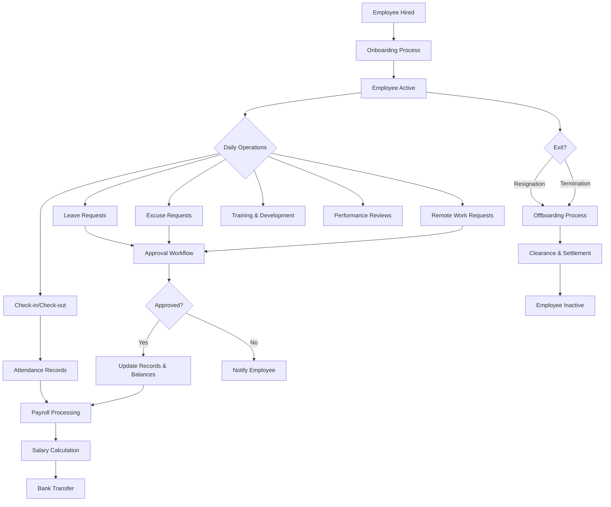

# 01 - Executive Summary

## 1.1 System Overview

**TecAxle HRMS** is a comprehensive enterprise-grade Human Resource Management System (HRMS) that combines workforce management, time & attendance tracking, payroll processing, talent management, and employee self-service into a unified platform.

The system is designed for organizations operating in the Kingdom of Saudi Arabia and the broader GCC region, with full compliance to Saudi labor law, bilingual support (English/Arabic), and RTL interface capabilities.

## 1.2 Business Objectives

| Objective | Description |
|-----------|-------------|
| **Automate Workforce Management** | Eliminate manual attendance tracking, leave calculations, and payroll processing |
| **Enhance Employee Experience** | Provide self-service portal and mobile app for employees to manage their own requests |
| **Ensure Compliance** | Saudi labor law compliant overtime, end-of-service, and leave calculations |
| **Real-Time Visibility** | Dashboards and analytics for instant decision-making |
| **Secure Access Control** | Role-based permissions with branch-scoped multi-tenancy |
| **Streamline HR Operations** | End-to-end employee lifecycle from recruitment to offboarding |

## 1.3 System Components

```
+----------------------------------------------------------+
|                    TecAxle HRMS Platform                         |
+----------------------------------------------------------+
|                                                            |
|  +----------------+  +------------------+  +-----------+  |
|  | Admin Portal   |  | Self-Service     |  | Mobile    |  |
|  | (Angular)      |  | Portal (Angular) |  | App       |  |
|  | Port: 4200     |  | Port: 4201       |  | (Flutter) |  |
|  +-------+--------+  +--------+---------+  +-----+-----+  |
|          |                     |                  |         |
|          +----------+----------+------------------+         |
|                     |                                       |
|          +----------v----------+                            |
|          | Backend API (.NET)  |                            |
|          | Port: 5099          |                            |
|          | + SignalR Hub       |                            |
|          +----------+----------+                            |
|                     |                                       |
|          +----------v----------+                            |
|          | PostgreSQL Database |                            |
|          +---------------------+                            |
+----------------------------------------------------------+
```

## 1.4 Stakeholders & Roles

| Role | Access | Primary Functions |
|------|--------|-------------------|
| **System Administrator** | Full system access | System configuration, user management, all modules |
| **HR Manager** | HR module access | Employee management, payroll, recruitment, performance |
| **Branch Manager** | Branch-scoped access | Branch employees, attendance, approvals |
| **Department Head** | Department-scoped access | Department employees, approvals, team management |
| **Manager** | Team access | Team attendance, approvals, performance reviews |
| **Employee** | Self-service access | Personal attendance, leave requests, profile |

## 1.5 Module Map

### Phase 1 - Core Modules
- Authentication & Security
- Organization Management (Branches, Departments, Employees)
- Time & Attendance (including Mobile GPS+NFC)
- Shift Management
- Leave Management (Vacations, Excuses)
- Remote Work Management
- Approval Workflows
- Employee Self-Service Portal
- Notifications (Real-time + Push)
- Dashboards & Reporting
- Audit Logging

### Phase 2 - HRMS Expansion
- Recruitment & Hiring
- Onboarding
- Performance Management
- Employee Lifecycle (Contracts, Promotions, Transfers)
- Payroll & Compensation
- Offboarding
- Training & Development
- Employee Relations
- Asset Management
- Expense Management
- Loan Management
- Benefits Management
- Succession Planning
- Surveys & Feedback
- Analytics & Custom Reports
- Document Management
- Announcements
- Timesheets

## 1.6 High-Level System Flow



## 1.7 Production Environment

| Component | URL | Platform |
|-----------|-----|----------|
| Backend API | https://api.clockn.net | Ubuntu 24.04 LTS |
| Admin Portal | https://www.clockn.net | Cloudflare Pages |
| Self-Service Portal | https://portal.clockn.net | Cloudflare Pages |
| Mobile App | App Store / Play Store | Flutter (iOS/Android) |

## 1.8 Technology Stack Summary

| Layer | Technology |
|-------|------------|
| Backend | .NET 9.0, C# 13, Entity Framework Core 9 |
| Database | PostgreSQL 15+ |
| Admin Frontend | Angular 20, TypeScript, Bootstrap 5 |
| Self-Service Frontend | Angular 20, TypeScript, Bootstrap 5 |
| Mobile App | Flutter 3.x, Dart, Riverpod |
| Real-Time | SignalR (WebSocket) |
| Push Notifications | Firebase Cloud Messaging |
| Background Jobs | Coravel |
| Authentication | JWT + Refresh Tokens |
| API Documentation | Swagger / OpenAPI |
