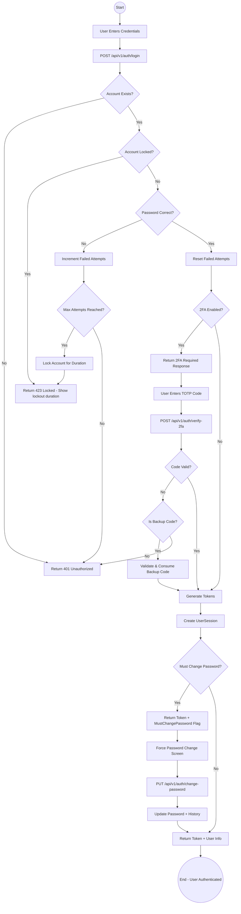
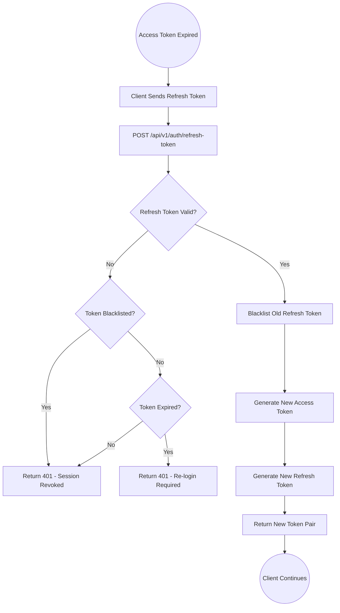
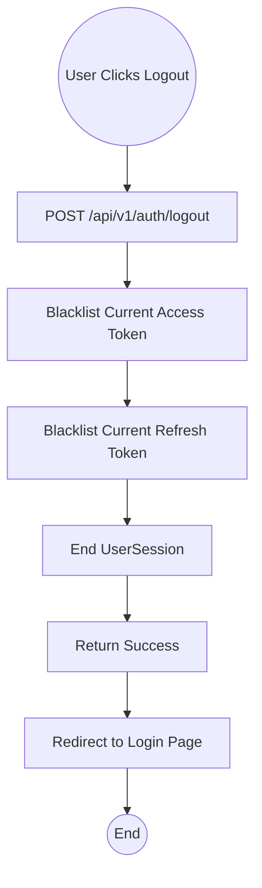
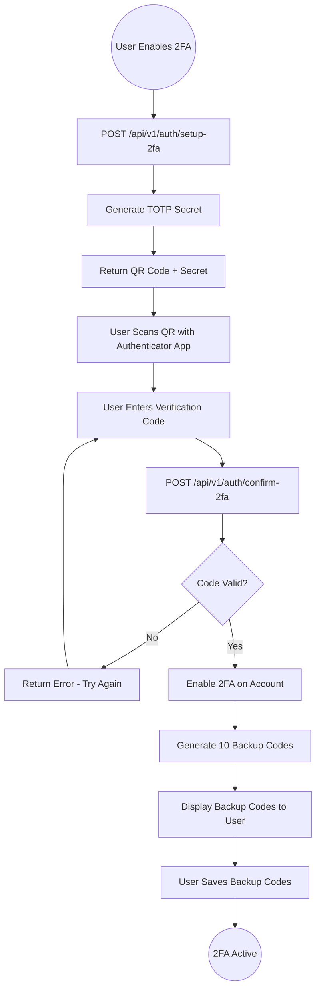
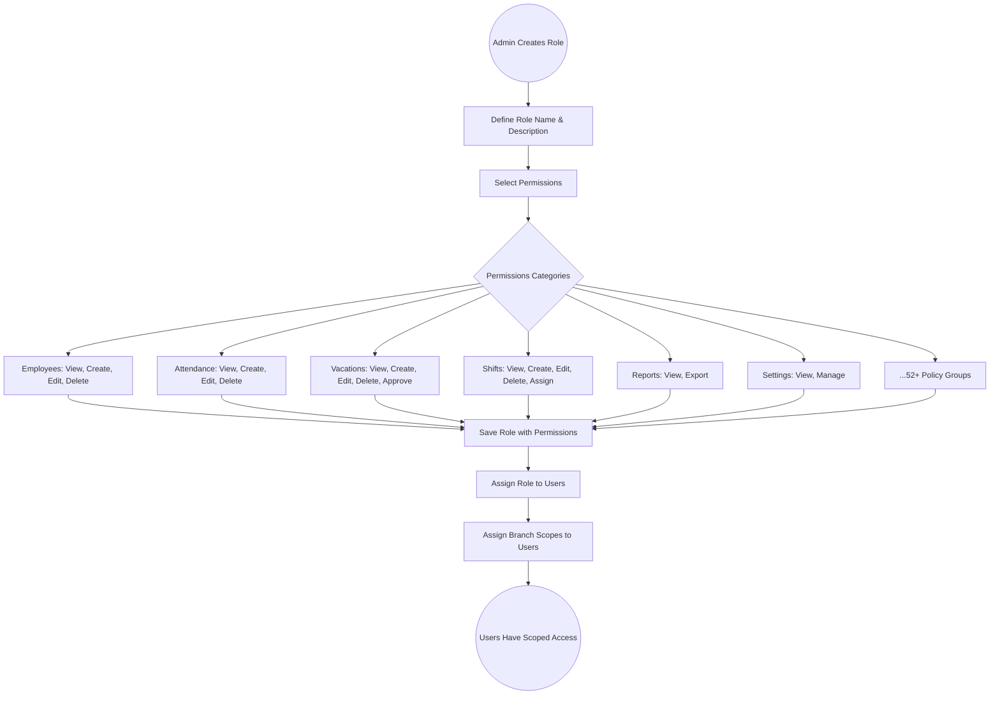
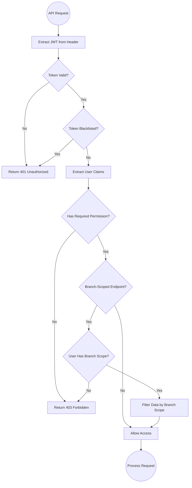
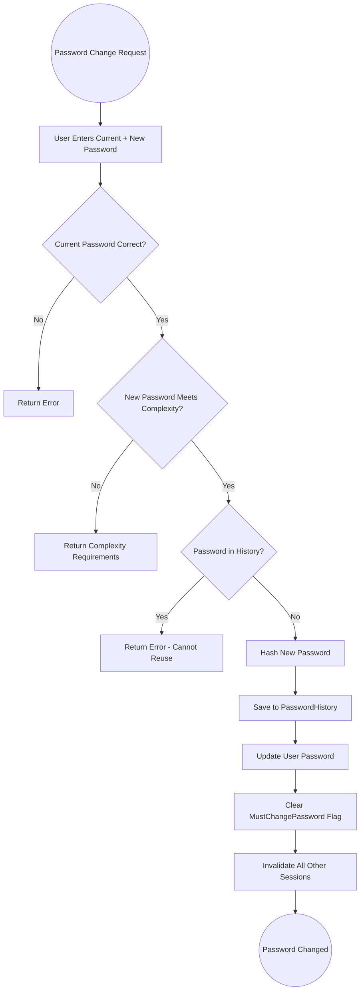

# 02 - Authentication & Security

## 2.1 Overview

The authentication and security module provides enterprise-grade identity management including JWT-based authentication, two-factor authentication (2FA), role-based access control (RBAC), branch-scoped multi-tenancy, and comprehensive audit logging.

## 2.2 Features

| Feature | Description |
|---------|-------------|
| JWT Authentication | Token-based stateless authentication with access + refresh tokens |
| Two-Factor Auth (2FA) | TOTP-based 2FA with backup codes |
| Role-Based Access (RBAC) | 52+ permission policies across all modules |
| Branch-Scoped Access | Multi-tenancy data isolation by branch |
| Password Policies | Complexity rules, history tracking, expiry enforcement |
| Session Management | Active session tracking, remote logout capability |
| Login Attempt Tracking | Brute-force protection with account lockout |
| Rate Limiting | 100 requests per 60 seconds per client |

## 2.3 Entities

| Entity | Purpose |
|--------|---------|
| User | User accounts with credentials and settings |
| Role | Named role grouping permissions |
| Permission | Individual permission (resource + action) |
| RolePermission | Maps permissions to roles |
| UserRole | Maps roles to users |
| UserBranchScope | Restricts user data access to specific branches |
| UserSession | Tracks active login sessions |
| RefreshToken | Stores refresh tokens for token renewal |
| BlacklistedToken | Revoked tokens for immediate invalidation |
| PasswordHistory | Stores previous password hashes to prevent reuse |
| LoginAttempt | Tracks failed login attempts for lockout |
| TwoFactorBackupCode | One-time backup codes for 2FA recovery |

## 2.4 Login Flow



## 2.5 Token Refresh Flow



## 2.6 Logout Flow



## 2.7 2FA Setup Flow



## 2.8 Role & Permission Management Flow



## 2.9 Permission Check Flow (Every API Request)



## 2.10 Password Change Flow



## 2.11 Session Management Flow

```mermaid
graph TD
    A((Admin Views Sessions)) --> B[GET /api/v1/sessions/active]
    B --> C[List All Active Sessions]
    C --> D{Action?}
    
    D -->|View Details| E[Show Session Info: IP, Device, Location, Last Active]
    
    D -->|Terminate Session| F[POST /api/v1/sessions/{id}/terminate]
    F --> G[Blacklist Session Tokens]
    G --> H[Mark Session as Terminated]
    H --> I[User Gets Logged Out on Next Request]
    
    D -->|Terminate All| J[POST /api/v1/sessions/terminate-all]
    J --> K[Blacklist All Tokens Except Current]
    K --> L[Mark All Other Sessions as Terminated]
    
    I --> M((Done))
    L --> M
```

## 2.12 Security Middleware Pipeline

```
Request
  |
  v
[CORS Middleware] --> Check allowed origins (localhost:4200, 4201, 4202)
  |
  v
[Global Exception Handler] --> Catch unhandled exceptions, return JSON with traceId
  |
  v
[Rate Limiting Middleware] --> 100 req/60s per client IP
  |
  v
[Localization Middleware] --> Set culture from Accept-Language header
  |
  v
[Authentication Middleware] --> Validate JWT token
  |
  v
[Authorization Middleware] --> Check permissions & branch scope
  |
  v
[Controller / SignalR Hub] --> Process request
  |
  v
Response
```
