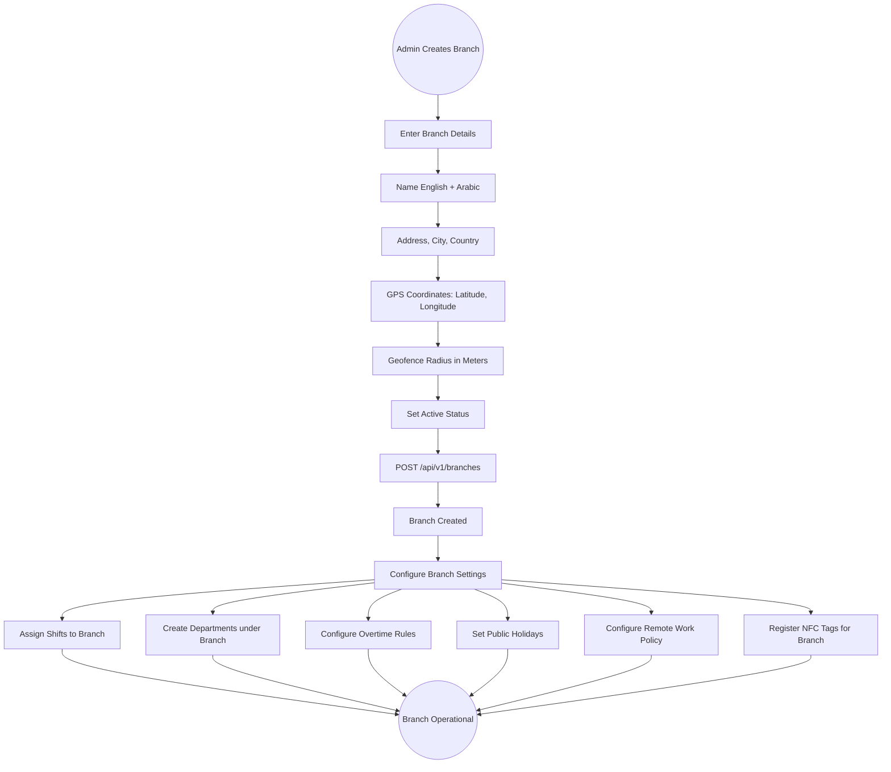
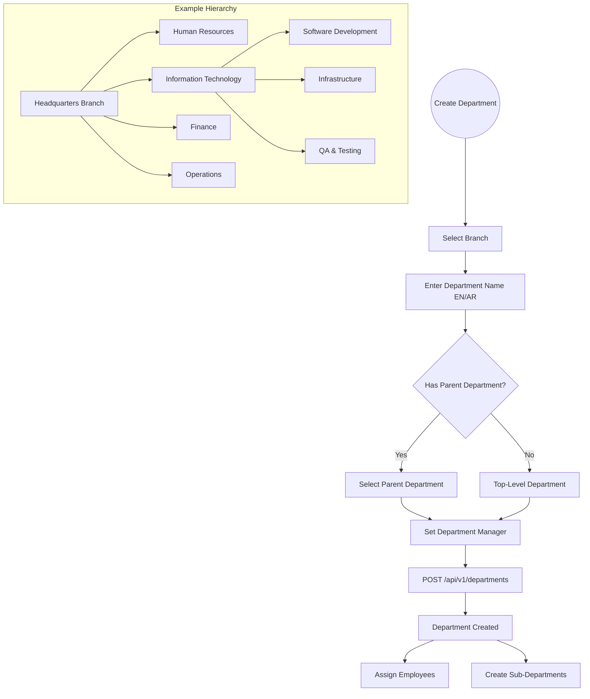
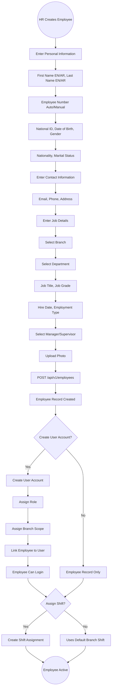
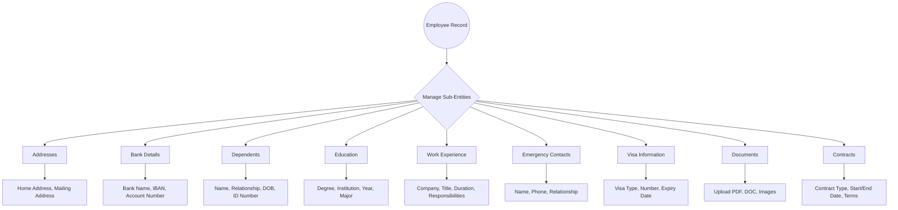
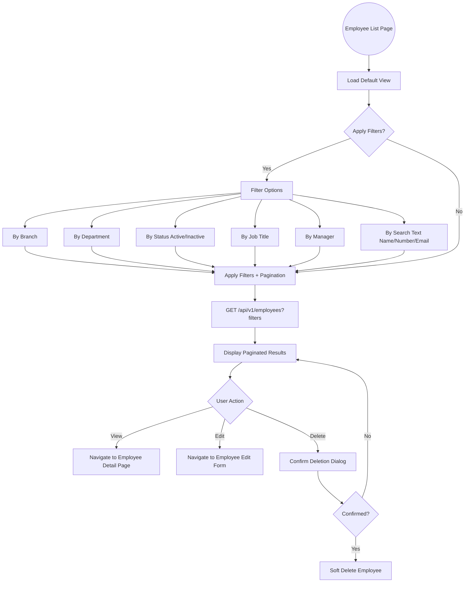

# 03 - Organization Management

## 3.1 Overview

The organization management module provides the foundational structure for the entire system. It manages branches (offices/locations), departments (organizational units), and employees (workforce). All other modules depend on this structure for data scoping, reporting, and access control.

## 3.2 Features

| Feature | Description |
|---------|-------------|
| Multi-Branch Support | Multiple office locations with independent configurations |
| GPS Geofencing | Branch coordinates and radius for mobile attendance verification |
| Hierarchical Departments | Parent-child department structure within branches |
| Complete Employee Records | Personal info, job details, contact info, emergency contacts |
| Employee-User Linking | Map employees to system user accounts |
| Bilingual Names | All entities support English and Arabic names |

## 3.3 Entities

| Entity | Key Fields |
|--------|------------|
| Branch | Name, NameAr, Address, City, Latitude, Longitude, GeofenceRadiusMeters, IsActive |
| Department | Name, NameAr, BranchId, ParentDepartmentId, ManagerId, IsActive |
| Employee | FirstName, LastName, EmployeeNumber, Email, Phone, BranchId, DepartmentId, ManagerId, HireDate, JobTitle, IsActive |
| EmployeeUserLink | EmployeeId, UserId (links employee record to login account) |

## 3.4 Branch Management Flow



## 3.5 Department Hierarchy Flow



## 3.6 Employee Creation Flow



## 3.7 Employee Sub-Entity Management



## 3.8 Employee Search & Filter Flow



## 3.9 Data Scoping by Branch

```
All API Requests for Branch-Scoped Data:

1. User authenticates --> JWT contains UserId
2. System looks up UserBranchScope for UserId
3. Query filters applied:

   Example: GET /api/v1/employees
   
   - SystemAdmin --> Sees ALL employees across ALL branches
   - Branch Manager (Branch: HQ) --> Sees only HQ employees
   - Department Head (Branch: HQ, Dept: IT) --> Sees only HQ IT employees
   
   SQL equivalent:
   WHERE BranchId IN (user's branch scopes)
   AND (DepartmentId = user's department OR user has full branch access)
```

## 3.10 Organization Statistics Dashboard

```
+------------------------------------------+
|         Organization Overview             |
+------------------------------------------+
| Total Branches: 5                         |
| Total Departments: 20                     |
| Total Employees: 50                       |
| Active Employees: 48                      |
| New Hires (This Month): 3                |
| Departures (This Month): 1               |
+------------------------------------------+
|                                           |
| Branch Distribution:                      |
| - Riyadh HQ: 15 employees               |
| - Jeddah: 12 employees                   |
| - Dammam: 10 employees                   |
| - Madinah: 8 employees                   |
| - Makkah: 5 employees                    |
+------------------------------------------+
```
