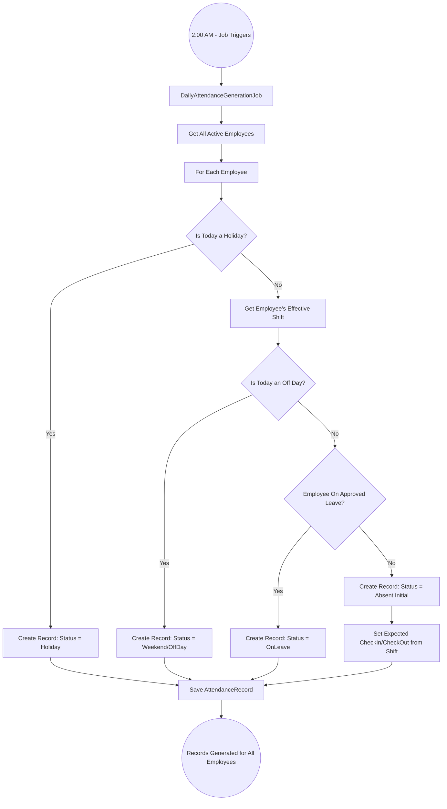
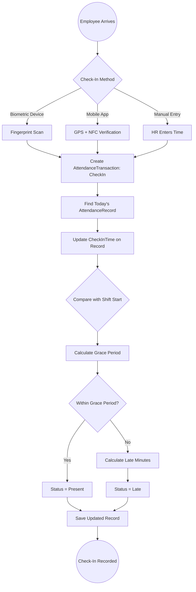
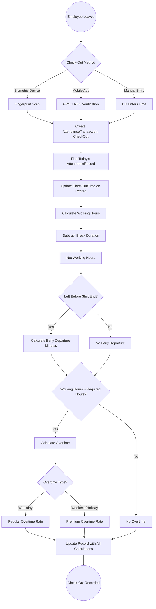
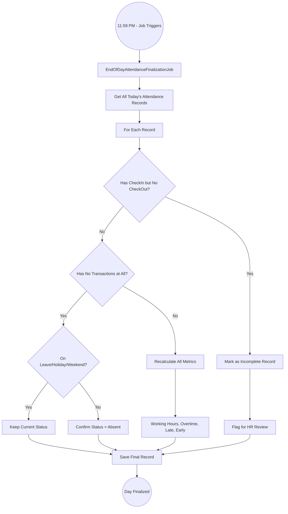
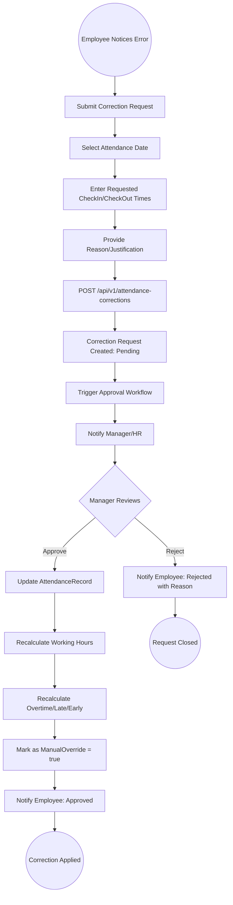
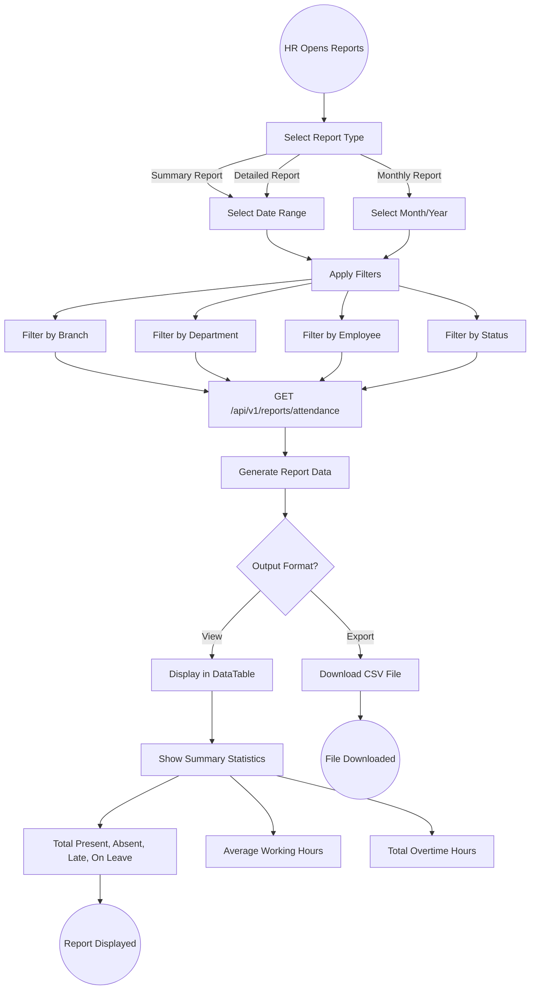
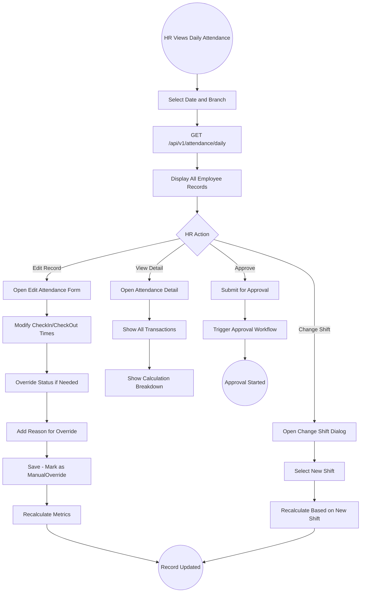

# 04 - Time & Attendance

## 4.1 Overview

The Time & Attendance module is the core of the TecAxle HRMS system. It automates daily attendance record generation, tracks employee check-in/check-out transactions, calculates working hours, overtime, late minutes, and early departures, and integrates with shifts, holidays, and leave management.

## 4.2 Features

| Feature | Description |
|---------|-------------|
| Automated Attendance Generation | Background job creates daily records for all active employees at 2:00 AM |
| Transaction Tracking | Check-in, check-out, break start, break end timestamps |
| Working Hours Calculation | Automatic calculation based on shift periods and transactions |
| Overtime Calculation | Regular and premium overtime based on configuration |
| Late/Early Detection | Grace period-aware detection of late arrivals and early departures |
| Status Management | Present, Absent, Late, OnLeave, Holiday, Weekend, etc. |
| Manual Override | HR can edit and override automated calculations |
| Attendance Approval | Multi-step approval workflow for attendance records |
| Finalization | Lock records after approval to prevent further changes |
| Correction Requests | Employees can request corrections to their attendance |

## 4.3 Entities

| Entity | Key Fields |
|--------|------------|
| AttendanceRecord | EmployeeId, Date, ShiftId, Status, CheckInTime, CheckOutTime, WorkingHours, OvertimeHours, LateMinutes, EarlyDepartureMinutes, IsFinalized, IsManualOverride |
| AttendanceTransaction | AttendanceRecordId, TransactionType (CheckIn/CheckOut/BreakStart/BreakEnd), Timestamp, Source (Device/Manual/Mobile) |
| WorkingDay | DayOfWeek, IsWorkingDay, BranchId |
| AttendanceCorrectionRequest | EmployeeId, AttendanceRecordId, Reason, RequestedCheckIn, RequestedCheckOut, Status |

## 4.4 Daily Attendance Generation Flow



## 4.5 Employee Check-In Flow



## 4.6 Employee Check-Out Flow



## 4.7 Working Hours Calculation Logic

```
Working Hours Calculation:
========================

1. Raw Working Hours = CheckOutTime - CheckInTime
2. Break Duration = Sum of (BreakEnd - BreakStart) for all breaks
3. Net Working Hours = Raw Working Hours - Break Duration

Overtime Calculation:
====================
4. Required Hours = Shift.TotalWorkingHours
5. If Net Working Hours > Required Hours:
   a. Overtime Hours = Net Working Hours - Required Hours
   b. Apply overtime thresholds:
      - Daily Threshold: Max overtime per day
      - Weekly Threshold: Max overtime per week
      - Monthly Threshold: Max overtime per month
   c. Apply overtime rate:
      - Regular: 1.5x (weekday overtime)
      - Premium: 2.0x (weekend/holiday overtime)

Late Minutes Calculation:
========================
6. Grace Period = Shift.LateGracePeriodMinutes
7. Actual Arrival = CheckInTime
8. Expected Arrival = Shift.StartTime
9. If (Actual Arrival - Expected Arrival) > Grace Period:
   Late Minutes = Actual Arrival - Expected Arrival

Early Departure Calculation:
===========================
10. Expected Departure = Shift.EndTime
11. Actual Departure = CheckOutTime
12. If Actual Departure < Expected Departure:
    Early Departure Minutes = Expected Departure - Actual Departure
```

## 4.8 End-of-Day Finalization Flow



## 4.9 Attendance Correction Request Flow



## 4.10 Attendance Report Flow



## 4.11 Attendance Status Reference

| Status | Description | Trigger |
|--------|-------------|---------|
| Present | Employee checked in and out within acceptable times | Normal check-in/out |
| Absent | No transactions recorded for a working day | No check-in by end of day |
| Late | Employee arrived after shift start + grace period | Late check-in |
| OnLeave | Employee has approved leave for the day | Approved vacation |
| Holiday | Public holiday - no attendance required | Holiday calendar |
| Weekend | Off day - no attendance required | Shift off days |
| Incomplete | Missing check-out (or check-in) | Partial transactions |
| Excused | Absence excused by management | Approved excuse |

## 4.12 Admin Attendance Management Flow


