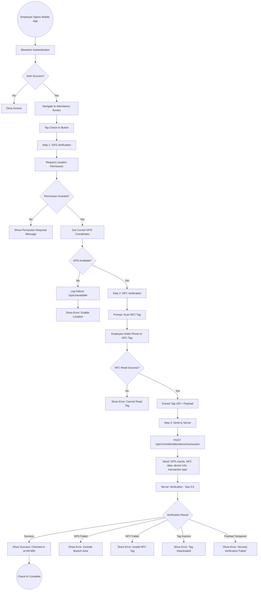
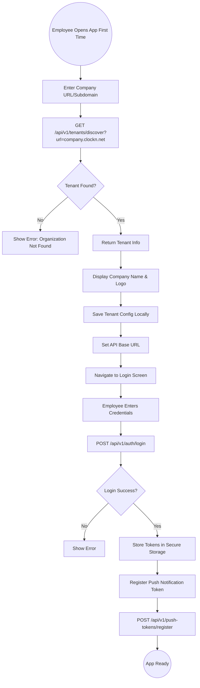

# 05 - Mobile Attendance (GPS + NFC Verification)

## 5.1 Overview

The mobile attendance module enables employees to check in and check out using their smartphones. It implements dual-verification security by requiring both GPS geofencing (proving the employee is physically at the workplace) and NFC tag scanning (proving the employee is at a specific checkpoint within the workplace).

## 5.2 Features

| Feature | Description |
|---------|-------------|
| GPS Geofencing | Verify employee is within branch radius using Haversine formula |
| NFC Tag Scanning | Scan physical NFC tags registered to branches |
| HMAC-SHA256 Signing | Tamper-proof NFC payload verification |
| Dual Verification | Both GPS and NFC must pass for successful check-in/out |
| Audit Trail | Every attempt (success and failure) is logged |
| Device Tracking | Capture device ID, model, platform, app version |
| Biometric Auth | Fingerprint/Face ID for app access |
| Offline Handling | Graceful degradation on network failure |

## 5.3 Entities

| Entity | Key Fields |
|--------|------------|
| NfcTag | TagUid, BranchId, EncryptedPayload, VerificationHash, Status, ScanCount, LastScannedAt |
| AttendanceVerificationLog | EmployeeId, BranchId, VerificationType, IsSuccess, FailureReason, GpsLatitude, GpsLongitude, GpsAccuracy, NfcTagUid, DeviceId, DeviceModel, Platform, AppVersion |

## 5.4 NFC Tag Lifecycle

```mermaid
graph TD
    A((Admin Receives NFC Tag)) --> B[Status: Unregistered]
    B --> C[Register Tag to Branch]
    C --> D[Enter Tag UID]
    D --> E[Select Branch]
    E --> F[POST /api/v1/nfc-tags]
    F --> G[Status: Registered]
    
    G --> H{Provision Tag?}
    H -->|Yes| I[Write HMAC Payload to Tag]
    I --> J[Generate Payload: tagId|branchId|tagUid|timestamp]
    J --> K[Sign with HMAC-SHA256 Secret Key]
    K --> L[Write Encrypted Payload to NFC Tag]
    L --> M[Store VerificationHash in Database]
    M --> N[Status: Active]
    
    H -->|No - UID Only Mode| N
    
    N --> O{Tag in Use}
    O -->|Normal Use| P[Employees Scan for Attendance]
    P --> Q[Increment ScanCount]
    Q --> R[Update LastScannedAt]
    
    O -->|Tag Lost| S[Status: Lost]
    S --> T[Admin Creates Replacement]
    
    O -->|Deactivate| U[Status: Disabled]
    U --> V[Tag No Longer Accepted for Verification]
    
    V --> W{Reactivate?}
    W -->|Yes| N
    W -->|No| X((Tag Retired))
```

## 5.5 Mobile Check-In Complete Flow



## 5.6 Server-Side Verification Flow

```mermaid
graph TD
    A((Receive Mobile Transaction)) --> B[Extract Request Data]
    B --> C[Get Employee's Branch]
    
    C --> D{Branch Has GPS Config?}
    D -->|No| E[Log Failure: BranchNotConfigured]
    E --> F[Return Error]
    
    D -->|Yes| G[Step 1: GPS Geofence Check]
    G --> H[Calculate Distance Using Haversine Formula]
    H --> I{Distance <= GeofenceRadius?}
    
    I -->|No| J[Log Failure: GpsOutsideGeofence]
    J --> K[Record: Distance, Branch Coords, Employee Coords]
    K --> F
    
    I -->|Yes| L[GPS Verified - Proceed to NFC]
    
    L --> M[Step 2: NFC Tag Verification]
    M --> N{Tag UID in System?}
    N -->|No| O[Log Failure: NfcTagNotRegistered]
    O --> F
    
    N -->|Yes| P{Tag Active?}
    P -->|No| Q[Log Failure: NfcTagInactive]
    Q --> F
    
    P -->|Yes| R{Tag Belongs to Employee's Branch?}
    R -->|No| S[Log Failure: NfcTagMismatch]
    S --> F
    
    R -->|Yes| T{RequirePayload Enabled?}
    T -->|No| U[Skip Payload Check]
    
    T -->|Yes| V[Step 3: HMAC Payload Verification]
    V --> W{Payload Present?}
    W -->|No| X[Log Failure: NfcPayloadInvalid]
    X --> F
    
    W -->|Yes| Y[Parse Payload: tagId|branchId|tagUid|timestamp|hmac]
    Y --> Z[Recompute HMAC-SHA256 with Server Secret]
    Z --> AA{HMAC Match?}
    AA -->|No| AB[Log Failure: NfcPayloadTampering]
    AB --> F
    
    AA -->|Yes| U
    
    U --> AC[All Verifications Passed]
    AC --> AD[Create AttendanceTransaction]
    AD --> AE[Update AttendanceRecord]
    AE --> AF[Update NFC Tag ScanCount]
    AF --> AG[Log Success in AttendanceVerificationLog]
    AG --> AH[Convert UTC to Branch Local Time]
    AH --> AI[Return Success Response]
    
    AI --> AJ((Transaction Recorded))
```

## 5.7 Haversine Distance Calculation

```
GPS Geofence Verification:
=========================

Given:
  - Branch: (lat1, lon1) with radius R meters
  - Employee: (lat2, lon2)

Haversine Formula:
  a = sin²((lat2-lat1)/2) + cos(lat1) * cos(lat2) * sin²((lon2-lon1)/2)
  c = 2 * atan2(√a, √(1-a))
  distance = R_earth * c    (R_earth = 6,371,000 meters)

Decision:
  IF distance <= R THEN GPS_VERIFIED
  ELSE GPS_OUTSIDE_GEOFENCE

Example:
  Branch: Riyadh HQ (24.7136, 46.6753), Radius: 200m
  Employee GPS: (24.7138, 46.6751)
  Distance: ~28 meters --> VERIFIED (within 200m radius)
```

## 5.8 NFC Payload Format

```
Payload Structure:
=================

Format: {tagId}|{branchId}|{tagUid}|{timestamp}|{hmacSignature}

Example:
  TagId: 42
  BranchId: 101
  TagUid: 04:A2:C8:3A:12:5B:80
  Timestamp: 2026-03-15T10:30:00Z
  HMAC Key: server-secret-key

Payload Written to Tag:
  42|101|04:A2:C8:3A:12:5B:80|2026-03-15T10:30:00Z|a3f8b2c1d4e5...

Verification Process:
  1. Read payload from NFC tag
  2. Split by '|' separator
  3. Reconstruct message: tagId|branchId|tagUid|timestamp
  4. Compute HMAC-SHA256(message, serverSecretKey)
  5. Compare computed HMAC with payload HMAC
  6. If match: Tag is authentic
  7. If mismatch: Tag has been tampered with
```

## 5.9 Verification Failure Reasons

| Failure Code | Description | User Message |
|-------------|-------------|--------------|
| GpsOutsideGeofence | Employee GPS coordinates outside branch radius | "You are outside the branch area" |
| NfcTagMismatch | NFC tag not registered to employee's branch | "This NFC tag does not belong to your branch" |
| NfcTagNotRegistered | NFC tag UID not found in system | "Unrecognized NFC tag" |
| NfcTagInactive | NFC tag exists but is disabled/lost | "This NFC tag has been deactivated" |
| BranchNotConfigured | Branch missing GPS coordinates or NFC | "Branch is not configured for mobile attendance" |
| GpsUnavailable | Device could not obtain GPS fix | "Unable to determine your location" |
| NfcPayloadInvalid | Payload missing or malformed | "NFC tag data could not be read" |
| NfcPayloadTampering | HMAC signature verification failed | "Security verification failed" |

## 5.10 Tenant Discovery Flow (Multi-Tenant Mobile)



## 5.11 Mobile App Permissions Required

| Permission | Platform | Purpose |
|------------|----------|---------|
| NFC | Android | Read NFC tags for attendance |
| Fine Location | Android/iOS | GPS geofence verification |
| Background Location | Android | Location access during check-in |
| Camera | Android/iOS | Document scanning |
| Biometric | Android/iOS | Fingerprint/Face ID login |
| Internet | Android/iOS | API communication |
| Vibration | Android | Haptic feedback on NFC scan |
