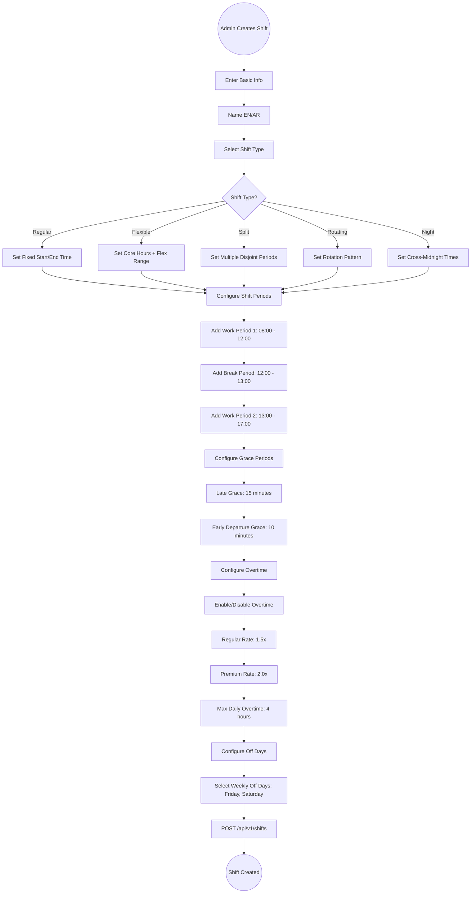
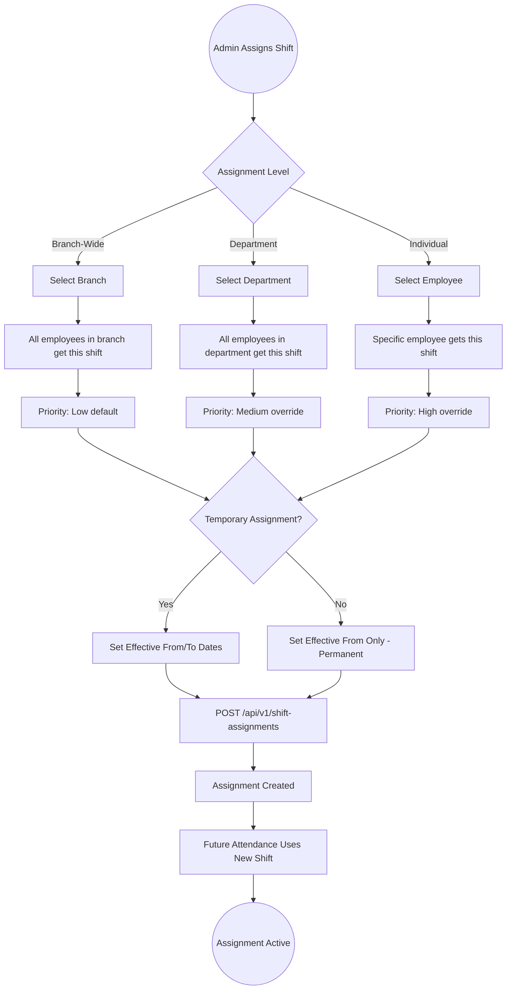
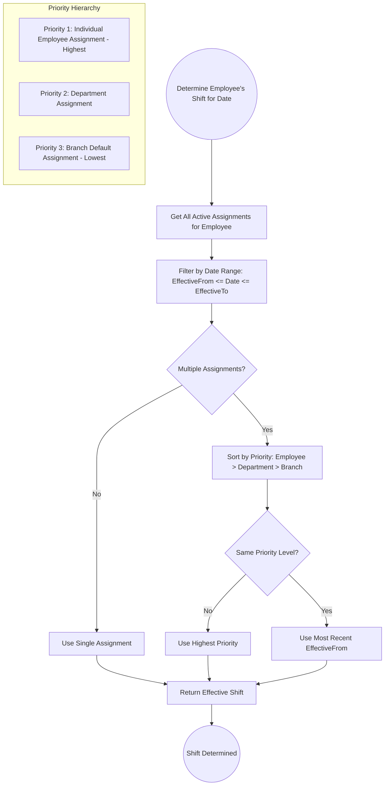
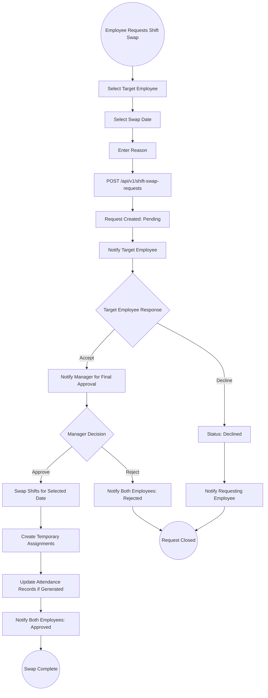
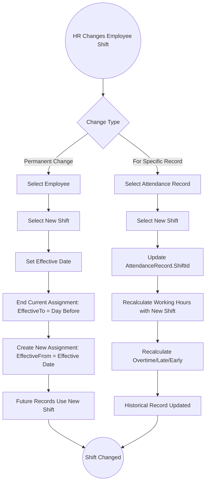

# 06 - Shift Management

## 6.1 Overview

The shift management module defines work schedules, assigns them to employees, departments, or branches, and drives all attendance calculations. It supports complex shift configurations including multiple work periods, flexible hours, rotating schedules, night shifts, and split shifts.

## 6.2 Features

| Feature | Description |
|---------|-------------|
| Multiple Shift Types | Regular, Flexible, Split, Rotating, Night |
| Shift Periods | Multiple work periods per shift (morning, afternoon, etc.) |
| Break Configuration | Configurable paid/unpaid break times |
| Grace Periods | Late arrival and early departure tolerance |
| Overtime Rules | Per-shift overtime calculation settings |
| Off Days | Configurable weekly off days per shift |
| Core Hours | Mandatory presence hours for flexible shifts |
| Assignment Levels | Assign to employee, department, or branch |
| Priority System | Resolve overlapping assignments by priority |
| Temporary Assignments | Time-bound shift assignments with start/end dates |
| Shift Swap | Employees can request to swap shifts |

## 6.3 Entities

| Entity | Key Fields |
|--------|------------|
| Shift | Name, NameAr, ShiftType, StartTime, EndTime, TotalWorkingHours, LateGracePeriodMinutes, EarlyDepartureGracePeriodMinutes, IsActive |
| ShiftPeriod | ShiftId, PeriodName, StartTime, EndTime, IsBreak |
| ShiftAssignment | ShiftId, EmployeeId/DepartmentId/BranchId, EffectiveFrom, EffectiveTo, Priority, IsTemporary |
| OffDay | ShiftId, DayOfWeek |
| ShiftSwapRequest | RequestingEmployeeId, TargetEmployeeId, RequestDate, SwapDate, Status |

## 6.4 Shift Creation Flow



## 6.5 Shift Assignment Flow



## 6.6 Effective Shift Resolution Flow



## 6.7 Shift Type Configurations

### Regular Shift
```
Name: Morning Shift
Type: Regular
Start: 08:00 | End: 17:00
Periods:
  - Work: 08:00 - 12:00
  - Break: 12:00 - 13:00 (unpaid)
  - Work: 13:00 - 17:00
Total Working Hours: 8.0
Off Days: Friday, Saturday
Grace: Late 15min, Early 10min
```

### Flexible Shift
```
Name: Flex Schedule
Type: Flexible
Flex Start: 07:00 - 10:00 (arrival window)
Flex End: 16:00 - 19:00 (departure window)
Core Hours: 10:00 - 16:00 (mandatory presence)
Total Required Hours: 8.0
Off Days: Friday, Saturday
```

### Split Shift
```
Name: Split Schedule
Type: Split
Period 1: 06:00 - 10:00 (morning)
Gap: 10:00 - 16:00 (off)
Period 2: 16:00 - 20:00 (evening)
Total Working Hours: 8.0
Off Days: Friday
```

### Night Shift
```
Name: Night Watch
Type: Night
Start: 22:00 | End: 06:00 (next day)
Periods:
  - Work: 22:00 - 02:00
  - Break: 02:00 - 02:30
  - Work: 02:30 - 06:00
Total Working Hours: 7.5
Off Days: Thursday, Friday
```

## 6.8 Shift Swap Request Flow



## 6.9 Change Employee Shift Flow


