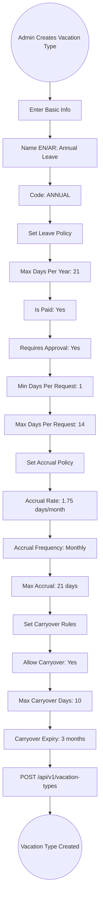
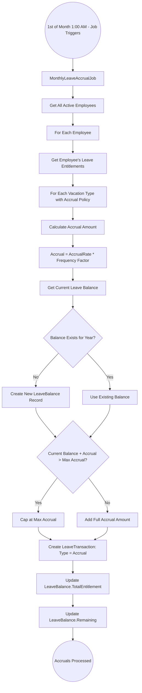
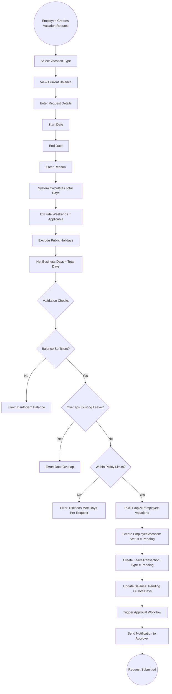
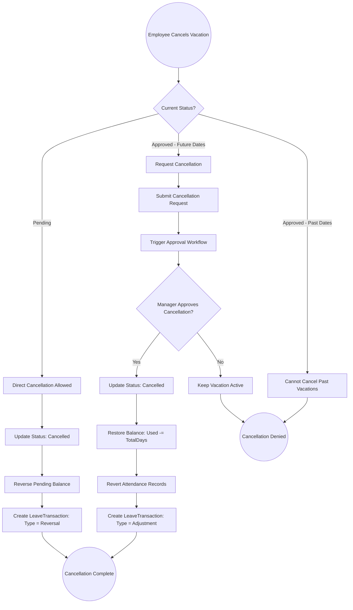
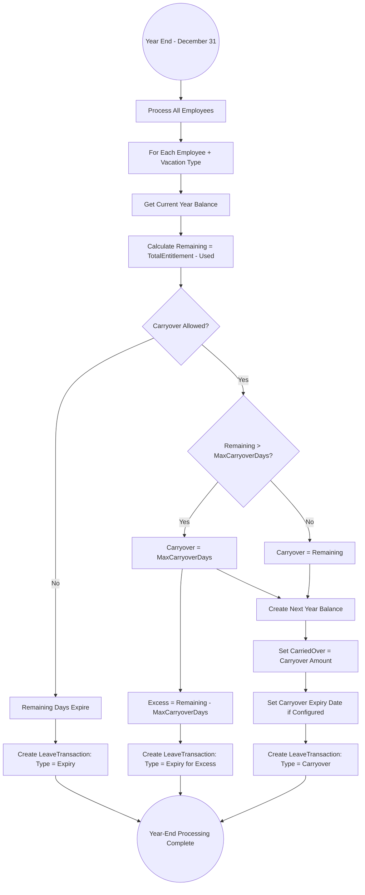
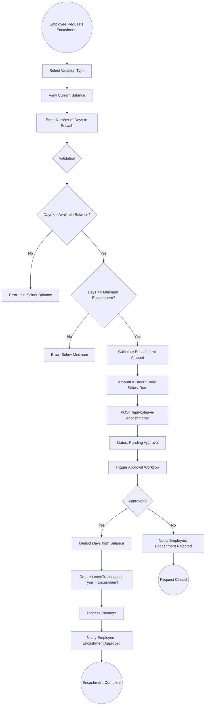
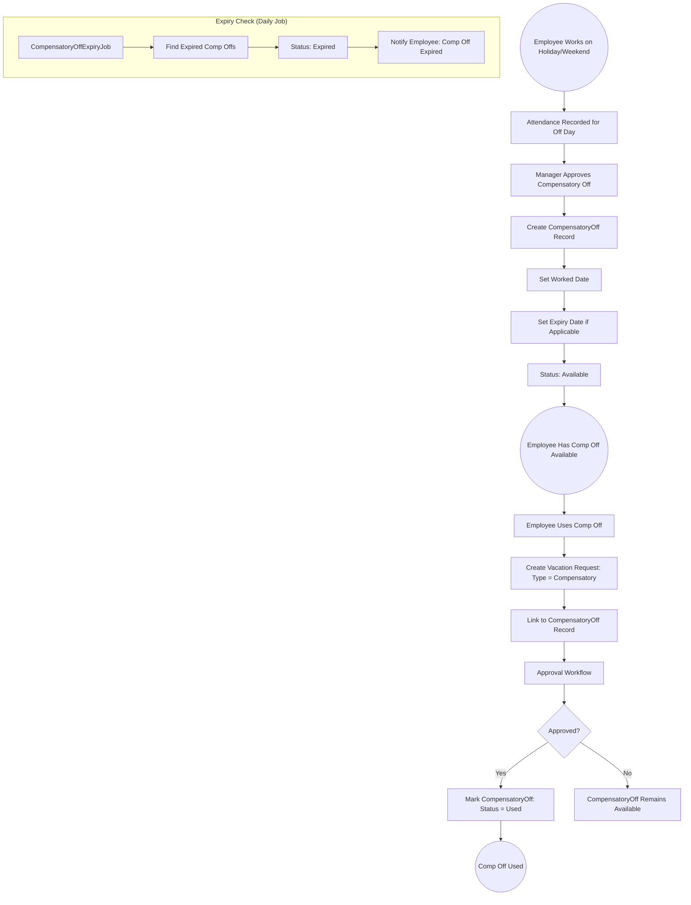

# 07 - Leave Management

## 7.1 Overview

The leave management module handles all aspects of employee time-off, including vacation type configuration, leave balance tracking, accrual processing, vacation requests with approval workflows, leave encashment, compensatory off, and carryover management.

## 7.2 Features

| Feature | Description |
|---------|-------------|
| Vacation Types | Configurable leave types (Annual, Sick, Personal, Maternity, etc.) |
| Leave Policies | Paid/unpaid, max days, carryover rules, accrual settings |
| Accrual Processing | Monthly automatic accrual based on policies |
| Balance Tracking | Real-time leave balance per employee per type |
| Leave Transactions | Full audit trail of all balance changes |
| Leave Entitlements | Automatic annual entitlement assignments |
| Vacation Requests | Submit, approve, reject with workflow integration |
| Leave Encashment | Convert unused leave to cash |
| Compensatory Off | Earn days off for working on holidays/weekends |
| Carryover Rules | Configurable year-end carryover with limits |
| Calendar View | Visual leave calendar for planning |

## 7.3 Entities

| Entity | Key Fields |
|--------|------------|
| VacationType | Name, NameAr, Code, MaxDaysPerYear, IsPaid, AllowCarryover, MaxCarryoverDays, RequiresApproval, AccrualRate, AccrualFrequency |
| EmployeeVacation | EmployeeId, VacationTypeId, StartDate, EndDate, TotalDays, Status, Reason, ApprovedBy |
| LeaveBalance | EmployeeId, VacationTypeId, Year, TotalEntitlement, Used, Pending, CarriedOver, Remaining |
| LeaveTransaction | LeaveBalanceId, Type (Accrual/Usage/Adjustment/Carryover/Expiry), Amount, Description |
| LeaveEntitlement | EmployeeId, VacationTypeId, Year, EntitlementDays |
| LeaveAccrualPolicy | VacationTypeId, AccrualRate, AccrualFrequency, MaxAccrual |
| LeaveEncashment | EmployeeId, VacationTypeId, Days, AmountPerDay, TotalAmount, Status |
| CompensatoryOff | EmployeeId, WorkedDate, Reason, ExpiryDate, Status |

## 7.4 Vacation Type Configuration Flow



## 7.5 Monthly Leave Accrual Flow



## 7.6 Vacation Request Submission Flow



## 7.7 Vacation Approval Flow

```mermaid
graph TD
    A((Manager Receives Approval Notification)) --> B[View Vacation Request Details]
    B --> C[See: Employee, Dates, Type, Balance, Reason]
    
    C --> D{Manager Decision}
    
    D -->|Approve| E[POST /api/v1/approvals/{id}/approve]
    E --> F{Last Approval Step?}
    
    F -->|No| G[Move to Next Approval Step]
    G --> H[Notify Next Approver]
    H --> I((Waiting Next Approval))
    
    F -->|Yes| J[Final Approval]
    J --> K[Update Vacation Status: Approved]
    K --> L[Convert Pending to Used in Balance]
    L --> M[Create LeaveTransaction: Type = Usage]
    M --> N[Update Attendance Records for Leave Days]
    N --> O[Notify Employee: Approved]
    
    D -->|Reject| P[Enter Rejection Reason]
    P --> Q[Update Vacation Status: Rejected]
    Q --> R[Reverse Pending Balance]
    R --> S[Create LeaveTransaction: Type = Reversal]
    S --> T[Notify Employee: Rejected with Reason]
    
    O --> U((Vacation Approved))
    T --> V((Vacation Rejected))
```

## 7.8 Vacation Cancellation Flow



## 7.9 Leave Balance Calculation

```
Leave Balance Formula:
=====================

Remaining = TotalEntitlement + CarriedOver - Used - Pending - Expired

Where:
  TotalEntitlement = Sum of all Accrual transactions for the year
  CarriedOver = Amount carried from previous year (capped by MaxCarryoverDays)
  Used = Sum of all approved and taken leave days
  Pending = Sum of all pending (not yet approved) leave days
  Expired = Carried over days that expired past the expiry deadline

Example:
  Annual Leave Balance for 2026:
  - Total Entitlement: 21 days (accrued monthly: 1.75/month)
  - Carried Over from 2025: 5 days
  - Used: 10 days
  - Pending: 3 days
  - Expired: 0 days
  
  Remaining = 21 + 5 - 10 - 3 - 0 = 13 days
```

## 7.10 Year-End Carryover Flow



## 7.11 Leave Encashment Flow



## 7.12 Compensatory Off Flow



## 7.13 Common Vacation Types

| Type | Code | Max Days | Paid | Accrual | Carryover |
|------|------|----------|------|---------|-----------|
| Annual Leave | ANNUAL | 21 | Yes | 1.75/month | Yes (10 max) |
| Sick Leave | SICK | 30 | Partial | Full on hire | No |
| Personal Leave | PERSONAL | 5 | Yes | None | No |
| Maternity Leave | MATERNITY | 70 | Yes | None | No |
| Paternity Leave | PATERNITY | 3 | Yes | None | No |
| Marriage Leave | MARRIAGE | 5 | Yes | None | No |
| Bereavement Leave | BEREAVEMENT | 5 | Yes | None | No |
| Hajj Leave | HAJJ | 15 | Yes | None (once) | No |
| Unpaid Leave | UNPAID | 30 | No | None | No |
| Compensatory Off | COMP | As earned | Yes | On work | Time-limited |
