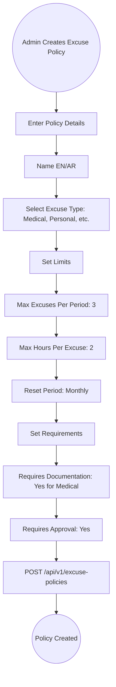
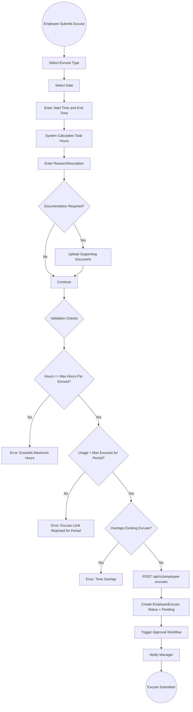
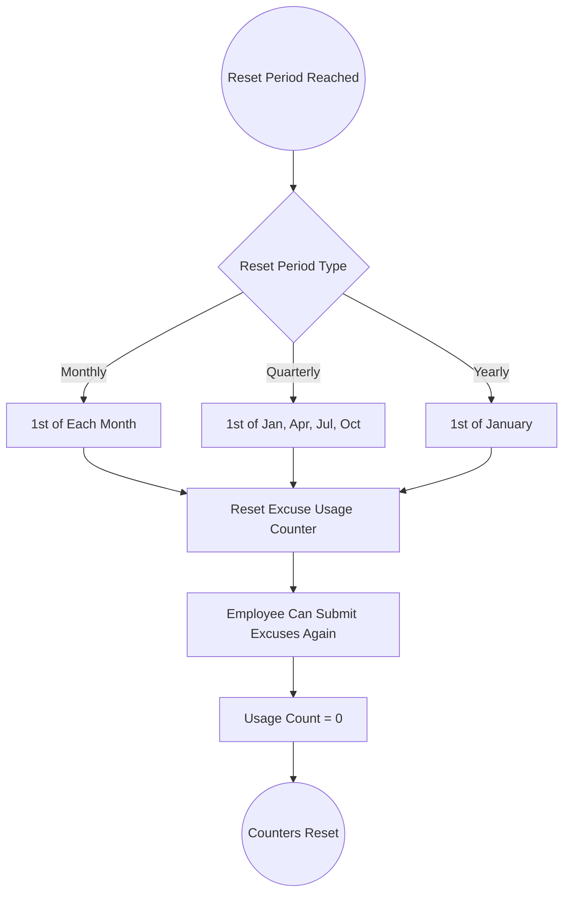

# 08 - Excuse Management

## 8.1 Overview

The excuse management module allows employees to submit excuses for late arrivals, early departures, or partial absences. Each excuse is governed by configurable policies that define limits, documentation requirements, and approval workflows.

## 8.2 Features

| Feature | Description |
|---------|-------------|
| Excuse Policies | Configurable excuse types and limits per policy |
| Multiple Excuse Types | Sick, Personal, Emergency, Medical, Family, Other |
| Documentation Support | Attach supporting documents to excuse requests |
| Balance Tracking | Track excuse hours/days usage against policy limits |
| Reset Periods | Configure policy reset cycles (Monthly, Quarterly, Yearly) |
| Approval Workflow | Multi-step approval process integration |
| Attendance Integration | Approved excuses update attendance records |

## 8.3 Entities

| Entity | Key Fields |
|--------|------------|
| ExcusePolicy | Name, NameAr, ExcuseType, MaxExcusesPerPeriod, MaxHoursPerExcuse, ResetPeriod, RequiresDocumentation, IsActive |
| EmployeeExcuse | EmployeeId, ExcusePolicyId, Date, StartTime, EndTime, TotalHours, ExcuseType, Reason, Status, DocumentPath |

## 8.4 Excuse Policy Configuration Flow



## 8.5 Excuse Request Submission Flow



## 8.6 Excuse Approval Flow

```mermaid
graph TD
    A((Manager Reviews Excuse)) --> B[View Excuse Details]
    B --> C[See: Employee, Date, Time, Reason, Documents]
    C --> D[View Employee's Excuse History]
    
    D --> E{Decision}
    
    E -->|Approve| F[POST /api/v1/approvals/{id}/approve]
    F --> G[Update Excuse Status: Approved]
    G --> H[Update Attendance Record]
    H --> I{What Was Excused?}
    
    I -->|Late Arrival| J[Reduce Late Minutes on Attendance]
    I -->|Early Departure| K[Reduce Early Departure on Attendance]
    I -->|Partial Absence| L[Mark Excused Hours on Attendance]
    
    J --> M[Recalculate Attendance Metrics]
    K --> M
    L --> M
    
    M --> N[Notify Employee: Excuse Approved]
    
    E -->|Reject| O[Enter Rejection Reason]
    O --> P[Update Excuse Status: Rejected]
    P --> Q[Notify Employee: Excuse Rejected]
    
    N --> R((Excuse Processed))
    Q --> R
```

## 8.7 Excuse Balance Reset Flow



## 8.8 Excuse Type Reference

| Excuse Type | Typical Policy | Documentation |
|-------------|---------------|---------------|
| Medical | 3/month, 2hrs max | Medical certificate required |
| Personal | 2/month, 1hr max | Not required |
| Emergency | 1/month, 4hrs max | Optional |
| Family | 2/month, 2hrs max | Not required |
| Government/Official | 2/month, 4hrs max | Official letter required |
| Other | 1/month, 1hr max | Optional |
