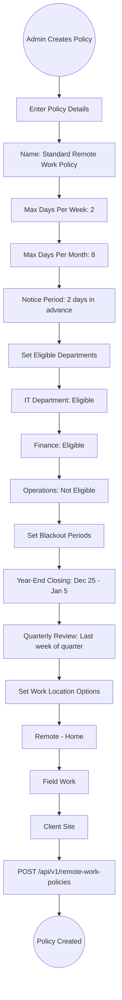
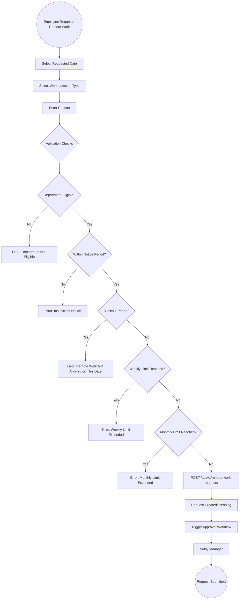
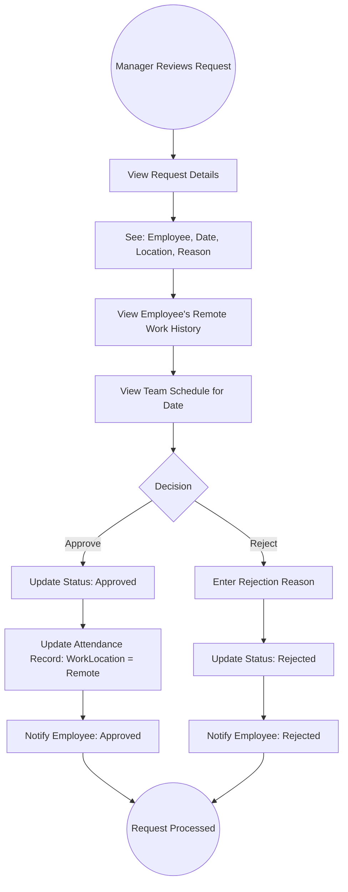
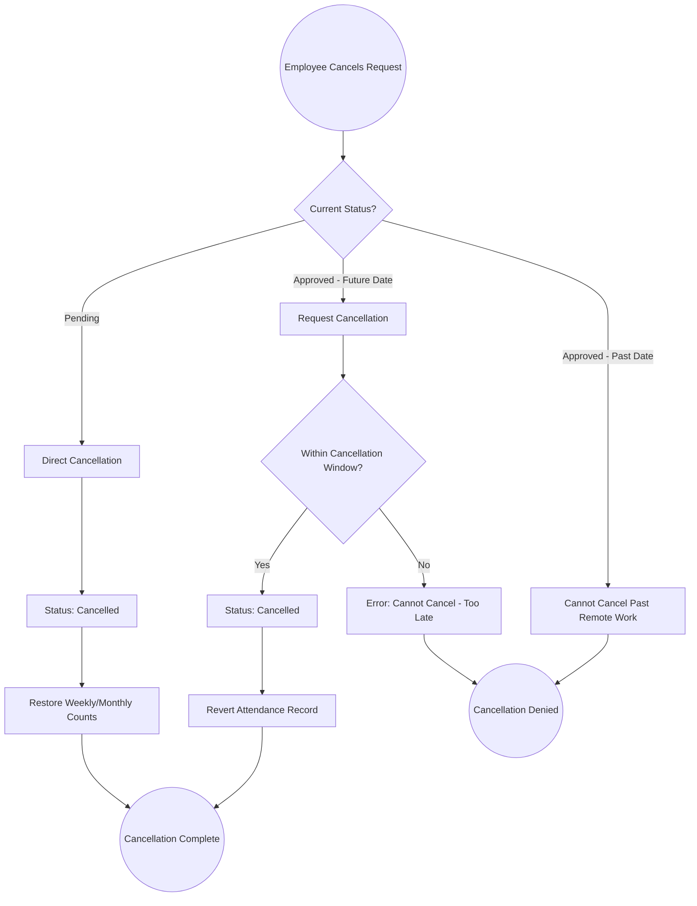

# 09 - Remote Work Management

## 9.1 Overview

The remote work management module enables organizations to configure remote work policies, allow employees to submit remote work requests, and track remote work through approval workflows. It supports multiple work location types and configurable blackout periods.

## 9.2 Features

| Feature | Description |
|---------|-------------|
| Remote Work Policies | Configure max days per week/month, notice periods |
| Work Location Types | Office, Remote, Field Work, Client Site |
| Remote Work Requests | Submit and track remote work requests |
| Blackout Periods | Define periods when remote work is not allowed |
| Department Eligibility | Configure which departments can work remotely |
| Approval Workflow | Multi-step approval process |
| Calendar Integration | Visual view of remote work days |

## 9.3 Entities

| Entity | Key Fields |
|--------|------------|
| RemoteWorkPolicy | Name, MaxDaysPerWeek, MaxDaysPerMonth, NoticePeriodDays, RequiresApproval, EligibleDepartments, BlackoutPeriods, IsActive |
| RemoteWorkRequest | EmployeeId, PolicyId, RequestedDate, WorkLocationType, Reason, Status |

## 9.4 Remote Work Policy Configuration Flow

## 9.5 Remote Work Request Flow

## 9.6 Remote Work Approval Flow

## 9.7 Remote Work Cancellation Flow

