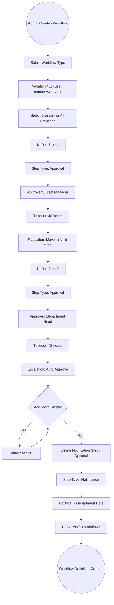
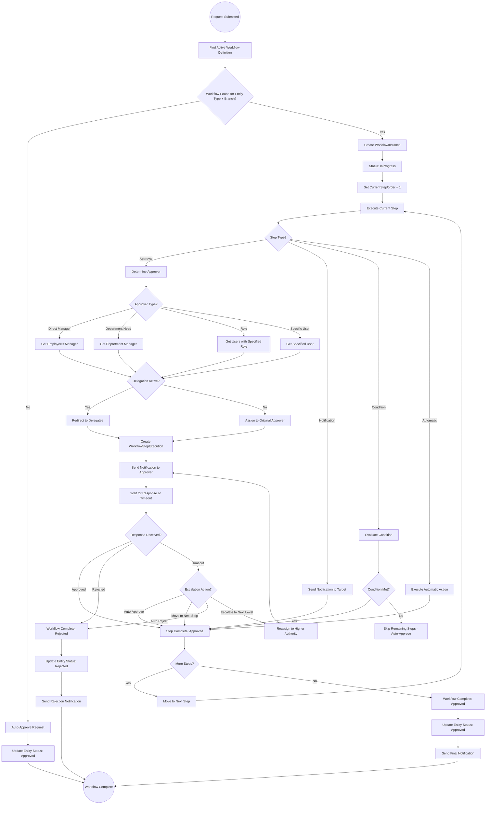
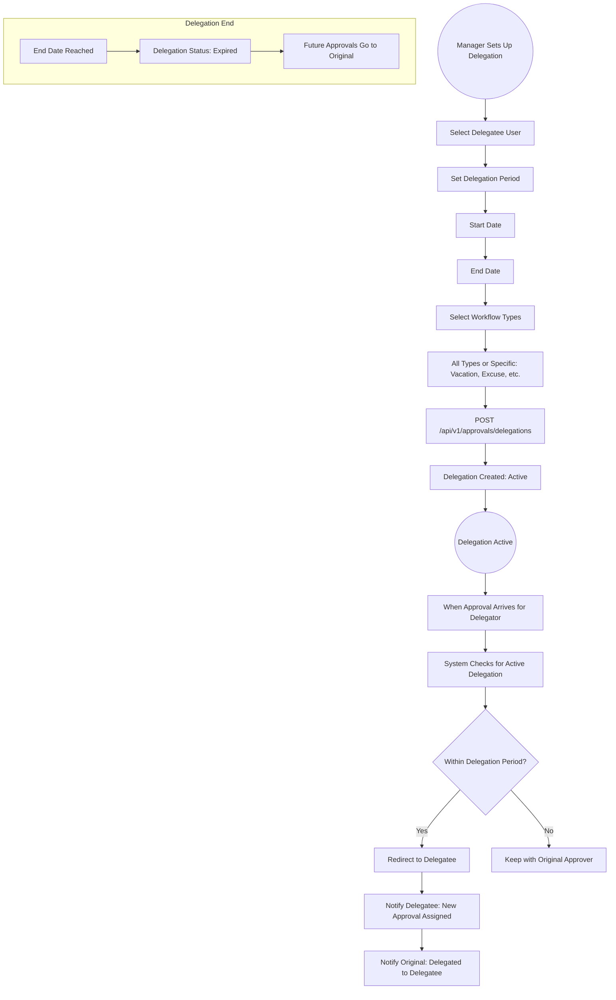
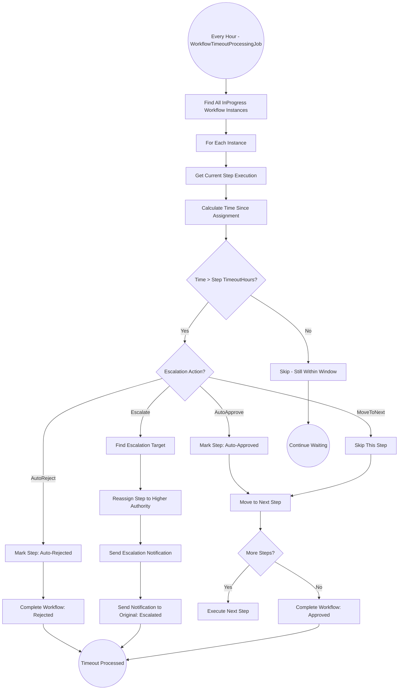

# 10 - Approval Workflows

## 10.1 Overview

The approval workflow engine is the backbone of all request processing in TecAxle HRMS. It provides a configurable, multi-step approval system that supports different approver types, delegation, timeout escalation, conditional logic, and both parallel and sequential approval patterns. It is used by vacations, excuses, remote work, attendance corrections, salary adjustments, and many other modules.

## 10.2 Features

| Feature | Description |
|---------|-------------|
| Configurable Steps | Define multiple approval steps per workflow |
| Step Types | Approval, Notification, Condition, Automatic |
| Approver Types | Role, User, Manager, Direct Manager, Department Head |
| Delegation | Delegate approvals to other users |
| Timeout & Escalation | Auto-escalate on timeout |
| Conditional Logic | Skip or execute steps based on conditions |
| Parallel Approvals | Multiple approvers at the same step |
| Sequential Approvals | Ordered step-by-step approvals |
| Branch-Specific | Different workflows per branch |
| Workflow Types | Vacation, Excuse, RemoteWork, AttendanceCorrection, SalaryAdjustment, and more |

## 10.3 Entities

| Entity | Key Fields |
|--------|------------|
| WorkflowDefinition | Name, EntityType, BranchId, Steps[], IsActive |
| WorkflowStep | WorkflowDefinitionId, StepOrder, StepType, ApproverType, ApproverId/RoleId, TimeoutHours, EscalationAction |
| WorkflowInstance | WorkflowDefinitionId, EntityType, EntityId, CurrentStepOrder, Status, StartedAt, CompletedAt |
| WorkflowStepExecution | WorkflowInstanceId, StepOrder, AssignedTo, Action, Comments, ExecutedAt, Status |
| ApprovalDelegation | DelegatorId, DelegateeId, StartDate, EndDate, WorkflowType, IsActive |

## 10.4 Workflow Definition Creation Flow



## 10.5 Complete Workflow Execution Flow



## 10.6 Approval Delegation Flow



## 10.7 Workflow Timeout Processing Flow



## 10.8 Workflow Status Reference

| Workflow Status | Description |
|-----------------|-------------|
| InProgress | Workflow is active, waiting for current step |
| Completed | All steps approved, workflow finished successfully |
| Rejected | A step was rejected, workflow terminated |
| Cancelled | Request was cancelled by the submitter |
| TimedOut | All timeout actions exhausted |

| Step Execution Status | Description |
|----------------------|-------------|
| Pending | Waiting for approver action |
| Approved | Approver approved the step |
| Rejected | Approver rejected the step |
| Escalated | Step was escalated due to timeout |
| AutoApproved | System auto-approved due to timeout |
| Skipped | Step was skipped (condition not met) |
| Delegated | Step was delegated to another user |

## 10.9 Workflow Types and Typical Configurations

| Workflow Type | Typical Steps | Notes |
|--------------|---------------|-------|
| Vacation | Direct Manager -> HR | Short leaves may only need manager |
| Excuse | Direct Manager | Single step for most excuses |
| Remote Work | Direct Manager | Single step approval |
| Attendance Correction | Direct Manager -> HR | Two-step verification |
| Salary Adjustment | HR -> Finance -> VP | Multi-step financial approval |
| Resignation | Direct Manager -> HR -> VP | Escalated approval chain |
| Expense Claim | Direct Manager -> Finance | Financial approval required |
| Loan Application | HR -> Finance -> VP | High-value approval chain |
| Allowance Request | Direct Manager -> HR | Two-step approval |

## 10.10 Parallel vs Sequential Approval

```
Sequential Approval (Default):
==============================
Step 1: Direct Manager approves
         |
         v (Only after Step 1 is approved)
Step 2: HR Manager approves
         |
         v (Only after Step 2 is approved)
Step 3: VP approves
         |
         v
Final: Request Approved


Parallel Approval:
==================
Step 1: Direct Manager approves ----+
                                    |
Step 1: HR Manager approves --------+--> All must approve
                                    |
Step 1: Finance Head approves ------+
                                    |
                                    v
Final: Request Approved (only if ALL approve)
       Request Rejected (if ANY reject)
```
