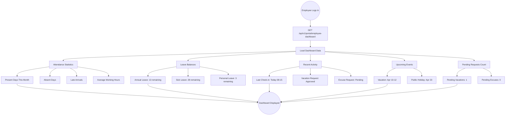
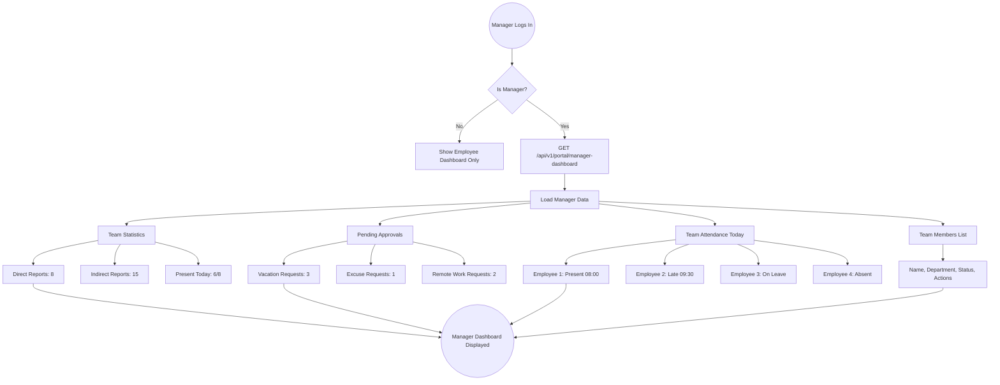
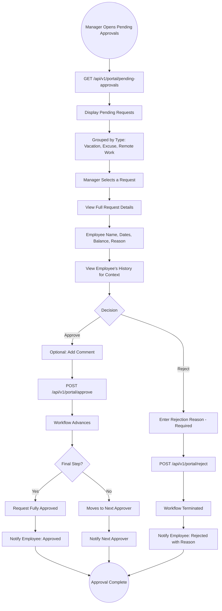
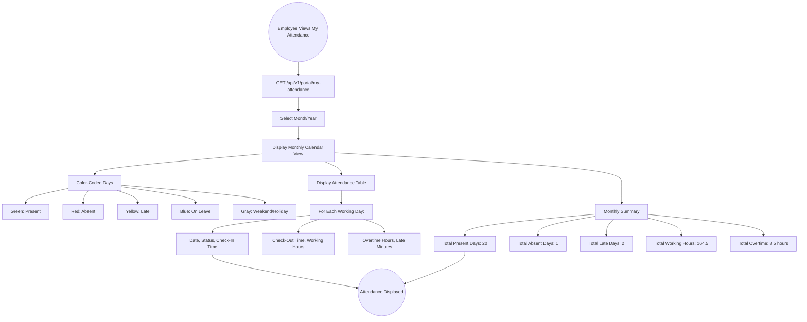
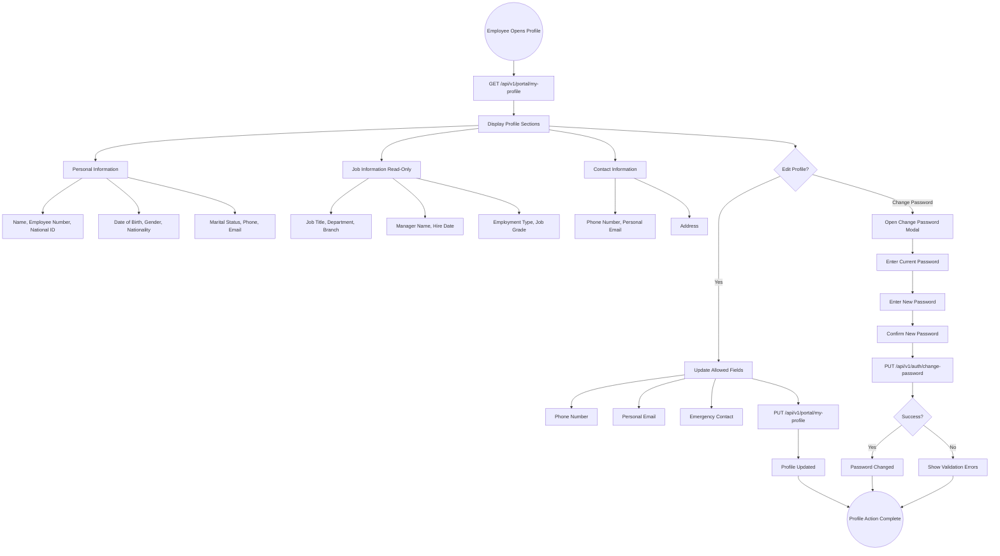
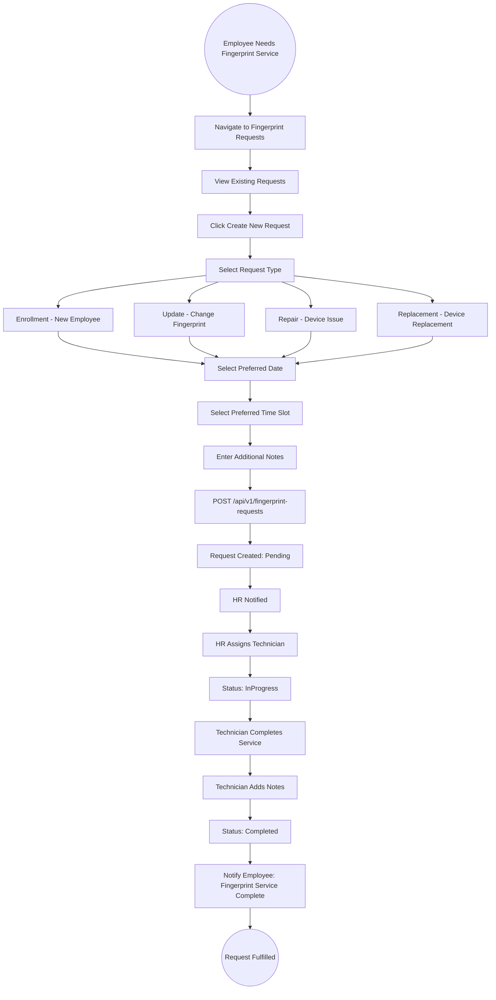
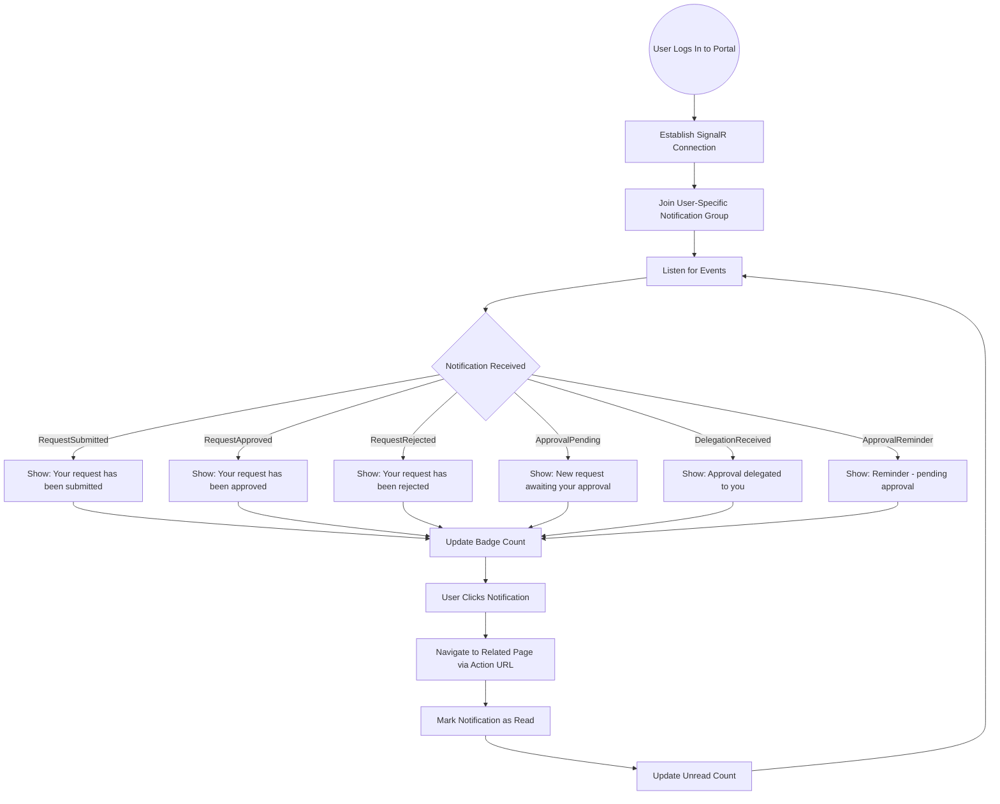

# 11 - Employee Self-Service Portal

## 11.1 Overview

The Employee Self-Service (ESS) Portal is a separate Angular application that enables employees to manage their own HR-related tasks and managers to handle team approvals. It runs independently from the admin portal on a different port/domain.

## 11.2 Portal Features

### For All Employees
| Feature | Description |
|---------|-------------|
| Employee Dashboard | Personal stats, leave balances, recent activity |
| My Attendance | View personal attendance records and history |
| My Profile | View/update personal information |
| Vacation Requests | Create, view, edit, cancel leave requests |
| Excuse Requests | Create and track excuse requests |
| Remote Work Requests | Request and manage remote work days |
| Fingerprint Requests | Request fingerprint enrollment/repair |
| Notifications | Real-time notifications via SignalR |

### For Managers (Additional)
| Feature | Description |
|---------|-------------|
| Manager Dashboard | Team stats, pending approvals count |
| Team Members | View team hierarchy and details |
| Pending Approvals | Approve/reject team member requests |
| Approval History | View past approval decisions |

## 11.3 Employee Dashboard Flow



## 11.4 Manager Dashboard Flow



## 11.5 Employee Vacation Request Flow (Self-Service)

```mermaid
graph TD
    A((Employee Opens Vacation Requests)) --> B[View My Vacation Requests List]
    B --> C[GET /api/v1/employee-vacations/my-requests]
    C --> D[Display Request History with Status]
    
    D --> E{Action}
    
    E -->|Create New| F[Click Create New Request]
    F --> G[Select Vacation Type]
    G --> H[View Current Balance for Type]
    H --> I[Select Start Date]
    I --> J[Select End Date]
    J --> K[System Shows: Total Days = X business days]
    K --> L[Enter Reason]
    L --> M[POST /api/v1/employee-vacations]
    M --> N[Request Created: Pending]
    N --> O[Notification Sent to Manager]
    
    E -->|View| P[Click on Existing Request]
    P --> Q[View Details: Dates, Status, Approval History]
    Q --> R[See Workflow Steps and Current Step]
    
    E -->|Edit| S{Status = Pending?}
    S -->|Yes| T[Modify Dates/Reason]
    T --> U[PUT /api/v1/employee-vacations/{id}]
    S -->|No| V[Cannot Edit: Already Processed]
    
    E -->|Cancel| W{Can Cancel?}
    W -->|Pending| X[DELETE /api/v1/employee-vacations/{id}]
    X --> Y[Status: Cancelled, Balance Restored]
    W -->|Approved Future| Z[Submit Cancellation Request]
    W -->|Past| AA[Cannot Cancel]
    
    O --> AB((Action Complete))
    R --> AB
    U --> AB
    Y --> AB
```

## 11.6 Manager Approval Flow (Self-Service)



## 11.7 My Attendance View Flow



## 11.8 My Profile Flow



## 11.9 Fingerprint Request Flow



## 11.10 Real-Time Notification Flow in Portal



## 11.11 Portal Navigation Structure

```
Self-Service Portal Layout:
===========================

Sidebar Navigation:
+-----------------------------------+
| Employee Name & Photo             |
| Role: Employee / Manager          |
+-----------------------------------+
| Dashboard                         |
| My Attendance                     |
| My Profile                        |
+-----------------------------------+
| Requests                          |
|   - Vacation Requests             |
|   - Excuse Requests               |
|   - Remote Work Requests          |
|   - Fingerprint Requests          |
+-----------------------------------+
| (Manager Only)                    |
|   Manager Dashboard               |
|   Team Members                    |
|   Pending Approvals               |
+-----------------------------------+
| Notifications (with badge count)  |
+-----------------------------------+
| Logout                            |
+-----------------------------------+
```
