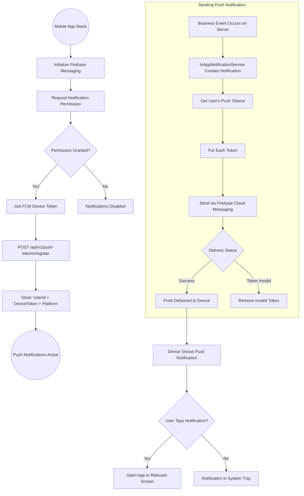
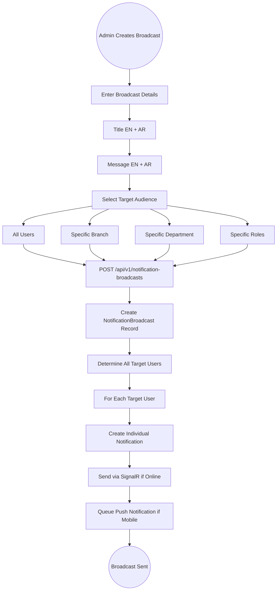

# 12 - Notifications & Real-Time Communication

## 12.1 Overview

The notification system provides multi-channel communication including real-time in-app notifications via SignalR WebSocket, push notifications via Firebase Cloud Messaging for mobile devices, and admin broadcast notifications. All notifications are bilingual (English/Arabic).

## 12.2 Features

| Feature | Description |
|---------|-------------|
| Real-Time Delivery | SignalR WebSocket for instant notifications |
| Push Notifications | Firebase Cloud Messaging for mobile |
| Bilingual Content | Title and message in English and Arabic |
| Read Tracking | Mark individual or all notifications as read |
| Action URLs | Click to navigate directly to related entity |
| User Targeting | Send to specific users or user groups |
| Broadcast System | Admin-wide announcements |
| Notification Types | 8+ event types for different scenarios |
| Unread Count Badge | Real-time unread count in navigation |

## 12.3 Entities

| Entity | Key Fields |
|--------|------------|
| Notification | UserId, Title, TitleAr, Message, MessageAr, Type, ActionUrl, IsRead, CreatedAt |
| NotificationBroadcast | Title, TitleAr, Message, MessageAr, TargetBranch, TargetDepartment, CreatedBy |
| PushNotificationToken | UserId, DeviceToken, Platform, DeviceId |

## 12.4 Notification Types

| Type | Trigger | Recipients |
|------|---------|------------|
| RequestSubmitted | New request created | Submitting employee |
| RequestApproved | Request approved | Submitting employee |
| RequestRejected | Request rejected | Submitting employee |
| RequestDelegated | Approval delegated | New delegatee |
| RequestEscalated | Timeout escalation | Escalation target |
| ApprovalPending | New request needs approval | Assigned approver |
| DelegationReceived | Delegation assigned to user | Delegatee |
| ApprovalReminder | Pending approval reminder | Assigned approver |

## 12.5 SignalR Real-Time Notification Flow

```mermaid
graph TD
    A((Client Application Loads)) --> B[Establish SignalR Connection]
    B --> C[Connect to /hubs/notifications]
    C --> D[Send JWT Token for Authentication]
    
    D --> E{Authentication Valid?}
    E -->|No| F[Connection Rejected]
    E -->|Yes| G[Connection Established]
    
    G --> H[Server: OnConnectedAsync]
    H --> I[Add User to Personal Group: user-{userId}]
    I --> J[Add User to Role Groups]
    J --> K[Connection Ready]
    
    K --> L((Listening for Events))
    
    subgraph "Server-Side Event"
        M[Business Event Occurs]
        M --> N[InAppNotificationService.SendAsync]
        N --> O[Create Notification Record in DB]
        O --> P[Determine Target Users]
        P --> Q[Hub.Clients.Group user-{id}.SendAsync]
    end
    
    Q --> R[Client Receives Event]
    R --> S[Display Toast Notification]
    S --> T[Update Notification Bell Badge]
    T --> U[Play Sound if Enabled]
    
    U --> L
    
    subgraph "Client Disconnection"
        V[User Navigates Away / Tab Closes]
        V --> W[Server: OnDisconnectedAsync]
        W --> X[Remove from All Groups]
    end
```

## 12.6 Push Notification Flow (Mobile)



## 12.7 Admin Broadcast Notification Flow



## 12.8 Notification Management Flow

```mermaid
graph TD
    A((User Opens Notification Panel)) --> B[GET /api/v1/notifications?unreadOnly=false]
    B --> C[Display Notification List]
    C --> D[Show Unread Count Badge]
    
    D --> E{User Action}
    
    E -->|Click Notification| F[Navigate to ActionUrl]
    F --> G[POST /api/v1/notifications/{id}/mark-read]
    G --> H[Update IsRead = true]
    H --> I[Decrement Unread Count]
    
    E -->|Mark All Read| J[POST /api/v1/notifications/mark-all-read]
    J --> K[Update All IsRead = true]
    K --> L[Reset Unread Count to 0]
    
    E -->|Delete Notification| M[DELETE /api/v1/notifications/{id}]
    M --> N[Remove from List]
    
    E -->|Filter| O[Toggle: All / Unread Only]
    O --> P[Re-fetch with Filter]
    
    I --> Q((Action Complete))
    L --> Q
    N --> Q
    P --> Q
```

## 12.9 Notification Template Examples

```
Vacation Request Submitted:
--------------------------
EN: "Your vacation request for Apr 10-12 has been submitted for approval"
AR: "تم تقديم طلب إجازتك للفترة من 10-12 أبريل للموافقة"
Action: /vacation-requests/{id}

Vacation Approved:
-----------------
EN: "Your vacation request for Apr 10-12 has been approved by Ahmed Al-Rashid"
AR: "تمت الموافقة على طلب إجازتك للفترة من 10-12 أبريل بواسطة أحمد الراشد"
Action: /vacation-requests/{id}

Approval Pending:
----------------
EN: "New vacation request from Sara Fahad requires your approval"
AR: "طلب إجازة جديد من سارة فهد يتطلب موافقتك"
Action: /pending-approvals/{id}

Approval Reminder:
-----------------
EN: "Reminder: You have 3 pending approvals waiting for your action"
AR: "تذكير: لديك 3 طلبات معلقة في انتظار إجراءك"
Action: /pending-approvals
```
