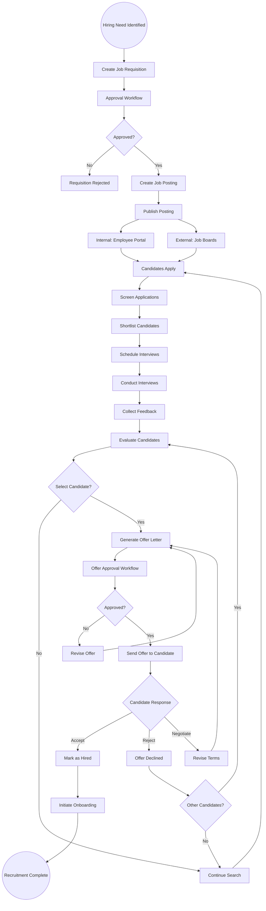
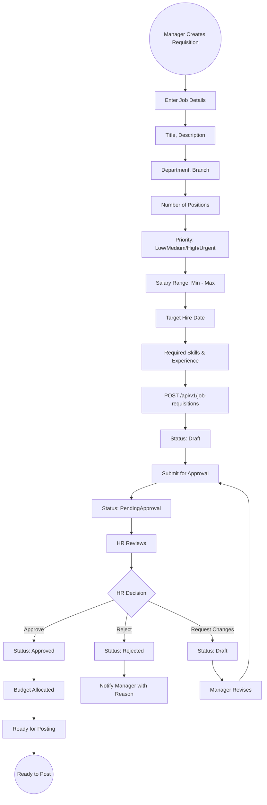
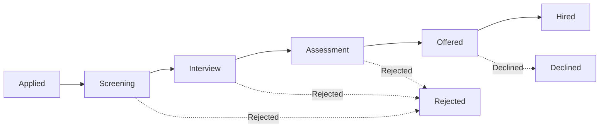
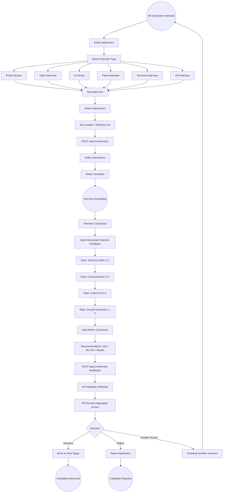
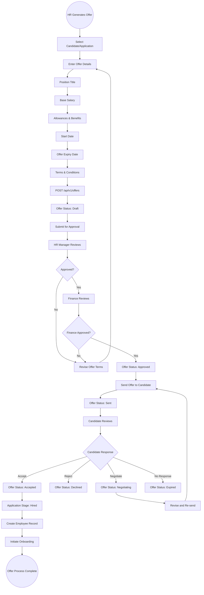

# 13 - Recruitment & Hiring

## 13.1 Overview

The recruitment module manages the end-to-end hiring process from job requisition to offer letter acceptance. It tracks candidates through a structured pipeline, manages interviews with multi-rater feedback, and generates offer letters with approval workflows.

## 13.2 Features

| Feature | Description |
|---------|-------------|
| Job Requisitions | Create and approve hiring requests with budget and priority |
| Job Postings | Publish positions internally/externally |
| Candidate Management | Track candidate profiles, resumes, and skills |
| Application Pipeline | Move candidates through stages (Applied to Hired) |
| Interview Scheduling | Phone, video, in-person, panel, technical, HR interviews |
| Interview Feedback | Structured feedback with technical/communication/culture ratings |
| Offer Letters | Generate, approve, send, and track offers |
| Recruitment Dashboard | Pipeline analytics and time-to-hire metrics |

## 13.3 Entities

| Entity | Key Fields |
|--------|------------|
| JobRequisition | Title, DepartmentId, BranchId, Priority, BudgetMin, BudgetMax, TargetDate, Status, ApprovedBy |
| JobPosting | RequisitionId, Description, Requirements, Benefits, PostingType (Internal/External), Status |
| Candidate | FirstName, LastName, Email, Phone, ResumeUrl, Skills, Experience, SalaryExpectation |
| JobApplication | CandidateId, PostingId, Stage, Status, AppliedDate |
| InterviewSchedule | ApplicationId, InterviewType, ScheduledDate, Location, InterviewerIds |
| InterviewFeedback | InterviewId, InterviewerId, TechnicalRating, CommunicationRating, CultureFitRating, OverallRating, Comments |
| OfferLetter | ApplicationId, Salary, Benefits, StartDate, ExpiryDate, Status |

## 13.4 End-to-End Recruitment Flow



## 13.5 Job Requisition Flow



## 13.6 Application Pipeline Stages



```
Stage Descriptions:
==================
1. Applied     - Candidate submitted application
2. Screening   - Resume review and initial qualification check
3. Interview   - One or more interview rounds scheduled
4. Assessment  - Technical tests, assignments, or evaluations
5. Offered     - Offer letter generated and sent
6. Hired       - Offer accepted, candidate to become employee
7. Rejected    - Candidate did not pass a stage
8. Declined    - Candidate declined the offer
```

## 13.7 Interview Scheduling & Feedback Flow



## 13.8 Offer Letter Flow



## 13.9 Recruitment Dashboard Metrics

```
Recruitment Analytics:
=====================
+------------------------------------------+
| Open Requisitions: 12                     |
| Active Postings: 8                        |
| Total Applications: 156                   |
| Interviews This Week: 14                  |
| Offers Pending: 3                         |
| Hires This Month: 5                       |
+------------------------------------------+
| Pipeline Breakdown:                       |
| - Applied: 45                             |
| - Screening: 32                           |
| - Interview: 18                           |
| - Assessment: 8                           |
| - Offered: 5                              |
+------------------------------------------+
| Average Time-to-Hire: 28 days             |
| Offer Acceptance Rate: 78%               |
| Source Effectiveness:                     |
|   - Internal Referral: 35%               |
|   - Job Board: 40%                        |
|   - LinkedIn: 25%                         |
+------------------------------------------+
```
