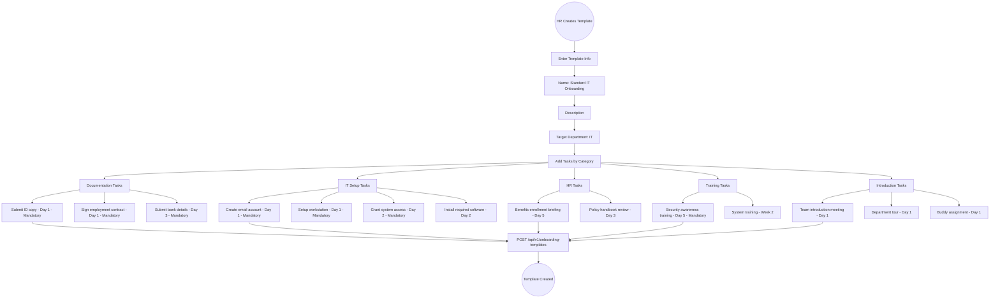
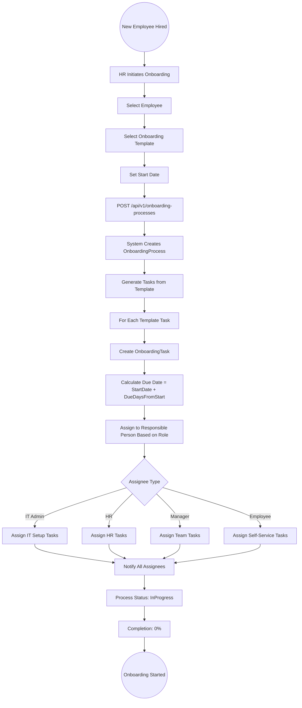
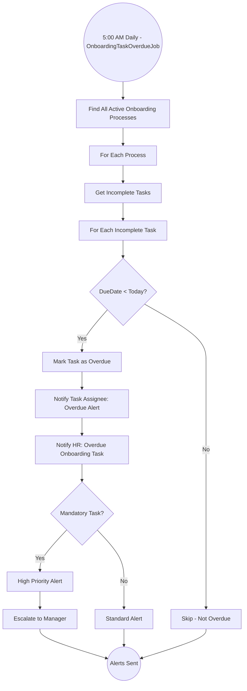

# 14 - Onboarding

## 14.1 Overview

The onboarding module streamlines the process of integrating new hires into the organization. It provides reusable templates with categorized tasks, tracks onboarding process completion, manages required documents, and provides a dashboard for HR to monitor progress.

## 14.2 Features

| Feature | Description |
|---------|-------------|
| Onboarding Templates | Reusable task templates with categories |
| Task Categories | Documentation, IT Setup, HR, Training, Equipment, Access, Introduction |
| Onboarding Processes | Employee-specific instances from templates |
| Task Tracking | Track completion with priorities, due dates, assignees |
| Document Management | Upload and manage onboarding documents |
| Overdue Alerts | Background job for overdue task notifications |
| Dashboard | Active processes, completion rates, overdue tracking |

## 14.3 Entities

| Entity | Key Fields |
|--------|------------|
| OnboardingTemplate | Name, Description, Department, Tasks[] |
| OnboardingTemplateTask | TemplateId, TaskName, Category, Priority, DueDaysFromStart, AssigneeRole, IsMandatory |
| OnboardingProcess | EmployeeId, TemplateId, StartDate, Status, CompletionPercentage |
| OnboardingTask | ProcessId, TaskName, Category, AssignedTo, DueDate, Status, CompletedDate, Notes |
| OnboardingDocument | ProcessId, DocumentName, FilePath, UploadedBy, UploadedAt |

## 14.4 Onboarding Template Creation Flow



## 14.5 Onboarding Process Initiation Flow



## 14.6 Task Completion Flow

```mermaid
graph TD
    A((Assignee Works on Task)) --> B[View Assigned Tasks]
    B --> C[Select Task to Complete]
    
    C --> D{Task Requires Document?}
    D -->|Yes| E[Upload Required Document]
    E --> F[Add Completion Notes]
    D -->|No| F
    
    F --> G[Mark Task as Complete]
    G --> H[PUT /api/v1/onboarding-tasks/{id}]
    H --> I[Status: Completed]
    I --> J[Set CompletedDate]
    
    J --> K[Recalculate Process Completion %]
    K --> L[Completion = CompletedTasks / TotalTasks * 100]
    
    L --> M{All Mandatory Tasks Done?}
    M -->|No| N[Continue Onboarding]
    
    M -->|Yes| O{All Tasks Done?}
    O -->|No| P[Mandatory Complete, Optional Remaining]
    O -->|Yes| Q[Process Status: Completed]
    Q --> R[Notify HR: Onboarding Complete]
    R --> S[Notify Manager: Employee Fully Onboarded]
    
    N --> T((Task Completed))
    P --> T
    S --> T
```

## 14.7 Overdue Task Alert Flow



## 14.8 Onboarding Dashboard

```
Onboarding Dashboard:
====================
+------------------------------------------+
| Active Onboarding Processes: 5            |
| Completed This Month: 3                  |
| Average Completion Time: 12 days         |
+------------------------------------------+
| Overdue Tasks: 4                          |
|   - IT Setup (2 tasks)                    |
|   - Documentation (1 task)                |
|   - Training (1 task)                     |
+------------------------------------------+
| Task Distribution by Category:            |
|   Documentation: 25%                      |
|   IT Setup: 20%                           |
|   HR: 15%                                 |
|   Training: 15%                           |
|   Equipment: 10%                          |
|   Access: 10%                             |
|   Introduction: 5%                        |
+------------------------------------------+
| Process Status:                           |
|   - Ahmed (IT): 80% complete             |
|   - Sara (Finance): 60% complete          |
|   - Omar (HR): 40% complete              |
|   - Fatima (Ops): 20% complete            |
|   - Khalid (IT): 10% complete            |
+------------------------------------------+
```
