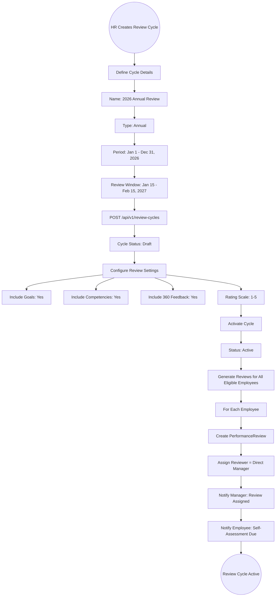
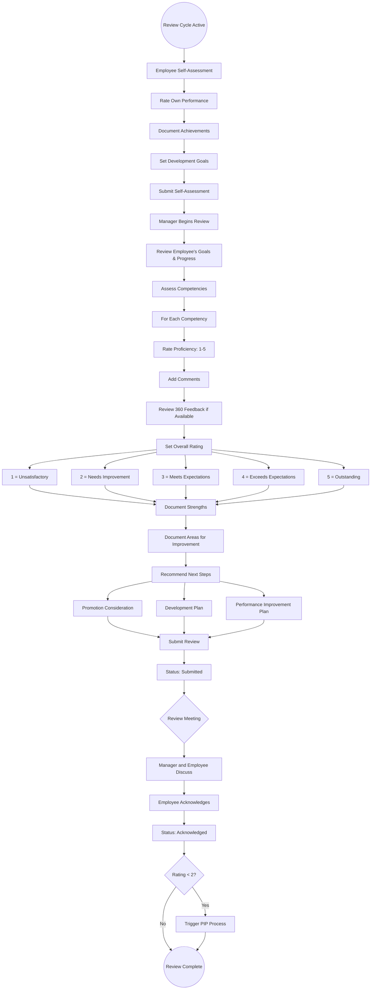
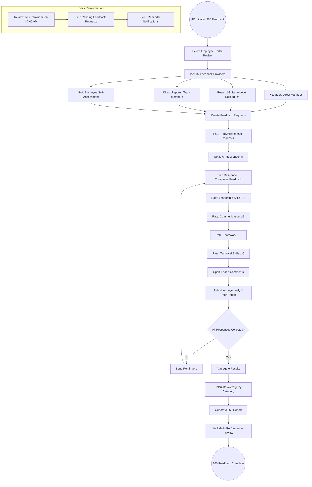
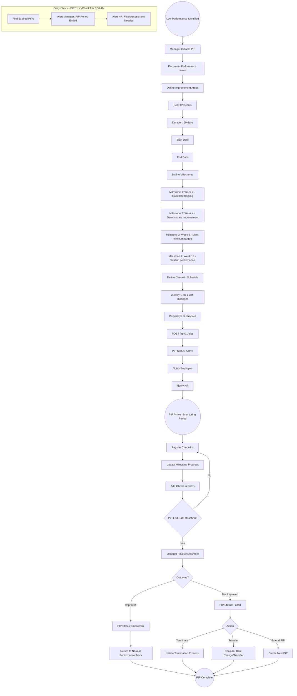

# 15 - Performance Management

## 15.1 Overview

The performance management module provides a comprehensive framework for evaluating employee performance through structured review cycles, goal setting and tracking, competency assessments, 360-degree feedback, and performance improvement plans (PIPs).

## 15.2 Features

| Feature | Description |
|---------|-------------|
| Review Cycles | Annual, Semi-Annual, Quarterly, Monthly, Probation, Project-Based, 360-Degree |
| Performance Reviews | Structured reviews with ratings, strengths, and areas for improvement |
| Goal Management | SMART goal setting with progress tracking and weight-based scoring |
| Competency Framework | Define competencies with proficiency levels |
| PIPs | Formal improvement plans with milestones and check-ins |
| 360-Degree Feedback | Multi-rater feedback from managers, peers, reports, and self |
| Performance Dashboard | Rating distributions, goal completion, cycle progress |

## 15.3 Entities

| Entity | Key Fields |
|--------|------------|
| PerformanceReviewCycle | Name, CycleType, StartDate, EndDate, Status |
| PerformanceReview | CycleId, EmployeeId, ReviewerId, OverallRating, Strengths, AreasForImprovement, Status |
| GoalDefinition | EmployeeId, CycleId, Title, Description, TargetValue, CurrentValue, Weight, Status, DueDate |
| CompetencyFramework | Name, Description, Competencies[] |
| Competency | FrameworkId, Name, Description, ProficiencyLevels[] |
| CompetencyAssessment | ReviewId, CompetencyId, Rating, Comments |
| PerformanceImprovementPlan | EmployeeId, Reason, StartDate, EndDate, Milestones[], Status |
| FeedbackRequest360 | ReviewId, RequesterId, RespondentId, Relationship, Status |
| Feedback360Response | RequestId, Ratings[], Comments, SubmittedAt |

## 15.4 Performance Review Cycle Flow



## 15.5 Individual Performance Review Flow



## 15.6 Goal Setting and Tracking Flow

```mermaid
graph TD
    A((Manager/Employee Sets Goals)) --> B[Create Goal]
    B --> C[Enter Goal Details]
    C --> C1[Title: Improve Customer Response Time]
    C1 --> C2[Description: SMART goal description]
    C2 --> C3[Target Value: Reduce from 4hrs to 2hrs]
    C3 --> C4[Weight: 25% of total score]
    C4 --> C5[Due Date: Dec 31, 2026]
    
    C5 --> D[POST /api/v1/goals]
    D --> E[Goal Status: InProgress]
    
    E --> F((Goal Tracking Period))
    
    F --> G[Employee Updates Progress]
    G --> H[Update Current Value: 3.2 hrs]
    H --> I[Add Progress Notes]
    I --> J[System Calculates % Complete]
    J --> K[Progress: 40% (4.0 -> 3.2 vs target 2.0)]
    
    K --> L{Goal Due Date Reached?}
    L -->|No| F
    
    L -->|Yes| M[Manager Reviews Final Progress]
    M --> N{Goal Achieved?}
    
    N -->|Fully Met| O[Status: Achieved, Score = Weight * 100%]
    N -->|Partially Met| P[Status: PartiallyAchieved, Score = Weight * %]
    N -->|Not Met| Q[Status: NotAchieved, Score = 0]
    
    O --> R[Factor into Overall Rating]
    P --> R
    Q --> R
    
    R --> S((Goal Evaluation Complete))
```

## 15.7 360-Degree Feedback Flow



## 15.8 Performance Improvement Plan (PIP) Flow



## 15.9 Performance Rating Scale

| Rating | Label | Description |
|--------|-------|-------------|
| 5 | Outstanding | Consistently exceeds all expectations |
| 4 | Exceeds Expectations | Regularly exceeds most expectations |
| 3 | Meets Expectations | Fully meets all job requirements |
| 2 | Needs Improvement | Partially meets expectations, development needed |
| 1 | Unsatisfactory | Does not meet minimum expectations, PIP required |
