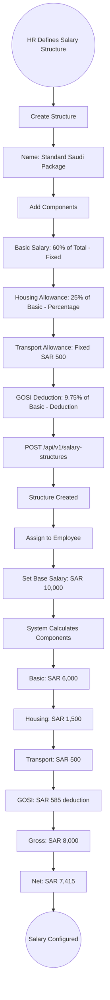
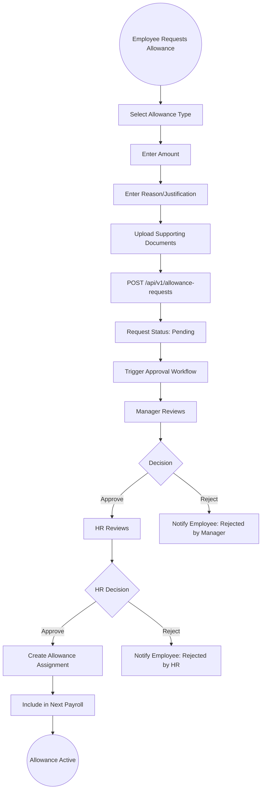
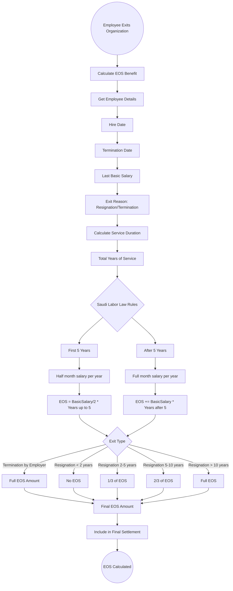
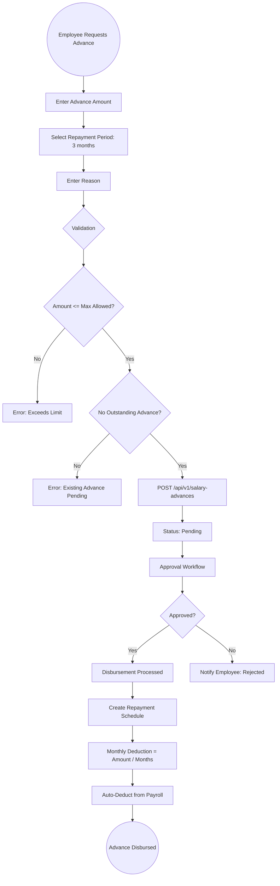

# 16 - Payroll & Compensation

## 16.1 Overview

The payroll and compensation module manages salary structures, payroll processing, allowances, deductions, tax calculations, social insurance, and end-of-service benefit calculations. It is designed for Saudi labor law compliance.

## 16.2 Features

| Feature | Description |
|---------|-------------|
| Salary Structures | Define salary components (Basic, HRA, Transport, etc.) |
| Payroll Periods | Monthly payroll processing with record generation |
| Allowance Management | Types, policies, assignments, and requests |
| Tax Configuration | Tax brackets and calculation rules |
| Social Insurance | GOSI/social insurance configuration |
| Bank Transfers | Generate bank transfer files |
| End-of-Service | Saudi labor law compliant EOS calculation |
| Payroll Adjustments | Ad-hoc additions and deductions |
| Salary Advances | Employee salary advance requests |

## 16.3 Entities

| Entity | Key Fields |
|--------|------------|
| SalaryStructure | Name, Components[], IsActive |
| SalaryComponent | Name, Type (Basic/Allowance/Deduction), CalculationType (Fixed/Percentage), Amount/Percentage |
| EmployeeSalary | EmployeeId, SalaryStructureId, BaseSalary, EffectiveDate |
| EmployeeSalaryComponent | EmployeeSalaryId, ComponentId, Amount |
| PayrollPeriod | Month, Year, StartDate, EndDate, Status, ProcessedBy |
| PayrollRecord | PeriodId, EmployeeId, GrossSalary, Deductions, NetSalary, Status |
| PayrollRecordDetail | RecordId, ComponentId, Amount, Type |
| PayrollAdjustment | RecordId, Type, Amount, Reason |
| AllowanceType | Name, CalculationType, IsTaxable |
| AllowancePolicy | AllowanceTypeId, EligibilityRules, Amount |
| AllowanceAssignment | PolicyId, EmployeeId, EffectiveFrom, EffectiveTo, Amount |
| AllowanceRequest | EmployeeId, AllowanceTypeId, Amount, Reason, Status |
| TaxConfiguration | Name, Brackets[], EffectiveDate |
| SocialInsuranceConfig | EmployeeRate, EmployerRate, MaxSalary |
| SalaryAdvance | EmployeeId, Amount, RepaymentMonths, Status |

## 16.4 Salary Structure Setup Flow



## 16.5 Monthly Payroll Processing Flow

```mermaid
graph TD
    A((HR Opens Payroll Period)) --> B[Create Payroll Period]
    B --> B1[Select Month: March 2026]
    B1 --> B2[Period: Mar 1-31, 2026]
    
    B2 --> C[POST /api/v1/payroll-periods]
    C --> D[Period Status: Draft]
    
    D --> E[Generate Payroll Records]
    E --> F[For Each Active Employee]
    
    F --> G[Get Employee Salary Structure]
    G --> H[Calculate Base Components]
    H --> I[Basic + Allowances = Gross]
    
    I --> J[Add Variable Components]
    J --> J1[Overtime Pay from Attendance]
    J1 --> J2[Active Allowance Assignments]
    J2 --> J3[Approved Allowance Requests]
    
    J3 --> K[Apply Deductions]
    K --> K1[GOSI Employee Share]
    K1 --> K2[Tax if Applicable]
    K2 --> K3[Loan Repayments]
    K3 --> K4[Salary Advance Deductions]
    K4 --> K5[Absence Deductions]
    
    K5 --> L[Apply Adjustments]
    L --> L1[Ad-hoc Bonuses]
    L1 --> L2[Penalty Deductions]
    L2 --> L3[Expense Reimbursements]
    
    L3 --> M[Net Salary = Gross - Total Deductions + Adjustments]
    M --> N[Create PayrollRecord]
    N --> O[Create PayrollRecordDetails for Each Line Item]
    
    O --> P[Period Status: Generated]
    P --> Q[HR Reviews All Records]
    
    Q --> R{All Correct?}
    R -->|No| S[Make Adjustments]
    S --> T[Recalculate Affected Records]
    T --> Q
    
    R -->|Yes| U[Finalize Payroll]
    U --> V[Period Status: Finalized]
    V --> W[Generate Bank Transfer File]
    W --> X[Lock Records - No Further Changes]
    
    X --> Y((Payroll Complete))
```



## 16.6 Payroll Calculation Breakdown

```
Monthly Payroll Calculation for Employee:
========================================

EARNINGS:
  Basic Salary:                 SAR  6,000.00
  Housing Allowance (25%):      SAR  1,500.00
  Transport Allowance:          SAR    500.00
  Overtime (12.5 hrs @ 1.5x):  SAR    562.50
  Phone Allowance:              SAR    200.00
  -------------------------------------------
  GROSS SALARY:                 SAR  8,762.50

DEDUCTIONS:
  GOSI (9.75% of Basic):       SAR    585.00
  Loan Repayment:              SAR    500.00
  Salary Advance Deduction:     SAR    300.00
  Late Deduction (3 days):      SAR    200.00
  -------------------------------------------
  TOTAL DEDUCTIONS:             SAR  1,585.00

ADJUSTMENTS:
  Performance Bonus:            SAR    500.00
  Expense Reimbursement:        SAR    150.00
  -------------------------------------------
  TOTAL ADJUSTMENTS:            SAR    650.00

  =============================================
  NET SALARY:                   SAR  7,827.50
  =============================================
```

## 16.7 Allowance Request Flow



## 16.8 End-of-Service Benefit Calculation Flow



## 16.9 EOS Calculation Example

```
Employee: Ahmed Al-Rashid
Hire Date: January 15, 2018
Exit Date: April 6, 2026
Service Duration: 8 years, 2 months, 22 days
Last Basic Salary: SAR 8,000/month
Exit Reason: Resignation

Calculation:
  First 5 years: SAR 8,000 / 2 * 5 = SAR 20,000
  Next 3.19 years: SAR 8,000 * 3.19 = SAR 25,520
  Total EOS (Full): SAR 45,520

  Resignation factor (5-10 years): 2/3
  Final EOS: SAR 45,520 * 2/3 = SAR 30,347
```

## 16.10 Salary Advance Flow


