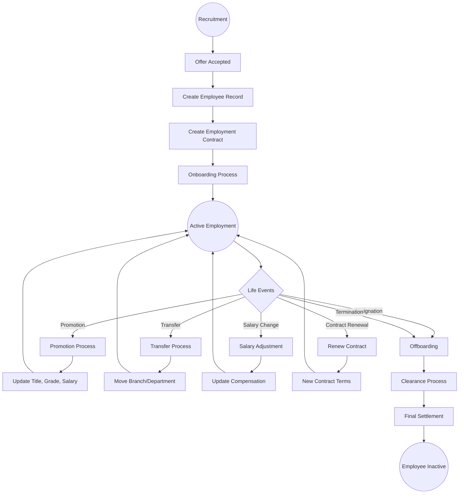
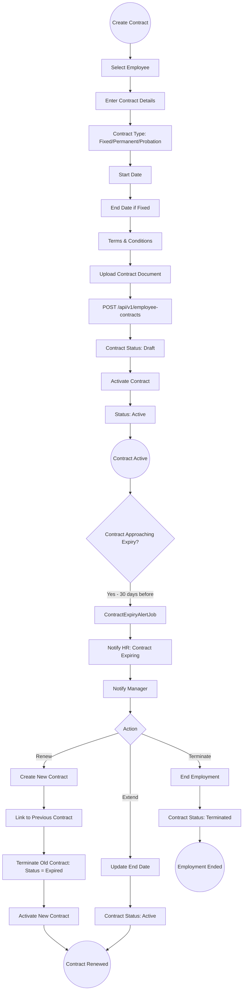
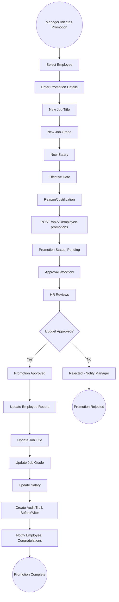
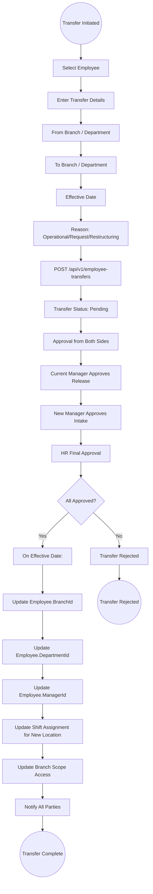
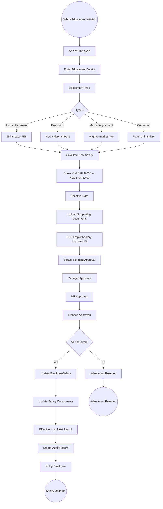

# 17 - Employee Lifecycle Management

## 17.1 Overview

The employee lifecycle module manages all stages of an employee's journey within the organization, from contract creation through promotions, transfers, salary adjustments, and job grade management. It provides full audit trails for all employment changes.

## 17.2 Features

| Feature | Description |
|---------|-------------|
| Employment Contracts | Contract creation, activation, renewal, termination |
| Promotions | Track promotions with salary and title changes |
| Transfers | Inter-branch and inter-department transfers |
| Salary Adjustments | Annual increments, market adjustments, corrections |
| Job Grades | Grade structure with salary ranges |
| Contract Alerts | Background job for expiring contracts |
| Visa Management | Track employee visa expiry with alerts |

## 17.3 Entities

| Entity | Key Fields |
|--------|------------|
| EmployeeContract | EmployeeId, ContractType, StartDate, EndDate, Status, Document |
| EmployeePromotion | EmployeeId, OldTitle, NewTitle, OldGrade, NewGrade, OldSalary, NewSalary, EffectiveDate |
| EmployeeTransfer | EmployeeId, FromBranch, ToBranch, FromDepartment, ToDepartment, EffectiveDate, Reason |
| SalaryAdjustment | EmployeeId, AdjustmentType, OldSalary, NewSalary, Reason, EffectiveDate, Status |
| JobGrade | Name, Level, MinSalary, MaxSalary, Description |
| EmployeeVisa | EmployeeId, VisaType, VisaNumber, ExpiryDate, Status |

## 17.4 Complete Employee Lifecycle Flow



## 17.5 Contract Management Flow



## 17.6 Promotion Flow



## 17.7 Transfer Flow



## 17.8 Salary Adjustment Flow



## 17.9 Job Grade Structure

```
Job Grade Hierarchy:
===================
Grade  | Level | Title Example          | Salary Range (SAR)
-------|-------|------------------------|--------------------
G1     | 1     | Junior Associate       | 4,000 - 6,000
G2     | 2     | Associate              | 5,500 - 8,000
G3     | 3     | Senior Associate       | 7,000 - 10,000
G4     | 4     | Specialist             | 9,000 - 13,000
G5     | 5     | Senior Specialist      | 11,000 - 16,000
G6     | 6     | Manager                | 14,000 - 20,000
G7     | 7     | Senior Manager         | 18,000 - 25,000
G8     | 8     | Director               | 22,000 - 32,000
G9     | 9     | Vice President         | 28,000 - 40,000
G10    | 10    | C-Level Executive      | 35,000 - 50,000+
```
