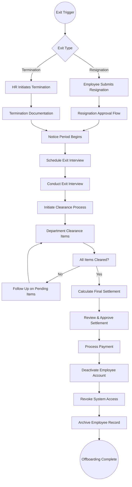
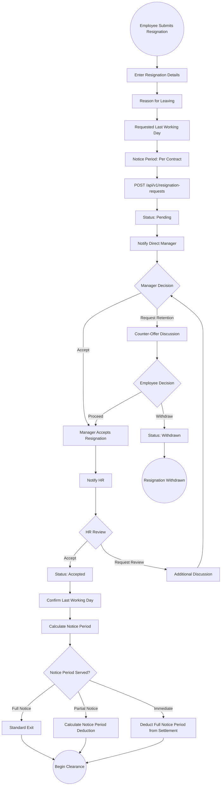
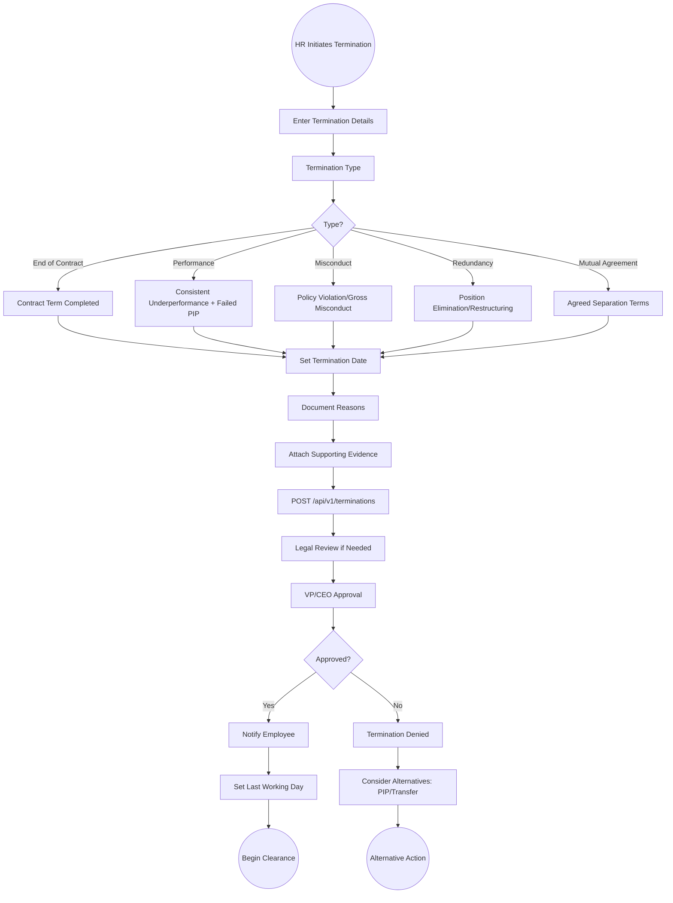
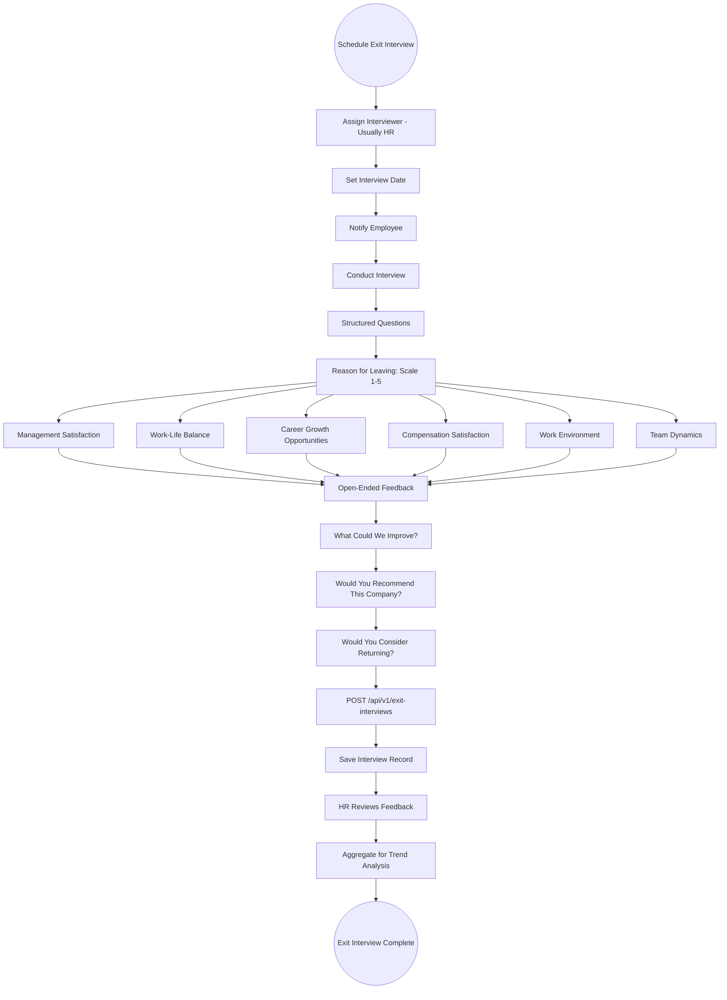
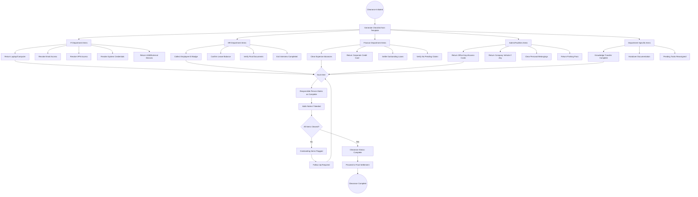

# 18 - Offboarding

## 18.1 Overview

The offboarding module manages the complete employee exit process, including resignation requests, termination records, exit interviews, clearance checklists, and final settlement calculations. It ensures a structured and compliant separation process.

## 18.2 Features

| Feature | Description |
|---------|-------------|
| Resignation Requests | Employee-initiated resignation with notice period |
| Termination Records | Employer-initiated termination with reason classification |
| Exit Interviews | Structured feedback collection from departing employees |
| Clearance Checklists | Department-specific clearance items |
| Final Settlements | Comprehensive final payment calculation |
| End-of-Service Benefits | Saudi labor law compliant EOS calculation |

## 18.3 Entities

| Entity | Key Fields |
|--------|------------|
| ResignationRequest | EmployeeId, SubmissionDate, RequestedLastDay, NoticePeriod, Reason, Status |
| TerminationRecord | EmployeeId, TerminationType, TerminationDate, Reason, Documentation |
| ExitInterview | EmployeeId, InterviewDate, InterviewerName, Feedback, Ratings |
| ClearanceChecklist | EmployeeId, Items[], OverallStatus |
| ClearanceItem | ChecklistId, Department, ItemName, Status, CompletedBy, CompletedDate |
| FinalSettlement | EmployeeId, PendingSalary, LeaveEncashment, EOSBenefit, Deductions, TotalAmount, Status |

## 18.4 Complete Offboarding Flow



## 18.5 Resignation Request Flow



## 18.6 Termination Flow



## 18.7 Exit Interview Flow



## 18.8 Clearance Checklist Flow



## 18.9 Final Settlement Calculation Flow

```mermaid
graph TD
    A((Calculate Final Settlement)) --> B[Get Employee Details]
    
    B --> C[Pending Salary]
    C --> C1[Unpaid Salary: Days Worked in Last Month]
    C1 --> C2[Proportional = Monthly Salary / 30 * Days]
    
    B --> D[Leave Encashment]
    D --> D1[Get Unused Annual Leave Days]
    D1 --> D2[Value = Days * Daily Salary]
    
    B --> E[End-of-Service Benefit]
    E --> E1[Calculate per Saudi Labor Law]
    E1 --> E2[Apply Resignation/Termination Factor]
    
    B --> F[Overtime Unpaid]
    F --> F1[Any Pending Overtime Payments]
    
    B --> G[Allowances Due]
    G --> G1[Prorated Allowances]
    
    C2 --> H[TOTAL EARNINGS]
    D2 --> H
    E2 --> H
    F1 --> H
    G1 --> H
    
    B --> I[Deductions]
    I --> I1[Outstanding Loan Balance]
    I --> I2[Salary Advance Balance]
    I --> I3[Notice Period Shortfall]
    I --> I4[Company Property Not Returned]
    I --> I5[Any Penalties/Fines]
    
    I1 --> J[TOTAL DEDUCTIONS]
    I2 --> J
    I3 --> J
    I4 --> J
    I5 --> J
    
    H --> K[NET SETTLEMENT = Earnings - Deductions]
    J --> K
    
    K --> L[POST /api/v1/final-settlements]
    L --> M[Status: Pending Approval]
    
    M --> N[HR Reviews]
    N --> O[Finance Approves]
    O --> P[Process Payment]
    P --> Q[Status: Paid]
    
    Q --> R((Settlement Complete))
```



## 18.10 Final Settlement Example

```
Final Settlement for: Ahmed Al-Rashid
Exit Date: April 6, 2026
Exit Type: Resignation (8+ years of service)

EARNINGS:
  Pending Salary (6 days):      SAR  1,600.00
  Annual Leave Encashment (13d): SAR  3,467.00
  End-of-Service Benefit:       SAR 30,347.00
  Unpaid Overtime:               SAR    375.00
  Pro-rated Transport Allowance: SAR    100.00
  ------------------------------------------------
  TOTAL EARNINGS:                SAR 35,889.00

DEDUCTIONS:
  Outstanding Loan Balance:      SAR  2,000.00
  Salary Advance Balance:        SAR    600.00
  ------------------------------------------------
  TOTAL DEDUCTIONS:              SAR  2,600.00

  ================================================
  NET SETTLEMENT:                SAR 33,289.00
  ================================================
```
