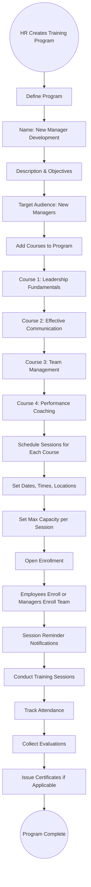
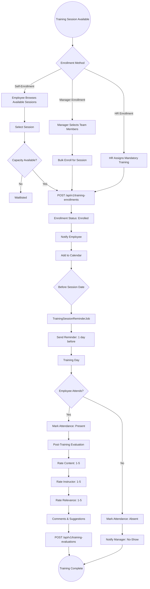
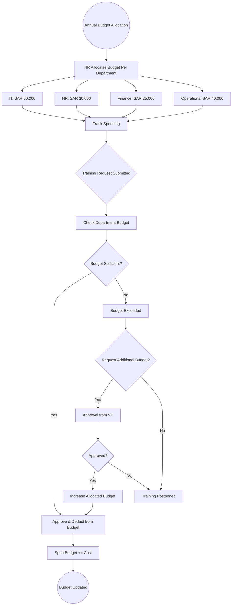
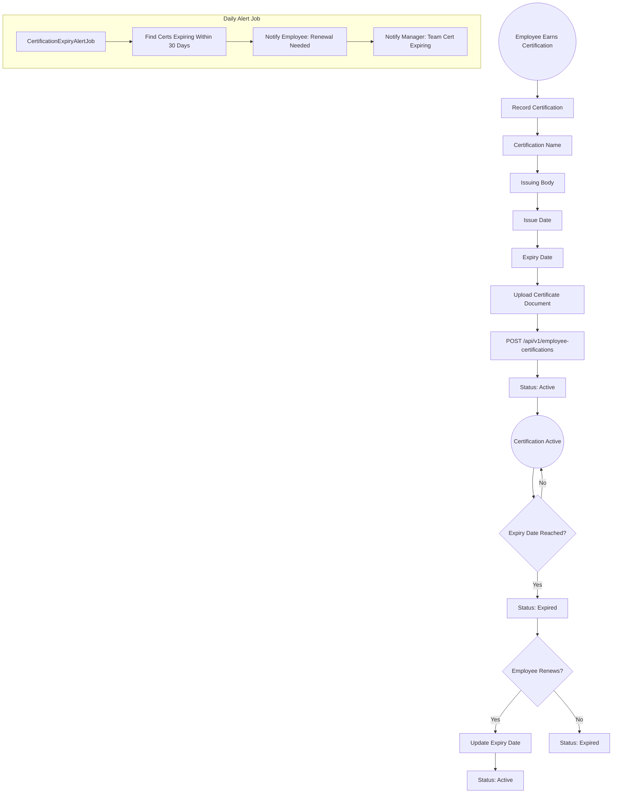

# 19 - Training & Development

## 19.1 Overview

The training and development module manages the organization's learning programs including course creation, program management, session scheduling, employee enrollment, attendance tracking, budget management, certification tracking, and training evaluations.

## 19.2 Features

| Feature | Description |
|---------|-------------|
| Training Categories | Categorize training by type (Technical, Soft Skills, Safety, etc.) |
| Training Courses | Create and manage individual courses |
| Training Programs | Group courses into structured programs |
| Session Scheduling | Schedule training sessions with capacity limits |
| Employee Enrollment | Enroll employees in sessions |
| Attendance Tracking | Track who attended which sessions |
| Budget Management | Allocate and track training budgets |
| Certifications | Track employee certifications with expiry alerts |
| Training Evaluations | Post-training feedback and effectiveness |

## 19.3 Entities

| Entity | Key Fields |
|--------|------------|
| TrainingCategory | Name, Description |
| TrainingCourse | Name, CategoryId, Description, Duration, Provider, Cost |
| TrainingProgram | Name, Description, Courses[], TargetAudience |
| TrainingSession | CourseId, InstructorName, StartDate, EndDate, Location, MaxCapacity, Status |
| TrainingEnrollment | SessionId, EmployeeId, Status, EnrolledBy |
| TrainingAttendance | SessionId, EmployeeId, AttendedDate, Status |
| TrainingBudget | DepartmentId, Year, AllocatedBudget, SpentBudget |
| EmployeeCertification | EmployeeId, CertificationName, IssuedDate, ExpiryDate, Status |
| TrainingEvaluation | SessionId, EmployeeId, ContentRating, InstructorRating, Comments |

## 19.4 Training Program Lifecycle Flow

## 19.5 Training Session Enrollment Flow

## 19.6 Training Budget Flow

## 19.7 Certification Tracking Flow

