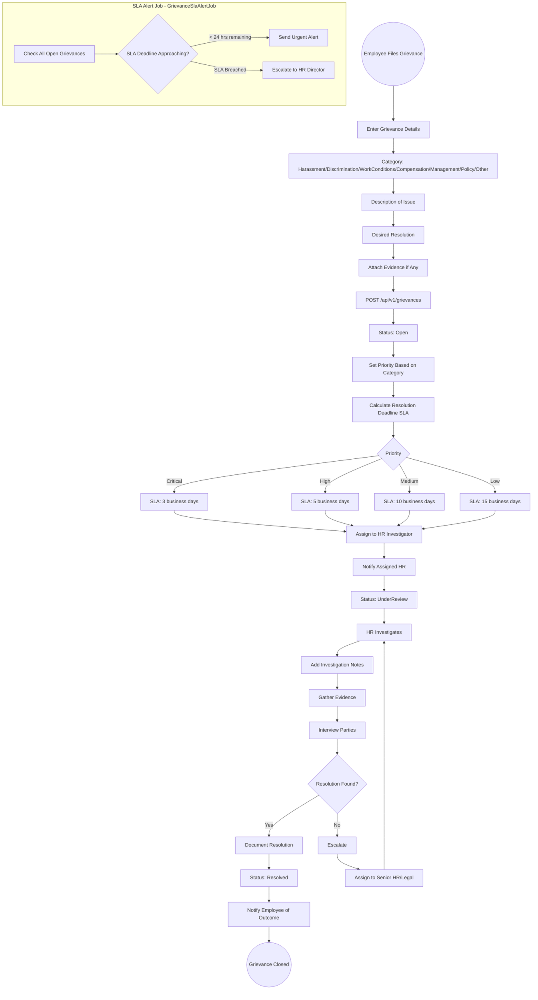
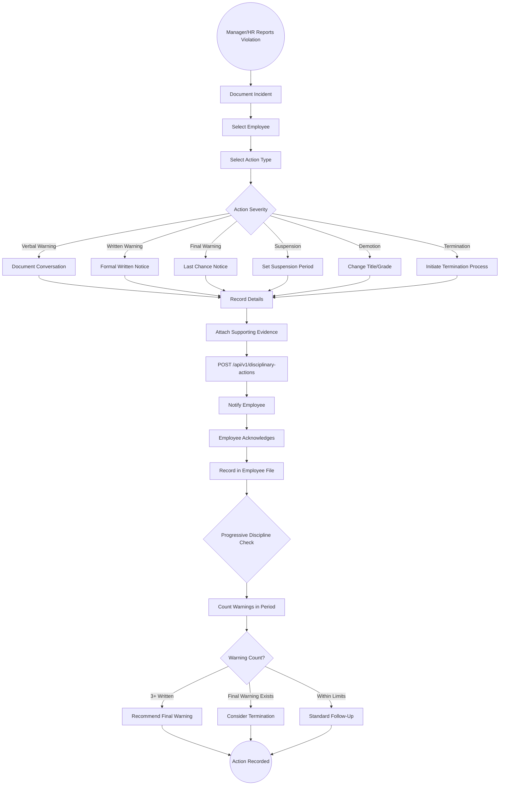
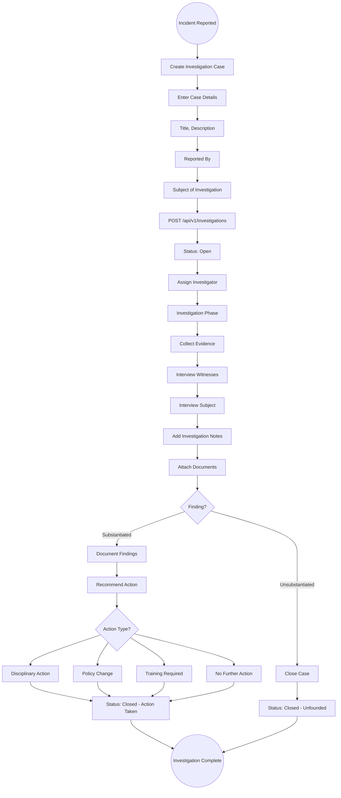
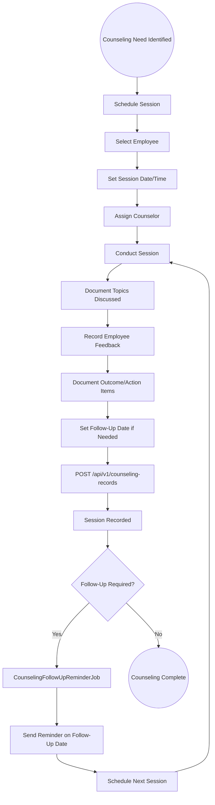

# 20 - Employee Relations

## 20.1 Overview

The employee relations module handles formal employee issues including grievance management, disciplinary actions, investigation cases, and counseling records. It includes SLA tracking for grievances and automated follow-up reminders.

## 20.2 Features

| Feature | Description |
|---------|-------------|
| Grievance Management | File, track, and resolve employee grievances |
| SLA Tracking | Ensure timely grievance resolution |
| Disciplinary Actions | Document and track disciplinary measures |
| Investigations | Manage investigation cases with evidence |
| Counseling Records | Track counseling sessions and outcomes |
| Documentation | Attach evidence and notes to all records |
| Follow-Up Reminders | Automated reminders for pending actions |

## 20.3 Entities

| Entity | Key Fields |
|--------|------------|
| Grievance | EmployeeId, Category, Description, Priority, Status, AssignedTo, ResolutionDeadline |
| GrievanceNote | GrievanceId, Author, Content, CreatedAt |
| GrievanceAttachment | GrievanceId, FileName, FilePath |
| DisciplinaryAction | EmployeeId, ActionType, Reason, Description, IssuedDate, IssuedBy |
| DisciplinaryAttachment | ActionId, FileName, FilePath |
| Investigation | Title, ReportedBy, Subject, Status, AssignedInvestigator |
| InvestigationNote | InvestigationId, Author, Content |
| InvestigationAttachment | InvestigationId, FileName, FilePath |
| CounselingRecord | EmployeeId, CounselorName, SessionDate, Topic, Outcome, FollowUpDate |

## 20.4 Grievance Management Flow

## 20.5 Disciplinary Action Flow

## 20.6 Investigation Flow

## 20.7 Counseling Session Flow

