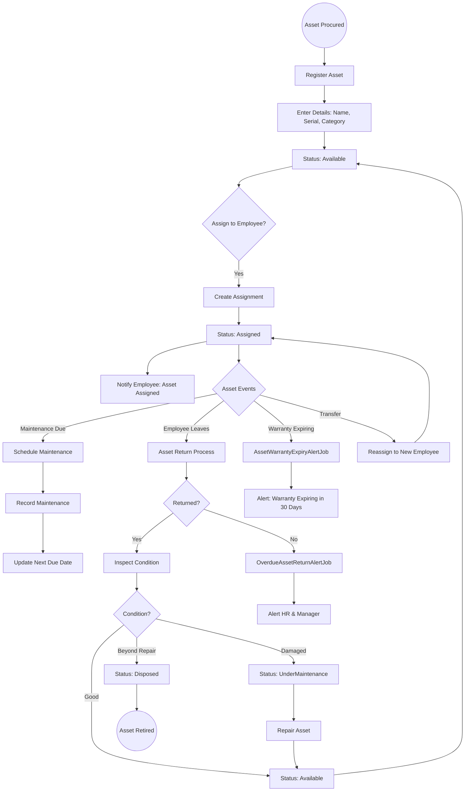
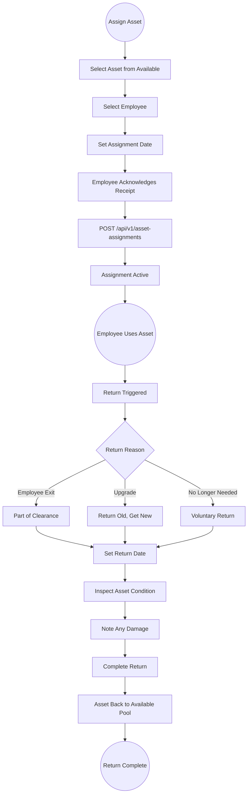

# 21 - Asset Management

## 21.1 Overview

The asset management module tracks company assets (laptops, phones, vehicles, furniture), manages asset assignments to employees, tracks maintenance records, and monitors warranty expirations.

## 21.2 Features

| Feature | Description |
|---------|-------------|
| Asset Inventory | Track all company assets with details |
| Asset Categories | Organize assets by type |
| Asset Assignment | Assign and track assets per employee |
| Maintenance Tracking | Schedule and record maintenance |
| Warranty Tracking | Monitor warranty expiration dates |
| Return Tracking | Track overdue asset returns |
| Lifecycle Management | Track asset from procurement to disposal |

## 21.3 Entities

| Entity | Key Fields |
|--------|------------|
| AssetCategory | Name, Description |
| Asset | Name, CategoryId, SerialNumber, PurchaseDate, PurchasePrice, WarrantyExpiry, Status, Condition |
| AssetAssignment | AssetId, EmployeeId, AssignedDate, ReturnDate, Status |
| AssetMaintenanceRecord | AssetId, MaintenanceDate, Description, Cost, NextMaintenanceDue |

## 21.4 Asset Lifecycle Flow

## 21.5 Asset Assignment & Return Flow

