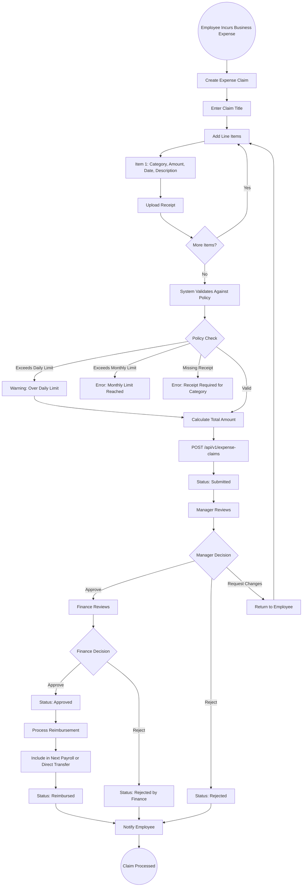

# 22 - Expense Management

## 22.1 Overview

The expense management module allows employees to submit expense claims for business-related expenditures, enforces organizational expense policies, and tracks reimbursement processing.

## 22.2 Features

| Feature | Description |
|---------|-------------|
| Expense Categories | Categorize expenses (Travel, Meals, Supplies, etc.) |
| Expense Policies | Set limits and rules per category |
| Expense Claims | Submit claims with receipts |
| Multi-Item Claims | Multiple line items per claim |
| Approval Workflow | Manager and finance approval |
| Reimbursement Tracking | Track reimbursement status and payment |

## 22.3 Entities

| Entity | Key Fields |
|--------|------------|
| ExpenseCategory | Name, Description, MaxAmount |
| ExpensePolicy | Name, CategoryId, DailyLimit, MonthlyLimit, RequiresReceipt, ApprovalRequired |
| ExpenseClaim | EmployeeId, Title, TotalAmount, Status, SubmittedDate |
| ExpenseClaimItem | ClaimId, CategoryId, Amount, Description, Date, ReceiptPath |
| ExpenseReimbursement | ClaimId, Amount, ProcessedDate, PaymentMethod |

## 22.4 Expense Claim Flow



## 22.5 Expense Policy Enforcement

```
Policy Enforcement Rules:
========================
Category: Travel
  - Daily Limit: SAR 500
  - Monthly Limit: SAR 5,000
  - Receipt Required: Yes, for amounts > SAR 50
  - Approval: Manager + Finance

Category: Meals
  - Daily Limit: SAR 150
  - Monthly Limit: SAR 2,000
  - Receipt Required: No, for amounts < SAR 100
  - Approval: Manager only

Category: Office Supplies
  - Per-Item Limit: SAR 200
  - Monthly Limit: SAR 1,000
  - Receipt Required: Yes
  - Approval: Manager only
```
