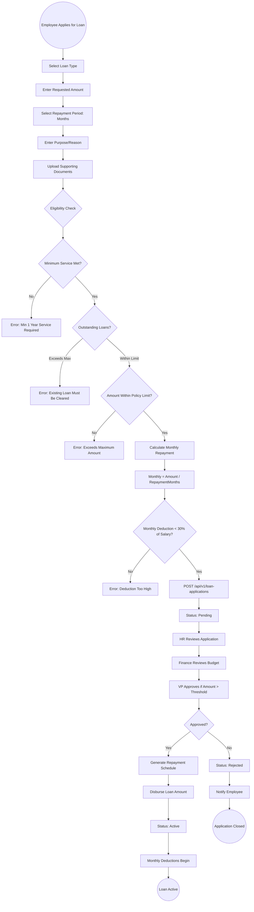
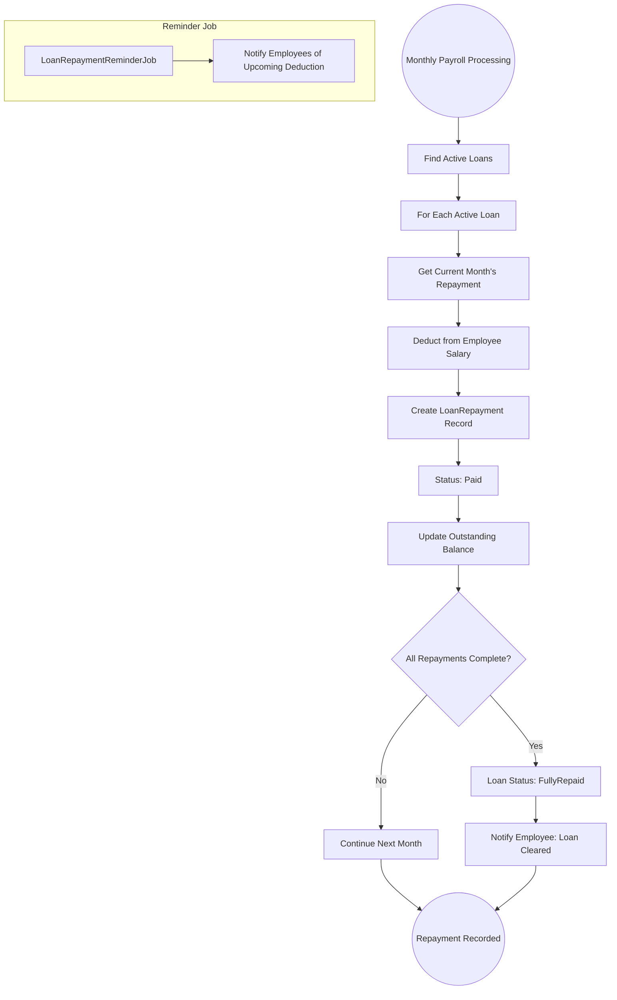

# 23 - Loan Management

## 23.1 Overview

The loan management module handles employee loan applications, policy configuration, loan approval workflows, disbursement, and automated repayment tracking through payroll deductions.

## 23.2 Features

| Feature | Description |
|---------|-------------|
| Loan Types | Personal, Emergency, Housing, Education, Vehicle |
| Loan Policies | Interest rates, max amounts, eligibility rules |
| Loan Applications | Apply for loans with documentation |
| Approval Workflow | Multi-step approval (HR, Finance, VP) |
| Repayment Schedule | Automatic monthly payroll deductions |
| Repayment Tracking | Track payments and outstanding balance |
| Salary Advances | Short-term salary advance requests |

## 23.3 Entities

| Entity | Key Fields |
|--------|------------|
| LoanType | Name, Description, MaxAmount, MaxRepaymentMonths |
| LoanPolicy | LoanTypeId, InterestRate, EligibilityMinService, MaxOutstandingLoans |
| LoanApplication | EmployeeId, LoanTypeId, RequestedAmount, RepaymentMonths, Purpose, Status |
| LoanRepayment | ApplicationId, Amount, DueDate, PaidDate, Status |
| SalaryAdvance | EmployeeId, Amount, RepaymentMonths, Reason, Status |

## 23.4 Loan Application Flow



## 23.5 Loan Repayment Flow



## 23.6 Loan Repayment Example

```
Loan Details:
  Type: Personal Loan
  Amount: SAR 12,000
  Repayment Period: 6 months
  Monthly Deduction: SAR 2,000

Repayment Schedule:
  Month 1: SAR 2,000 | Balance: SAR 10,000
  Month 2: SAR 2,000 | Balance: SAR 8,000
  Month 3: SAR 2,000 | Balance: SAR 6,000
  Month 4: SAR 2,000 | Balance: SAR 4,000
  Month 5: SAR 2,000 | Balance: SAR 2,000
  Month 6: SAR 2,000 | Balance: SAR 0 (Fully Repaid)
```
