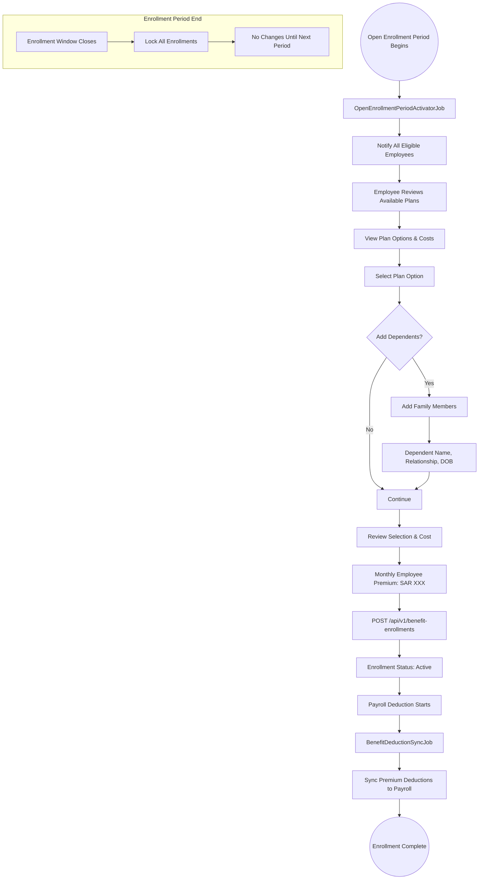
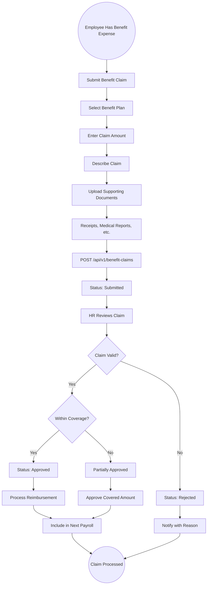

# 24 - Benefits Management

## 24.1 Overview

The benefits management module manages employee benefit plans including health insurance, life insurance, retirement plans, and other perks. It handles plan configuration, enrollment periods, eligibility rules, and benefit claims.

## 24.2 Features

| Feature | Description |
|---------|-------------|
| Benefit Plans | Configure health, life, retirement, and other benefit plans |
| Plan Options | Multiple tiers per plan (Basic, Standard, Premium) |
| Enrollment Periods | Open enrollment windows for plan selection |
| Eligibility Rules | Define who qualifies for which benefits |
| Employee Enrollment | Self-service enrollment in available plans |
| Dependent Coverage | Add family members to benefit plans |
| Benefit Claims | Submit and track benefit claims |
| Payroll Integration | Automatic deduction of employee premiums |

## 24.3 Entities

| Entity | Key Fields |
|--------|------------|
| BenefitPlan | Name, Type, Description, EmployerContribution, IsActive |
| BenefitPlanOption | PlanId, OptionName, EmployeeCost, Coverage |
| BenefitEligibilityRule | PlanId, MinServiceMonths, EmploymentTypes, JobGrades |
| BenefitEnrollment | EmployeeId, PlanOptionId, StartDate, EndDate, Status |
| BenefitDependent | EnrollmentId, DependentName, Relationship, DateOfBirth |
| BenefitClaim | EnrollmentId, ClaimAmount, Description, Status, Documents |
| OpenEnrollmentPeriod | Name, StartDate, EndDate, PlansIncluded, Status |

## 24.4 Benefits Enrollment Flow



## 24.5 Benefit Claim Flow



## 24.6 Common Benefit Plans

```
Available Benefit Plans:
=======================
1. Medical Insurance
   - Basic: Employee only, SAR 200/month
   - Standard: Employee + Spouse, SAR 400/month
   - Premium: Employee + Family, SAR 700/month
   Employer covers 80%, Employee pays 20%

2. Life Insurance
   - Standard: 2x Annual Salary
   - Premium: 4x Annual Salary
   Employer covers 100%

3. Dental Plan
   - Basic: SAR 100/month
   - Premium: SAR 200/month
   Employee pays 100%

4. Employee Assistance Program
   - Free counseling sessions
   - No cost to employee
```
