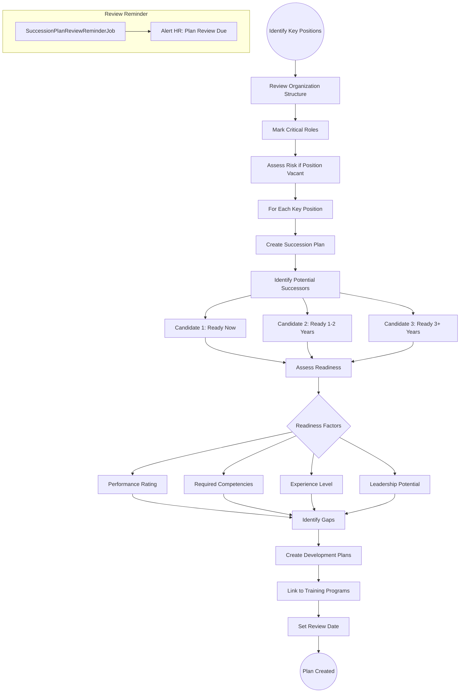
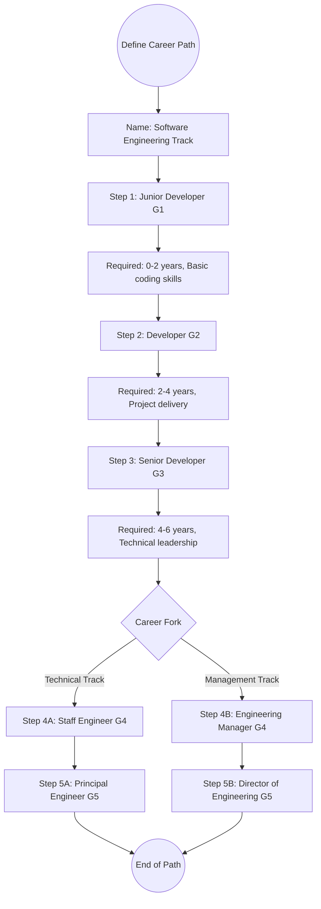

# 25 - Succession Planning & Talent Management

## 25.1 Overview

The succession planning module identifies key positions, develops talent profiles, defines career paths, and creates succession plans to ensure business continuity and leadership pipeline development.

## 25.2 Features

| Feature | Description |
|---------|-------------|
| Key Positions | Identify critical roles for succession |
| Succession Plans | Map potential successors to key positions |
| Talent Profiles | Comprehensive talent assessment |
| Career Paths | Define career progression routes |
| Readiness Assessment | Evaluate successor readiness |
| Development Plans | Link to training for gap closure |

## 25.3 Entities

| Entity | Key Fields |
|--------|------------|
| KeyPosition | Title, DepartmentId, CriticalityLevel, CurrentHolder |
| SuccessionPlan | KeyPositionId, Status, ReviewDate |
| SuccessionCandidate | PlanId, EmployeeId, ReadinessLevel, DevelopmentNeeds |
| CareerPath | Name, Description, Steps[] |
| CareerPathStep | PathId, FromGrade, ToGrade, RequiredCompetencies, TypicalDuration |
| TalentProfile | EmployeeId, PotentialRating, PerformanceRating, FlightRisk, Strengths, DevelopmentAreas |
| TalentSkill | ProfileId, SkillName, ProficiencyLevel |

## 25.4 Succession Planning Flow



## 25.5 Talent Profile & 9-Box Grid

```
9-Box Talent Grid:
==================
                    Low Performance | Medium Performance | High Performance
High Potential    |   Enigma       |   High Potential    |   Star
Medium Potential  |   Risk         |   Core Player       |   High Performer  
Low Potential     |   Underperformer|  Solid Performer   |   Workhorse

Talent Profile Assessment:
  - Performance Rating: From most recent review cycle
  - Potential Rating: Assessed by manager + HR
  - Flight Risk: Low/Medium/High
  - Strengths: Key skills and competencies
  - Development Areas: Gaps to address
```

## 25.6 Career Path Flow


