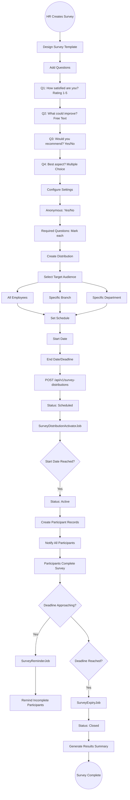
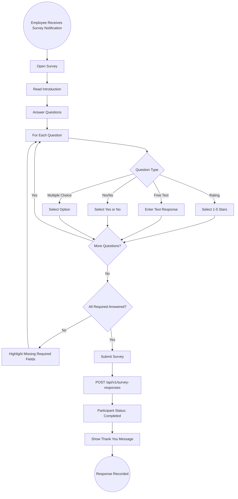

# 26 - Surveys & Feedback

## 26.1 Overview

The surveys module enables HR to create and distribute surveys to employees, collect responses, and analyze results for organizational insights. It supports multiple question types, targeted distribution, anonymous responses, and automated reminders.

## 26.2 Features

| Feature | Description |
|---------|-------------|
| Survey Templates | Reusable survey templates with multiple question types |
| Targeted Distribution | Send to specific branches, departments, or roles |
| Anonymous Responses | Option for anonymous survey participation |
| Automated Scheduling | Schedule surveys for future distribution |
| Reminders | Automated reminders for incomplete surveys |
| Expiry Management | Auto-close surveys after deadline |
| Results Analysis | Aggregate response data and statistics |

## 26.3 Entities

| Entity | Key Fields |
|--------|------------|
| SurveyTemplate | Name, Description, Questions[], IsAnonymous |
| SurveyQuestion | TemplateId, QuestionText, QuestionType (Rating/MultiChoice/FreeText/YesNo), Options[], IsRequired |
| SurveyDistribution | TemplateId, Title, TargetBranch, TargetDepartment, StartDate, EndDate, Status |
| SurveyParticipant | DistributionId, EmployeeId, Status, CompletedAt |
| SurveyResponse | ParticipantId, QuestionId, Answer, Rating |

## 26.4 Survey Lifecycle Flow



## 26.5 Survey Response Collection Flow



## 26.6 Survey Results Analysis

```
Survey Results Example: Employee Satisfaction Q1 2026
=====================================================
Distribution: All Employees | Responses: 42/50 (84% rate)

Q1: Overall Satisfaction (Rating 1-5)
  Average: 3.8 / 5.0
  Distribution: 1★(2%) 2★(5%) 3★(25%) 4★(45%) 5★(23%)

Q2: What could improve? (Free Text - Top Themes)
  - Work-life balance (15 mentions)
  - Career development (12 mentions)
  - Communication (8 mentions)

Q3: Would you recommend? (Yes/No)
  Yes: 78% | No: 22%

Q4: Best aspect? (Multiple Choice)
  Team culture: 38%
  Compensation: 25%
  Management: 20%
  Growth opportunities: 17%
```
