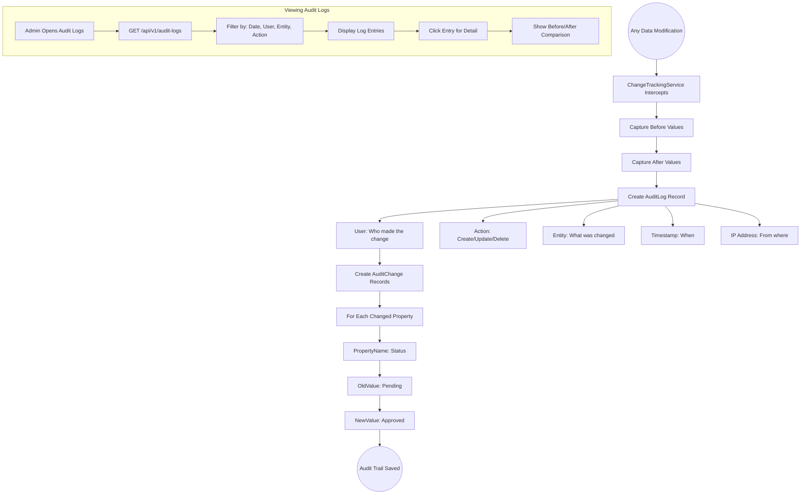
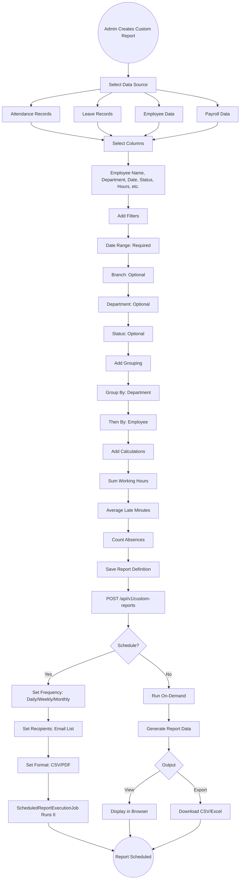
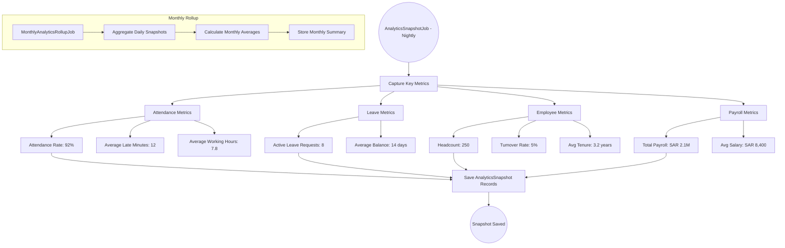
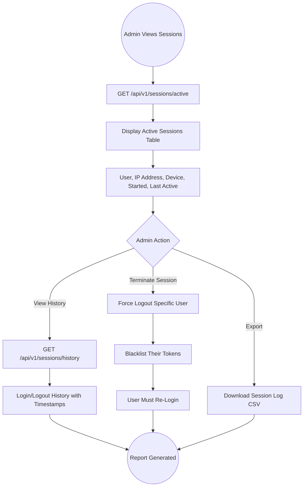

# 27 - Analytics & Reporting

## 27.1 Overview

The analytics and reporting module provides comprehensive dashboards, custom report generation, scheduled report delivery, audit logging, and data export capabilities across all system modules.

## 27.2 Features

| Feature | Description |
|---------|-------------|
| Admin Dashboard | Organization-wide statistics and KPIs |
| Custom Reports | User-defined report templates |
| Scheduled Reports | Automated report generation and delivery |
| Audit Logs | Complete audit trail of all system changes |
| Data Export | CSV/Excel export for all reports |
| Analytics Snapshots | Periodic data snapshots for trend analysis |
| Session Reports | Active sessions and login history |
| Saved Dashboards | Custom dashboard configurations |

## 27.3 Entities

| Entity | Key Fields |
|--------|------------|
| AuditLog | UserId, Action, EntityType, EntityId, Timestamp, IpAddress |
| AuditChange | AuditLogId, PropertyName, OldValue, NewValue |
| CustomReportDefinition | Name, DataSource, Columns[], Filters[], CreatedBy |
| ScheduledReport | ReportId, Frequency, Recipients, NextRun, Format |
| AnalyticsSnapshot | SnapshotDate, Module, MetricName, MetricValue |
| SavedDashboard | UserId, Name, Widgets[], Layout |

## 27.4 Admin Dashboard Data Flow

```mermaid
graph TD
    A((Admin Opens Dashboard)) --> B[GET /api/v1/dashboard]
    
    B --> C[Organization Stats]
    C --> C1[Total Employees: 250]
    C --> C2[Active: 240 | Inactive: 10]
    C --> C3[New Hires This Month: 5]
    C --> C4[Departures This Month: 2]
    
    B --> D[Attendance Stats Today]
    D --> D1[Present: 210 85%]
    D --> D2[Late: 15 6%]
    D --> D3[Absent: 8 3%]
    D --> D4[On Leave: 12 5%]
    D --> D5[Remote: 5 2%]
    
    B --> E[Leave Stats]
    E --> E1[Pending Requests: 12]
    E --> E2[Approved This Week: 8]
    E --> E3[Most Requested Type: Annual]
    
    B --> F[Approval Stats]
    F --> F1[Pending Approvals: 18]
    F --> F2[Avg Approval Time: 1.5 days]
    
    B --> G[Weekly Attendance Trend]
    G --> H[Line Chart: Mon-Sun Attendance %]
    
    B --> I[Department Breakdown]
    I --> J[Bar Chart: Attendance by Department]
    
    C1 --> K((Dashboard Rendered))
    D1 --> K
    E1 --> K
    F1 --> K
    H --> K
    J --> K
```

## 27.5 Audit Log Flow



## 27.6 Custom Report Creation Flow



## 27.7 Analytics Snapshot Flow



## 27.8 Report Types Reference

| Report | Data Source | Key Metrics |
|--------|-----------|-------------|
| Attendance Summary | AttendanceRecords | Present/Absent/Late counts, working hours |
| Attendance Detail | AttendanceRecords + Transactions | Individual check-in/out times |
| Leave Summary | EmployeeVacations + LeaveBalances | Balances, usage by type |
| Overtime Report | AttendanceRecords | Regular/premium overtime hours |
| Payroll Report | PayrollRecords | Gross/net salary, deductions |
| Headcount Report | Employees | By branch, department, status |
| Turnover Report | Employees + Terminations | Hire/exit rates by period |
| Training Report | TrainingEnrollments | Completion rates, costs |
| Recruitment Report | JobApplications + Offers | Pipeline, time-to-hire |
| Audit Report | AuditLogs | System changes by user/entity |

## 27.9 Session Management & Login History


