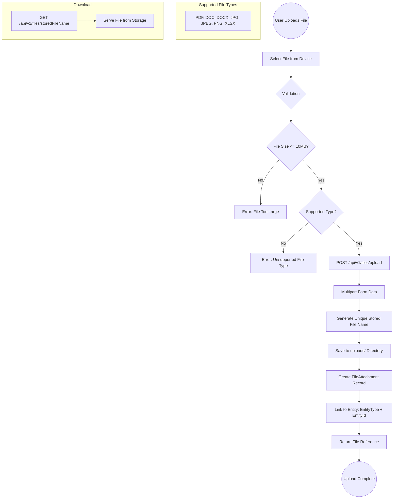
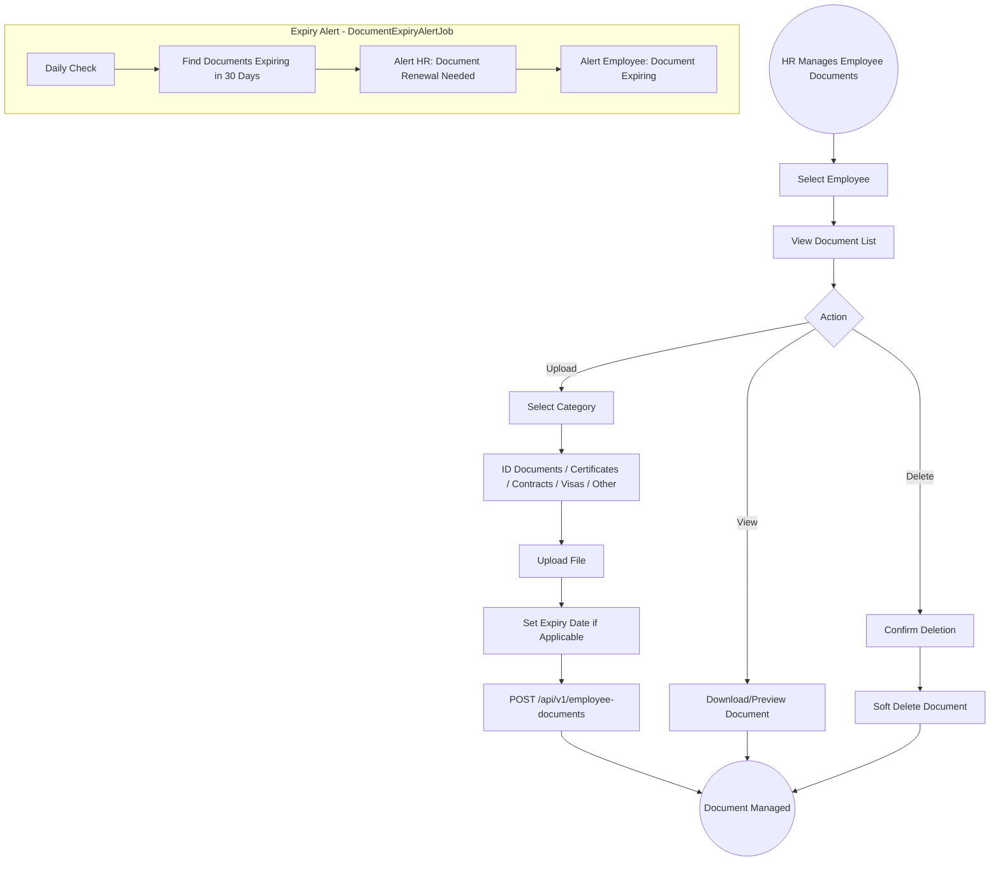
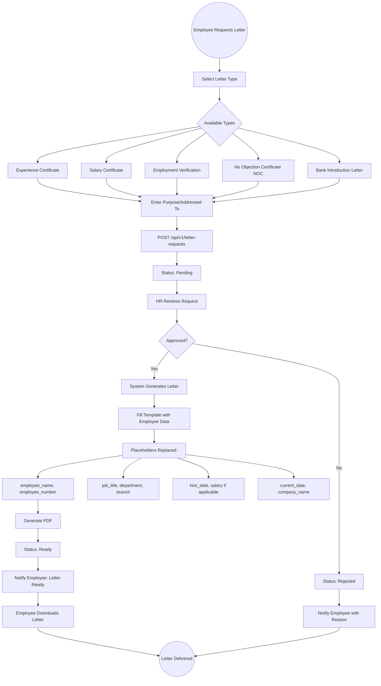
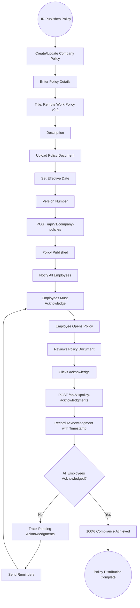
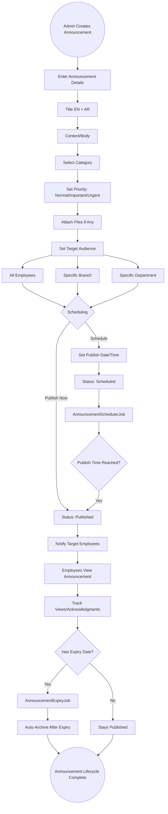

# 28 - Document Management

## 28.1 Overview

The document management module provides centralized file storage, employee document management, letter generation from templates, company policy distribution with acknowledgment tracking, and entity-linked file attachments across the entire system.

## 28.2 Features

| Feature | Description |
|---------|-------------|
| File Upload & Storage | Centralized file storage with 10MB limit |
| Entity Attachments | Link files to any entity (employee, contract, application, etc.) |
| Employee Documents | Manage employee-specific documents with categories |
| Letter Templates | Reusable templates for experience letters, salary certificates, etc. |
| Letter Requests | Employees request official letters through self-service |
| Company Policies | Distribute policies and track acknowledgments |
| Document Categories | Organize documents by type |
| Document Expiry Alerts | Background alerts for expiring documents |

## 28.3 Entities

| Entity | Key Fields |
|--------|------------|
| FileAttachment | EntityType, EntityId, FileName, StoredFileName, ContentType, FileSize, UploadedBy |
| EmployeeDocument | EmployeeId, CategoryId, DocumentName, FilePath, ExpiryDate, Status |
| DocumentCategory | Name, Description |
| LetterTemplate | Name, Type, TemplateContent, Placeholders[] |
| LetterRequest | EmployeeId, TemplateId, Purpose, Status, GeneratedFilePath |
| CompanyPolicy | Title, Description, Version, FilePath, EffectiveDate, IsActive |
| PolicyAcknowledgment | PolicyId, EmployeeId, AcknowledgedAt |

## 28.4 File Upload Flow

## 28.5 Employee Document Management Flow

## 28.6 Letter Request Flow

## 28.7 Company Policy Distribution Flow

## 28.8 Announcement System Flow

## 28.9 File Integration Points

| Module | File Usage |
|--------|------------|
| Employees | Profile photo upload |
| Contracts | Contract document attachment |
| Salary Adjustments | Supporting documentation |
| Candidates | Resume/CV upload |
| Applications | Cover letter attachment |
| Offer Letters | Offer document PDF |
| Onboarding | Onboarding documents |
| Allowance Requests | Supporting documents |
| Expense Claims | Receipt attachments |
| Grievances | Evidence attachments |
| Investigations | Case documents |
| Disciplinary Actions | Supporting documentation |
| Certifications | Certificate files |
| Company Policies | Policy documents |
| Announcements | Announcement attachments |
