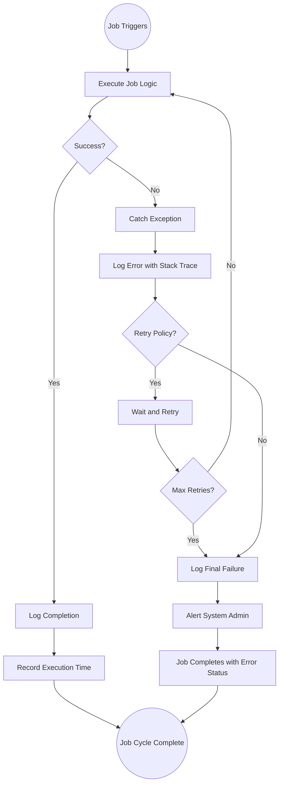

# 29 - Background Jobs & Automated Processing

## 29.1 Overview

ClockN uses Coravel, a .NET background job scheduler, to automate recurring tasks across all modules. These jobs handle attendance generation, leave accruals, notification reminders, expiry alerts, analytics snapshots, and various housekeeping tasks.

## 29.2 Complete Job Inventory

### Attendance & Scheduling Jobs

| Job | Schedule | Description |
|-----|----------|-------------|
| DailyAttendanceGenerationJob | Daily 2:00 AM | Creates attendance records for all active employees |
| EndOfDayAttendanceFinalizationJob | Daily 11:59 PM | Finalizes and locks daily attendance records |
| TimesheetPeriodGenerationJob | Monthly | Creates timesheet periods for the new month |
| TimesheetSubmissionReminderJob | Configurable | Reminds employees to submit timesheets |
| TimesheetPeriodClosureJob | Monthly | Closes timesheet periods after deadline |
| ApplyScheduledProfileChangesJob | Daily | Applies pre-scheduled employee profile changes |

### Leave & Absence Jobs

| Job | Schedule | Description |
|-----|----------|-------------|
| MonthlyLeaveAccrualJob | 1st of month, 1:00 AM | Processes monthly leave accruals for all employees |
| CompensatoryOffExpiryJob | Daily | Expires unused compensatory off days past deadline |

### Workflow & Approval Jobs

| Job | Schedule | Description |
|-----|----------|-------------|
| WorkflowTimeoutProcessingJob | Hourly | Checks for timed-out approval steps and triggers escalation |

### Contract & Compliance Jobs

| Job | Schedule | Description |
|-----|----------|-------------|
| ContractExpiryAlertJob | Daily | Alerts HR about contracts expiring within 30 days |
| VisaExpiryAlertJob | Daily | Alerts about employee visas expiring soon |
| DocumentExpiryAlertJob | Daily | Alerts about expiring employee documents |

### Performance Management Jobs

| Job | Schedule | Description |
|-----|----------|-------------|
| ReviewCycleReminderJob | Daily 7:00 AM | Sends reminders for pending performance reviews |
| PIPExpiryCheckJob | Daily 6:00 AM | Checks for expired performance improvement plans |

### Onboarding Jobs

| Job | Schedule | Description |
|-----|----------|-------------|
| OnboardingTaskOverdueJob | Daily 5:00 AM | Flags overdue onboarding tasks and notifies assignees |

### Training & Certification Jobs

| Job | Schedule | Description |
|-----|----------|-------------|
| TrainingSessionReminderJob | Daily | Reminds about upcoming training sessions (1 day before) |
| CertificationExpiryAlertJob | Daily | Alerts about certifications expiring within 30 days |

### Employee Relations Jobs

| Job | Schedule | Description |
|-----|----------|-------------|
| GrievanceSlaAlertJob | Configurable | Alerts when grievance SLA deadlines approach or breach |
| CounselingFollowUpReminderJob | Daily | Reminds about scheduled counseling follow-ups |

### Finance & Payroll Jobs

| Job | Schedule | Description |
|-----|----------|-------------|
| LoanRepaymentReminderJob | Monthly | Notifies employees of upcoming loan deductions |
| ExpireTemporaryAllowancesJob | Daily | Expires temporary allowance assignments past end date |

### Asset Management Jobs

| Job | Schedule | Description |
|-----|----------|-------------|
| OverdueAssetReturnAlertJob | Daily | Alerts about unreturned assets from departed employees |
| AssetWarrantyExpiryAlertJob | Daily | Alerts about assets with warranties expiring soon |

### Announcement Jobs

| Job | Schedule | Description |
|-----|----------|-------------|
| AnnouncementSchedulerJob | Configurable | Publishes scheduled announcements when publish date arrives |
| AnnouncementExpiryJob | Daily | Archives announcements past their expiry date |

### Survey Jobs

| Job | Schedule | Description |
|-----|----------|-------------|
| SurveyDistributionActivatorJob | Configurable | Activates surveys when start date arrives |
| SurveyExpiryJob | Daily | Closes surveys past their deadline |
| SurveyReminderJob | Daily | Reminds participants with incomplete surveys |

### Analytics Jobs

| Job | Schedule | Description |
|-----|----------|-------------|
| AnalyticsSnapshotJob | Nightly | Captures daily KPI snapshots for trend analysis |
| MonthlyAnalyticsRollupJob | Monthly | Aggregates daily snapshots into monthly summaries |

### Benefits Jobs

| Job | Schedule | Description |
|-----|----------|-------------|
| BenefitEnrollmentExpiryJob | Daily | Expires benefit enrollments past end date |
| OpenEnrollmentPeriodActivatorJob | Configurable | Activates open enrollment periods on start date |
| BenefitDeductionSyncJob | Monthly | Syncs benefit premium deductions to payroll |

### Talent Management Jobs

| Job | Schedule | Description |
|-----|----------|-------------|
| TalentProfileSyncJob | Configurable | Syncs talent profiles with latest performance data |
| SuccessionPlanReviewReminderJob | Configurable | Reminds HR to review succession plans |

### Reporting Jobs

| Job | Schedule | Description |
|-----|----------|-------------|
| ScheduledReportExecutionJob | Configurable | Generates and distributes scheduled reports |

## 29.3 Daily Job Timeline

```
00:00  ┌─────────────────────────────────────────────────┐
       │                                                  │
01:00  │  MonthlyLeaveAccrualJob (1st of month only)     │
       │                                                  │
02:00  │  DailyAttendanceGenerationJob ●                 │
       │                                                  │
03:00  │  (Analytics/cleanup jobs)                        │
       │                                                  │
04:00  │  AnalyticsSnapshotJob ●                         │
       │                                                  │
05:00  │  OnboardingTaskOverdueJob ●                     │
       │                                                  │
06:00  │  PIPExpiryCheckJob ●                            │
       │  ContractExpiryAlertJob ●                       │
       │  VisaExpiryAlertJob ●                           │
       │  DocumentExpiryAlertJob ●                       │
       │  CertificationExpiryAlertJob ●                  │
       │  CompensatoryOffExpiryJob ●                     │
       │  ExpireTemporaryAllowancesJob ●                 │
       │  OverdueAssetReturnAlertJob ●                   │
       │  AssetWarrantyExpiryAlertJob ●                  │
       │  AnnouncementExpiryJob ●                        │
       │  SurveyExpiryJob ●                              │
       │  BenefitEnrollmentExpiryJob ●                   │
       │                                                  │
07:00  │  ReviewCycleReminderJob ●                       │
       │  TrainingSessionReminderJob ●                   │
       │  SurveyReminderJob ●                            │
       │  CounselingFollowUpReminderJob ●                │
       │  LoanRepaymentReminderJob ●                     │
       │  ApplyScheduledProfileChangesJob ●              │
       │                                                  │
08:00  │                                                  │
  to   │  ← WorkflowTimeoutProcessingJob runs HOURLY →  │
22:00  │                                                  │
       │                                                  │
23:00  │                                                  │
       │                                                  │
23:59  │  EndOfDayAttendanceFinalizationJob ●            │
       │                                                  │
00:00  └─────────────────────────────────────────────────┘
```

## 29.4 Job Registration Pattern (Coravel)

```csharp
// In Program.cs / Startup configuration
app.Services.UseScheduler(scheduler =>
{
    // Attendance
    scheduler.Schedule<DailyAttendanceGenerationJob>()
        .DailyAtHour(2);

    scheduler.Schedule<EndOfDayAttendanceFinalizationJob>()
        .Cron("59 23 * * *");

    // Leave
    scheduler.Schedule<MonthlyLeaveAccrualJob>()
        .Cron("0 1 1 * *"); // 1st of month at 1:00 AM

    // Workflows
    scheduler.Schedule<WorkflowTimeoutProcessingJob>()
        .EveryHour();

    // Alerts
    scheduler.Schedule<ContractExpiryAlertJob>()
        .DailyAtHour(6);

    scheduler.Schedule<ReviewCycleReminderJob>()
        .DailyAtHour(7);

    // ... and so on for all 36 jobs
});
```

## 29.5 Job Error Handling



## 29.6 Job Dependencies

```
Critical Path Jobs (Must Complete in Order):
=============================================

Morning Sequence:
  1. DailyAttendanceGenerationJob (2:00 AM)
     ↓ Must complete before employees check in
  2. Alert Jobs (6:00-7:00 AM)
     ↓ Run after data is fresh
  3. Reminder Jobs (7:00 AM)
     ↓ Send before work hours

Evening Sequence:
  1. EndOfDayAttendanceFinalizationJob (11:59 PM)
     ↓ Finalizes the day's data
  2. AnalyticsSnapshotJob (after midnight)
     ↓ Captures finalized data

Monthly Sequence:
  1. MonthlyLeaveAccrualJob (1st of month)
     ↓ Must complete before payroll
  2. PayrollPeriodGeneration (after accruals)
     ↓ Uses updated balances
  3. MonthlyAnalyticsRollupJob (after all monthly processing)
```
