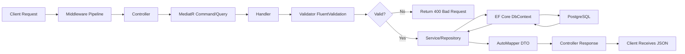

# 30 - System Architecture & Technical Overview

## 30.1 Overview

TecAxle HRMS is built on a Clean Architecture foundation with .NET 9.0 backend, Angular 20 frontends, Flutter mobile app, and PostgreSQL database. This document describes the technical architecture, deployment topology, integration patterns, and system capabilities.

## 30.2 Architecture Diagram

```
┌──────────────────────────────────────────────────────────────┐
│                     CLIENT APPLICATIONS                       │
├──────────────────┬──────────────────┬────────────────────────┤
│  Admin Portal    │  Self-Service    │  Mobile App            │
│  Angular 20      │  Portal          │  Flutter 3.x           │
│  Port: 4200      │  Angular 20      │  iOS / Android         │
│  clockn.net      │  Port: 4201      │  Riverpod State Mgmt   │
│                  │  portal.clockn.net│  GPS + NFC + Biometric │
└────────┬─────────┴────────┬─────────┴────────────┬───────────┘
         │                  │                       │
         │    HTTPS / WebSocket / REST API          │
         └──────────────────┼───────────────────────┘
                            │
┌───────────────────────────┼──────────────────────────────────┐
│                    BACKEND API LAYER                          │
│                    .NET 9.0 / C# 13                          │
│                    Port: 5099                                │
│                    api.clockn.net                            │
├──────────────────────────────────────────────────────────────┤
│                                                               │
│  ┌─────────────┐  ┌─────────────┐  ┌──────────────────────┐ │
│  │ Controllers  │  │ SignalR Hub │  │ Middleware Pipeline   │ │
│  │ (108+)       │  │ (Notifs)   │  │ CORS → ExceptionHndl │ │
│  │ REST API     │  │ WebSocket  │  │ → RateLimit → Locale │ │
│  └──────┬───────┘  └──────┬─────┘  │ → Auth → AuthZ       │ │
│         │                  │        └──────────────────────┘ │
│  ┌──────┴──────────────────┴──────────────────────────────┐  │
│  │              APPLICATION LAYER                          │  │
│  │  Services │ CQRS Handlers │ Validators │ Mappers       │  │
│  │  MediatR  │ FluentValidation │ AutoMapper              │  │
│  └──────────────────────┬─────────────────────────────────┘  │
│                         │                                     │
│  ┌──────────────────────┴─────────────────────────────────┐  │
│  │              DOMAIN LAYER                               │  │
│  │  Entities (150+) │ Enums │ Value Objects │ Logic       │  │
│  └──────────────────────┬─────────────────────────────────┘  │
│                         │                                     │
│  ┌──────────────────────┴─────────────────────────────────┐  │
│  │              INFRASTRUCTURE LAYER                       │  │
│  │  EF Core DbContext │ Repositories │ Background Jobs    │  │
│  │  Coravel Scheduler (36 jobs) │ External Services       │  │
│  └──────────────────────┬─────────────────────────────────┘  │
│                         │                                     │
└─────────────────────────┼─────────────────────────────────────┘
                          │
               ┌──────────┴──────────┐
               │   PostgreSQL 15+    │
               │   Database          │
               │   150+ Tables       │
               │   30 Domain Modules │
               └─────────────────────┘
```

## 30.3 Clean Architecture Layers

### Layer 1: Domain (Innermost)
```
TecAxle.Hrms.Domain/
├── Entities/          # 150+ domain entities
│   ├── Attendance/    # AttendanceRecord, Transaction, etc.
│   ├── Employees/     # Employee, Contract, Promotion, etc.
│   ├── Users/         # User, Role, Permission, etc.
│   ├── Shifts/        # Shift, ShiftPeriod, Assignment
│   ├── Vacations/     # VacationType, EmployeeVacation
│   ├── Payroll/       # SalaryStructure, PayrollPeriod
│   ├── Recruitment/   # JobPosting, Candidate, Application
│   ├── Performance/   # ReviewCycle, Review, Goal
│   └── ... (30 modules)
├── Enums/             # Status codes, types, categories
└── Common/            # BaseEntity, ValueObject
```
**Dependencies**: None (pure domain logic)

### Layer 2: Application
```
TecAxle.Hrms.Application/
├── Services/          # Business logic services
│   ├── AttendanceCalculationService
│   ├── LeaveAccrualService
│   ├── OvertimeConfigurationService
│   ├── DailyAttendanceGeneratorService
│   ├── InAppNotificationService
│   ├── ChangeTrackingService
│   └── NfcTagEncryptionService
├── Features/          # 44+ CQRS feature folders
│   ├── Attendance/
│   │   ├── Commands/
│   │   ├── Queries/
│   │   └── Validators/
│   ├── Employees/
│   └── ... (each module)
├── DTOs/              # Request/Response models
├── Mappings/          # AutoMapper profiles
└── Interfaces/        # Repository & service interfaces
```
**Dependencies**: Domain only

### Layer 3: Infrastructure
```
TecAxle.Hrms.Infrastructure/
├── Persistence/
│   ├── ApplicationDbContext.cs
│   ├── Configurations/     # EF Core entity configurations
│   ├── Repositories/       # Generic + specific repositories
│   ├── Migrations/         # Database migration files
│   └── Common/
│       └── SeedData.cs     # Initial data seeding
├── BackgroundJobs/         # 36 Coravel jobs
├── ExternalServices/       # Third-party integrations
└── DependencyInjection.cs  # IoC container registration
```
**Dependencies**: Domain + Application

### Layer 4: API (Outermost)
```
TecAxle.Hrms.Api/
├── Controllers/       # 108+ REST API controllers
├── Hubs/             # SignalR notification hub
├── Middleware/        # Exception, Rate Limiting, Localization
├── Models/           # API-specific request/response models
├── Program.cs        # Application entry point & configuration
└── appsettings.json  # Configuration
```
**Dependencies**: All layers

## 30.4 Data Flow Architecture



## 30.5 Authentication Architecture

```
JWT Token Structure:
===================
Header: { alg: "HS256", typ: "JWT" }
Payload: {
  sub: "userId",
  name: "John Doe",
  roles: ["BranchManager"],
  permissions: ["Employees.View", "Attendance.Edit", ...],
  branchScopes: [101, 102],
  exp: 1680000000,
  iat: 1679996400
}
Signature: HMACSHA256(header + payload, secret)

Token Lifecycle:
  Access Token:  Short-lived (15-60 minutes)
  Refresh Token: Long-lived (7-30 days)
  
  Client --> Access Token expired?
    --> POST /auth/refresh-token with refresh token
    --> Server validates, blacklists old, issues new pair
```

## 30.6 Real-Time Communication Architecture

```
SignalR WebSocket Connection:
============================

Client (Angular/Flutter)
  |
  | WSS Connection
  |
  v
SignalR Hub (/hubs/notifications)
  |
  ├── OnConnectedAsync()
  │     Add to group: "user-{userId}"
  │     Add to role groups
  │
  ├── Server Sends Event
  │     InAppNotificationService
  │       → Create Notification DB record
  │       → Hub.Clients.Group("user-{id}").SendAsync("notification", data)
  │
  └── OnDisconnectedAsync()
        Remove from all groups

Fallback: Long Polling if WebSocket unavailable
```

## 30.7 Deployment Architecture

```
Production Environment:
======================

┌─────────────────────────────────┐
│     Cloudflare DNS & CDN        │
│     SSL Termination             │
├──────────┬──────────┬───────────┤
│          │          │           │
│  ┌───────▼──────┐  │  ┌────────▼────────┐
│  │ Cloudflare   │  │  │ Cloudflare      │
│  │ Pages        │  │  │ Pages           │
│  │              │  │  │                 │
│  │ Admin Portal │  │  │ Self-Service    │
│  │ clockn.net   │  │  │ portal.clockn   │
│  └──────────────┘  │  └─────────────────┘
│                    │
│           ┌────────▼────────┐
│           │ Ubuntu 24.04    │
│           │ LTS Server      │
│           │                 │
│           │ .NET 9.0 API    │
│           │ api.clockn.net  │
│           │ Port: 5099      │
│           │                 │
│           │ PostgreSQL 15+  │
│           │ (same server)   │
│           └─────────────────┘
│
│  ┌──────────────────────┐
│  │ Firebase              │
│  │ Cloud Messaging       │
│  │ (Push Notifications)  │
│  └──────────────────────┘
│
│  ┌──────────────────────┐
│  │ App Store / Play Store│
│  │ Mobile App (Flutter)  │
│  └──────────────────────┘
└─────────────────────────────────┘
```

## 30.8 Database Schema Overview

```
Database: TecAxle.Hrms (PostgreSQL)
Total Tables: 150+
Domain Modules: 30

Module Distribution:
  Attendance:        11 tables
  Users/Auth:        12 tables
  Employees:         18 tables
  Leave:              9 tables
  Excuses:            4 tables
  Shifts:             4 tables
  Organization:       3 tables
  Payroll:           14 tables
  Remote Work:        2 tables
  Notifications:      4 tables
  Workflows:          7 tables
  Documents:          6 tables
  Onboarding:         5 tables
  Offboarding:        6 tables
  Recruitment:        7 tables
  Performance:        6 tables
  Training:          10 tables
  Employee Relations: 9 tables
  Assets:             4 tables
  Expenses:           5 tables
  Loans:              5 tables
  Succession:         6 tables
  Surveys:            5 tables
  Benefits:           7 tables
  Announcements:      4 tables
  Settings:           3 tables
  Reports:            4 tables
  NFC/Access:         2 tables
  Timesheets:         4 tables
  Analytics:          2 tables
  Common:             5 tables (Audit, FileAttachment, etc.)
```

## 30.9 API Statistics

```
API Overview:
=============
Total Controllers:     108+
Total API Endpoints:   500+
Authorization Policies: 52+
SignalR Hubs:          1 (NotificationHub)
Background Jobs:       36
Domain Entities:       150+

Endpoint Distribution by HTTP Method:
  GET:    ~40% (Read operations, queries, reports)
  POST:   ~35% (Create operations, actions)
  PUT:    ~15% (Update operations)
  DELETE: ~10% (Delete operations)

Response Formats:
  Standard: JSON with camelCase
  Error: { statusCode, message, traceId, detail?, stackTrace? }
  Paginated: { data[], totalCount, pageNumber, pageSize }
  Enums: Serialized as strings (e.g., "Draft", "Approved")
```

## 30.10 Security Architecture

```
Security Layers:
===============

Layer 1: Network
  - HTTPS/TLS encryption
  - Cloudflare DDoS protection
  - CORS restricted to known origins

Layer 2: Application
  - Rate limiting (100 req/60s per IP)
  - Global exception handler (no stack traces in production)
  - Request validation (FluentValidation)

Layer 3: Authentication
  - JWT token validation
  - Token blacklisting for revocation
  - Refresh token rotation
  - 2FA with TOTP + backup codes
  - Login attempt tracking + lockout

Layer 4: Authorization
  - 52+ permission policies
  - Role-based access control (RBAC)
  - Branch-scoped data isolation
  - Resource-level permissions

Layer 5: Data
  - Parameterized queries (EF Core)
  - Password hashing (PBKDF2-SHA256)
  - Password history (prevent reuse)
  - Secure token storage (mobile)
  - HMAC-SHA256 NFC tag signing

Layer 6: Audit
  - Comprehensive change tracking
  - Before/after value comparison
  - User + timestamp + IP logging
  - Session tracking
```

## 30.11 Technology Stack Summary

| Component | Technology | Version |
|-----------|-----------|---------|
| **Backend Runtime** | .NET | 9.0 |
| **Language** | C# | 13 |
| **ORM** | Entity Framework Core | 9.0 |
| **Database** | PostgreSQL | 15+ |
| **API Documentation** | Swagger / OpenAPI | 3.0 |
| **Background Jobs** | Coravel | Latest |
| **Real-Time** | SignalR | Latest |
| **Validation** | FluentValidation | Latest |
| **Mapping** | AutoMapper | Latest |
| **CQRS/Mediator** | MediatR | Latest |
| **Admin Frontend** | Angular | 20 |
| **Self-Service Frontend** | Angular | 20 |
| **CSS Framework** | Bootstrap | 5.3 |
| **Icons** | FontAwesome | 6 |
| **Mobile App** | Flutter | 3.x |
| **Mobile State** | Riverpod | Latest |
| **Mobile HTTP** | Dio + Retrofit | Latest |
| **Mobile Navigation** | GoRouter | Latest |
| **Push Notifications** | Firebase Cloud Messaging | Latest |
| **Hosting (API)** | Ubuntu 24.04 LTS | - |
| **Hosting (Frontends)** | Cloudflare Pages | - |

## 30.12 Multi-Language Support

```
Internationalization (i18n):
============================
Languages: English (en) + Arabic (ar)
Direction: LTR (English) + RTL (Arabic)

Translation Coverage:
  Admin Frontend:    ~2,700+ keys per language
  Self-Service:      ~1,500+ keys per language
  Mobile App:        ~500+ keys per language
  Backend Responses: Bilingual notification content

Entity Bilingual Fields:
  All entities with Name also have NameAr
  Notifications have Title/TitleAr and Message/MessageAr
  Holiday names in English and Arabic
```

## 30.13 Performance Characteristics

```
Performance Guidelines:
======================
  - All I/O operations use async/await
  - Pagination for all list endpoints (default: 10-50 items)
  - Eager loading for related entities (Include/ThenInclude)
  - Projection (Select) for read-only queries
  - Database indexes on frequently queried columns
  - Background jobs for long-running operations
  - Connection pooling for database
  - Angular lazy loading for all routes
  - Angular signals for efficient change detection
  - Virtual scrolling for long lists
  - OnPush change detection strategy

Typical Response Times:
  - Simple CRUD: < 100ms
  - List with pagination: < 200ms
  - Complex report generation: < 2s
  - Dashboard data: < 500ms
  - SignalR notification delivery: < 50ms
```

## 30.14 Integration Points

```
External System Integrations:
=============================
1. Firebase Cloud Messaging → Push notifications to mobile
2. Biometric Devices → Fingerprint attendance capture
3. NFC Tags → Physical tag scanning for attendance
4. GPS Services → Geolocation for mobile attendance
5. Email Service → Notification delivery (configurable)
6. File Storage → Local disk (configurable for S3/Azure Blob)
7. Bank Transfer → File generation for payroll disbursement

Future Integration Points:
  - Active Directory / LDAP
  - ERP Systems (SAP, Oracle)
  - Government Portals (GOSI, MOL)
  - Cloud Storage (AWS S3, Azure Blob)
  - SSO Providers (SAML, OAuth)
```
