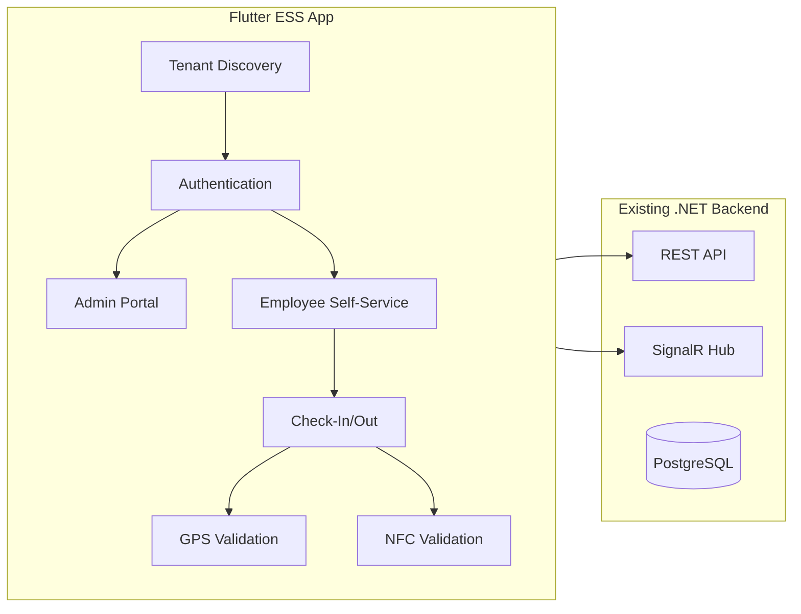
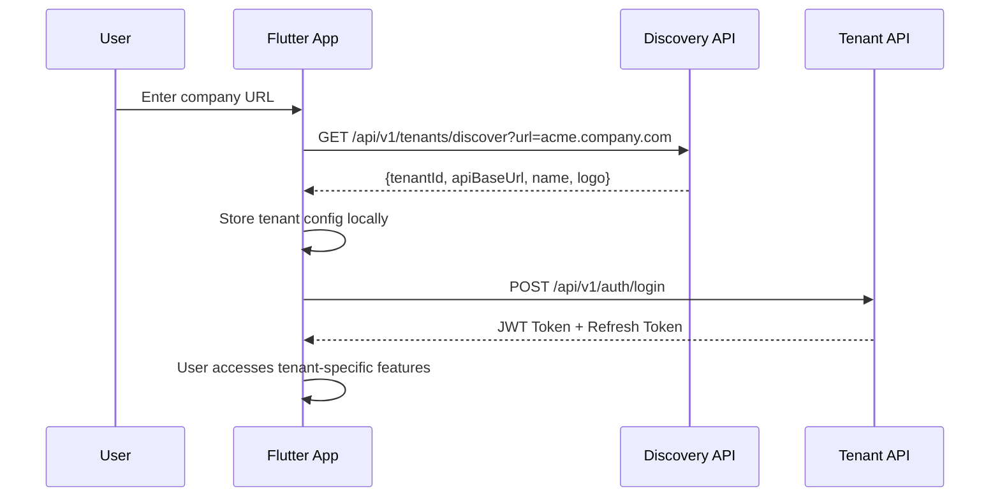
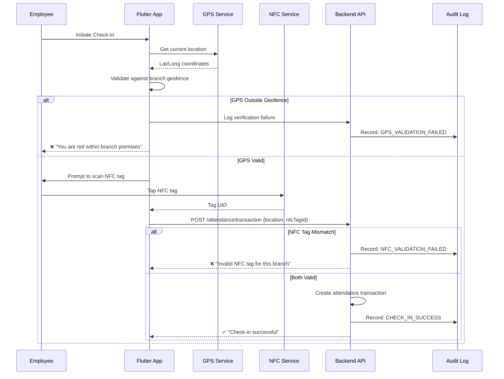
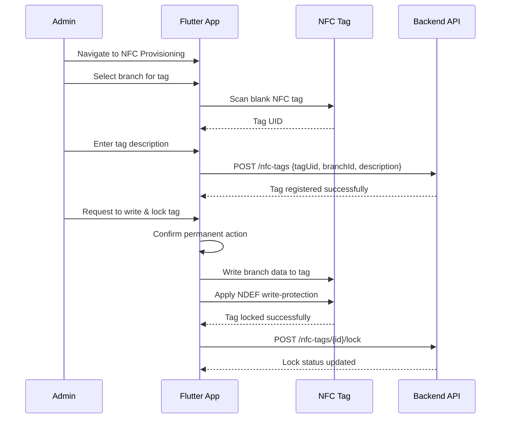
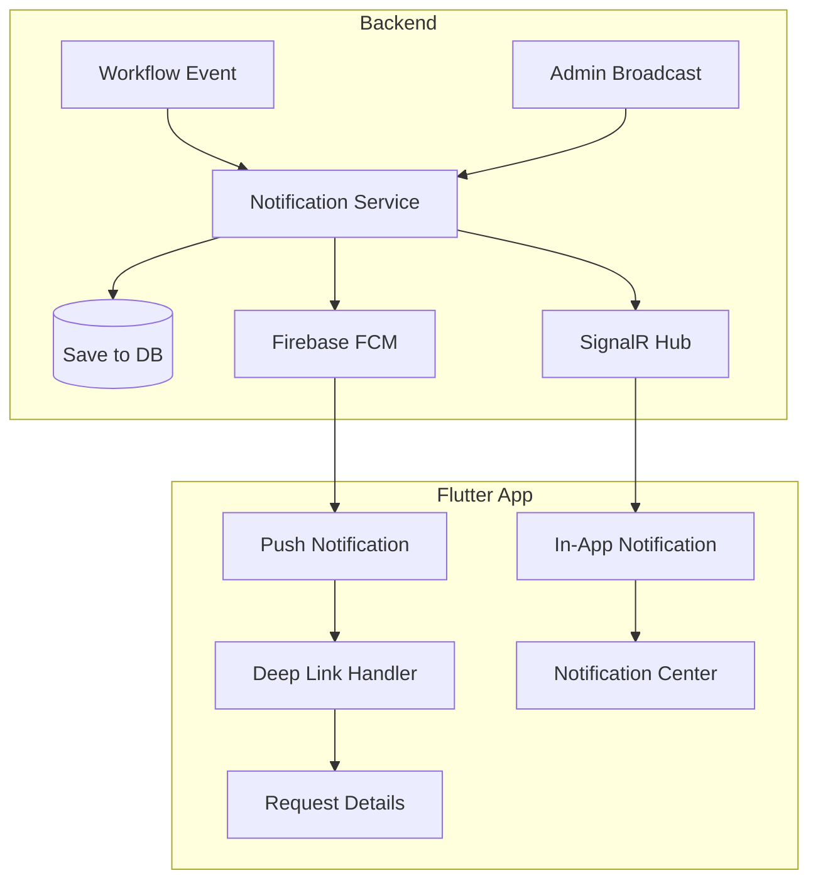

# Flutter ESS Mobile Platform - Implementation Plan

## Overview

Build a **multi-tenant Flutter mobile application** for Employee Self-Service (ESS) that integrates with the existing Time Attendance System backend. The app enforces **dual-verification check-in/out** using GPS geofencing and NFC tag validation.



---

## User Review Required

> [!IMPORTANT]
> **Multi-Tenant Strategy**: The plan assumes each tenant has a unique subdomain/URL (e.g., `acme.timeattendance.com`). Confirm this is the desired approach vs. a tenant ID-based system.

> [!IMPORTANT]
> **NFC Hardware**: NFC write-protection lock is **permanent and irreversible**. Confirm this is acceptable for production use.

> [!CAUTION]
> **Geofence Radius**: What should be the default geofence radius for branches? (Suggested: 100 meters, configurable per branch)

---

## Architecture Overview

### Multi-Tenant SaaS Flow



### Dual-Verification Check-In/Out Flow



---

## Proposed Changes

### Backend - New Entities & Modifications

---

#### [MODIFY] [Branch.cs](file:///d:/Work/TimeAttendanceSystem/src/Domain/TimeAttendanceSystem.Domain/Entities/Branch.cs)

Add GPS coordinates and geofence configuration:
```diff
public class Branch : BaseEntity
{
    public string Name { get; set; }
    public string NameAr { get; set; }
+   public double? Latitude { get; set; }
+   public double? Longitude { get; set; }
+   public int GeofenceRadiusMeters { get; set; } = 100;
    // ... existing properties
}
```

---

#### [NEW] NfcTag.cs

New entity for NFC tag management:
```csharp
public class NfcTag : BaseEntity
{
    public string TagUid { get; set; }           // Unique NFC tag identifier
    public int BranchId { get; set; }            // Associated branch
    public string? Description { get; set; }      // e.g., "Main Entrance"
    public bool IsWriteProtected { get; set; }   // Lock status
    public DateTime? LockedAt { get; set; }
    public int? LockedByUserId { get; set; }
    public bool IsActive { get; set; } = true;
    
    // Navigation
    public virtual Branch Branch { get; set; }
    public virtual User? LockedByUser { get; set; }
}
```

---

#### [NEW] Tenant.cs

Multi-tenant configuration entity:
```csharp
public class Tenant : BaseEntity
{
    public string Subdomain { get; set; }        // e.g., "acme"
    public string Name { get; set; }
    public string? LogoUrl { get; set; }
    public string ApiBaseUrl { get; set; }
    public bool IsActive { get; set; } = true;
    public string? CustomDomain { get; set; }    // Optional custom domain
}
```

---

#### [NEW] AttendanceVerificationLog.cs

Audit entity for verification attempts:
```csharp
public class AttendanceVerificationLog : BaseEntity
{
    public int EmployeeId { get; set; }
    public int BranchId { get; set; }
    public DateTime AttemptedAt { get; set; }
    public VerificationStatus Status { get; set; }
    public VerificationFailureReason? FailureReason { get; set; }
    
    // GPS Data
    public double? DeviceLatitude { get; set; }
    public double? DeviceLongitude { get; set; }
    public double? DistanceFromBranch { get; set; }
    
    // NFC Data
    public string? ScannedTagUid { get; set; }
    public string? ExpectedTagUid { get; set; }
    
    // Device Info
    public string? DeviceId { get; set; }
    public string? DeviceModel { get; set; }
    public string? AppVersion { get; set; }
}

public enum VerificationStatus { Success, Failed }
public enum VerificationFailureReason 
{ 
    GpsOutsideGeofence, 
    NfcTagMismatch, 
    NfcTagNotRegistered,
    NfcTagInactive,
    BranchNotConfigured,
    GpsUnavailable
}
```

---

#### [NEW] PushNotificationToken.cs

Store device tokens for push notifications:
```csharp
public class PushNotificationToken : BaseEntity
{
    public int UserId { get; set; }
    public string DeviceToken { get; set; }      // FCM token
    public string DeviceId { get; set; }         // Unique device identifier
    public string Platform { get; set; }         // "android" | "ios"
    public DateTime RegisteredAt { get; set; }
    public DateTime? LastUsedAt { get; set; }
    public bool IsActive { get; set; } = true;
    
    public virtual User User { get; set; }
}
```

---

#### [MODIFY] Notification.cs

Extend existing Notification entity for broadcast support:
```diff
public class Notification : BaseEntity
{
    // ... existing fields
+   public NotificationChannel Channel { get; set; }  // InApp, Push, Both
+   public int? BroadcastId { get; set; }             // Link to broadcast batch
+   public string? DeepLink { get; set; }             // e.g., "/requests/vacation/123"
+   public virtual NotificationBroadcast? Broadcast { get; set; }
}

+public enum NotificationChannel { InApp, Push, Both }
```

---

#### [NEW] NotificationBroadcast.cs

Admin broadcast batch entity:
```csharp
public class NotificationBroadcast : BaseEntity
{
    public string Title { get; set; }
    public string TitleAr { get; set; }
    public string Message { get; set; }
    public string MessageAr { get; set; }
    public BroadcastTargetType TargetType { get; set; }  // All, Branch, Department, Group, Employees
    public string? TargetIds { get; set; }               // JSON array of IDs
    public NotificationChannel Channel { get; set; }
    public int SentByUserId { get; set; }
    public DateTime SentAt { get; set; }
    public int TotalRecipients { get; set; }
    public int DeliveredCount { get; set; }
    
    public virtual User SentByUser { get; set; }
    public virtual ICollection<Notification> Notifications { get; set; }
}

public enum BroadcastTargetType { All, Branch, Department, Group, Employees }
```

---

### Backend - New API Endpoints

---

#### [NEW] TenantDiscoveryController.cs

```
GET  /api/v1/tenants/discover?url={companyUrl}
     → Returns: { tenantId, apiBaseUrl, name, logoUrl }
     → Public endpoint (no auth required)
```

---

#### [MODIFY] [BranchesController.cs](file:///d:/Work/TimeAttendanceSystem/src/Api/TimeAttendanceSystem.Api/Controllers/BranchesController.cs)

Add GPS management endpoints:
```
PUT  /api/v1/branches/{id}/coordinates
     → Body: { latitude, longitude, geofenceRadiusMeters }
     → Requires: Admin permission
```

---

#### [NEW] NfcTagsController.cs

```
GET    /api/v1/nfc-tags                      → List all NFC tags
GET    /api/v1/nfc-tags/{id}                 → Get tag details
POST   /api/v1/nfc-tags                      → Register new tag
PUT    /api/v1/nfc-tags/{id}                 → Update tag
DELETE /api/v1/nfc-tags/{id}                 → Deactivate tag
POST   /api/v1/nfc-tags/{id}/lock            → Mark as write-protected
GET    /api/v1/nfc-tags/by-branch/{branchId} → Get tags for branch
GET    /api/v1/nfc-tags/validate/{tagUid}    → Validate tag for check-in
```

---

#### [NEW] NotificationBroadcastController.cs (Admin Portal)

```
GET    /api/v1/notification-broadcasts           → List all broadcasts (paginated)
GET    /api/v1/notification-broadcasts/{id}      → Get broadcast details
POST   /api/v1/notification-broadcasts           → Create & send broadcast
       → Body: {
           title, titleAr, message, messageAr,
           targetType: "All" | "Branch" | "Department" | "Employees",
           targetIds: [1, 2, 3],  // IDs based on targetType
           channel: "InApp" | "Push" | "Both"
         }
GET    /api/v1/notification-broadcasts/{id}/stats → Delivery statistics
```

---

#### [MODIFY] NotificationsController.cs

Add push token registration:
```
POST   /api/v1/notifications/register-device
       → Body: { deviceToken, deviceId, platform }
       → Registers FCM token for push notifications

DELETE /api/v1/notifications/unregister-device/{deviceId}
       → Removes device token (on logout)
```

---

#### [MODIFY] [AttendanceController.cs](file:///d:/Work/TimeAttendanceSystem/src/Api/TimeAttendanceSystem.Api/Controllers/AttendanceController.cs)

Add mobile check-in endpoint with dual verification:
```
POST /api/v1/attendance/mobile-transaction
     → Body: {
         transactionType: "CheckIn" | "CheckOut",
         deviceLatitude: number,
         deviceLongitude: number,
         nfcTagUid: string,
         deviceId: string,
         deviceModel: string,
         appVersion: string
       }
     → Returns: { success, message, transactionId?, failureReason? }
     → Performs: 
        1. GPS validation against employee's assigned branch
        2. NFC tag validation against branch
        3. Creates transaction or logs failure
```

---

### Flutter App Structure

```
flutter_ess_app/
├── lib/
│   ├── main.dart
│   ├── app/
│   │   ├── app.dart                    # Material App configuration
│   │   ├── routes.dart                 # App routing
│   │   └── theme.dart                  # App theming (matches web)
│   │
│   ├── core/
│   │   ├── config/
│   │   │   └── app_config.dart         # Environment config
│   │   ├── di/
│   │   │   └── injection.dart          # Dependency injection (GetIt)
│   │   ├── network/
│   │   │   ├── api_client.dart         # Dio HTTP client
│   │   │   ├── api_interceptors.dart   # Auth, logging interceptors
│   │   │   └── api_endpoints.dart      # Endpoint constants
│   │   ├── storage/
│   │   │   ├── secure_storage.dart     # Encrypted storage (tokens)
│   │   │   └── local_storage.dart      # Tenant config, preferences
│   │   └── services/
│   │       ├── gps_service.dart        # Geolocation service
│   │       ├── nfc_service.dart        # NFC read/write service
│   │       ├── push_notification_service.dart  # FCM push notifications
│   │       └── signalr_service.dart    # Real-time in-app notifications
│   │
│   ├── features/
│   │   ├── tenant_discovery/           # Company URL entry
│   │   │   ├── data/
│   │   │   ├── domain/
│   │   │   └── presentation/
│   │   │
│   │   ├── auth/                       # Login, biometrics
│   │   │   ├── data/
│   │   │   ├── domain/
│   │   │   └── presentation/
│   │   │
│   │   ├── admin/                      # Admin-only features
│   │   │   ├── branch_management/      # GPS coordinates setup
│   │   │   ├── nfc_provisioning/       # NFC tag registration & writing
│   │   │   ├── notification_broadcast/ # Send notifications to users
│   │   │   └── dashboard/
│   │   │
│   │   ├── employee/                   # Employee features
│   │   │   ├── dashboard/
│   │   │   ├── check_in_out/           # Dual verification flow
│   │   │   ├── attendance_history/
│   │   │   ├── leave_requests/
│   │   │   ├── notifications/          # Notification center & history
│   │   │   └── profile/
│   │   │
│   │   └── common/
│   │       └── widgets/                # Shared widgets
│   │
│   └── l10n/                           # Localization (EN/AR)
│
├── android/                            # Android-specific (NFC permissions)
├── ios/                                # iOS-specific (Core NFC)
├── pubspec.yaml
└── README.md
```

---

### Key Flutter Dependencies

```yaml
dependencies:
  flutter:
    sdk: flutter
  
  # State Management
  flutter_bloc: ^8.1.0
  equatable: ^2.0.5
  
  # Networking
  dio: ^5.4.0
  retrofit: ^4.1.0
  
  # Storage
  flutter_secure_storage: ^9.0.0
  shared_preferences: ^2.2.0
  
  # Location & Maps
  geolocator: ^10.1.0
  google_maps_flutter: ^2.5.0
  
  # NFC
  nfc_manager: ^3.3.0
  
  # Push Notifications
  firebase_core: ^2.24.2
  firebase_messaging: ^14.7.10
  flutter_local_notifications: ^16.3.0
  
  # UI
  flutter_svg: ^2.0.9
  cached_network_image: ^3.3.1
  
  # Dependency Injection
  get_it: ^7.6.4
  injectable: ^2.3.2
  
  # Localization (Arabic/English)
  flutter_localizations:
    sdk: flutter
  intl: ^0.18.1
  
  # Real-time (SignalR)
  signalr_netcore: ^1.3.7
```

---

### Bilingual Support (Arabic/English)

**Localization Structure:**
```
lib/l10n/
├── app_en.arb          # English translations
├── app_ar.arb          # Arabic translations
└── l10n.dart           # Generated localization class
```

**Key Implementation Details:**

| Feature | Implementation |
|---------|----------------|
| **RTL Layout** | Automatic via `Directionality` widget based on locale |
| **Font Support** | Arabic-friendly fonts (Cairo, Tajawal) bundled |
| **Date/Time** | Hijri calendar option for Arabic users |
| **Number Format** | Arabic numerals (٠١٢) vs Western (012) per locale |
| **Text Direction** | Dynamic `TextDirection.rtl` / `TextDirection.ltr` |

**Language Switching:**
- Stored in local preferences
- Syncs with backend user profile language setting
- Respects device locale on first launch

---

### NFC Tag Provisioning Flow (Admin)



---

### Push & In-App Notification System



**Notification Types & Deep Links:**

| Event | Notification | Deep Link |
|-------|--------------|----------|
| Vacation request submitted | "New vacation request pending" | `/approvals/vacation/{id}` |
| Request approved | "Your vacation was approved" | `/my-requests/vacation/{id}` |
| Request rejected | "Your vacation was rejected" | `/my-requests/vacation/{id}` |
| Admin broadcast | Custom message | Optional custom link |

**Admin Notification Center (Web Portal):**
- Dashboard widget showing recent broadcasts
- Send notification page with recipient selection
- Delivery statistics and analytics
- Notification history with filters

**Mobile Notification Center:**
- List of all notifications (read/unread)
- Mark as read / Mark all as read
- Tap to navigate to related entity
- Pull-to-refresh
- Badge count on app icon

## Verification Plan

### Automated Tests

**Backend:**
```bash
# Unit tests for verification logic
dotnet test --filter "Category=VerificationLogic"

# Integration tests for NFC and GPS endpoints
dotnet test --filter "Category=MobileAttendance"
```

**Flutter:**
```bash
# Unit tests
flutter test

# Integration tests
flutter test integration_test/
```

### Manual Verification

| Test Case | Steps | Expected Result |
|-----------|-------|-----------------|
| **Tenant Discovery** | Enter valid company URL | App loads tenant config, shows login |
| **GPS Inside Geofence** | Check-in within 100m of branch | GPS validation passes |
| **GPS Outside Geofence** | Check-in 200m from branch | Error: "Outside branch premises" |
| **Valid NFC Tag** | Scan registered branch tag | NFC validation passes |
| **Invalid NFC Tag** | Scan unregistered tag | Error: "Invalid NFC tag" |
| **Wrong Branch Tag** | Scan tag from different branch | Error: "Tag not for this branch" |
| **Dual Verification Success** | GPS ✓ + NFC ✓ | Transaction created successfully |
| **NFC Write Protection** | Write to locked tag | Write fails (expected) |
| **Audit Log - Failure** | GPS fail or NFC fail | Failure logged with details |

### Browser Tests (Admin Portal Updates)
- Verify GPS coordinate input works for branches
- Verify NFC tag list displays correctly
- Verify audit logs show mobile verification attempts

---

## Implementation Timeline (Estimated)

| Phase | Duration | Deliverables |
|-------|----------|--------------|
| **Phase 1: Backend** | 3-4 days | New entities, API endpoints, verification logic |
| **Phase 2: Flutter Core** | 4-5 days | Project setup, tenant discovery, auth |
| **Phase 3: Admin Features** | 3-4 days | Branch GPS, NFC provisioning |
| **Phase 4: Employee Features** | 4-5 days | Check-in/out, dual verification |
| **Phase 5: Polish** | 2-3 days | Testing, bug fixes, documentation |
| **Total** | ~3 weeks | Complete MVP |

---

## Questions for Clarification

1. **Tenant Discovery**: Should we use subdomain-based (`acme.company.com`) or path-based (`company.com/acme`) tenant identification? subdomain-based

2. **Offline Mode**: Should the app support offline check-in with sync when online? yes, but should present to the user you are offline now

3. **Biometric Auth**: Should we add fingerprint/Face ID for app login?yes

4. **Multiple NFC Tags per Branch**: Is one tag per branch sufficient, or multiple tags for different entrances?multiple

5. **Employee Branch Assignment**: Use existing employee branch assignment, or allow check-in at any configured branch?employee branch
